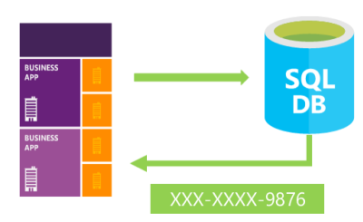

Originally published by Tricore: April 20, 2017

SQL Server 2016 introduced three new principal security features: Always
Encrypted, dynamic data masking, and row level security.

This blog introduces the dynamic data masking (DDM) feature.

<!--more-->

### Introduction

DDM limits sensitive data exposure by masking it to non-privileged users. This
helps prevent unauthorized access to sensitive data by enabling customers
to designate how much of the sensitive data to reveal with minimum impact
on the application layer. DDM can be configured on the database to hide
sensitive data as the result sets of queries over designated
database fields. The data in the database is not changed.

Because masking rules are applied in the query results, dynamic data masking is
easy to use with existing applications.

DDM is available in SQL Server 2016 and Azure SQL Database, and is
configured by using Transact-SQL commands. For additional information about
configuring dynamic data masking by using the Azure portal, see the
[Microsoft Azure SQL Database documentation](https://docs.microsoft.com/en-us/azure/sql-database/sql-database-dynamic-data-masking-get-started).

### How DDM works

Dynamic data masking rules can be defined on particular columns, indicating
how the data in those columns will appear when queried. There are no
physical changes to the data in the database itself. The data remains
intact and is fully available to authorized users or applications. Database
operations remain unaffected, and masked data has the same data type as
the original data, so DDM can often be applied without making any changes
to database procedures or application code.

[*Image source*](https://www.codeproject.com/Articles/1084808/Dynamic-Data-Masking-in-SQL-Server)

To add a data mask on a certain column in the database, all you need to do is
alter that column by adding a mask and specifying the required masking type.
The following types of masks are available:

- *default masking*, which fully masks the original value.
- *partial masking* where you specify part of the data to expose
- *random masking*, which replaces the numeric value with a random value within a specified range.
- *email masking*, which exposes the first character and keeps the email format.

In addition to the syntax shown in the following sections for the different
types of masking, you can also configure masking functions on columns at the
time of table creation, as in the following example:

    CREATE TABLE [CUSTOMER] (
    [CustId] INT IDENTITY (1,1) NOT NULL,
    [Title] NVARCHAR(8) NULL,
    [FirstName] VARCHAR(32) NOT NULL,
    [LastName] VARCHAR(32) MASKED WITH (FUNCTION='partial(2,"----",0)') NOT NULL,
    [EmailAddress] NVARCHAR(50) MASKED WITH (FUNCTION='email()') NOT NULL,
    [Phone] NVARCHAR(128) MASKED WITH (FUNCTION='default()') NULL,
    );

**Default masking**

The default mask masks the full data according to the data types of the
designated fields.

- For string data types, use XXXX or fewer X's if the size of the field is less than four characters (`char`, `nchar`, `varchar`, `nvarchar`, `text`, or `ntext`).
- For numeric data types, use a zero value (`bigint`, `bit`, `decimal`, `int`, `money`, `numeric`, `smallint`, `smallmoney`, `tinyint`, `float`, or `real`).
- For date and time data types, use 01.01.2000 00:00:00.0000000 (`date`, `datetime2`, `datetime`, `datetimeoffset`, `smalldatetime`, or `time`).
- For binary data types, use a single byte of ASCII value 0 (`binary`, `varbinary`, or `image`).

The following syntax provides examples for default masking:

- Definition syntax: `Phone# varchar(12) MASKED WITH (FUNCTION = 'default()') NULL`
- Alter syntax: `ALTER COLUMN Gender ADD MASKED WITH (FUNCTION = 'default()')`

**Partial masking**

The partial masking method exposes the first and last letters and adds a
customer padding string in the middle (prefix,[padding],suffix).

- Example definition syntax: `FirstName varchar(100) MASKED WITH (FUNCTION = 'partial(prefix,[padding],suffix)') NULL`
- Example alter syntax: `ALTER COLUMN [PhoneNumber] ADD MASKED WITH (FUNCTION = 'partial(1,"XXXXXXX",0)')`

**Random masking**

The random masking function can be defined on any numeric type to mask the
original value with a random value within a specified range.

- Example definition syntax: `Account_Number bigint MASKED WITH (FUNCTION = 'random([start range],[end range])')`
- Example alter syntax: `ALTER COLUMN [Month] ADD MASKED WITH (FUNCTION = 'random(1,12)')`

**Email masking**

The email masking method exposes the first letter of an email address and the
constant suffix ".com" in the form of an email address (aXXX@XXXX.com).

- Example definition syntax: `Email varchar(100) MASKED WITH (FUNCTION = 'email()') NULL`
- Example alter syntax: `ALTER COLUMN Email ADD MASKED WITH (FUNCTION = 'email()')`

### Permissions

You do not need any special permissions to create a table with a dynamic
data mask. You need only the standard `CREATE TABLE` and `ALTER` on schema permissions.

Adding, replacing, or removing the mask of a column requires the
`ALTER ANY MASK` permission and `ALTER` permission on the table. Users
with `SELECT` permission on a table can view the table data. Columns that
are defined as masked will display the masked data. Grant the `UNMASK`
permission to a user to enable them to retrieve unmasked data from the
columns for which masking is defined.

The `CONTROL` permission on the database includes both the `ALTER ANY MASK` and
`UNMASK` permission.

### Best practices and common use cases

Creating a mask on a column does not prevent updates to that column. Although
users receive masked data when querying the masked column, the same users can
update the data if they have write permissions. A proper access control policy
should still be used to limit update permissions.

Using `SELECT INTO` or `INSERT INTO` to copy data from a masked column into
another table results in masked data in the target table.

Dynamic data masking is applied when you run SQL Server Import and Export. A
database containing masked columns results in a backup file with masked data
(assuming it is exported by a user without `UNMASK` privileges), and the imported
database contains statically masked data.

#### Query for masked columns

Use the **sys.masked_columns** view to query for table-columns that have a masking
function applied to them. This view inherits from the **sys.columns** view. It
returns all columns in the **sys.columns** view plus the **is_masked** and
**masking_function** columns, which indicate if the column is masked, and if so,
which masking function is defined. This view shows only the columns on which
there is a masking function applied.

    SELECT c.name, tbl.name as table_name, c.is_masked, c.masking_function
    FROM sys.masked_columns AS c
    JOIN sys.tables AS tbl
    ON c.[object_id] = tbl.[object_id]
    WHERE is_masked = 1;

#### Limitations and restrictions

A masking rule cannot be defined for the following column types:

- Encrypted columns (Always Encrypted)
- FILESTREAM
- COLUMN_SET or a sparse column that is part of a column set
- A mask cannot be configured on a computed column, but if the computed column
depends on a column with a MASK, then the computed column will return masked data
- A column with data masking cannot be a key for a FULLTEXT index
- For users without with the UNMASK permission, the deprecated READTEXT,
UPDATETEXT, and WRITETEXT statements do not function properly on a column
configured for dynamic data masking

#### Add or edit a mask on an existing column

Use the `ALTER TABLE` statement to add a mask to an existing column in the table,
or to edit the mask on that column. The following example adds a masking function
to the **LastName** column:

    ALTER COLUMN LastName ADD MASKED WITH (FUNCTION = 'partial(2,"XXX",0)');

#### Grant permissions to view unmasked data

Granting the `UNMASK` permission allows a user to see the unmasked data. Use the
following command to grant the `UNMASK` permission:

    GRANT UNMASK TO TestUser;

To remove the `UNMASK` permission from a user, use the following command:

    REVOKE UNMASK TO TestUser;

### Dropping a dynamic data mask

The following statement drops the mask on the LastName column created in the
example in the "Add or edit a mask on an existing column" section:

    ALTER TABLE TableName
    ALTER COLUMN LastName DROP MASKED;

### Conclusion

The purpose of DDM is to limit exposure of sensitive data, preventing users who
should not have access to the data from viewing it. DDM does not aim to prevent
database users from connecting directly to the database and running exhaustive
queries that expose pieces of the sensitive data. DDM is complementary to other
SQL Server security features (auditing, encryption, row level security, and so
on), and it is highly recommended that you use this feature in conjunction with
them in order to better protect the sensitive data in the database.

Use the Feedback tab to make any comments or ask questions.

### References

- https://msdn.microsoft.com/en-in/library/mt130841.aspx
- https://www.codeproject.com/Articles/1084808/Dynamic-Data-Masking-in-SQL-Server

<a class="cta teal" id="cta" href="https://www.rackspace.com/dba-services">Learn more about Databases</a>

Visit [www.rackspace.com](https://www.rackspace.com) and click **Sales Chat**
to get started.

Use the Feedback tab to make any comments or ask questions.
