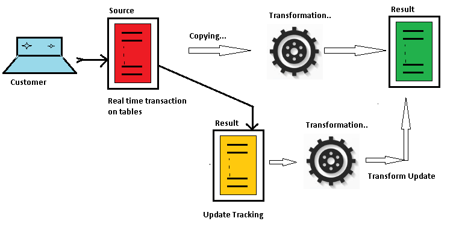

Online table redefinition allows you to restructure your Oracle&reg; table in
production without making the data unavailable. You might be comfortable using
temp tables to move data around, but there is a better solution.

<!--more-->

### Introduction

Staging the data and moving it around while you restructure your table makes
both the table and the data unavailable for a certain period, which is a less
than favorable situation for businesses. This is when the ``DBMS_REDEFINITION``
package saves the day, as shown in the following image:

### Purpose

Periodically, you need to modify the logical or physical structure of an Oracle
table for the following reasons:

-	To enhance queries or Data Manipulation Language (DML) performance
-	To accommodate application changes
-	To manage storage

Oracle Database provides a mechanism to make table structure modifications
without significantly affecting the availability of the table, which is known
as online table redefinition. Redefining tables online provides a substantial
performance boost when compared to traditional methods of redefining tables.

When a table is redefined online, it is accessible to both queries and DML
during most of the redefinition process. The table is locked in exclusive mode
for only a short period, which is independent of the size of the table and the
complexity of the redefinition. The redefinition process is completely
transparent to users.

Online table redefinition requires free space that is approximately equivalent
to the space currently used by the table being redefined.

There are numerous ways to reorganize a table. When downtime is a challenge,
then the ``DBMS_REDEFINITION`` package is the best option for this task.

### Redefine a table online

Use the following steps to redefine a table online.

1. Choose the redefinition method, either ``by key`` or ``by rowids``.

   **By key**: Select a primary key or pseudo-primary key to use for the
   redefinition. Pseudo-primary keys are unique keys where all the component
   columns contain ``NOT NULL`` constraints. For this method, the versions of the
   tables before and after redefinition should consist of the same primary key
   columns. This is the preferred and default method of redefinition.

   **By rowid:** Use this method if no key is available. In this method, a
   hidden column, named ``M_ROW$$``, is added to the post-redefined version of
   the table. This column should be dropped or marked as unused after the
   redefinition is complete. If ``COMPATIBLE`` is set to 10.2.0 or higher, the
   final phase of redefinition automatically sets this column as unused. You can
   then use the ``ALTER TABLE ... DROP UNUSED COLUMNS`` statement to drop it.
   You cannot use this method on index-organized tables.

2. Verify that the table can be redefined online by invoking the
   ``CAN_REDEF_TABLE`` procedure. If the table is not a candidate for online
   redefinition, then this procedure raises an error indicating why the table
   cannot be redefined online.

3. Create an empty interim table (in the same schema as the table to be
   redefined) with all of the desired logical and physical attributes.

4. It is not necessary to create the interim table with all the indexes,
   constraints, grants, and triggers of the table being redefined. This can be
   done automatically by using the ``COPY_TABLE_DEPENDENTS`` procedure.

5. To improve performance in larger tables, you can set it in parallel by using
   the following commands:

        ALTER SESSION force parallel dml parallel degree-of-parallelism;

        ALTER SESSION force parallel query parallel degree-of-parallelism;

6. The ``FINISH_REDEF_TABLE`` command completes the redefinition of the table.
   During this procedure, the original table is locked in an exclusive mode for
   a short time, independent of the amount of data in the original table.
   However, ``FINISH_REDEF_TABLE`` waits for all the pending DML operations to
   commit before completing the redefinition.

7. If you used ``rowids`` for the redefinition and your ``COMPATIBLE``
   initialization parameter is set to 10.1.0 or lower, you need to drop
   the hidden column ``M_ROW$$`` that was added to the redefined table. You can
   also set the column to "UNUSED" by using the following command:

        ALTER TABLE <table_name> SET UNUSED (M_ROW$$);

   If ``COMPATIBLE`` is 10.2.0 or higher, this hidden column is automatically
   set to ``UNUSED`` when the redefinition completes. You can then drop the column
   with the ``ALTER TABLE ... DROP UNUSED COLUMNS`` statement. Wait for any
   long-running queries against the interim table to complete and then drop the
   interim table.

### Sample table redefinition

The following section shows examples of the various commands and outputs for a
sample table redefinition.

#### Start sqlplus

The following sample demonstrates starting ``sqlplus``:

    [oracle@vm215 ~]$ sqlplus amit/amit

    SQL*Plus: Release 11.2.0.3.0 Production on Sat Oct 29 05:44:44 2016

    Copyright (c) 1982, 2011, Oracle.  All rights reserved.

    Connected to:
    Oracle Database 11g Enterprise Edition Release 11.2.0.3.0 - 64bit Production
    With the Partitioning, OLAP, Data Mining and Real Application Testing options

#### Create a demo table

The following sample demonstrates creating a demo table name ``TEST1`` under
``AMIT`` schema.

    SQL> CREATE TABLE TEST1 ( ID        NUMBER(10) ,
                          ENAME     VARCHAR2(10),
                          SAL       NUMBER(10) ) ;

#### Insert bulk rows

The following sample demonstrates inserting bulk rows and setting
``PPA_AGGGREGATE_TARGET`` in ``AMIT`` schema to max value.

    SQL> INSERT INTO AMIT.TEST1 SELECT ROWNUM, 'T'|| ROWNUM,
    DBMS_RANDOM.VALUE(100000, 999999) FROM DUAL CONNECT BY LEVEL < 1000000;

    999999 ROWS CREATED.

    SQL> COMMIT;

    COMMIT COMPLETE.

#### Create dependent objects for testing

The following sample demonstrates creating dependent objects related to table
``TEST1`` rows, so that you can see what happens during an online redefinition.

**View creation**

    SQL> CREATE VIEW TEST1_VW AS SELECT * FROM TEST1 ;

    VIEW CREATED.

**Sequence creation**

    SQL> CREATE SEQUENCE TEST_SEQ ;

    SEQUENCE CREATED.

**Procedure creation**

    CREATE OR REPLACE PROCEDURE PROC1 (P_ID IN NUMBER)
       AS V_ID  NUMBER ;

    BEGIN
      SELECT SAL
      INTO   V_ID
      FROM   TEST1
      WHERE  ID = P_ID;
    END;
    /

    PROCEDURE CREATED.

**DML trigger creation**

    SQL> CREATE OR REPLACE TRIGGER AMIT_TRIG
         BEFORE INSERT OR UPDATE ON TEST1
         FOR EACH ROW

    DECLARE
          X       NUMBER;
    BEGIN
         SELECT COUNT(*) INTO X
         FROM TEST1
         WHERE ID = :NEW.ID;
       IF X > 0 THEN
           RAISE_APPLICATION_ERROR(-20501, 'ID' || :NEW.ID || ' ALREADY EXISTS');
       END IF;
    END;
    /

    TRIGGER CREATED.

**Primary key creation**

    SQL> ALTER TABLE TEST1 ADD CONSTRAINT TEST1_ID_PK PRIMARY KEY (ID) ;

    TABLE ALTERED.

**Get the status before redefinition**

    SQL> COLUMN OBJECT_NAME FORMAT A20
        SELECT OBJECT_NAME, OBJECT_TYPE, STATUS FROM USER_OBJECTS ORDER BY OBJECT_NAME;SQL>

    OBJECT_NAME          OBJECT_TYPE         STATUS
    -------------------- ------------------- -------
    AMIT_TRIG            TRIGGER             VALID
    PROC1                PROCEDURE           VALID
    TEST1                TABLE               VALID
    TEST1_ID_PK          INDEX               VALID
    TEST1_VW             VIEW                VALID
    TEST_SEQ             SEQUENCE            VALID

    6 ROWS SELECTED.

#### Check table for redefinition

The following sample demonstrates checking that the table can be redefined online
using either ``rowids`` or ``primary key``:

**Using primary key**

    SQL> EXEC DBMS_REDEFINITION.CAN_REDEF_TABLE ('AMIT','TEST1',DBMS_REDEFINITION.CONS_USE_PK);

    PL/SQL PROCEDURE SUCCESSFULLY COMPLETED.

**Using rowid**

    SQL> EXEC DBMS_REDEFINITION.CAN_REDEF_TABLE ('AMIT','TEST1',DBMS_REDEFINITION.CONS_USE_ROWID);

    PL/SQL PROCEDURE SUCCESSFULLY COMPLETED.

#### Create a replica of the interim table

The following sample demonstrates creating a replica of new interim table without
any dependent objects:

    SQL> CREATE TABLE TEST1_REORG AS SELECT * FROM TEST1 WHERE ROWNUM=5 ;

    TABLE CREATED.

    SQL> SELECT COUNT(*) FROM TEST1_REORG ;

      COUNT(*)
     ----------
         0

    SQL>  SELECT COUNT(*) FROM TEST1;

      COUNT(*)
     ----------
       999999

#### Connect to database

The following sample demonstrates connecting by using a privilege user to execute
the table redefinition task:

    [oracle@vm215 ~]$ sqlplus / as sysdba

    Sql*plus: release 11.2.0.3.0 production on sat oct 29 05:16:48 2016

    Copyright (c) 1982, 2011, oracle.  All rights reserved.

    Connected to:
    Oracle database 11g enterprise edition release 11.2.0.3.0 - 64bit production
    With the partitioning, olap, data mining and real application testing options

#### Start redefinition

The following sample demonstrates starting redefinition by using a primary key:

    SQL> EXEC DBMS_REDEFINITION.START_REDEF_TABLE('AMIT','TEST1', 'TEST1_REORG');

    PL/SQL PROCEDURE SUCCESSFULLY COMPLETED.

#### Copy dependent objects

The following sample demonstrates automatically copying dependent objects like
mview, primary key, view, sequence, and triggers. ``IGNORE_ERROR``  is set to
``TRUE`` to avoid primary key violation with the ``COPY_TABLE_DEPENDENTS``
command.

    SQL> DECLARE
          N PLS_INTEGER;
    BEGIN
        DBMS_REDEFINITION.COPY_TABLE_DEPENDENTS('AMIT', 'TEST1','TEST1_REORG',
        DBMS_REDEFINITION.CONS_ORIG_PARAMS, TRUE, TRUE, TRUE, TRUE, N);
    END;
    /

    PL/SQL PROCEDURE SUCCESSFULLY COMPLETED.

#### Check for errors

The following sample demonstrates checking for errors in
``DBA_REDEFINITION_ERRORS`` view:

    SQL> COL OBJECT_NAME FOR A25
    SET LIN200 PAGES 200
    COL DDL_TEXT FOR A60

    SELECT OBJECT_NAME, BASE_TABLE_NAME, DDL_TXT
    FROM DBA_REDEFINITION_ERRORS;

    NO ROWS SELECTED

#### Validate both tables

The following sample demonstrates validating the row count on both tables and
syncing with the interim table:

    SQL> SELECT COUNT(*) FROM AMIT.TEST1_REORG ;

     COUNT(*)
    ----------
      999999

    SQL> SELECT COUNT(*) FROM AMIT.TEST1 ;

     COUNT(*)
    ----------
      999999

    SQL> EXEC DBMS_REDEFINITION.SYNC_INTERIM_TABLE('AMIT', 'TEST1', 'TEST1_REORG');

    PL/SQL PROCEDURE SUCCESSFULLY COMPLETED.

#### Finish the redefinition

The following sample demonstrates finishing the redefinition:

    SQL> EXEC DBMS_REDEFINITION.FINISH_REDEF_TABLE ('AMIT', 'TEST1', 'TEST1_REORG');

    PL/SQL PROCEDURE SUCCESSFULLY COMPLETED.

    SQL> COLUMN OBJECT_NAME FORMAT A40
    SELECT OBJECT_NAME, OBJECT_TYPE, STATUS
    FROM DBA_OBJECTS
    WHERE OWNER='AMIT';

    OBJECT_NAME           OBJECT_TYPE         STATUS
    --------------------- ------------------- -------
    TEST1_VW              VIEW                INVALID
    TEST_SEQ              SEQUENCE            VALID
    PROC1                 PROCEDURE           VALID
    TEST1                 TABLE               VALID
    TEST1_REORG           TABLE               VALID
    TEST1_ID_PK           INDEX               VALID
    TMP$$_TEST1_ID_PK0    INDEX               VALID
    TMP$$_AMIT_TRIG0      TRIGGER             INVALID
    AMIT_TRIG             TRIGGER             INVALID

    9 ROWS SELECTED.

#### Check error and recompile the schema

The following sample demonstrates recompiling the schema with complete
dependency, which is necessary because of the invalid triggers in the
preceding step:

    SQL> EXEC UTL_RECOMP.RECOMP_SERIAL('AMIT') ;

    PL/SQL PROCEDURE SUCCESSFULLY COMPLETED.

    SQL> SELECT OBJECT_NAME, OBJECT_TYPE, STATUS FROM DBA_OBJECTS WHERE OWNER='AMIT';

    OBJECT_NAME                              OBJECT_TYPE         STATUS
    ---------------------------------------- ------------------- -------
    TEST1_VW                                 VIEW                VALID
    TEST_SEQ                                 SEQUENCE            VALID
    PROC1                                    PROCEDURE           VALID
    TEST1                                    TABLE               VALID
    TEST1_REORG                              TABLE               VALID
    TEST1_ID_PK                              INDEX               VALID
    TMP$$_TEST1_ID_PK0                       INDEX               VALID
    TMP$$_AMIT_TRIG0                         TRIGGER             VALID
    AMIT_TRIG                                TRIGGER             VALID

    9 ROWS SELECTED.

#### Drop the interim table

The following sample demonstrates dropping the interim table:

    SQL> DROP TABLE AMIT.TEST1_REORG;

    TABLE DROPPED.

### Conclusion

If a table structure needs to be modified and simultaneously accessed by end
users, use ``DBMS_REFDEFINITION``.

This feature helps reorganize the data without any downtime, thus avoiding
challenges caused by downtime for customers in an online transaction processing
(OLTP) environment.

Use the Feedback tab to make any comments or ask questions.

