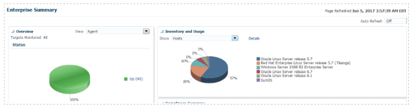
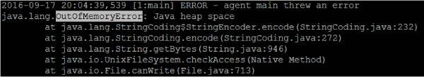

Originally published by Tricore: June 26, 2017

In this blog post, we review common issues that database administrators
(DBAs) might run into when working with Oracle&reg; Enterprise Manager
(OEM) 12c Management Agents. We hope this information helps you fix these
problems quickly and keep your Oracle targets well-monitored.

<!--more-->

### Introduction

OEM Agents are one of the most important components in the OEM monitoring
environment. An Enterprise Manager (EM) Agent is the only component or service
that runs on a target machine, and is solely responsible for collecting and
uploading all monitoring data. OEM then processes the data and generates a
notification alert according to defined threshold values, as shown in the
following figure:



### Common EM Agent issues

This section describes some common EM Agent issues.

#### Issue 1: Java Heap Space-OutOfMemoryError

It's common for DBAs to encounter Java&reg; heap space issues
while working with EM Agents on versions 12.1.0.1.0 and later. OEM Agent 12c
suddenly crashes and displays the following error message:

``/agent_inst/sysman/log/gcagent.log ``

The following image shows what the full error message looks like:



Java heap space issues are sometimes accompanied by a ``TaskZombieException``.
The following code block shows an example of this exception:

```
++++++++++++++++++++
2014-10-12 07:49:43,917 [153032:GC.Executor.70250] ERROR - Critical error:
oracle.sysman.gcagent.task.TaskZombieException: task declared as a zombie
--
2014-10-12 07:49:57,229 [153098:oracle.dfw.impl.incident.DiagnosticsDataExtractorImpl - Incident Dump Executor (created: Sun Oct 12 07:49:48 AST 2014)] ERROR - Result set exceeded max flood control level
2014-10-12 07:50:47,129 [150730:GC.SysExecutor.1751 (Ping OMS)] ERROR - PingListener "Upload Manager" threw an unchecked exception on notification of ((* PingEvent: subsequent scheduled ping attempt with result=SUCCESS occurred at Sun Oct 12 07:50:47 AST 2014 *))
oracle.sysman.gcagent.task.TaskCancelledError: Aborting task due to Thread.interrupt
--
2014-10-12 07:51:33,212 [153110:GC.SysExecutor.1776 (SchedulerHeartbeat)] ERROR - Critical error:
java.lang.OutOfMemoryError: Java heap space
++++++++++++++++++++
```

**Cause**

When an EM Agent collects monitoring metric data, it uses Java memory. The
Agent might crash if it doesn’t have access to the required amount of Java
memory that's specified in the configuration.

**Resolution**

To resolve this issue, use the following steps:

1. Stop the Agent by entering the following command:

          emctl stop agent

2. Make a backup of the ``emd.properties`` file that resides at
   ``../agent_inst/sysman/config``.

3. Edit the ``emd.properties`` file to give it the values shown in the
   following code sample:


         # Applicable only if getting TaskZombieException message.
         _zombieSuspensions=true
         _canceledThreadWait=210

4. Change the Java heap memory size from the default value of
   ``agentJavaDefines=-Xmx128M -XX:MaxPermSize=96M`` to
   ``agentJavaDefines=-Xmx512M -XX:MaxPermSize=96M``.

5. Start the Agent by entering the following command:


        emctl start agent

**Note**: In some cases, you might need to assign ``XmxXXXM`` a value greater
than ``512M`` in order to fix the issue.

#### Issue 2: Linux leap second adjustment bug

The Linux;reg; operating system has a bug in the way that it makes adjustments
to leap second insertions.

In case you're not familiar with leap seconds, here's a definition from RedHat&reg;:

“Leap seconds are a periodic one-second adjustment of Coordinated Universal
Time (UTC) in order to keep a system's time of day close to the mean solar
time. However, the Earth's rotation speed varies in response to climatic
and geological events, and due to this, UTC leap seconds are irregularly
spaced and unpredictable...

“Why this extra second? It exists because the rotation of the Earth on its
axis, which determines the passing of days and nights, slows down over a
long period, mainly as a consequence of Moon-Sun attraction effects. In
addition, the Earth is affected by its internal (core, mantle) and external
(atmosphere, oceans) constituents."

Source: [Resolve Leap Second Issues in Red Hat Enterprise
Linux](https://access.redhat.com/articles/15145)

Some Linux distributions are affected by a bug in the way that the leap second
is inserted or adjusted. This issue impacts Enterprise Manager (EM) Agents and
Oracle Management Service (OMS) functionality adversely.

When the bug is hit, the EM Agent or OMS might begin to consume
excessive CPU on the server. Because leap second adjustments are scheduled for
June 30 or December 31, this issue is typically encountered on or around these
dates.

**How to identify a leap second adjustment**

To identify a leap second adjustment, use the following command:

```
$dmesg | grep -i leap
 [10703552.860274] Clock: inserting leap second 23:59:60 UTC
```

The output shows whether a leap second is being inserted or adjusted.

**Resolution**

Oracle devised a workaround for this bug based on customer feedback.
To resolve the issue, run the following command as a root user:

```
# /etc/init.d/ntpd stop
#  date -s "`date`"    (reset the system clock)
# /etc/init.d/ntpd start
```

You can also fix the issue by restarting the impacted host.

### Conclusion

Keeping these issues and fixes in mind can help you avoid
compromising the monitoring of your critical environments. Have you run up
against similar issues? Use the Feedback tab to make any comments or ask questions.

### References

The following articles were used as references for this article:

- [Enterprise Manager Management Agent or OMS CPU Use Is Excessive near Leap
  Second Additions on Linux (Doc ID
    1472651.1)](https://support.oracle.com/epmos/faces/DocumentDisplay?_afrLoop=287033065719959&id=1472651.1&_adf.ctrl-state=qtcxet0s2_85) (requires a log in)

- [Resolve Leap Second Issues in Red Hat Enterprise
  Linux](https://access.redhat.com/articles/15145)

