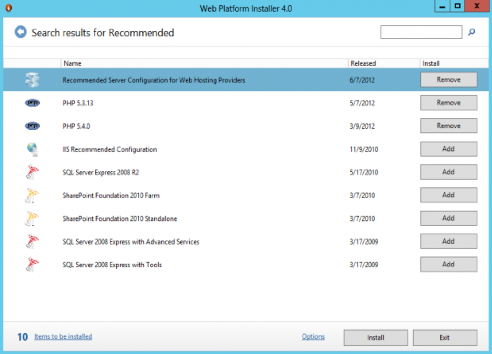
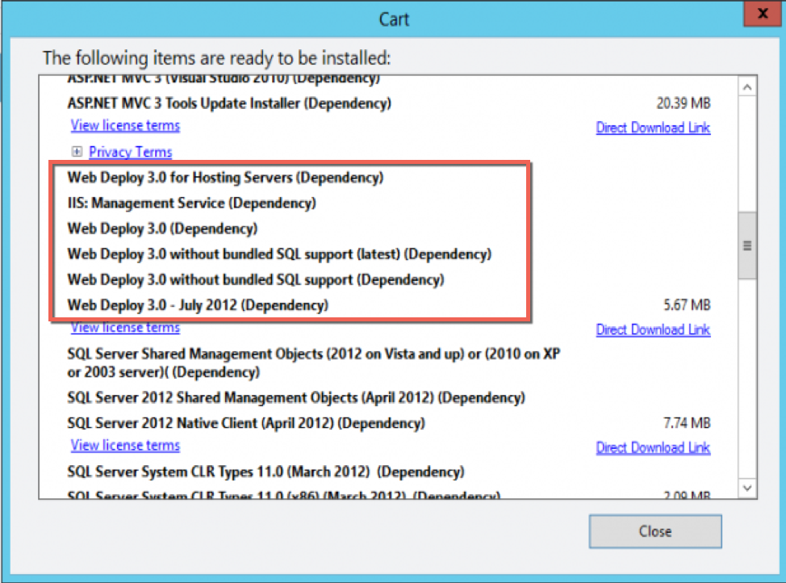
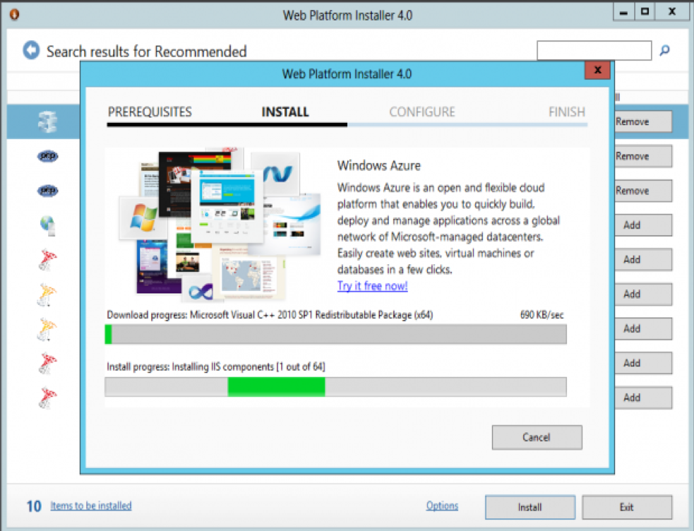
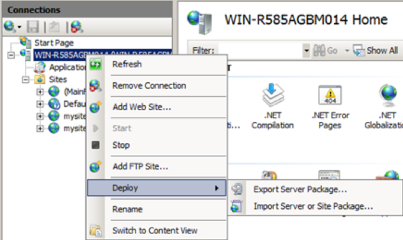
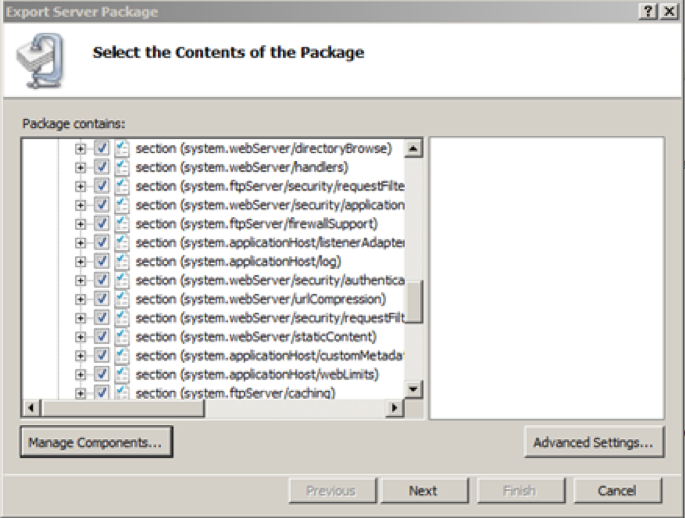
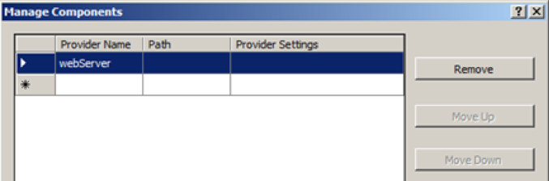
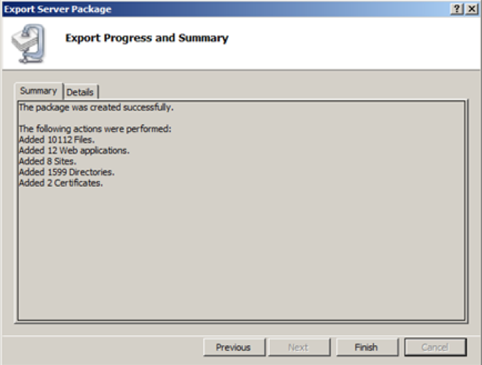
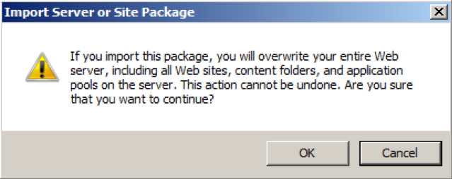

You may be asked to migrate multiple Internet Information Server (IIS) sites
from on-site to the Cloud, but migrating individual sites is a long and daunting
task. This blog discusses simplifying the process.

<!--more-->

### Introduction

The Microsoft&reg; Web Deploy tool is used to export the sites and their content
from a source and import it to a target environment. The following steps for
using Web Deploy to migrate IIS sites are discussed in more detail in this post:

1.	Install Web Deploy on the source and target servers.
2.	Export the IIS contents from the source environment by using Web Deploy.
3.	Copy the data from the source to the target environment by using the PowerShell
``copy/sync`` command.
4.	Import the IIS contents into the target environment using Web Deploy.
5.	Copy the database from the source to the target environment by using backup
and restore commands. This blog uses a MySQL&reg; database as an example.

### Install Web Deploy on the source and target servers

Use the following instructions to install Web Deploy:

1. Install Web Deploy by downloading Microsoft’s
[Web Platform Installer (WebPI)](https://www.iis.net/downloads/microsoft/web-platform-installer),
which includes Web Deploy.
2. After WebPI downloads, launch the installer.
3. Type **Recommended** in the search bar, and choose **Recommended Configuration
for Hosting Providers** as shown in the following screen shot.

<ol start=4>
    <li>To see a list of all components to be installed, click <b>Items to be
    installed</b> at the bottom of the window.  Anything with an "X" next to it
    can be removed. The following screenshot shows the Web Deploy features:</li>
</ol>

<ol start=5>
    <li>Don't uncheck anything, click <b>Next</b>, and <b>Install</b>.  The
    installation begins after you accept the license agreement, as shown in the
    following screenshot:</li>
</ol>

<ol start=6>
    <li> After the WebPI installation completes, close WebPI.</li>
</ol>

### Export the IIS contents from the source environment

Before you begin exporting IIS site contents by using Web Deploy, make a backup
copy of the following files:

-  **C:\Windows\System32\inetsrv\config\administration.config**
-  **C:\Windows\System32\inetsrv\config\applicationHost.config**

These files contain all the site settings. The following steps modify these files
on only the destination server. If you run into issues during the process and
need to get the destination server back to its original state, restore file
backups.

After you've made the backup copies, perform the following steps on the
source server to export the IIS site contents:

1. Open the IIS 7.0 Manager on the source server for your IIS sites to be migrated.
2. Right click on the server name, select **Deploy**, and click **Export Server
Package**, as shown in the following screenshot:

<ol start=3>
    <li>On the <b>Export Server Package</b> screen, click <b>Manage Components</b>
    as shown in the following screenshot:</li>
</ol>

<ol start=4>
    <li>In the <b>Manage Components</b> window, make sure the first <b>Provider Name</b>
    listed is <b>webServer</b>, as shown in the following screenshot. This
    enables you to export the entire server configuration. If it is missing,
    click the cell under <b>Provider Name</b> and choose it from the displayed list.</li>
</ol>

<ol start=5>
    <li>Click <b>OK</b>, <b>Next</b>, and then <b>Next</b> again.</li>
    <li>Enter the path where you want to save the exported file and click <b>Next</b>.</li>
    <li>If prompted, enter the encrypted password for your secure settings.</li>
    <li>Click <b>Finish</b> in the <b>Export Progress and Summary</b> screen as
    shown in the following screenshot:</li>
</ol>

### Copy the data from the source to the target environment

Copy the export file that was created in the preceding section to the target
server by using the standard ``robocopy`` commands, the Windows copy utility, or
the copy utility of your choice.

### Import the IIS contents into the target server

Use the following steps to import the IIS settings on the target server:

1. Open the IIS 7.0 Manager on the destination server for the sites that you are
migrating.
2. Right click on the server name, click **Deploy**, and click **Import Server
or Site Package**.
3. Browse to the exported zip file that you copied from the source server and
select it.
4. Click **Next**.
5. If prompted, enter the encrypted password for your secure settings.
6. Click **Next**.
7. Click **OK** to overwrite the existing IIS configuration on the server, as
shown in the following screenshot:

<ol start=8>
    <li>Click <b>Next</b>.</li>
    <li>Click <b>Finish</b> in the <b>Export Progress and Summary</b> screen.</li>
</ol>

#### Resolve import failure

If the package import fails with the following error, use these steps to
correct the issue:

    Child object 'customFields' cannot be added to object 'logFile'.
    The 'logFile' provider may not support this deployment."

1. Open the zip file, which was exported using `msdeploy`.
2. From the zip file **archive.xml** in a text editor.
3. Remove the lines with customFields.
4. Save the xml file.
5. Import the zip again.

### Backup and restore a MySQL database

To back up your MySQL database on the source server, use the ``mysqldump`` command.

To restore your MySQL database on the target server, use the ``mysql`` command
with name of the dump file that you created.

### Conclusion:

Migrating IIS sites manually can be monolithic work. Web Deploy makes it easy
to migrate thousands of sites and their configuration seamlessly to target
environments with no need to worry about code. Web deploy not only automates
most of the migration, it also eliminates the possibility of human error and
saves time.

<a class="cta red" id="cta" href="https://www.rackspace.com/dba-services">Learn more about Databases</a>

Visit [www.rackspace.com](https://www.rackspace.com) and click **Sales Chat**
to get started.

Use the Feedback tab to make any comments or ask questions.
