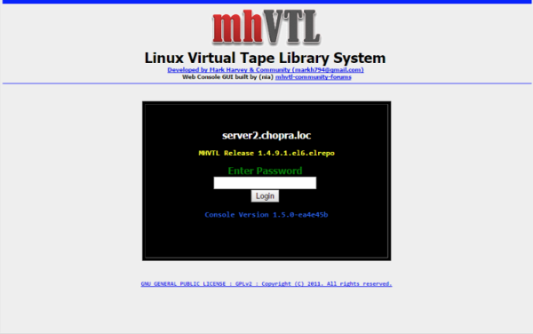
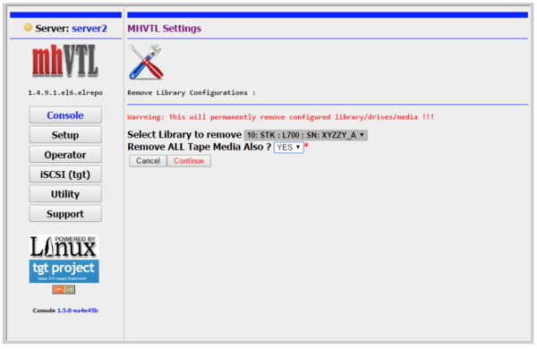
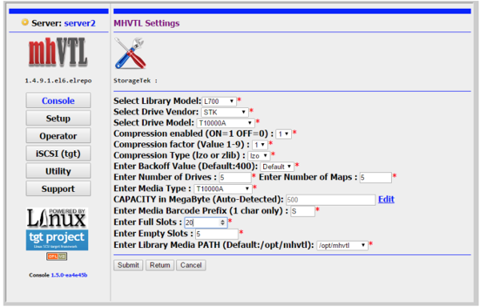
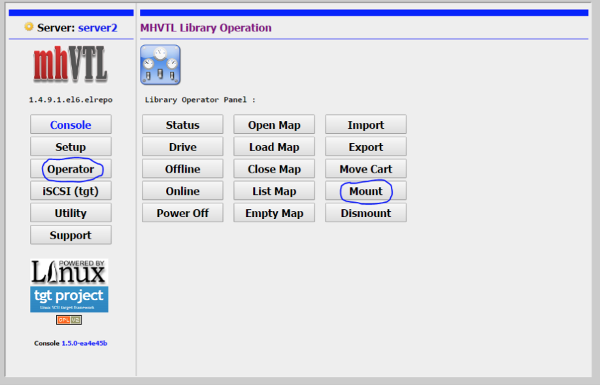
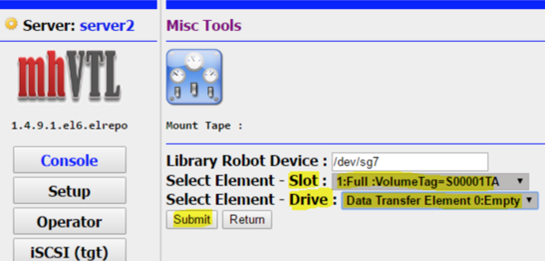

Originally published by TriCore: November 22, 2017

A virtual tape library (VTL) is a data storage virtualization technology
that's typically used for backups and recovery. A VTL presents a storage
component, which is usually hard disk storage, as tape libraries or tape
drives for use with existing backup software.

<!--more-->

Virtualizing disk storage as tape enables you to integrate storage with
existing backup software, as well as existing backup and recovery processes
and policies. Tape virtualization also consolidates storage and speeds up data
restore processes.

In addition, disk technology doesn't rely on streaming and can write
effectively regardless of data transfer speeds. As a result, switching to
VTLs eliminates streaming problems that often impair efficiency in tape
drives.

By backing up data to disks instead of tapes, VTLs often increase the
performance of both backup and recovery operations. Restore processes are
faster than backup, regardless of implementation.

### The advantages of VTLs

The durability, low cost, and high density of tape make it an ideal media for
handling extremely large amounts of information. However, tapes also come with
one significant drawback: speed.

In order to work effectively, automated tape libraries need a significant
boost in speed to take them to the next level. VTLs were created to address
this need.

Instead of reading from and writing to tape directly, VTLs maintain a large,
disk-based buffer of virtual tapes. This buffer expedites the read and write
processes, and often represents as many as 256 or 512 tapes.

#### Performance

Virtual copies of tapes can be instantly accessed in the buffer without being
loaded into the reader. They enable you to access 20 different virtual tapes
in the same amount of time that it would take you to find, load, and read just
one or two tapes.

#### Capacity

With simple, automated tape libraries, storage devices were often underused.
To save a file, you had to pick up a tape, write to it, and then put it back.
Now, you can load up the entire virtual tape before putting it back. Better
yet, there are ways to optimize file storage across many virtual devices. For
example, you can save space by copying several smaller virtual tapes to one
physical tape.

#### Other benefits of using VTLs

Here are some other benefits of using VTLs:

* Enhanced performance

* Greater capacity

* Ability to keep trusted backup software in place

* Reduced data center infrastructure footprints

* Streamlined backup processes and reduced manual effort

* Data durability

* Low-cost data archiving for long-term retention and predictable retrieval
  times

### mhVTL

mhVTL is a free virtual tape library. Because this library isn't
production-ready, you can use it to explore VTLs and for non-production
environments. There are also proprietary VTL offerings available on the
market. You can use any backup software with VTL.

### Understand mhVTL basics

Let's walk through an example that might help you better understand mhVTL.

Imagine that you're using two virtual box Centos machines. The first
represents the VTL and the second represents the backup machine. One Centos
machine is running VTL.

1. Verify that Security-Enhanced Linux&reg; (SELinux) is disabled. If it's not,
   disable it and then reboot it.

2. To install repositories from the web, enter the following commands:

        [root@server2 ~]# rpm --import https://www.elrepo.org/RPM-GPG-KEY-elrepo.org

        [root@server2 ~]# rpm -Uvh https://www.elrepo.org/elrepo-release-6-6.el6.elrepo.noarch.rpm

3. Next, install the mhVTL software by entering the following command:

        [root@server2 ~]# yum install kmod-mhvtl mhvtl-utils

4. Reboot the machine.

Because configuring a VTL from the command line is difficult, install it
through the web user interface (UI).

1. On the command line, enter ``mkdir /guivtl``.

2. Download the web interface console by entering the following commands:

        [root@server2 ~]# cd /guivtl/

        [root@server2 guivtl]# weget https://github.com/markh794/mhvtl-gui/tarball/master

3. Enter the following command:

        [root@server2 guivtl]# tar zxvf markh794-mhvtl-gui-1.4.4-41-gcfcd117.tar.gz

4. Enter this command:

        [root@server2 guivtl]# cd markh794-mhvtl-gui-cfcd117/

5. Enter the following command:

        [root@server2 markh794-mhvtl-gui-cfcd117]# yum install httpd php

6. Enter this command:

        [root@server2 markh794-mhvtl-gui-cfcd117]# chkconfig httpd on

7. Enter the following commands:

        [root@server2 markh794-mhvtl-gui-cfcd117]# mkdir /var/www/html/mhvtl

        [root@server2 markh794-mhvtl-gui-cfcd117]# cp -r * /var/www/html/mhvtl

8. The web server user must be unable to run all root user commands. To manage
   user permissions, enter the following command:

        [root@server2 ~]# echo "apache ALL=(ALL) NOPASSWD: ALL" >> /etc/sudoers

9. In the ``sudoers`` file, comment out ``Defaults requiretty`` by entering
   the following command:

        [root@server2 ~]# cat /etc/sudoers | grep -i "Defaults requiretty"

        # Defaults requiretty

10. To install the required packages, use the following command:

        [root@server2 ~]# yum install lsscsi mtx mt-st git sysstat iscsi-initiator-utils*

11. To configure the virtual alias on the web server, enter the following
    commands:

        /var/www/html/mhvtl

        [root@server2 ~]# vi /etc/httpd/conf/httpd.conf

    At the end of file, add the following lines:

        Alias /mhvtl "/var/www/html/mhvtl"

        <Directory "/var/www/html/mhvtl">

        Options None

        AllowOverride None

        Order allow,deny

        Allow from all

        </Directory>

12. Restart the web server by entering the following command:

          [root@server2 ~]# /etc/init.d/httpd restart

13. To test whether the web-based UI is accessible from your
    browser, paste the following URL into the address bar:

          https://192.168.171.142/mhvtl/

    You should see the screen in the following image:

    

13. Log in to the UI. The default password is **MHVTL**.

14. If ``tgt`` is offline, you need to install ``stgt``. Click the
    **Install** button.

15. To install the Internet Small Computer System Interface (iSCSI) target,
    enter the following commands:

          [root@server2 ~]# yum list | grep -i scsi-target-util

          scsi-target-utils.x86_64 1.0.24-18.el6 base

          [root@server2 ~]# yum install scsi-target-utils.x86_64

### Working with the mhVHTL UI

Now let's use the UI to set up and configure a tape library.

1. Go to the web UI, click the **Console** button in the left navigation
   pane, and start **SCCI target framework (tgt)**.

2. The mhVTL framework has already configured a robot. You need to erase this
  robot. To remove the robot, go to the **Setup** page and click **remove**.

3. In the **Select Library to remove** drop-down box, select one library
   at a time (if there are multiple libraries), then select **Yes** for the
   **Remove ALL Tape Media Also?** option and click **Continue**.

4. The last robot can't be removed. However, after you've created your own
   robot you can go ahead and remove the default one.

 

<ol start=5>
    <li>After you have removed the robot, click <strong>Start MHVTL</strong>.</li>

    <li>Next, click <strong>Setup</strong> in the left navigation pane, then click <strong>Add >
        Standard</strong>. These steps initiate the setup wizard.</i>

    <li>Click <strong>Next</strong> to begin working with the wizard.</li>
</ol>

#### Create a tape library

In this example, we create an Oracle&reg; StorageTek L700 tape library.

1. Select **STK**, then fill out all of the required settings.

 

<ol start=2>
    <li>After you've entered all of the details, click the <strong>Submit</strong> button, then
        click <strong>Finish</strong> twice. Finally, click <strong>Return</strong>.</li>

    <li>Select <strong>Console</strong> in the left navigation pane and click the <strong>Start</strong> button to start the mhVTL engine.</li>

</ol>

At this point, there should be two VTLs. If you want, you can erase the older
VTL.

#### Configure your tape library

Configure the robot STK L700 as an iSCSI target to prepare it to be
connected by the host initiator by using iSCSI.

1. Navigate to the **iSCSI (tgt)** section of the UI.

2. Select **Quick Start > Start > Return**:

3. Select **Target**.

Your robot is now ready. The robot tape drives are configured in the
``/opt/mhvtl`` directory.

The STK L700 robot and its tape drives are configured in
``/etc/mhvtl/device.conf``. The mhVTL general configuration is stored in
``/etc/mhvtl/mhvtl.conf``. For more information, enter the following command:

      [root@server2 ~]# cat /etc/mhvtl/device.conf

The output should be similar to the following example:

      VERSION: 5

      # VPD page format:

      # <page #> <Length> <x> <x+1>... <x+n>

      # NAA format is an 8 hex byte value seperated by ':'

      # Note: NAA is part of inquiry VPD 0x83

      #

      # Each 'record' is separated by one (or more) blank lines.

      # Each 'record' starts at column 1

      # Serial num max len is 10.

      # Compression: factor X enabled 0|1

      # Where X is zlib compression factor 1 = Fastest compression

      # 9 = Best compression

      # enabled 0 == off, 1 == on

      #

      # fifo: /var/tmp/mhvtl

      # If enabled, data must be read from fifo, otherwise daemon will block

      # trying to write.

      # e.g. cat /var/tmp/mhvtl (in another terminal)

      Library: 50 CHANNEL: 1 TARGET: 00 LUN: 00

      Vendor identification: STK

      Product identification: L700

      Product revision level: 0016

      Unit serial number: 90000050

      NAA: 50:11:22:33:ab:1:00:00

      Home directory: /opt/mhvtl

      Backoff: 400

      .

      .

      .

      .

      Drive: 54 CHANNEL: 1 TARGET: 00 LUN: 4

      Library ID: 50 Slot: 4

      Vendor identification: STK

      Product identification: T10000A

      Product revision level: 1.27

      Unit serial number: 90000054

      NAA: 50:11:22:33:ab:1:00:4

      Compression: factor 1 enabled 1

      Compression type: lzo

      Backoff: 400

      Drive: 55 CHANNEL: 1 TARGET: 00 LUN: 5

      Library ID: 50 Slot: 5

      Vendor identification: STK

      Product identification: T10000A

      Product revision level: 1.27

      Unit serial number: 90000055

      NAA: 50:11:22:33:ab:1:00:5

      Compression: factor 1 enabled 1

      Compression type: lzo

      Backoff: 400

      Checking tgtd daemon is running:

      [root@server2 ~]# /etc/init.d/tgtd status

      tgtd (pid 2080 2078) is running...

      [root@server2 ~]#

#### Connect the Centos 6.x host to the configured mhVTL

This section describes how to connect the client to the server that's hosting
the virtual tape drive.

To ensure that ``iscsi-initiator-utils`` is installed, enter the following
commands:

      [root@server3 ~]# yum install iscsi-initiator-utils

      [root@server3 ~]# rpm -qa | grep -i iscsi-initiator-utils

The output should be similar to the following example:

      iscsi-initiator-utils-6.2.0.873-22.el6_8.x86_64

Next, execute the following command:

      [root@server3 ~]# iscsiadm -m discovery -t st -p 192.168.171.142

The output should be similar to the following example:

      192.168.171.142:3260,1 iqn.1994-05.com.redhat:dbb9aea5f9f:mhvtl:stgt:1

      [root@server3 ~]#iscsiadm -m node -T iqn.1994-05.com.redhat:dbb9aea5f9f:mhvtl:stgt:1 -p 192.168.171.142 -l

      [root@server3 ~]# dmesg

      .
      .
      .

      st: Version 20130315rh, fixed bufsize 32768, s/g segs 256

      st 33:0:0:1: Attached scsi tape st0

      st 33:0:0:1: st0: try direct i/o: yes (alignment 1 B)

      osst :I: Tape driver with OnStream support version 0.99.4

      osst :I: $Id: osst.c,v 1.73 2005/01/01 21:13:34 wriede Exp $

      scsi 33:0:0:2: Sequential-Access STK T10000A 1.27 PQ: 0 ANSI: 5

      st 33:0:0:2: Attached scsi tape st1

      st 33:0:0:2: st1: try direct i/o: yes (alignment 1 B)

      st 33:0:0:2: Attached scsi generic sg4 type 1

      scsi 33:0:0:3: Sequential-Access STK T10000A 1.27 PQ: 0 ANSI: 5

      st 33:0:0:3: Attached scsi tape st2

      st 33:0:0:3: st2: try direct i/o: yes (alignment 1 B)

      st 33:0:0:3: Attached scsi generic sg5 type 1

      scsi 33:0:0:4: Sequential-Access STK T10000A 1.27 PQ: 0 ANSI: 5

      st 33:0:0:4: Attached scsi tape st3

      st 33:0:0:4: st3: try direct i/o: yes (alignment 1 B)

      st 33:0:0:4: Attached scsi generic sg6 type 1

      scsi 33:0:0:5: Sequential-Access STK T10000A 1.27 PQ: 0 ANSI: 5

      st 33:0:0:5: Attached scsi tape st4

      st 33:0:0:5: st4: try direct i/o: yes (alignment 1 B)

      st 33:0:0:5: Attached scsi generic sg7 type 1

      scsi 33:0:0:6: Medium Changer STK L700 0016 PQ: 0 ANSI: 5

      scsi 33:0:0:6: Attached scsi generic sg8 type 8

      SCSI Media Changer driver v0.25

      ch0: type #1 (mt): 0x2c0+1 [medium transport]

      ch0: type #2 (st): 0x400+25 [storage]

      ch0: type #3 (ie): 0x300+5 [import/export]

      ch0: type #4 (dt): 0x1+5 [data transfer]

      [root@server3 ~]# /etc/init.d/iscsi status

      iSCSI Transport Class version 2.0-870

      version 6.2.0-873.22.el6

      Target: iqn.1994-05.com.redhat:dbb9aea5f9f:mhvtl:stgt:1 (non-flash)

      Current Portal: 192.168.171.142:3260,1

      Persistent Portal: 192.168.171.142:3260,1

      **********

      Interface:

      **********

      Iface Name: default

      Iface Transport: tcp

      Iface Initiatorname: iqn.1994-05.com.redhat:9738eb103a40

      Iface IPaddress: 192.168.171.145

      Iface HWaddress: <empty>

      Iface Netdev: <empty>

      SID: 1

      iSCSI Connection State: LOGGED IN

      iSCSI Session State: LOGGED_IN

      Internal iscsid Session State: NO CHANGE

      *********

      Timeouts:

      *********

      Recovery Timeout: 120

      Target Reset Timeout: 30

      LUN Reset Timeout: 30

      Abort Timeout: 15

      *****

      CHAP:

      *****

      username: <empty>
      password: ********

      username_in: <empty>

      password_in: ********

      ************************

      Negotiated iSCSI params:

      ************************

      HeaderDigest: None

      DataDigest: None

      MaxRecvDataSegmentLength: 262144

      MaxXmitDataSegmentLength: 8192

      FirstBurstLength: 65536

      MaxBurstLength: 262144

      ImmediateData: Yes

      InitialR2T: Yes

      MaxOutstandingR2T: 1

      ************************

      Attached SCSI devices:

      ************************

      Host Number: 33 State: running

      scsi33 Channel 00 Id 0 Lun: 0

      scsi33 Channel 00 Id 0 Lun: 1

      scsi33 Channel 00 Id 0 Lun: 2

      scsi33 Channel 00 Id 0 Lun: 3

      scsi33 Channel 00 Id 0 Lun: 4

      scsi33 Channel 00 Id 0 Lun: 5

      scsi33 Channel 00 Id 0 Lun: 6

#### Use backup software with your VTL

Your basic setup is complete, and you're ready to use any backup software with
your tape library.

In this example, you work with the very basic Linux utilities ``mt`` and
``mtx``.

To ensure that you installed the required packages, enter the following
command:

      [root@server3 ~]# rpm -qa | grep -i ^mt

The output should be similar to the following example:

      mtr-0.75-5.el6.x86_64

      mt-st-1.1-5.el6.x86_64

      mtools-4.0.12-1.el6.x86_64

      mtdev-1.1.2-5.el6.x86_64

      mtx-1.3.12-5.el6.x86_64

**Tape device names on Linux**

Linux has the following tape device names:

- ``/dev/rmt/0``, ``/dev/rmt/1``, or ``/dev/rmt/[0-127]``: These are the
  standard tape device names on Unix. These tapes are rewound.

- ``/dev/rmt/0n``: Tapes with this name are referred to as no-rewind. After
  the tape is used, it remains in the current status for next command.

- ``/dev/rmt/0b``: These tapes use a magnetic tape interface and Berkeley
  Software Distribution (BSD) behavior. They're more readable by a variety of
  operating systems, including IBM Advanced Interactive eXecutive (AIX)&reg;,
  Microsoft&reg; Windows&reg;, Linux&reg;, and FreeBSD&reg;.

- ``/dev/rmt/0l``: Using this name sets the density of the tape drive to low.

- ``/dev/rmt/0m``: Using this name sets the density of the tape drive to
  medium.

- ``/dev/rmt/0u``: Using this name sets the density of the tape drive to high.

- ``/dev/rmt/0c``: Using this name sets the density of the tape drive to
  compressed.

- ``/dev/st[0-9]``: This is a Linux-specific Small Computer System Interface
  (SCSI) tape device name.

**Tape device name examples**

The following list of examples shows when you should use certain tape device
names:

- ``/dev/rmt/1cn``: This name indicates that the tape uses unity 1, compressed
  density, and no rewind.

- ``/dev/rmt/0hb``: This name indicates that the tape uses unity 0, high
  density, and BSD behavior.

- ``/dev/st0``: This is the auto-rewind SCSI tape device name on Linux.

- ``/dev/nst0``: This is the non-rewind SCSI tape device name on Linux.

**List installed sCSI tape devices**

To generate a list of all of the sCSI tape devices that have been installed,
enter the following commands:

      lsscsi

      lsscsi -g

      [root@server3 ~]# rpm -qa | grep -i ^lsscsi

      lsscsi-0.23-2.el6.x86_64[root@server3 ~]# lsscsi -g

The output should be similar to the following example:

      [0:0:0:0] disk VMware, VMware Virtual S 1.0 /dev/sda /dev/sg0

      [4:0:0:0] cd/dvd NECVMWar VMware SATA CD01 1.00 /dev/sr0 /dev/sg1

      [33:0:0:0] storage IET Controller 0001 - /dev/sg2

      [33:0:0:1] tape STK T10000A 1.27 /dev/st0 /dev/sg3

      [33:0:0:2] tape STK T10000A 1.27 /dev/st1 /dev/sg4

      [33:0:0:3] tape STK T10000A 1.27 /dev/st2 /dev/sg5

      [33:0:0:4] tape STK T10000A 1.27 /dev/st3 /dev/sg6

      [33:0:0:5] tape STK T10000A 1.27 /dev/st4 /dev/sg7

      [33:0:0:6] mediumx STK L700 0016 /dev/sch0 /dev/sg8

**Display the status of the tape drive**

To display the status the tape drive, enter the following command:

      [root@server3 ~]# mtx -f /dev/sg8 status

The output should be similar to the following example:

      Storage Changer /dev/sg8:5 Drives, 30 Slots ( 5 Import/Export )

      Data Transfer Element 0:Empty

      Data Transfer Element 1:Empty

      Data Transfer Element 2:Empty

      Data Transfer Element 3:Empty

      Data Transfer Element 4:Empty

      Storage Element 1:Full :VolumeTag=S00001TA

      Storage Element 2:Full :VolumeTag=S00002TA

      Storage Element 3:Full :VolumeTag=S00003TA

      Storage Element 4:Full :VolumeTag=S00004TA

      Storage Element 5:Full :VolumeTag=S00005TA

      Storage Element 6:Full :VolumeTag=S00006TA

      Storage Element 7:Full :VolumeTag=S00007TA

      Storage Element 8:Full :VolumeTag=S00008TA

      Storage Element 9:Full :VolumeTag=S00009TA

      Storage Element 10:Full :VolumeTag=S00010TA

      Storage Element 11:Full :VolumeTag=S00011TA

      Storage Element 12:Full :VolumeTag=S00012TA

      Storage Element 13:Full :VolumeTag=S00013TA

      Storage Element 14:Full :VolumeTag=S00014TA

      Storage Element 15:Full :VolumeTag=S00015TA

      Storage Element 16:Full :VolumeTag=S00016TA

      Storage Element 17:Full :VolumeTag=S00017TA

      Storage Element 18:Full :VolumeTag=S00018TA

      Storage Element 19:Full :VolumeTag=S00019TA

      Storage Element 20:Full :VolumeTag=CLN020TA

      Storage Element 21:Empty

      Storage Element 22:Empty

      Storage Element 23:Empty

      Storage Element 24:Empty

      Storage Element 25:Empty

      Storage Element 26 IMPORT/EXPORT:Empty

      Storage Element 27 IMPORT/EXPORT:Empty

      Storage Element 28 IMPORT/EXPORT:Empty

      Storage Element 29 IMPORT/EXPORT:Empty

      Storage Element 30 IMPORT/EXPORT:Empty

      Above drives are empty.

**Check the status of the tape device**

To check the status of the tape device, enter the following command:

      [root@server3 ~]# mt -f /dev/st0 status

The output should be similar to the following example:

      SCSI 2 tape drive:

      File number=-1, block number=-1, partition=0.

      Tape block size 0 bytes. Density code 0x0 (default).

      Soft error count since last status=0

      General status bits on (50000):

      DR_OPEN IM_REP_EN

Load tape on ``Data Transfer Element 0`` to make it usable. To accomplish this
task, go back to the mhVTL portal and load the tape on slot 0 by using the
following steps:

1. Select **Operator > Mount**.

   

<ol start=2>
    <li>Select <strong>Element Slot</strong> and <strong>Drive</strong>.</li>
</ol>

   

<ol start=3>
    <li>Next, go back to server3 (the backup server) and check its status again.</li>
</ol>

      [root@server3 ~]# mtx -f /dev/sg8 status

      The output should be similar to the following example:

        Storage Changer /dev/sg8:5 Drives, 30 Slots ( 5 Import/Export )

        Data Transfer Element 0:Full (Storage Element 1 Loaded):VolumeTag = S00001TA

        Data Transfer Element 1:Empty

        Data Transfer Element 2:Empty

        Data Transfer Element 3:Empty

        Data Transfer Element 4:Empty

        Storage Element 1:Empty

        Storage Element 2:Full :VolumeTag=S00002TA

        Storage Element 3:Full :VolumeTag=S00003TA

        Storage Element 4:Full :VolumeTag=S00004TA

        Storage Element 5:Full :VolumeTag=S00005TA

        Storage Element 6:Full :VolumeTag=S00006TA

        Storage Element 7:Full :VolumeTag=S00007TA

        Storage Element 8:Full :VolumeTag=S00008TA

        Storage Element 9:Full :VolumeTag=S00009TA

        Storage Element 10:Full :VolumeTag=S00010TA

        Storage Element 11:Full :VolumeTag=S00011TA

        Storage Element 12:Full :VolumeTag=S00012TA

        Storage Element 13:Full :VolumeTag=S00013TA

        Storage Element 14:Full :VolumeTag=S00014TA

        Storage Element 15:Full :VolumeTag=S00015TA

        Storage Element 16:Full :VolumeTag=S00016TA

        Storage Element 17:Full :VolumeTag=S00017TA

        Storage Element 18:Full :VolumeTag=S00018TA

        Storage Element 19:Full :VolumeTag=S00019TA

        Storage Element 20:Full :VolumeTag=CLN020TA

**Back up the directory**

To back up the directory in tape archive (TAR) format, enter the following
command:

      [root@server3 ~]# tar cvf /dev/st0 /etc/

The output should be similar to the following example:

      tar: Removing leading `/` from member names

      /etc/

      /etc/hosts.deny

      /etc/audit/

      /etc/audit/audit.rules

      /etc/audit/auditd.conf

      /etc/lsb-release

      /etc/abrt/

      /etc/abrt/plugins/

      /etc/abrt/plugins/CCpp.conf

      /etc/abrt/plugins/python.conf

      /etc/abrt/gpg_keys

      /etc/abrt/abrt.conf

      .
      .
      .

**List or check tape contents**

To pull up the tape contents in TAR format, enter the following command:

      [root@server3 ~]# tar tvf /dev/st0

**Restore the directory**

To restore the directory, enter the following commands:

      [root@server3 ~]# tar xvf /dev/st0 -C /tmp &>/dev/null

      [root@server3 ~]# ls -ld /tmp/etc/

      drwxr-xr-x 114 root root 12288 Mar 22 02:25 /tmp/etc/

      [root@server3 ~]# date

      Wed Mar 22 02:48:10 IST 2017

There are many other options for restoring a directory. These include using a
partition backup or free backup software such as Bacula&reg;.

### Conclusion

Managing physical tape backups requires effort, time, and other costs,
such as setting up tapes and sending them off-site. This approach isn't
feasible for small and medium-sized businesses. Retrieving data from tape
backup is also inconvenient, and searching for the correct tape can
be tedious.

VTLs are the simplest replacement for tapes. They're also more flexible,
reliable, and easier to manage. VTLs have lower latency and enhanced
performance that enable you to integrate newer data encryption techniques
with disk. They also deliver high-speed backup with restore management in case
of any loss. VTLs emulate physical tape drives, combining the advantages of
both physical tapes and disks.

Use the Feedback tab to make any comments or ask questions.

### References

The following article was used as a reference for this post:

- [15 Useful Linux and Unix Tape Managements Commands For
  Sysadmins](https://www.cyberciti.biz/hardware/unix-linux-basic-tape-management-commands/)
