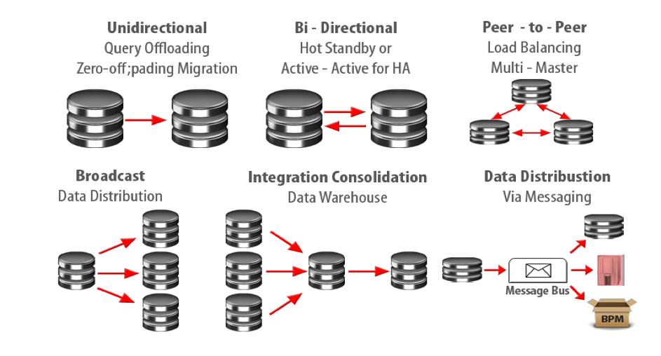
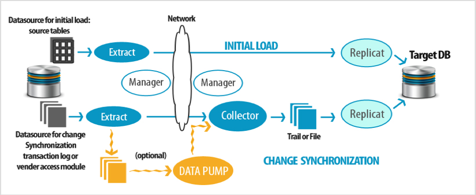
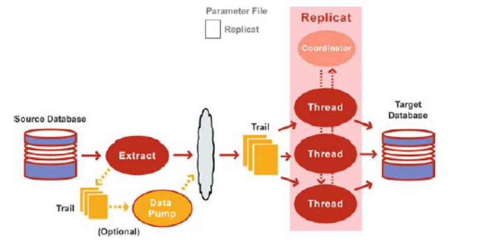
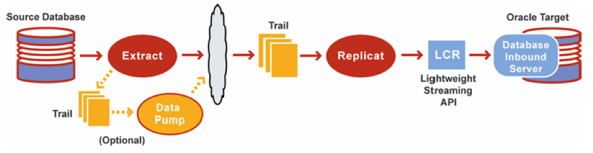

This blog post explores the basics of Oracle&reg; GoldenGate&reg; and its
functions. Because it's decoupled from the database architecture, GoldenGate
facilitates heterogeneous and homogeneous real-time capture of transactional change data
capture and integration.

<!--more-->

### Introduction to Oracle GoldenGate

Oracle GoldenGate is a software product that allows you to replicate, filter,
and transform data from one database to another database.

It enables the replication of data between Oracle databases and other supported
heterogeneous databases.

### Why use GoldenGate?

Some reasons to use GoldenGate include the following items:

-	Data movement is in real-time and reduces latency.
-	Only committed transactions are moved, enabling consistency and improving
performance.
-	Different versions and releases of Oracle databases are supported, along with
variety of heterogeneous databases running on various operating systems.
-	It uses simple architecture and has easy configuration.
-	It has high performance with minimal overhead for the underlying databases
and infrastructure.

#### Business requirements that GoldenGate supports

Use GoldenGate to meet the following business requirements:

-	Business continuity and high availability
-	Initial load and database migration and upgrades with zero downtime
-	Data integration
-	Live reporting

#### How to use GoldenGate

There are many different architectures that can be configured, ranging from a
simple unidirectional architecture to a more complex peer-to-peer one. Refer to
the following image to see the various topologies supported by GoldenGate.

**Image Source:** https://www.vitalsofttech.com/goldengate-replication-topologies/

### GoldenGate logical architecture

The following image shows the components, or processes, of the GoldenGate
architecture, which are described in this section:

**Image source**: https://www.vitalsofttech.com/wp-content/uploads/2013/06/GoldenGate-Replication.jpg

#### Manager

The manager is the process that starts the other GoldenGate processes. This
process must run on both the source and target system for the configuration and
must initiate all the other GoldenGate processes. The manager process also
allocates disk space by purging the old trails or extract files. One manager process is
required for every GoldenGate installation.

#### Extract

The extract process involves data extraction, which is called *data capture* in
GoldenGate. Extract is the process that is configured to run against the source
mining database.

Extract is responsible for capturing the committed data modeling language (DML)
transactions and the data definition language (DDL) from Oracle redo logs. Extract
writes these data changes into trails or extract files.

#### Trail

A trail is the series of files on the disk where GoldenGate stores the captured
changes, which supports the continuous extraction and replication of database
changes. These are platform-independent binary files at the OS level.

#### Replicat

Replicat is the process that delivers data to a target database. It reads the
trail on the target database, reconstructs the DML or DDL operations, and
applies them to the target database.

#### Pump

The pump process, which is also an extract process, is optional in the GoldenGate
setup. This process copies the trail files that contain data to the target system.

#### Checkpoint

The extract pump and Replicat processes use checkpoints for tracking their
respective progress. This mechanism marks the location of data changes that have
been retrieved or applied from the trail files. This is useful when processes
need to recover without any data loss or need to know the starting point after
a failure.

#### Collector

The collector process runs on the target system and writes the data changes from
the source database in the target trail files, which are known as **RMTTRAIL**.
Before copying it to **RMTTRAIL**, the collector reassembles the files.

### GoldenGate capture modes

Oracle GoldenGate supports the following types of capture, which are described
in this section:

-	Classic capture
-  Integrated capture

#### Classic capture mode

Classic capture is the original GoldenGate capture mechanism, which reads data
directly from the online redo logs and archived redo logs where possible.
Additional data might be fetched from the database file where necessary.

#### Integrated capture mode

Integrated capture (IC), introduced in Oracle GoldenGate version 11.2.1, was
initially available for Oracle 11.2.0.3 with the 11.2.0.3 database-specific
bundle patch for Integrated Extract 11.2.x (MOS Note 1411356.1). IC uses a
log-mining server on the source system or in a downstream Oracle database,
similar to a DataGuard logical standby or Oracle streams.

IC is a new form of the extract process, which has moved inside the source
database. In the traditional classic extract process, the extract works on the
redo logs outside the domain of the actual database. In IC, a server
log miner process is started, which extracts all the DML data and DDL
statements (create, alter, drop, and so on) and creates logical change records
(LCR). These records are then handed to the GoldenGate memory processes, which
write the LCR’s to the local trail files.

### GoldenGate Replicat modes

Before the release of version 12.1, Replicat applied transactions to the target
database serially. To achieve parallelism, tables had to be split across multiple
replicates for quicker data application and reduced lag. Drawbacks to this
approach include the manual configuration of multiple replicates and trail files
and the limiting inability to split tables that had foreign key relationships
across replicates.

The new coordinated and integrated Replicat modes help you to apply transactions
in parallel on the target database without having to manually split tables into
multiple replicates.

The following sections describe the different Replicat modes.

#### Classic Replicat

With classic Replicat, a target database checkpoint tells the system which
transactions have been committed and which have not. This is a key aspect of
transactional replication.

Classic Replicat has the following characteristics:

-  Applies SQL serially.
-  Must be used if the database version is less than 11.2.0.4

The following image illustrates classic Replicat:

**Image source**: https://docs.oracle.com/GoldenGate/1212/gg-winux/GIORA/img/integratedapply.jpg

#### Coordinated Replicat

A configured Replicat is called a coordinator. This process starts additional
replicates based on the specified number of threads. The Replicat name is limited
to five characters, and the threaded replicates have this name appended with a
three-digit number (for example, RGGMA, RGGMA001, RGGMA002, and so on).  The
coordinator sends SQL to the threads, which can be applied in parallel and in
committed order.

The following image illustrates coordinated Replicat:

**Image source**: https://www.red-gate.com/simple-talk/sql/oracle/oracle-GoldenGate-12c-new-features-part-2/

#### Integrated Replicat

Integrated Replicat has the following characteristics:

-	Constructs LCRs that represent source database DML transactions (in committed
order). DDL is applied directly by Replicat. These transactions can be applied
in parallel.
-	Attaches to a background process in the target database, which is known as
the database inbound server, by means of a lightweight streaming interface.
-	Transmits the LCRs to the inbound server, which applies the data to the
target database.

The following image illustrates integrated Replicat:

**Image source**: https://docs.oracle.com/GoldenGate/1212/gg-winux/GIORA/process_mode.htm#GIORA212

### Conclusion

This blog described how and why to use GoldenGate and discussed its architecture
and components.  It also detailed the capture modes and Replicat modes
incorporated in the tool.

Use the Feedback tab to make any comments or ask questions.

