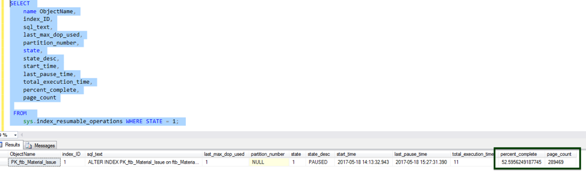
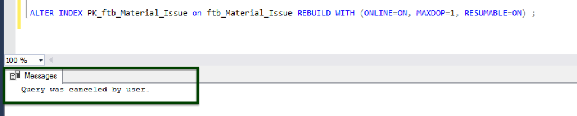
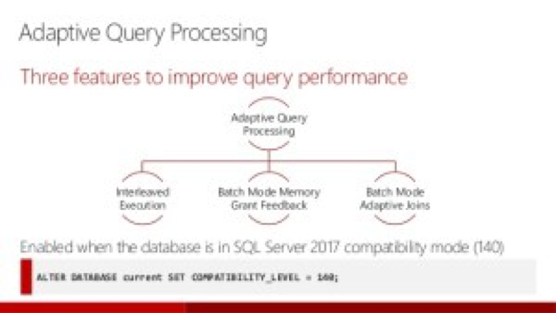
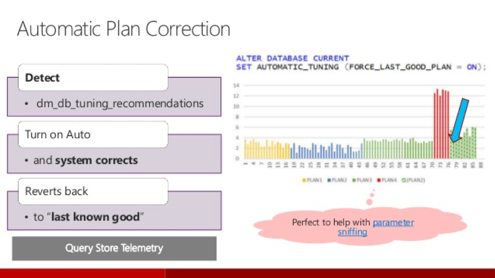
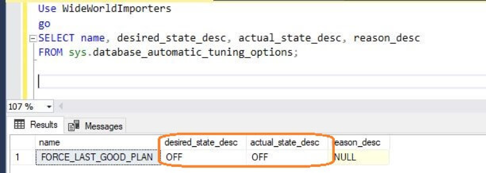
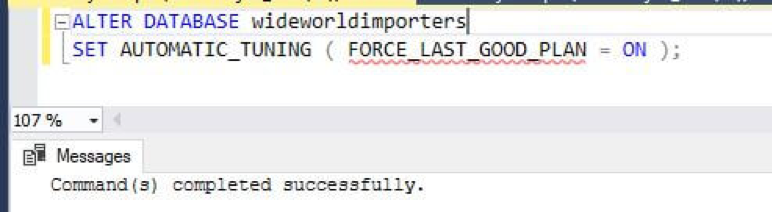
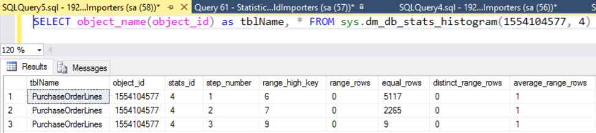
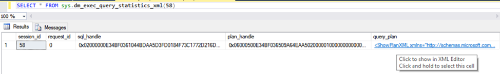

Are you considering an upgrade to a more modern version of SQL Server? Are you
choosing between SQL Server 2016 or SQL Server 2017? If so, then my advice is
to upgrade to SQL Server 2017 as I explain in this post.

The release of SQL Server technology provides lots of interesting new features
for SQL administrators and developers to ponder. The Community Technology
Preview (CTP) 2.0 for SQL Server vNext (generally called SQL Server 2017)
is no exception. Many updates have been implemented in the existing
features and services of the application. In this blog post, I discuss what is
new in the database engine of SQL Server 2017 from a database administrator (DBA)
perspective.

<!--more-->

### Introduction

Microsoft&reg; SQL Server 2017 is now on the scene with more new features that
offer faster processing, more flexibility of use, and greater cost savings as
a result. SQL Server 2016 provided many improvements, which Microsoft termed as
a big leap forward. However, if SQL Server 2016 was a big leap, then SQL Server
2017 promises all that and much more of what corporate customers need at all
levels. Database performance has reached a new peak with adaptive query
processing, new flexibility with cross-platform capabilities, new integrations
for statistical and data science analysis, and SQL Server versions on Linux&reg;,
Ubuntu&reg; operating systems, or Docker&reg;. The new version adds solid technology with cost
savings.

The changes introduced in SQL Server 2017 discussed here include the following
features:

- [SQL Server on Linux](#sql-server-on-linux)
- [Resumable online index rebuild](#resumable-online-index-rebuild)
- [SQL Server machine learning services](#sql-server-machine-learning-services)
- [Query processing improvements](#query-processing-improvements)
- [Automatic database tuning](#automatic-database-tuning)
- [TempDB file size improvements](#tempdb-file-size-improvements)
- [Smart differential backup](#smart-differential-backup)
- [Smart transaction log backup](#smart-transaction-log-backup)
- [Improved **SELECT INTO** statement](#improved-select-into-statement)
- [Distributed transaction support](#distributed-transaction-support)
- [New availability groups functionality](#new-availability-groups-functionality)
- [New dynamic management views](#new-dynamic-management-views)
- [In-memory enhancements](#in-memory-enhancements)
- [Security enhancement](#security-enhancement)
- [High availability and disaster recovery](#high-availability-and-disaster-recovery)
- [Performance improvements](#performance-improvements)

### <a name="sql-server-on-linux">SQL Server on Linux</a>

SQL Server is no longer just a windows-based relational database management
system (RDBMS). You can run it on different flavors of the Linux operating
systems.  You can also develop applications with SQL Server on Linux, Windows,
Ubuntu operating systems, or Docker and deploy them on these platforms.

### <a name="resumable-online-index-rebuild">Resumable online index rebuild</a>

This feature resumes an online index rebuild operation from where it stopped
after events such as database failovers, running out of disk space, or pauses.

The following images show an example of this operation:

#### Guidelines for indexing

When you perform online index operations, the following guidelines apply:

-	Clustered indexes must be created, rebuilt, or dropped offline when the
underlying table contains image, ntext, and text large object (LOB) data types.
-	Non-unique and non-clustered indexes can be created online when the table
contains LOB data types but none of these columns are used in the index
definition as either key or as non-key (included) columns.
-	Indexes on local temporary tables cannot be created, rebuilt, or dropped online.
This restriction does not apply to indexes on global temporary tables.
-	You can perform concurrent online index data definition language (DDL)
operations on the same table or view only when you are creating multiple new
non-clustered indices, or reorganizing non-clustered indices. All other online
index operations performed at the same time fail. For example, you cannot create
a new index online while rebuilding an existing index online on the same table.

### <a name="sql-server-machine-learning-services">SQL Server machine learning services</a>

SQL Server 2016 integrated the R programming language, which can be run within
the database server and can be embedded into a Transact-SQL (T-SQL) script, too.
In SQL Server 2017, you can execute the Python script within the database server
itself. Both R and Python are popular programming languages that provide
extensive support for data analytics along with natural language processing
capability.

### <a name="query-processing-improvements">Query processing improvements</a>

SQL Server 2017 adapts optimization strategies to your application workload’s
runtime conditions. It includes adaptive query processing features that you can
use to improve query performance in SQL Server and SQL Database.

There are three new query improvements as shown in the following diagram:

-  **Batch mode memory grant feedback**: This feedback technique recalculates
required memory for the execution plan and grants it from cache.
-  **Batch mode adaptive joins**: To execute the plan faster, this technique
can use a hash join or a nested loop join. After scanning the first input of the
execution plan, it decides which join to use to produce output at the fastest
speed.
-  **Interleaved execution**: Interleaved execution pauses optimization of an
execution plan when it encounters multi-statement table-valued functions. Then,
it calculates perfect cardinality and resumes optimization.

### <a name="automatic-database-tuning">Automatic database tuning</a>

This feature notifies you whenever a potential performance issue is detected
and enables you to apply corrective actions, or it enables the database engine
to automatically fix performance issues caused by the SQL plan choice regressions.
Thus, the database can dynamically adapt to your workload by finding what indexes
and plans might improve performance of your workloads and what indexes affect
your workloads. Based on these findings, the automatic tuning process applies
actions that improve the workload performance. In addition, the database
continuously monitors performance after any change made by automatic tuning to
ensure that it improves the workload performance. Any action that doesn’t
improve performance is automatically reverted.

#### SQL plan choice regression

The SQL Server database engine may use different SQL plans to execute the T-SQL
queries. Query plans depend on the statistics, indexes, and other factors. In
some cases, the new plan might not be better than the previous one, and the new
plan might cause a performance regression. Whenever you notice a poor plan choice
regression, you should find a previously used good plan and force it to be used
instead of the current one by using the **sp\_query\_store\_force\_plan**
procedure. The database engine in SQL Server 2017 (v. 14.x) provides information
about regression plans and recommended corrective actions. Additionally, the
database engine enables you to fully automate this process and let the database
engine fix any problems related to the plan changes that are found.

#### Automatic plan correction

The automatic plan correction is shown in the following diagram:

The following automatic tuning features are available:

-	**Automatic plan correction** (available in SQL Server 2017 v14.x and Azure
SQL Database): It identifies problematic query execution plans and fixes the
SQL plan performance problems. Automatic tuning is enabled using the following
command:

-	**Automatic index management** (available only in Azure SQL Database): It
identifies indexes that should be added in your database and indexes that should
be removed.

### <a name="tempdb-file-size-improvements">TempDB file size improvements</a>

SQL Server 2017 setup now enables you to specify the initial TempDB file size
up to 256 GB (262,144 MB) per file, with a warning if the file size is set
greater than 1GB without *instant file initialization (IFI)* enabled. It is
important to understand that, depending on the initial size of TempDB data file
specified, not enabling IFI can cause setup time to increase exponentially.

### <a name="smart-differential-backup">Smart differential backup</a>

A new column **modified\_extent\_page\_count** is introduced in
**sys.dm\_db\_file\_space\_usage** to track differential changes in each database
file in the database. The new column **modified\_extent\_page\_count** allows
DBAs, the SQL community, and backup independent software vendors (ISVs) to build
smart backup solutions, which perform differential backups if the percentage of
changed pages in the database is below a threshold (approximately 70-80%).
Otherwise, they perform a full database backup. With a large number of changes
in the database, the cost and time to complete differential backups is similar
to taking a full database backup, so there is no real benefit of taking
differential backup in this case. However, it can certainly increase the restore
time of database. By adding this intelligence to the backup solutions, you can
now save on restore and recovery time by using differential backups.

### <a name="smart-transaction-log-backup">Smart transaction log backup</a>

A new Dynamic Management Function (DMF), **sys.dm\_db\_log\_stats (database\_id)**,
was released. This function exposes a new column, **log\_since\_last\_log\_backup\_mb**,
which empowers DBAs, the SQL community, and backup ISVs to build intelligent
T-log backup solutions to take backups based on the transactional activity on
the database. This T-log backup solution intelligence ensures that, if the T-log
backup frequency is too low, the transaction log size doesn't grow due to a high
burst of transactional activity in a short time. It also helps to avoid a
situation where the scheduled transaction log backup creates too many T-log
backup files even when there is no transactional activity on the server. If that
happened, it would add unnecessarily to the storage, file management, and restore
overheads.

### <a name="improved-select-into-statement">Improved **SELECT INTO** statement</a>

In SQL Server 2017, you can provide the filegroup name on which to create a new
table by using the **ON** keyword with the **SELECT INTO** statement. The table
is created on the default filegroup of the user by default. This functionality
was not available in previous versions.

### <a name="distributed-transaction-support">Distributed transaction support</a>

SQL Server 2017 supports distributed transactions for databases in availability
groups. This support includes databases on the same instance of SQL Server and
databases on different instances of SQL Server. Distributed transactions are not
supported for databases configured for database mirroring.

### <a name="new-availability-groups-functionality">New availability groups functionality</a>

This functionality includes clusterless support, the **Minimum Replica Commit
Availability Groups** setting, and Windows-Linux cross-OS migrations and testing.

This functionality includes the following features:

-	Availability groups can now be set up without an underlying cluster (Windows
Server Failover Cluster or WSFC) and across mixed environments (instances on
Windows and Linux or Docker).

-	The new **Minimum Replica Commit** setting  enables you to dictate a
certain number of secondary replicas. You must commit a transaction before
committing on the primary.

### <a name="new-dynamic-management-views">New dynamic management views</a>

The dynamic management views (DMVs) include the following elements:

-	**sys.dm\_db\_log\_stats** exposes summary level attributes and information
on transaction log files and is helpful for monitoring transaction log health.
-	**sys.dm\_tran\_version\_store\_space\_usage** enables you to see the impact
on version store usage, grouped by each database. As a result, you can use this
to profile your workload in a test environment (before and after the change) and
to monitor the impact over time–even if other databases are also using version
store.
-	**sys.dm\_db\_log\_info** exposes virtual log file (VLF) information to
monitor, alert, and avert potential transaction log issues.
-	**sys.dm\_d\_stats\_histogram** is a new dynamic management view for examining
statistics, as shown in the following image:

-	**sys.dm\_os\_host\_info** exposes things like platform, distribution,
service pack level, and language.
-	**sys.dm\_os\_sys\_info** was expanded, revealing CPU information (such as
socket count, core count, and cores per socket).

### <a name="in-memory-enhancements">In-memory enhancements</a>

The in-memory changes in SQL Server 2017 include the following enhancements:

-	Computed column, and indexes on those columns, are now supported.
-	CASE expressions, CROSS APPLY, and TOP (N) WITH TIES are now supported in
natively-compiled modules.
-	JSON commands are now fully supported in both check constraints and in
natively-compiled modules.
-	The system procedure **sp\_spaceused** now properly reports space for
memory-optimized tables.
-	The system procedure **sp\_rename** now works on in-memory tables and
natively-compiled modules.
-	The limitation of eight indexes on memory-optimized tables has been eliminated.
-	Memory-optimized filegroup files can now be stored on Azure storage.

### <a name="security-enhancement">Security enhancement</a>

You can now grant, deny, or revoke permissions on database-scoped credentials
such as CONTROL, ALTER, REFERENCES, TAKE OWNERSHIP, and VIEW DEFINITION
permissions. Also, ADMINISTER DATABASE BULK OPERATIONS is now visible in
**sys.fn\_builtin\_permissions**.

### <a name="high-availability-and-disaster-recovery">High availability and disaster recovery</a>

Gain mission-critical uptime, fast failover, easy setup, and load balancing of
readable secondaries with enhanced **Always On** functionality in SQL Server
2017.  This is a unified solution for high availability and disaster recovery
on Linux and Windows. You can also put an asynchronous replica in an Azure
virtual machine for hybrid high availability.

### <a name="performance-improvements">Performance improvements</a>

SQL Server 2017 introduces the following changes to the way queries and
statistics are collected and displayed:

-	A new DMV **sys.dm\_exec\_query\_statistics\_xml** allows you to correlate
sessions to plans, as long as query profiling is enabled. The following image
illustrates this:

-	Showplan XML now includes information about the statistics used for a plan
and, for actual plans, runtime metrics and the top 10 wait statistics
experienced by that plan. These wait statistics are also now being tracked in
the query store.
-	A new dynamic management function **sys.dm\_db\_stats\_histogram** enables
you to access histogram information programmatically, without databases console
commands (DBCC).

### Conclusion

There are many changes in SQL Server 2017 that could help your implementation,
and a wealth of information is out there to help you. Even though you might
think SQL Server 2017 was “just a Linux port,” there are significant real-world
improvements in the core database engine that benefit all platforms. Microsoft
continues to add extra functionality to the product in SQL Server 2017 cumulative
updates, and SQL Server 2017 will be fully supported by Microsoft for longer than
SQL Server 2016.

<a class="cta blue" id="cta" href="https://www.rackspace.com/dba-services">Learn more about Databases</a>

Visit [www.rackspace.com](https://www.rackspace.com) and click **Sales Chat**
to get started.

Use the Feedback tab to make any comments or ask questions.
