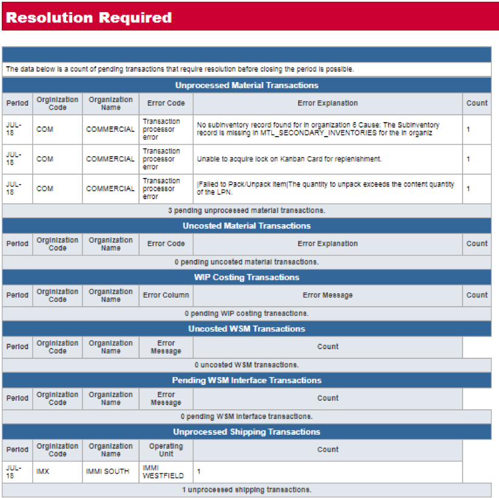
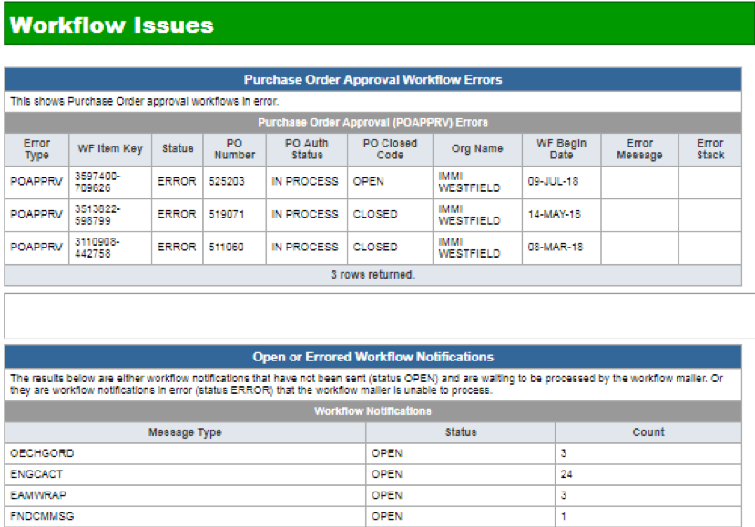
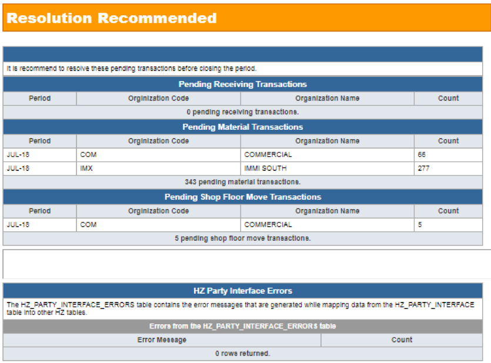

One of the key points in supporting our customers is to make sure they have a
smooth month-end closing process. Many people have issues that lead to a delay
in their monthly close.  Often, the issues causing these delays are not
identifiable and are hidden behind the scenes. To overcome this situation, we
have an application monitoring process that helps unearth these hidden problems
and allows us to proactively address these even before it comes to our customers’
notice.

<!--more-->

### What is application monitoring?

Application monitoring consists of scripts that can be scheduled, on cron, to
run periodically in our customers’ production environments to identify hidden
problems. These scripts monitor the standard Oracle&reg; transactional interfaces
and workflows and create a report that is emailed to a predefined distribution
group for review. The reports are reviewed daily, and if issues exist, our
applications support team can quickly address them, often before the customers
notice.

Application monitoring scripts are non-invasive and provide the following
benefits:

-	Provide proactive problem resolution
-	Offer a smoother and more timely period close process
-	Save bandwidth in our support group by being proactive
-	Help to prevent spikes in ticket creation and reduce the number of
*critical* issues during period close
-	Create a better work experience for the business users

### Application monitoring case study

The following customer case study shows how Rackspace helped a customer improve
their period close process by leveraging applications monitoring and Rackspace's
functional support.

#### Client

The client is a large manufacturing company.

#### Challenge

They were dealing with significant problems around uncosted transactions. The
uncosted transactions issues prevented the period close and were invisible to
the business users on a day-to-day operational basis. The delay that these
transactions caused to the period-end financial close meant that the company
had six to eight unclosed inventory periods.

#### Solution

Rackspace helped in closing the past inventory periods by putting an application
monitoring process in place. This allowed Rackspace to identify the uncosted
transactions each night and to fix them before the financial period close.

#### Value

Quickly, the customer was able to regularize the monthly financial period close
cycles and also close the pending open inventories.

### Application monitoring reports

The following snapshot shows a sample report. The report is divided into three
main categories:

- Resolution Required
- Workflow Issues
- Resolution Recommended

#### How we use the reports

We use the information from the reports to identify and resolve existing issues.
The application monitoring process also helps us to build a repository of
solutions that can be leveraged across all of our Application Services customers.
We also discuss the resolution process with our customer to identify potential
patching requirements, process change recommendations, and so on.

### Customer-specific monitoring

In addition to our standard monitoring, we work with our customers to identify
custom monitoring that can be developed to better support our client’s production
environment.  The following case study shows a solution that we put together for
an existing customer.

#### Client

The client is a large manufacturing company.

#### Challenge

It was imperative for the manufacturing company to run their Advanced Supply
Chain Planning plans hourly to meet their deadlines to ensure that production
was not affected and orders could be released on time.

#### Solution

Working with the manufacturing IT team, we created a monitoring script and a
Standard Operating Procedure (SOP). The script looks for errors in the program
and if issues are identified, an email notification is sent to the assigned
Rackspace Support team. The issue is given a critical ticket status and
automatically queued in the Rackpsace’s ticketing system. That ticket references
a knowledge base article that contains the SOP for troubleshooting and resolving
the issue. Thus, issues are proactively identified and resolved on time by our
24/7/365 Support teams to provide you with a Fanatical Experience.

#### Value

As a result of application monitoring, the customer experienced less downtime
due to errors and issue tracking was more efficient.

### Conclusion

By utilizing application monitoring, organizations can proactively resolve
issues. This helps to prevent spikes in issues during peak period close and
enables a smoother and more timely financial period-close. This tool also
identifies any breakdowns in business processes and helps us to design potential
process improvements in different functional areas.

Use the Feedback tab to make any comments or ask questions.
