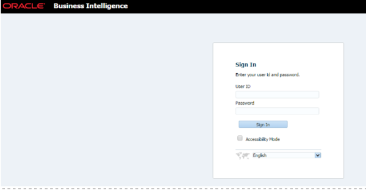

Originally published by TriCore: October 18, 2017

In [Part 1](https://developer.rackspace.com/blog/obiee1/) of this two-part
series, we covered some strategies for resolving common issues with Oracle&reg;
Business Intelligence Enterprise Edition (OBIEE). In Part 2, we share two
additional tips about how to customize the logo and banner text in OBIEE.

<!--more-->

### Tip 1: Add a custom logo to OBIEE Analytics

After you've installed OBIEE, the default Oracle logo appears on the OBIEE
Analytics page, as shown in the following image:

The Oracle logo also appears on the login page, as shown in the following
image:

However, you'll probably want to use your own custom logo.

To customize the logo in OBIEE Analytics 11g, use the following steps:

1. Log in to the environment where OBIEE is installed.
2. Navigate to the following path to change the logo for the home page:

    **$FMW_HOME/user_projects/domains/DR_domain/servers/bi_server1/tmp/_WL_user/analytics_11.1.1/7dezjl/war/res/s_Skyros/master**

    The current logo file is **oracle_logo.png**.

4. Rename your custom image to **oracle_logo.png**.
5. At the file path that you followed in step 2, replace the default image
   with your custom image.

    **Note**: We recommend that you use the default dimensions for your custom
    logo. For OBIEE 11.1.1.7, the dimensions should be 119 x 25 pixels. For
    OBIEE 11.1.1.9, logo images should be 104 x 14 pixels.

6. Restart Oracle Process Manager (OPMN) services.
7. Clear the browser cache and verify that your changes took effect.

After you've restarted OPMN services, you see your custom image on the login
and home pages of OBIEE Analytics, as shown in the following images:

### Tip 2: Customize the banner text in OBIEE Analytics

Oracle's default banner text in OBIEE Analytics says "Business
Intelligence," as shown in the following images:

You can change the banner text in OBIEE Analytics by using the following steps:

1. Log in to the machine where OBIEE is installed.
2. Navigate to the following path:

    **/FMW_HOME/Oracle_BI1/bifoundation/web/msgdb/l_en/messages**
3. Search for the XML file named **productmessages.xml** and make a backup of
   it before you edit it.
4. In the original file, scroll to the following line and customize the text
   between the `<TEXT>` and `</TEXT>` tags to suit your needs:

    `<WebMessage name="kmsgHeaderBIBrandName"><TEXT>Business Intelligence</TEXT></WebMessage>`
5. Save the file.
6. Restart all OBIEE services.
7. Clear the browser cache and verify that your changes took effect.

    You should see your custom text on the login and home pages of OBIEE
    Analytics, as shown in the following images:

    

    

### Conclusion

After you've followed the steps outlined in this blog post, your
custom logo and text appear in OBIEE. We hope that these tips help you better
understand the user interface elements of OBIEE 11g and reduce the amount of
time it takes you to customize your environment.

Use the Feedback tab to make any comments or ask questions.

