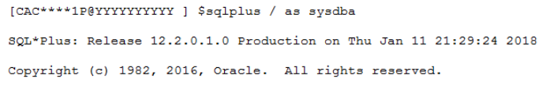
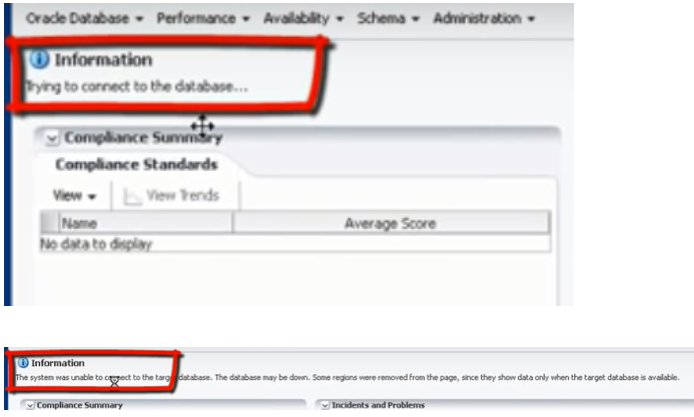
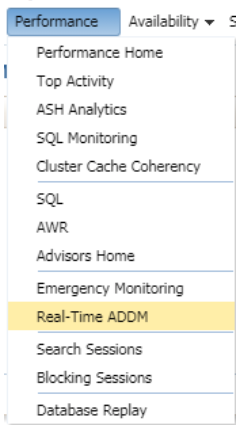
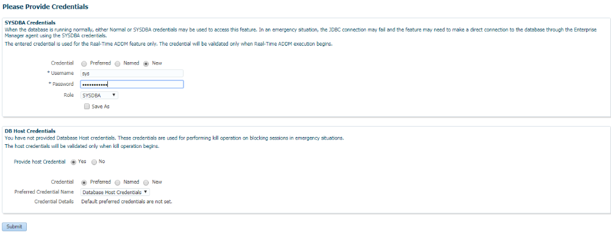
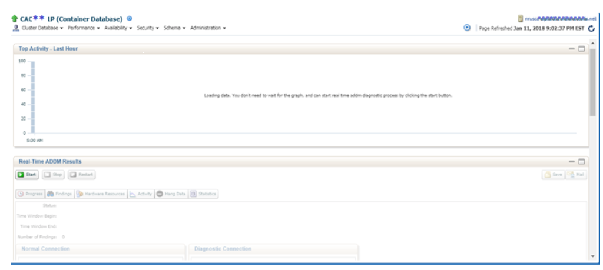
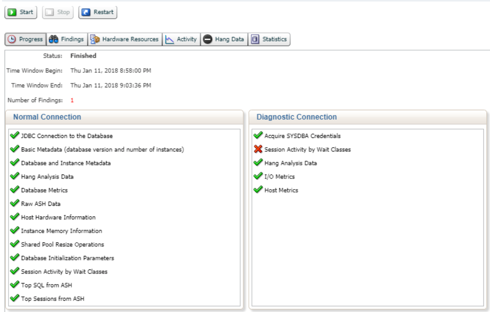
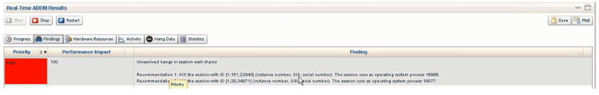
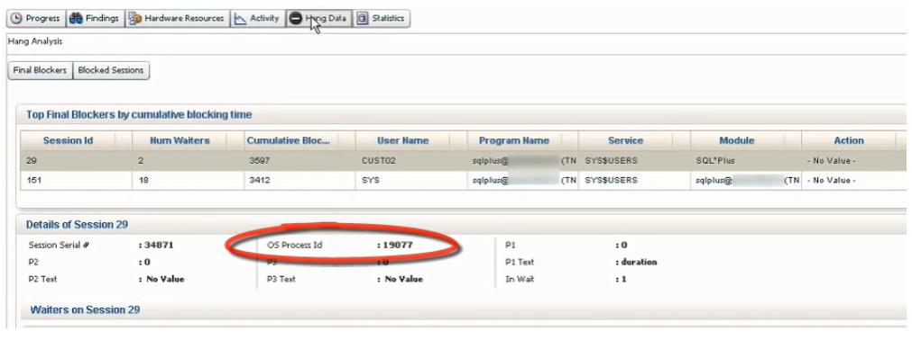
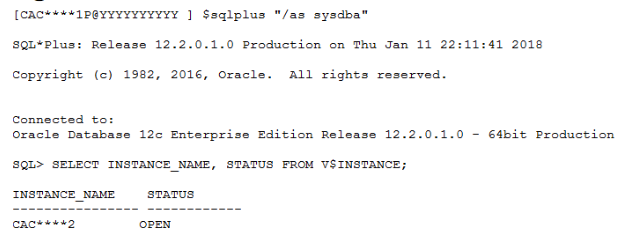

Oracle&reg; Enterprise Manager (OEM) 12c and 13c includes many performance
analysis tools, including a support tool, called OEM Real-Time Automatic Database
Diagnostic Monitor (Real-Time ADDM), for the Oracle DBA to use for
troubleshooting or tuning real-time, ongoing performance issues. This blog shares
knowledge about practical use of Real-Time ADDM to identify and
survive an emergency due to any type of database health problems, such as 100%
session, process utilization, or exceeding the predefined critical limits setup
for input/output (I/O), memory, or interconnect limits. In such cases, Real-Time
ADDM is a very handy tool, and provides the capability to do deeper real-time and
realistic ADDM analysis of database health, so let's compare RADDM vs. ADDM.

<!--more-->

### What is ADDM?

ADDM is a tool provided by Oracle Database (starting with version 10g) to
analyze data in the Automatic Workload Repository (AWR) to identify potential
performance bottlenecks. For each of the identified issues, it locates the root
cause and provides recommendations for correcting the problem.

### What is Real-Time ADDM?

In Oracle Enterprise Manager (OEM) Cloud Control 12c, Oracle introduced the
Real-Time ADDM tool, which helps to analyze and resolve problems in unresponsive
or hung databases that traditionally require you to restart the database.
Real-Time ADDM runs through a set of predefined criteria to analyze the current
performance of the database. If any of the criteria matches, Real-Time ADDM
helps to resolve the identified issues (such as deadlocks, hangs, shared pool
contention, and other exception situations) without having to restart the database.

Database administrators (DBAs) can use Real-Time ADDM to analyze database
performance automatically, for instance, in a case when you cannot log in to the
database because the database is in a hung state and running slowly due to
performance issues. In such a situation, Real-Time ADDM identifies the source
of SQL contention on global resources.

Real-Time ADDM also performs all realistic database time analysis like ADDM.
When you invoke Real-Time ADDM on a database that is experiencing unusually high
database activity, it can detect the top performance issues currently affecting
the database and find any major consumer of the database time like SQL sessions,
application connections, and so on.

### The difference between ADDM and Real-Time ADDM

ADDM is provided as the database-level performance diagnosis tool, and Real-Time
ADDM is an OEM version 12c plus tool. You need OEM ready with a connection to
database to use Real-Time ADDM.

The major difference between ADDM and Real-Time ADDM is that Real-Time ADDM uses
a diagnostic-mode connection to access the Active Session History (ASH) data
directly in the System Global Area (SGA) of the database instance, bypassing the
normal-mode connection and without using any global resources like latches and
queues or an excessive number of host resources.

### Why use Real-Time ADDM?

The following list provides reasons to use Real-Time ADDM:

-	Analyze current database performance when it is hanging or running slow.
-	Find sources of severe contention.
-	Perform database time analysis to detect top performance issues.
-	Direct the diagnostic connection to SGA.
-	Avoid the need for HANGANALYZE of ORADEBUG (a basic trace utility of Oracle
   Database) for reading and analyzing large trace files.

#### What is HANGANALYZE?

HANGANALYZE is an option within ORADEBUG to locate details about hung or blocking
sessions. By using the HANGANALYZE option, DBAs can get a connection into a hung
database and generate trace files, which they can read or use with trace analysis
tools to identify the hung database issues.

#### Troubleshooting with Real-Time ADDM demonstration

Assuming you have OEM 12c set up with connection to target database, you can use
the following steps to employ Real-Time ADDM analysis when your database instance
is in a hung state.

Open a terminal session and try to connect to the database. Notice that the session
has not yet started. With a connection not established, you can't log in to the
database because of the hung condition as shown in the following image:

Now, go to OEM and under the **Target** menu, select `Databases for Troubleshooting`
and search for the database name. As shown in the following image, I am searching
for `CAC****1P`.

Click on the database name. It might take a little time, so wait to refresh. In
a bit, you see the error message highlighted in the following image:

For this database instance, this is where Real-Time ADDM is going to be very
useful for the database administrator (DBA) to diagnose the situation. Let's
start using Real-Time ADDM on that database instance. From the database on page,
go to the **Performance** menu and select `Real-Time ADDM`, which takes you to the
screen shown in the following image. In this situation, Real-Time ADDM uses a
direct connection because the instance is hanging.

You must use SYSDBA credentials for the Real-Time ADDM connection in a hung
situation, as shown in the following image:

After the diagnostic mode connection is established, you can read ASH data directly
in memory, starting from the previous hour. After login, you can view the top
activity at the top of the activity program as shown in the following image:

You can see that the issue which is causing the database to hang. In this example,
it relates to the application weight class. To counter this situation, you need
to start the diagnostic to get more insights on the issue. Click **START** to
initiate the analysis. Real-Time ADDM looks at the past ten minutes of ASH
samples to determine the issues. To stop after 10 minutes, click **STOP**. After
this is done, Real-Time ADDM shows findings based on priority. The following
image indicates the analysis under the **Findings** tab.

In this example, it shows unresolved or session wait chains, causing the database
to hang. Recommendations to fix the issue are indicated in the following image:

In this example, Real-Time ADDM recommended (as shown in the preceding image)
that you kill a particular session. To get more information about the process
that needs to be terminated, go to the **Hang Data** tab, as shown in the
following image:

Click on **Final Blockers** to see the blocker session summary. As recommended,
kill the session for which you have the session details at the database level
Session ID (SID), Serial #, and OS Process ID. If you still can't log in
to database, the only option available is to kill the OS Process ID. To do that,
open a terminal and kill the session causing issue as shown in the following
image:

After that, you can see that the blocked session can proceed in the Real-Time ADDM
analysis window. Now try to connect with an SQL Plus connection from terminal, and
this time the connection succeeds as shown in the following image:

### Conclusion

The Real-Time ADDM tool from OEM Cloud Control 12c is one of Oracle’s best
and quickest tools to support critical database health diagnosis. In the case
of a hung database, Real-Time ADDM becomes the DBA’s definitive, effective
support, especially when compared to the limited usage of ADDM, and ORADEBUG’s
HANGANALYZE trace utility. You can apply the previous steps to overcome your
database or hung session issues to get your database up and running.

Use the Feedback tab to make any comments or ask questions.

