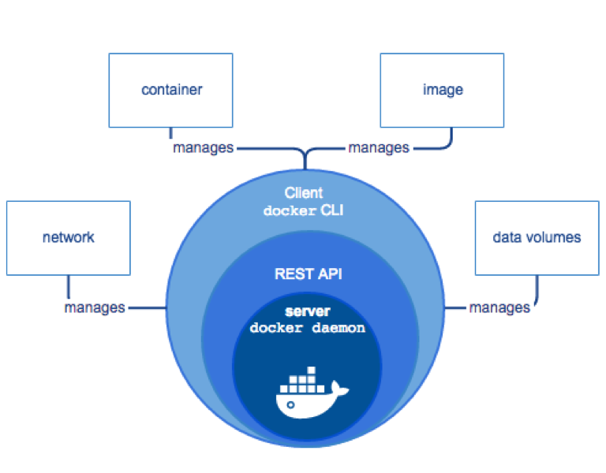

Businesses compete to transform digitally, but most are restricted in some way
or another from moving over to the cloud or to a new data center by existing
applications or infrastructure. Docker&reg; comes to rescue and enables the
independence of applications and infrastructure. It is the only container
platform that addresses every application across the hybrid cloud.

This blog provides insights into the Docker architecture and key features so that
you can get started with these migration activities and explains why you might
want to use Docker.

<!--more-->

### What is Docker?

Docker is a container management service that allows businesses to develop an
application, place it in a container, and deploy it anywhere on the cloud,
which makes the application independent of the infrastructure. This ensures
the functionality of an application as it is moved from one environment to
another.

Docker allows the application to use the same infrastructure as that of the
system on which the application is running. Everything needed by the application is
packed into a container and shipped to the production server. This benefits both
the developers and the operations team. It frees the developers to concentrate
on writing code without needing to worry about the infrastructure on which the
code is deployed and running. For system administrators, Docker provides
flexibility and reduces the number of systems to be configured, which reduces
the extra effort, time, and space requirements.

### Why use Docker?

Containerization changes the way we look at application deployment and makes
Docker an important and recognized service in agile-based projects across all
IT industries. The following features have inspired companies to adopt Docker
at a remarkable rate:

-	Docker can reduce the size of development by providing a smaller footprint
   of the operating system (OS) by using containers.
-	With containers, it becomes easier for teams across different units, such as
   development, QA, and operations, to work seamlessly across applications.
-	You can deploy Docker containers anywhere, on physical and virtual machines
   and even in the cloud.
-	Because Docker containers are lightweight, they are easily scalable.

### Architecture

The Docker engine is a client server application, which has a server that is a
long running program called a daemon, and a client, which is the command line
interface (CLI). The communication between the server and client is enabled by
using a RESTful application program interface (API).

The Docker daemon creates and manages various objects such as images, containers,
and volumes.

The Docker client interacts with the server through the REST API or by using
CLI commands, as shown in the following diagram:

**Image source**: https://docs.docker.com/engine/images/engine-components-flow.png

### Docker components

The Docker implementation involves many components, including handling images,
containers, and the registry.

#### Registry

A Docker registry stores the Docker images. The Docker hub and Docker cloud are
a public registry in the cloud that allows you to upload Docker images, which
can be downloaded by anyone with access.

#### Images

A Docker image is an immutable file that is a snapshot of a container.

In Docker, everything is based on images. An image is a combination of file
system, parameters, and source code. Applications are developed and saved as
images, which are then shipped in a container.

Build an image by using the following Docker command:

    docker build -t <image name> .

Display existing Docker images by using the following command:

    docker images

Remove Docker images by using the following command:

    docker rmi <image name>
    or
    docker rmi <image id>

To view the history of an image, and the commands that have been executed on it,
use the following command:

    docker history <image id>

#### Containers

Containers are instances of Docker images. Containers are produced by using the
`Docker run <image>` command. Images that are shipped in containers can be run
on any OS.

List currently running containers by using following command:

    docker ps

List all containers on the system by using following command:

    docker ps -a will list all the containers on the system.

Edit a file after creating container by using the following command:

    docker cp <container id>: <container id> file.

The preceding command copies the edited file to a container for debugging
purposes and leaves the image intact. The next time that you run the same image,
the changes are lost unless you create a new image that includes them.

### Conclusion

Containers provide OS-level process isolation, and  virtual environments provide
isolation at the hardware level. If you want to use Infrastructure as a Service
(IaaS), virtualization is the right choice. However, Docker containers are handy
for packaging and shipping modular software. Also, Docker containers can be
created inside a virtual machine, which makes software highly portable.

Unlike a hypervisor, Docker containers run on the Docker engine and do not
create an entire virtual OS. Instead, all the required components that are not
already running on the host machine are packed inside a container with the
application. Because the host kernel is shared by Docker containers, an
application needs to ship only the extra items that they need to run. This makes
Docker containers lightweight, easy to create and use, and faster to start up
than a virtual machine.

Use the Feedback tab to make any comments or ask questions.