This post shows you how to integrate Oracle&reg; Discoverer 11g with the single
sign-on (SSO) solution delivered by Oracle Access Manager (OAM) 11g. It helps anyone
who is looking for a one-stop login solution across different applications.

<!--more-->

### Oracle Discoverer certification matrix

Oracle Discoverer 11.1.1.7.0 is certified with Oracle Access Manager 11.1.2.0.0
on Linux&reg; x86-64 Oracle Linux 5 Update Level 3+.

Oracle E-Business Suite 12.1.1 is certified with Oracle Discoverer 11.1.1.7.0 on
Linux x86-64 RedHat&reg; Enterprise Linux 5 Update Level 5+.

The following diagram shows the OAM operational flow:

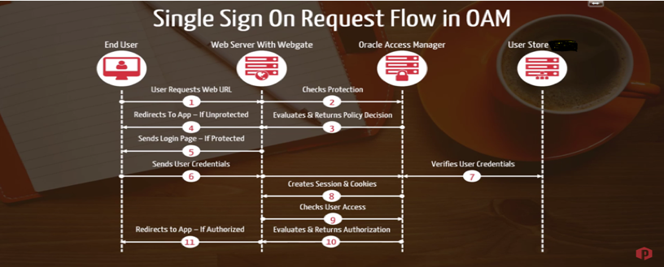

### Configure SSO for Discoverer

If you are planning to configure SSO for both Oracle E-Business Suite (EBS)
and Oracle Business Intelligence (BI) Discoverer, you need to configure SSO for
the Oracle EBS first. Oracle Access Manager, the preferred solution, forms the
basis of Oracle Fusion Middleware 11g.

The following steps are explained in more detail in the following sections:

1. Register the Oracle Single Sign-On (OSSO) agent (mod\_osso) with OAM 11g.
2. Update authentication and authorization policies.
3. Copy the generated `osso.conf` file from  **$DOMAIN\_HOME/output/<ossoagent>**
   to **$ORACLE\_INSTANCE/config/<OHSComponent>/<ohs-comp-name>**.
4. Enable SSO connections.
5. Validate the configuration.

#### Registration

Use the following steps to register an OSSO agent (mod_sso):

1. Log in to the [oamconsole](https://<oam_server>:7002/oamconsole) and click
   **Setup**.

2. Under the **Agents** section, click the "+" with the dropdown symbol as
   shown in the following images:

   

   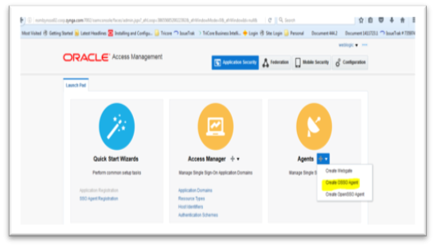

<ol start=3>
    <li>
      Click <b>Oracle OSSO Agent</b>, which takes you to the following screen:
    </li>
</ol>

   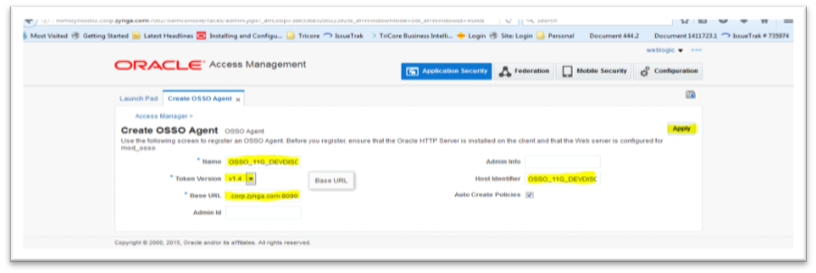

<ol start=4>
    <li>
      Enter the following <b>Name</b> and <b>Base URL</b> and select <b>Token Version</b> v1.4:

      Name: OSSO_11G_DEVDISCO
      Base URL: https://<discoverer_server>:8090 (Dev Disco url)
    </li>
    <li>
      Click <b>Apply</b>.
    </li>
    <li>
      Verify the <b>SSO_Agent</b> by going to the Launch Pad, clicking the <b>Agents</b>
      icon, and searching for SSO agents as shown in the following images:
    </li>
</ol>

   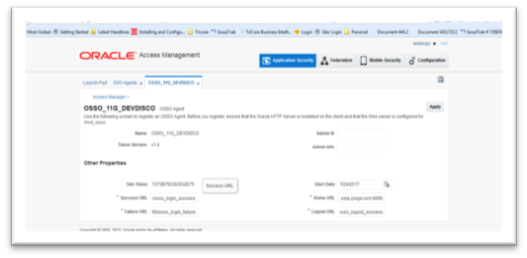

   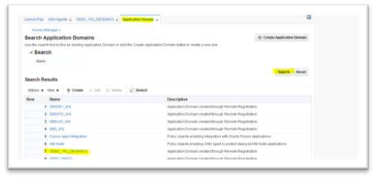

   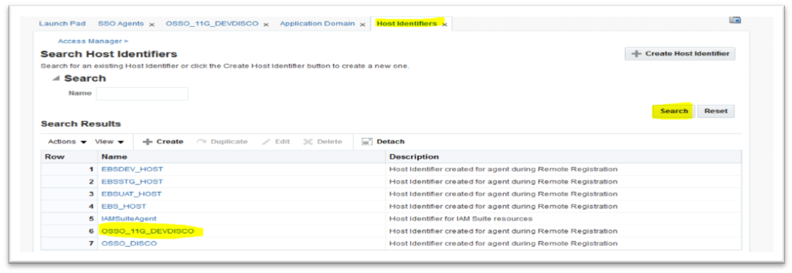

#### Update policies

Use the following steps to update authentication and authorization policies:

1. Go to **Access Manager > Application Domains > Search for OSSO_DISCO >
   Authentication Policies > Protected Resource Policy** and click **Protected
   Resource Policy** as shown in the
   following images:

   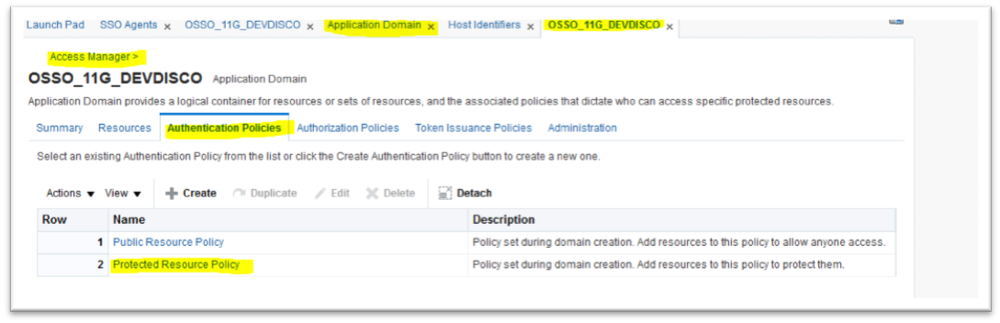

   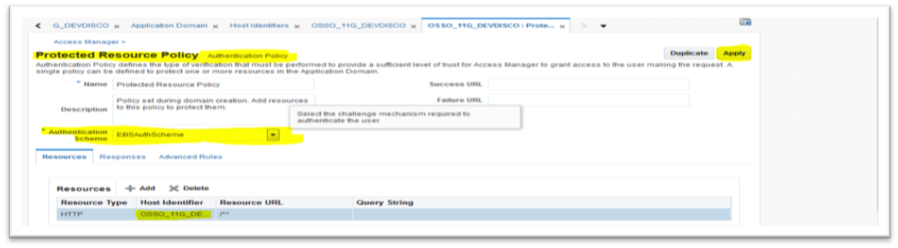

<ol start=2>
    <li>
       Change the Authentication scheme to <b>EBSAuthScheme</b> and click
       <b>Apply</b> as shown in the following image:
    </li>
</ol>

   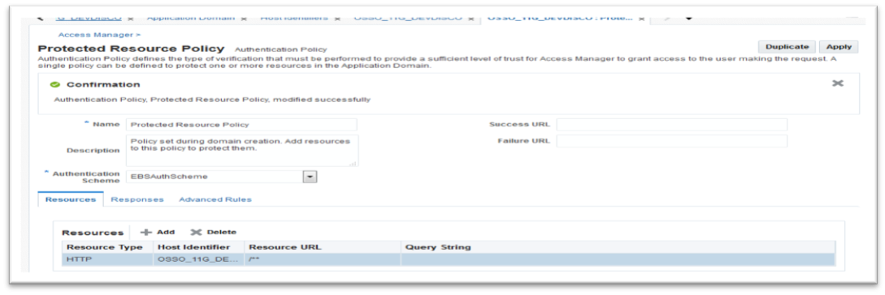

#### Copy the osso.conf file

When you register the OSSO agent, the system creates `osso.conf` in
$DOMAIN_HOME/output/<Agent Name>, as shown in the following image:

Log in to your Discoverer server and check the file information as shown in the
following example:

    [appdb@<disco_server> ~]$ cd $ORACLE_INSTANCE/config/OHS/ohs1/disabled/
    [appdb@<discoverer_server> disabled]$ grep  osso.conf mod_osso.conf
    #Point to proper osso.conf file.
    #   OssoConfigFile "${ORACLE_INSTANCE}/config/${COMPONENT_TYPE}/${COMPONENT_NAME}/osso.conf"
    [appdb@<discoverer_server> disabled]$

Make a new directory as shown in the following example:

    mkdir $ORACLE_INSTANCE/config/OHS/ohs1/osso
    cd $ORACLE_INSTANCE/config/OHS/ohs1/osso

Run the following commands on the OAM server to copy `osso.conf` from the OAM
server as shown in the following example:

    cd $MW_HOME/oam/user_projects/domains/OAMDomain/output/OSSO_11G_DEVDISCO
    scp osso.conf appdb@<discoverer_server>.corp.zynga.com: /u01/app/appdb/Disco11g/MW/asinst_1/config/OHS/ohs1/osso/

Configure protected resources and back up `mod_osso.conf` as shown in the
following sample:

    [appdb@<discoverer_server> moduleconf]$ cp $ORACLE_INSTANCE/config/OHS/ohs1/disabled/mod_osso.conf $ORACLE_INSTANCE/config/OHS/ohs1/moduleconf/
    [appdb@<discoverer_server> moduleconf]$ cd $ORACLE_INSTANCE/config/OHS/ohs1/moduleconf/
    [appdb@<discoverer_server> moduleconf]$ cp mod_osso.conf mod_osso.conf_Orginal
    [appdb@<discoverer_server> moduleconf]$

Edit and save `mod_osso.conf` by adding the following lines to the file:

    LoadModule osso_module "${ORACLE_HOME}/ohs/modules/mod_osso.so"
    <IfModule osso_module>
      OssoIpCheck off
      OssoIdleTimeout off
      OssoHttpOnly off
      OssoSecureCookies off
      OssoConfigFile

      /<$MW_HOME>/asinst_1/config/OHS/ohs1/osso/osso.conf
      <Location /discoverer/plus>
        require valid-user
        AuthType Osso
      </Location>
      <Location /discoverer/viewer>
        require valid-user
        AuthType Osso
      </Location>
      <Location /discoverer/app>
        require valid-user
        AuthType Osso
      </Location>
    </IfModule>

#### Enable SSO connections

Enable SSO connections by editing `configuration.xml` to set the connection
parameter from `enableAppsSSOConnection="false"` to `enableAppsSSOConnection="true"`.

Find `configuration.xml` in
`/<$MW_HOME>/user_projects/domains/ClassicDomain/config/fmwconfig/servers/WLS_DISCO/applications/discoverer_11.1.1.2.0/configuration`.

Backup the file and check the values as shown in the following example:

    [appdb@<discoverer_server> configuration]$ cp configuration.xml configuration.xml_Orginal_BKP
    [appdb@<discoverer_server> configuration]$
    [appdb@<discoverer_server> configuration]$ grep enableAppsSSOConnection configuration.xml
          userDefinedConnections="true" laf="dc_blaf" switchWorksheetBehavior="prompt" defaultLocale="en" disableBrowserCaching="false" enableAppsSSOConnection="true" propagateGUIDtoVPD="false" pageNavigation="true">
    [appdb@<discoverer_server> configuration]$

Restart the  Oracle HTTP server by running the following commands, which are in
`ORACLE_INSTANCE\bin`:

    opmnctl stopall
    opmnctl startall

**Note**: The EBS instance must be SSO enabled and configured with same OAM
instance.

#### Validation

Validate the SSO configuration by accessing the following launchers:

[Discoverer viewer launcher](https://<discoverer_server>.corp.zynga.com:8090/discoverer/viewer)

[Discoverer launcher](https://<discoverer_server>.corp.zynga.com:8090/discoverer/plus)

Browse to the URL, enter your SSO login, and click **Login** as shown in the
following image:

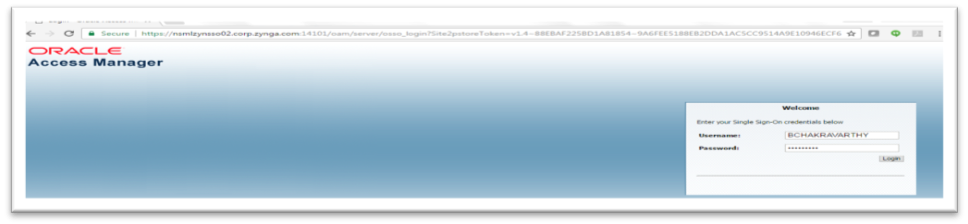

Fill in the details as shown in the following image:

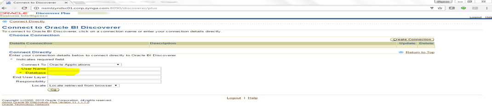

Click **Continue** and the system populates your user name automatically as
shown in the following images:

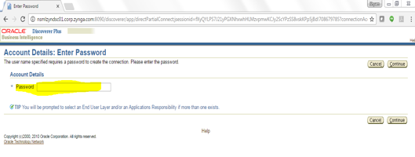

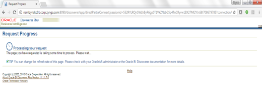

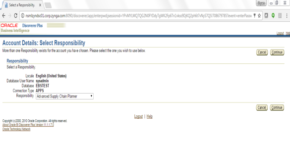

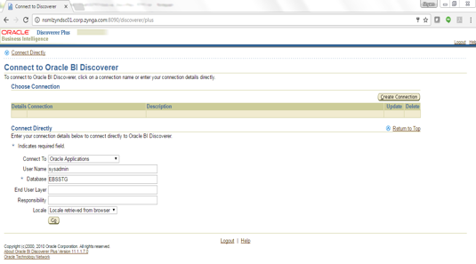

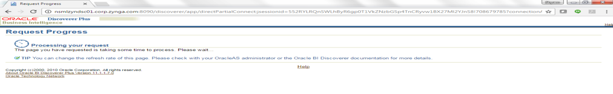

### Conclusion

This post described how to implement an SSO solution for Discoverer.

Key benefits of implementing SSO in Discoverer are that it helps eliminates the
time spent re-entering user credentials and improves productivity for users,
increasing conversion rates for product owners. Internal and external users don't
have to go through the hassle of maintaining and remembering yet another set of
credentials.

SSO reduces the issues related to password management and brings down the costs
associated with setting up several help desk systems for password-reset issues,
invalid credentials, and so on.

Learn more about our [Rackspace Application Services](https://www.rackspace.com/application-management).

Use the Feedback tab to make any comments or ask questions.

