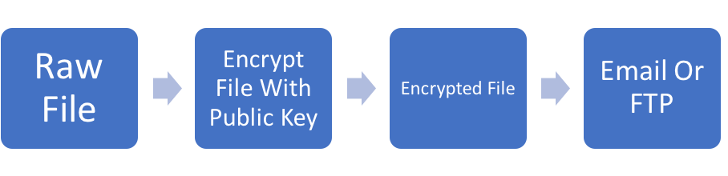
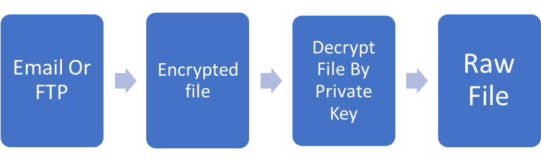
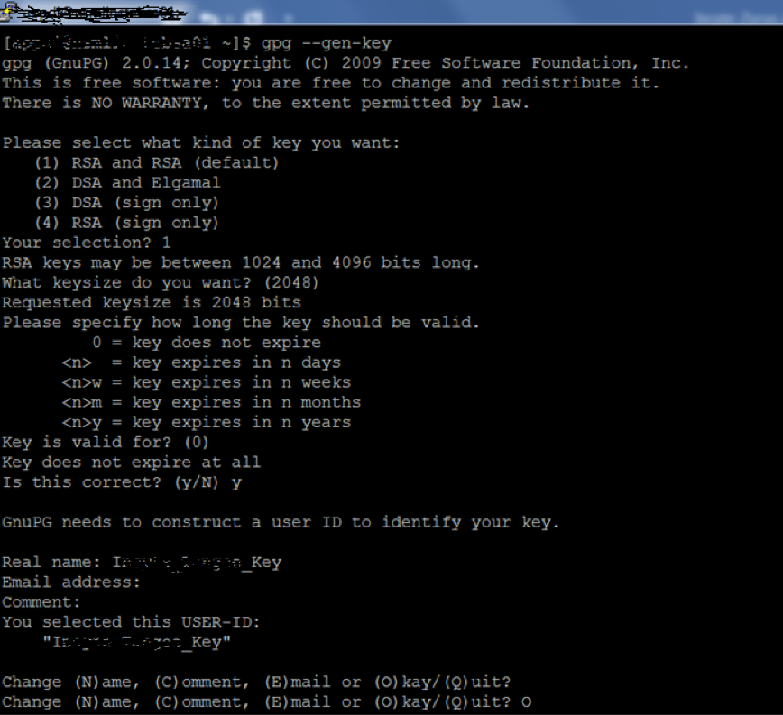
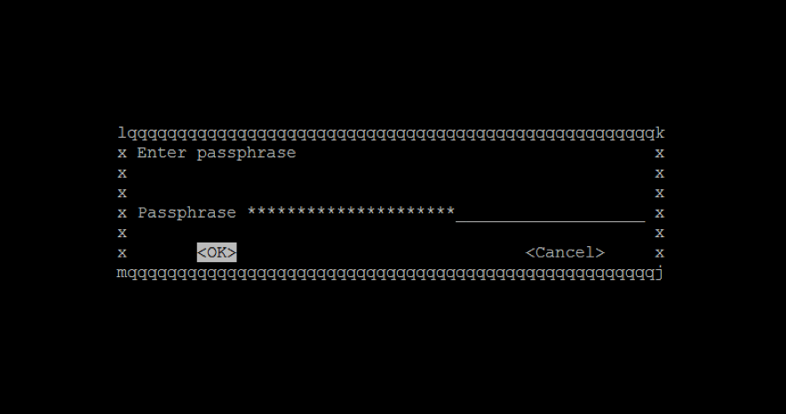

The GNU Privacy Guard (GPG) is a complete and free implementation of the
OpenPGP standard as defined by RFC4880, also known as PGP (Pretty Good Privacy).
GPG, also known as GnuPG, is a command line tool with features for easy
integration with other applications.

Most companies that exchange sensitive data, such as payment details, employee
information, and so on over the internet, use PGP encryption to
transfer files securely between two systems. This blog introduces GPG, why you
should use file encryption, and what are the steps involved in both file
encryption and decryption.

<!--more-->

### The encryption and decryption processes

First, a quick word about keys. Public and private keys play a vital role in
PGP to encrypt and decrypt the data. Generally, a public key is used to encrypt
the data and is always shared with the end users. The private key is used to
decrypt the data and it is never shared with anyone.

Now, the following diagrams show the encryption and decryption processes:

### Advantages of PGP encryption

Following are some advantages of PGP encryption:

1.	It protects sensitive information.
2.	Files and text cannot be misused through email attacks.
3.	It protects data against viruses.

### Steps to implement PGP

To implement PGP by creating and installing keys, use the following steps:

1. Generate a key on your source system with the following command:

        $ gpg --gen-key

   After you run this command, you'll need to make the following selections:

   a. Kind of key.  Select option **1** to create an RSA key, which is
   the default.
   b. Bit size.  Select **2048** bits, which is the default.
   c. Length of time that the key should be valid. Select **0** so the key does
   not expire.

   Once you've made all these selections, press **Enter** again.

   When asked to confirm that the key does not expire, press **y**.

   Now, you'll be shown the key name and user id that you chose. Then you'll be
   prompted to "Change (N)ame, (C)omment, (E)mail, or (O)kay/(Q)uit?", choose
   **O** for okay.

   The following image shows these prompts and responses:

   

   **Note:** You might be required to enter a passphrase to protect your secret key.
   If you are, enter it and click **ok** as shown in the following image:

   

   It is not mandatory to have a passphrase, but having one is a good idea.
   The passphrase can be changed at any time using option `--edit-key`.

<ol start=2>
    <li> After the key is generated, list the key details with the following command:</li>
</ol>

       $ gpg –list-keys

       pub   2048R/F2F771CF 2018-02-15
       uid                  <Key_Name>
       sub   2048R/A5D75B00 2018-02-15

<ol start=3>
    <li> Export the public key, so that it can be shared with the target instance,
    by using the following command on the source server:</li>
</ol>

       $ gpg --armor --output <Key_Name>-pub-sub.asc --export '<Key_Name>'

<ol start=4>
    <li> Validate the generated key with the following command:</i>
</ol>

       $ cat <Key_Name>-pub-sub.asc

<ol start=5>
    <li> To transfer the generated key to the target system, retrieve the key
    <b><Key_Name>-pub-sub.asc</b> from the server and send the file to the contact
    person of the target system by using email.</li>
</ol>

<ol start=6>
    <li> Install the key on the target system with the following command: </i>
</ol>

       $ gpg --import <Key_Name>-pub-sub.asc

       gpg: Total number processed: 1
       gpg:               imported: 1

<ol start=7>
    <li> After the key is imported, list it with the following command: </li>
</ol>

      $ gpg --list-keys

<ol start=8>
    <li> Now, trust the key with the following command: </li>
</ol>

       $ gpg --edit-key <Key_Name>-pub-sub.asc

       gpg> trust
       Your decision? (no. 5)
       Do you really want to set this key to ultimate trust Y/N? (Y)

### Encrypt a file

After you've created and installed the key, you use it to encrypt a file, either
with or without a passphrase.

#### Encrypt a file with a passphrase

Use the following command to encrypt a file with a passphrase:

     $ gpg -s --no-tty --always-trust --passphrase "passphrase@test" -u <Key_Name>-pub-sub.asc "data_file.txt"

If you defined your key in the source system with a passphrase, the same
passphrase must be used in the preceding command.  In our example,
“passphrase@test” is the passphrase to be used.

#### Encrypt a file without a passphrase

Use the following command to encrypt a file without a passphrase:

     $ gpg --encrypt --recipient ‘<Key_Name>-pub-sub.asc’ data_file.txt

### Decrypt a file

Use the following command to decrypt a file:

     $ echo $PASSPHRASE | gpg --batch --yes  --passphrase-fd 0 data_file.txt.gpg

### Conclusion:

PGP Encryption secures data transmission over the internet and only the person
with whom you have shared the keys is able to decrypt the data and use it. This
protects your data so that it cannot be misused, even if someone has the file.
Without keys, no one can decrypt the file and access the data. If you need to
transfer sensitive information, use file encryption functionality. The examples
in this blog were tested on Oracle Release 12.1.3.

<a class="cta purple" id="cta" href="https://www.rackspace.com/security">Learn more about Security services</a>

Visit [www.rackspace.com](https://www.rackspace.com) and click **Sales Chat**
to get started.

Use the Feedback tab to make any comments or ask questions.
