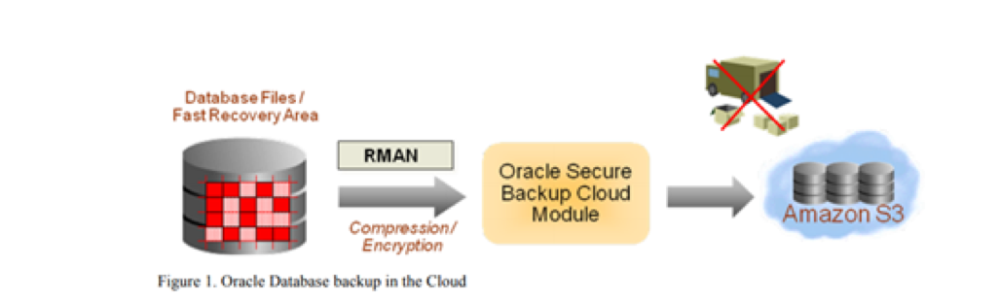
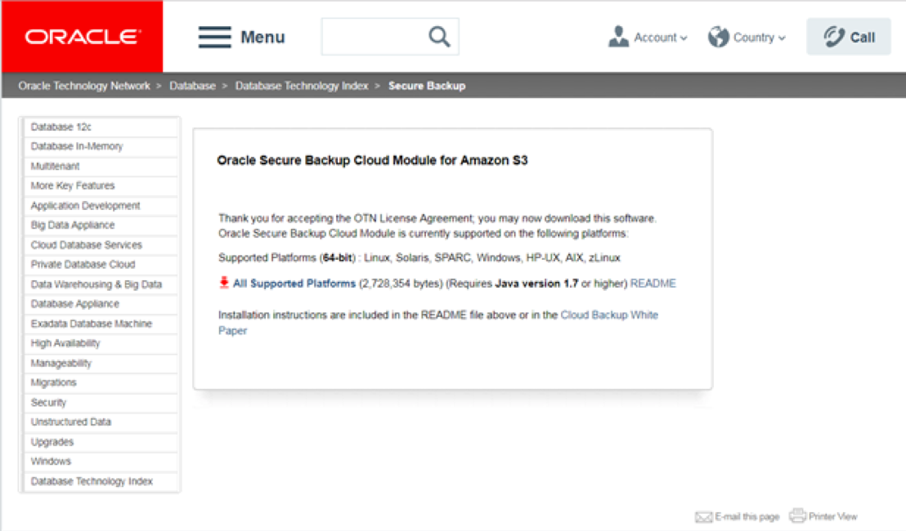
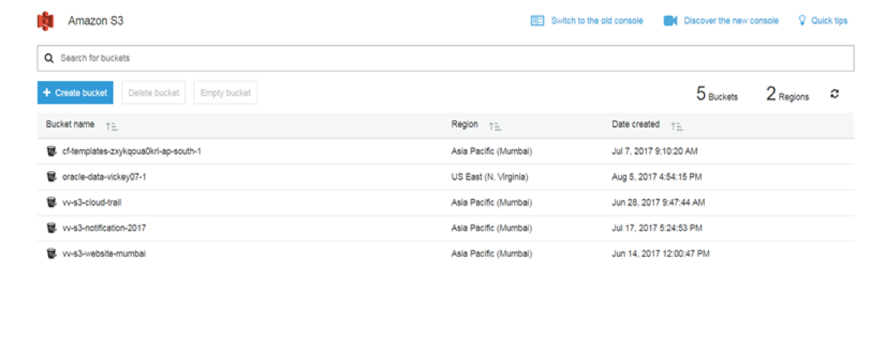

This blog post reviews how to use Amazon Simple Storage Service (S3), as storage
for an Oracle&reg; Database backup. Amazon Web Services (AWS) was the first cloud
vendor that Oracle partnered with to enable database backup in the cloud. S3 is
the main storage offering of AWS.

<!--more-->

### Introduction

S3’s simple web-services interface enables applications to store and retrieve
any amount of data from anywhere on the Internet. S3 is a highly scalable,
reliable, fast, and inexpensive data storage infrastructure, and thousands of
enterprises rely on it for their production storage needs, from “cold”
inexpensive storage to serving rich multimedia in real time to customers
worldwide.

The following image illustrates the S3 concept:

### Oracle Secure Backup cloud module

The Oracle Secure Backup (OSB) cloud module enables an Oracle Database to send
its backup to Amazon S3. It is compatible with Oracle Database versions 9i
Release 2 and above, requires a network connection to the internet, and
provides the means of payment to AWS. The OSB cloud module can also be used
while the database is running within the Amazon Elastic Compute Cloud (EC2).
This way it benefits from the higher internal network bandwidth without any
transfer costs in to or out of S3.

The OSB cloud module is implemented by using the Oracle Recovery Manager (RMAN)
serial backup tape (SBT) interface. The SBT interface allows external backup
libraries to be seamlessly integrated with RMAN. Consequently, database
administrators can continue to use their existing backup tools, such as Enterprise
Manager, RMAN and other scripts, and so on, to perform cloud backups.

The OSB cloud module is available for Linux&reg; 64 & SPARC&reg; 64. The
versions for Microsoft&reg; Windows 32-bit and Linux 32-bit are deprecated.

The following sections walk you through installing the OSB cloud module and
configuring a sample cloud backup.

#### Sign up

The first step in getting started with the OSB cloud module is to sign up for
Amazon S3. You can do this by visiting the [Amazon S3 website](https://aws.amazon.com/s3 ),
as shown in the following image:

After registration, users get a pair of access identifiers called
the **Access key ID** and the **Secret Access key**, as shown in the following
image:

To find your access key ID and secret access key:
 
1. Log in to your AWS Management Console.
2. Click on your user name at the top right of the page.
3. Click **Security Credentials** in the drop-down menu.
4. Your keys are listed in the  **Access keys** section.
5. If you do not have a key, click **Create access key**.

#### Register for an account

Register for an Oracle.com or Oracle Technology Network (OTN) account. You must
have one of these accounts to install the OSB cloud module. New accounts can be
created by visiting the [OTN website](https://otn.oracle.com).

#### Install the OSB cloud module

Download the OSB cloud module install tool from the OTN website and run the
following code to install the module.

    [root@ip-10-0-1-135 Downloads]# unzip osbws_installer.zip
      Archive:  osbws_installer.zip
      inflating: osbws_install.jar
      inflating: osbws_readme.txt
    [root@ip-10-0-1-135 Downloads]#
    [oracle@ip-10-0-1-135 dbs]$ /home/oracle/jdk1.8.0_144/bin/java -jar osbws_install.jar \
    > -AWSID ******************** \
    > -AWSKey ******************************** \
    > -otnUser vverma@tricoresolutions.com \
    > -walletDir $ORACLE_HOME/dbs/osbws_wallet \
    > -libDir $ORACLE_HOME/lib

    Oracle Secure Backup Web Service Install Tool, build 2017-06-01
    AWS credentials are valid.
    Oracle Secure Backup Web Service wallet created in directory /u01/app/PROD/db/tech_st/11.1.0/dbs/osbws_wallet.
    Oracle Secure Backup Web Service initialization file /u01/app/PROD/db/tech_st/11.1.0/dbs/osbwsPROD.ora created.
    Downloading Oracle Secure Backup Web Service Software Library from file osbws_linux64.zip.
    Download complete.

#### Verify the files

Verify the library file, `libosbws.so`, by running the following code:

    [oracle@ip-10-0-1-135 osbws_wallet]$ cd $ORACLE_HOME
    [oracle@ip-10-0-1-135 11.1.0]$ cd lib
    [oracle@ip-10-0-1-135 lib]$ ls -ltr libosbws.so
      -rw-r--r--. 1 oracle dba  93601830 Aug  5 07:00 libosbws.so

Verify the OSB parameter file by running the following code:

    [oracle@ip-10-0-1-135 lib]$ cd $ORACLE_HOME/dbs
    [oracle@ip-10-0-1-135 dbs]$ ls -ltr osbwsPROD.ora
      -rw-r--r--. 1 oracle dba     145 Aug  5 07:00 osbwsPROD.ora
    [oracle@ip-10-0-1-135 dbs]$ cat osbwsPROD.ora
      OSB_WS_HOST=https://s3.amazonaws.com
      OSB_WS_WALLET='location=file:/u01/app/PROD/db/tech_st/11.1.0/dbs/osbws_wallet CREDENTIAL_ALIAS=vickey07_aws'
    [oracle@ip-10-0-1-135 dbs]$ ls -ltr osbws_wallet
      total 4
      -rw-------. 1 oracle dba    0 Aug  5 07:00 cwallet.sso.lck
      -rw-------. 1 oracle dba 1613 Aug  5 07:00 cwallet.sso

#### Back up the USERS tablespace

Run RMAN Backup to back up the **USERS** tablespace to S3 by executing the
following code:

    RMAN> run {
      allocate channel s3_bucket device type sbt
      parms 'SBT_LIBRARY=/u01/app/PROD/db/tech_st/11.1.0/lib/libosbws.so ENV=(OSB_WS_PFILE=/u01/app/PROD/db/tech_st/11.1.0/dbs/osbwsPROD.ora)';
      backup tablespace users;
    }
    2> 3> 4> 5>

      allocated channel: s3_bucket
      channel s3_bucket: SID=400 device type=SBT_TAPE
      channel s3_bucket: Oracle Secure Backup Web Services Library VER=3.17.7.27

      Starting backup at 05-AUG-17
      channel s3_bucket: starting full datafile backup set
      channel s3_bucket: specifying datafile(s) in backup set
      input datafile file number=00019 name=/u01/app/PROD/db/apps_st/data/user01.dbf
      channel s3_bucket: starting piece 1 at 05-AUG-17
      channel s3_bucket: finished piece 1 at 05-AUG-17
      piece handle=03sb4ecv_1_1 tag=TAG20170805T072414 comment=API Version 2.0,MMS Version 3.17.7.27
      channel s3_bucket: backup set complete, elapsed time: 00:00:01
      Finished backup at 05-AUG-17
      released channel: s3_bucket
    RMAN>

#### Verify the RMAN backup

Verify the RMAN backup of the **USERS** tablespace to S3 by running the
following code:

    RMAN> list backup of tablespace users;

      List of Backup Sets
      ===================

      BS Key  Type LV Size       Device Type Elapsed Time Completion Time
      ------- ---- -- ---------- ----------- ------------ ---------------
      1       Full    1.03M      DISK        00:00:00     05-AUG-17
        BP Key: 1   Status: AVAILABLE  Compressed: NO  Tag: TAG20170805T071737
        Piece Name: /u01/app/PROD/db/tech_st/11.1.0/dbs/02sb4e0i_1_1

      List of Datafiles in backup set 1
      File LV Type Ckp SCN    Ckp Time  Name
      ---- -- ---- ---------- --------- ----
      19      Full 5965126970157 05-AUG-17 /u01/app/PROD/db/apps_st/data/user01.dbf

      BS Key  Type LV Size       Device Type Elapsed Time Completion Time
      ------- ---- -- ---------- ----------- ------------ ---------------
      2       Full    1.25M      SBT_TAPE    00:00:00     05-AUG-17
        BP Key: 2   Status: AVAILABLE  Compressed: NO  Tag: TAG20170805T072414
        Handle: 03sb4ecv_1_1   Media: s3.amazonaws.com/oracle-data-vickey07-1

      List of Datafiles in backup set 2
      File LV Type Ckp SCN    Ckp Time  Name
      ---- -- ---- ---------- --------- ----
      19      Full 5965126970339 05-AUG-17 /u01/app/PROD/db/apps_st/data/user01.dbf
    RMAN>

Notice that the first backup was a local one run earlier and shows a local
backup piece (file). The second backup shows that the media was `s3.amazonaws.com`.
The `oracle-data-vickey07-1` is the bucket, or logical container, automatically
created within Amazon S3.

You can also verify the results of the backup from the AWS console as shown in
the following image:

### Conclusion

The Oracle OSB cloud module allows customers to use Amazon S3 as their offsite
backup storage destination. Compared to traditional tape-based offsite storage,
cloud backups are more accessible, faster to restore under most circumstances,
and more reliable. They also eliminate the overhead associated with maintaining
offsite backup operations. Cloud backups ensure optimal protection for databases
running within the compute cloud.

<table>
  <tr>If you liked this blog, share it by using the following icons:</tr>
  <tr>
   <td>
       
    </td>
    <td>
      
    </td>
    <td>
       
    </td>
    <td>
      
    </td>
    <td>
       
    </td>
    <td>
      
    </td>
  </tr>
</table>

 

Learn more about our [Rackspace Application Services](https://www.rackspace.com/application-management).

Use the Feedback tab to make any comments or ask questions.
