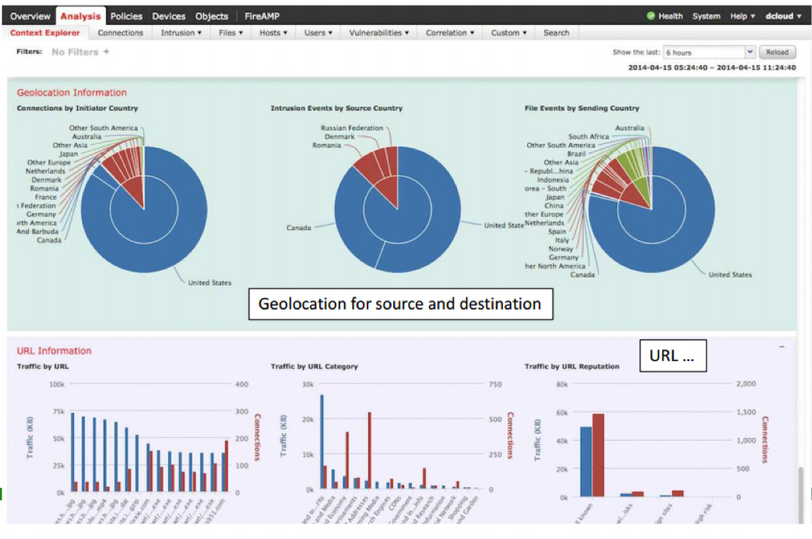
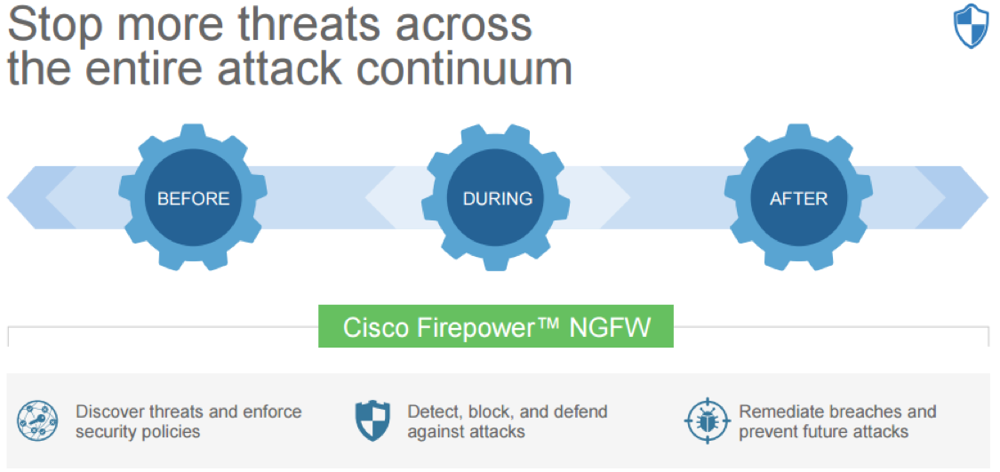
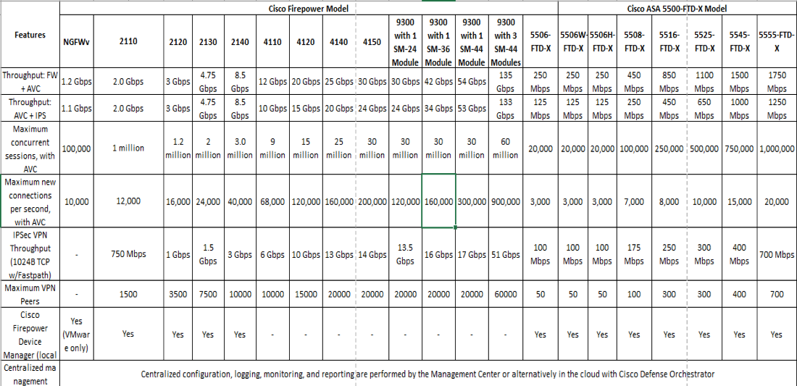
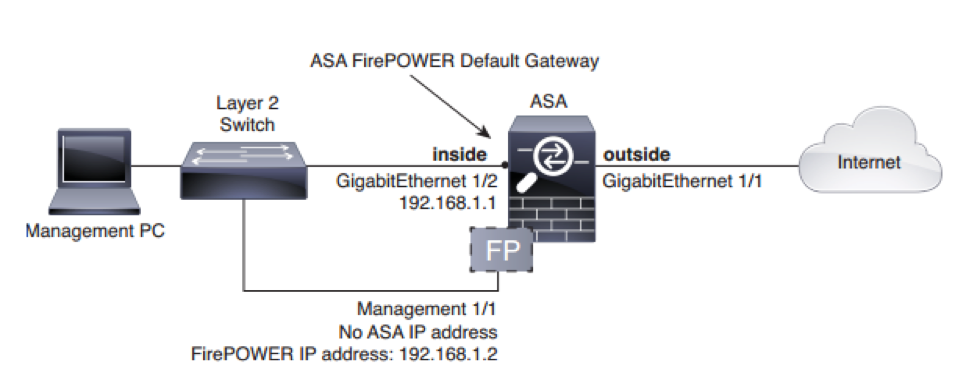

This blog explores Cisco&reg; FirePOWER&reg; technology and next-generation
firewalls (NGFW). NGFWs are composed of Adaptive Security Appliances (ASA) and
a software module that takes care of the main functions like application control,
intrusion protection, anti-malware protection, and URL filtering.

<!--more-->

### Introduction

NGFWs are part of the third generation of firewall technology, combining a
traditional firewall with other network device filtering functionalities, such
as an application firewall that uses an in-line intrusion prevention system (IPS)
called deep packet inspection (DPI). Other techniques might also be employed,
such as Transport Layer Security/Secure Sockets Layer (TLS/SSL) encrypted traffic
inspection, website filtering, quality of service (QoS)/bandwidth management,
antivirus inspection, and third-party identity management integration (such as
Lightweight Directory Access Protocol (LDAP), RADIUS, and Active Directory).

In the past, stateful firewalls with simple packet filtering capabilities
efficiently blocked unwanted applications because most applications met the
port-protocol expectations. However, today, blocking web applications such as
Facebook, Twitter, and other applications that use port 80 might lead to
complications with the entire HyperText Transfer Protocol (HTTP) protocol.

Protection based on ports, protocols, or Internet Protocol (IP) addresses is no
longer reliable nor workable. This fact led to the development of an identity-based
security approach, which takes organizations a step beyond conventional security
appliances that bind security to IP addresses.

NGFWs offer administrators a deeper awareness of, and control over, individual
applications, along with the firewall's deeper inspection capabilities.
Administrators can create very granular allow and deny rules for controlling
access by websites and applications in the network.

Newer firewall technology can also filter traffic based on the applications or
traffic types traversing specific ports. For example, you could open port 80 for
only selected HTTP traffic, or for specific applications, sites, or services
that you allow. Think of it as blending the firewall and QoS functions into one
solution.

These application-aware firewalls are commonly known as an NGFW, and they
are a type of unified threat management (UTM) solution. The term UTM is usually
applied to products that lack true application-awareness and are targeted towards
the small and midsize business (SMB) market. UTM products usually offer more
functions than traditional firewalls, such as antivirus, antispam, or even
intrusion prevention systems (IPS).

The fine tuning of traffic provided by NGFWs can help with both security and
bandwidth control. Because NGFWs are smarter and provide deeper inspection, they
have the potential to catch more malicious activity. They can also serve as
content filters and provide QoS functions so that higher priority applications
receive more priority bandwidth. Along with providing better overall security,
NGFWs are in demand due to the increase of cloud services offerings and outsourced
software as a service (SaaS) providers.

### Common NGFW characteristics

Here are the common features of most NGFWs:

- **Standard firewall features:** These include the traditional (first-generation)
firewall functionalities such as stateful port/protocol inspection, Network
Address Translation (NAT), and Virtual Private Network (VPN).

- **Application identification and filtering:** This is the chief characteristic
of NGFWs. This feature identifies and filters traffic based upon the specific
applications, rather than just opening ports for all kinds of traffic. This
prevents malicious applications and activity from using non-standard ports to
avoid the firewall.

- **SSL and SSH inspection:** NGFWs can even inspect SSL and SSH encrypted traffic.
This feature decrypts traffic, makes sure the applications are allowed, checks
other policies, and then re-encrypts the traffic. This provides additional
protection from malicious applications and activity that tries to hide itself
by using encryption to avoid the firewall.

- **Intrusion prevention:** These are more intelligent capabilities and provide
deeper traffic inspection to perform intrusion detection and prevention. Some of
the NGFWs have built-in IPS functionality so that a stand-alone IPS might not be
needed.

- **Directory integration:** Most NGFWs include directory support (such as,
Active Directory). For instance, they manage authorized applications based upon
users and user groups.

- **Malware filtering:** NGFWs can also provide reputation-based filtering to
block applications that have a bad reputation. This functionality can check for
phishing, viruses, and other malware sites and applications.

### NGFW development

When the first firewalls were developed and deployed, their primary role was to
act as guards, monitoring the traffic moving into and out of the network. These
devices would look at packets, network addresses, and ports to determine whether
data should be allowed through or blocked.

Then application traffic took off, and first-generation firewalls could no longer
keep up because hackers were able to hide malware (that could not be identified
easily) inside the application traffic. This led to the introduction of a second
generation of firewalls, or NGWFs. This new tool can identify and block malware
in applications and is similar to an X-ray machine this is used for security
checks at airports. Over time, compatible security inspection technologies were
added to the process, such as IPS, application control, and anti-malware.

Today, things are more complicated than ever. Rather than networks becoming
borderless, they have become porous, with points of access and endpoints
multiplying at an unprecedented rate. Almost 60% of enterprise traffic is
encrypted, and hackers are increasingly deploying encrypted malware. As a result,
the Gartner Enterprise Firewall MQ 2017 predicted that almost 50% of enterprise
customers will soon require SSL inspection capabilities, compared to only 10%
today. In addition, increasingly sophisticated, multi-vector cyberattacks are
being designed to bypass traditional edge security and evade conventional detection.

Decryption, deep packet inspection, and threat correlation are extremely
CPU-intensive and are well-known for bringing even high-end commercial NGFWs to
their knees. As malware and threats become increasingly difficult to detect at
the access point, it’s necessary for security to span the network to monitor
behaviors and uncover intent.

### Cisco Firepower Management Center overview

The Cisco Firepower&reg; Management Center (FMC) increases the effectiveness of
Cisco network security solutions by providing centralized, integrated, and
streamlined management.

Formerly known as the FireSIGHT&reg; Management Center, the FMC is the
administrative nerve center for select Cisco security products
running on many different platforms. It provides complete and unified management
of firewalls, application control, intrusion prevention, URL filtering, and
advanced malware protection. The Management Center is the centralized point for
event and policy management for the following solutions:

- Cisco Firepower Next-Generation Firewall (NGFW)
- Cisco ASA with FirePOWER Services
- Cisco Firepower Next-Generation IPS (NGIPS)
- Cisco FirePOWER Threat Defense for ISR
- Cisco Advanced Malware Protection (AMP)

The FMC provides extensive intelligence about the users, applications, devices,
threats, and vulnerabilities that exist in your network. It also uses this
information to analyze your network’s vulnerabilities. It provides tailored
recommendations on what security policies to put in place and what security
events you should investigate.

The FMC provides easy-to-use policy screens to control access and guard against
known attacks. It integrates with the advanced malware protection and sandboxing
technology, and it provides tools to track malware infections throughout your
network. It unifies all these capabilities in a single management interface.
You can go from managing a firewall to controlling applications to investigating
and remediating malware outbreaks with ease.

The following image shows the FMC's dashboard:

Image source: speaknetworks.com

### Management before, during, and after an attack

The FMC provides unified management across the entire *attack continuum*—before,
during, and after an attack as shown in the following image.

Image source: Cisco

#### Before

Before an attack, the FMC does the following tasks:

-  Provides exceptional visibility into what is running in your network so that
you can see what needs protection.
-  Creates firewall rules and controls how more than 4000 commercial and custom
applications are used in your environment.

#### During

During an attack, the FMC does the following tasks:

-  Defines the intrusion prevention levels, URL reputation rules, and advanced
malware protection pieces to be put in place.
-  Applies policies such as when network traffic is coming from a particular
country, using a particular application, with a file attachment at a particular
level, intrusion inspection has to be put in place to analyze the file for
malware and even send it to the integrated sandbox, if necessary.

#### After

After an attack, the FMC does the following tasks:

-  Generates a graphical representation of all the devices that were infected
after the attack. Provides the ability to easily create a custom rule to stop
the attack from advancing.
-  Gives a detailed analysis of the malware to safely remediate it.

### Cisco Firepower Threat Defense

Cisco Firepower Threat Defense (FTD) is a unified software image that is a
combination of Cisco ASA and Cisco FirePOWER Services features that can be
deployed on the Cisco Firepower 4100 and the Firepower 9300 series appliances,
as well as on the ASA 5506-X,ASA 5506H-X, ASA 5506W-X, ASA 5508-X, ASA 5512-X,
ASA 5515-X, ASA 5516-X, ASA 5525-X, ASA 5545-X, and ASA 5555-X. Currently, you
cannot deploy the FTD unified software on Cisco ASA 5505 or 5585-X series
appliances.

Supported models and services are shown in the following image:

Image source: Cisco

Cisco acquired the cyber-security firm Sourcefire, in October 2013 and completed
the acquisition of ThreatGRID in June 2016, which provided dynamic malware
analysis and threat intelligence technology.

The FMC is available as a dedicated server or a virtual image appliance
(Linux&reg;-based VM server) that connects to the FirePOWER or FTD and allows
you to fully manage either system. Organizations with multiple FTD systems or
FirePOWER Services register and manage these systems from the FMC.

Alternatively, users can manage the FTD device by using a Firepower Device Manager
(FDM) such as an adaptive security device manager (ASDM).

Currently the latest FTD unified software image is available in version 6.2.x.
The FTD is continually expanding the NGFW services that it supports, including
the following services:

-  Stateful firewall capabilities
-  Static and dynamic routing. Supports Routing Information Protocol(RIP), Open
Shortest Path First (OSPF), and Border Gateway Protocol (BGP) static routing
-  Next-generation intrusion prevention systems (NGIPS)
-  URL filtering
-  Application visibility and control (AVC)
-  Advance malware protection (AMP)
-  Cisco Identity Service Engine (Cisco ISE) integration
-  SSL decryption
-  Captive portal (Guest web portal)
-  Multi-domain management
-  Rate limiting
-  Tunneled traffic policies
-  Site-to-site virtual private networks (VPN). Only supports site-to-site VPN
between FTD appliances and FTD to ASA.
-  Multicast routing shared NAT
-  Limited configuration migration (ASA to Firepower TD)

### Firepower release notes

The following sections provide selected details from the release notes for
versions 6.2.3.1 through 6.2.3.5.

#### Features introduced in Firepower Version 6.2.3.3

You can now configure site-to-site VPN with clustering. Site-to-site VPN is a
centralized feature, and only the master unit supports VPN connections. This
feature is supported on the Firepower 4100/9300 platforms.

#### Deployment options

You can deploy the FMC as a physical or virtual appliance, or from the cloud.
You can choose which options work best for your environment and deploy it on
any of the following platforms:

-  VMware ESX and ESXi hypervisors
-  KVM hypervisor
-  Amazon Web Services cloud platform

#### Configuration for the ASA FirePOWER module

The ASA ships with a default configuration that enables ASDM connectivity to the
management 1/1 interface. When you use the ASA Fire POWER module, we recommend
that you do not use the default configuration. To apply a new configuration,
consider the following factors:

-  The ASA FirePOWER module requires internet access for updates.
-  This configuration also enables a basic usable configuration for both inside
and outside networks.
-  The following figure shows the suggested network deployment for the ASA
5506-X with the ASA FirePOWER module:

Image source: Cisco

The procedure shown in the preceding image shows a connection to the ASA console
port that you can paste into a new configuration to configure the following
behavior:

-  Inside –> outside traffic flow.
-  Outside IP address from the Dynamic Host Configuration Protocol (DHCP).
-  DHCP for clients on inside.
-  The Management 1/1 interface is up, though unconfigured. The ASA FirePOWER
module can then use this interface to access the ASA inside network and use the
inside interface as the gateway to the Internet.
-  Adaptive Security Device Manager (ASDM) access on the inside interface.

To reproduce this configuration for a Cisco AS 5506-X, perform the following
steps:

1. Connect your computer to the ASA console port with the supplied console cable
or with a mini-USB cable.

2. Launch a terminal emulator and connect to the ASA.

3. Press the **Enter** key to see the following prompt:

        ciscoasa>

4. Access privileged EXEC mode by entering the following command:

        enable

5. At the **Password** prompt, press **Enter**. By default, the password is blank.

6. Access global configuration mode by entering the following command:

        config terminal

7. Clear the configuration by entering the following command:

        clear configure all

8. Copy and paste the following configuration at the prompt:

        interface gigabitethernet1/1
        nameif outside
        ip address dhcp setroute
        no shutdown
        interface gigabitethernet1/2
        nameif inside
        ip address 192.168.1.1 255.255.255.0
        security-level 100
        no shutdown
        interface management1/1
        no shutdown
        object network obj_any
        subnet 0 0
        nat (any,outside) dynamic interface
        http server enable
        http 192.168.1.0 255.255.255.0 inside
        dhcpd address 192.168.1.5-192.168.1.254 inside
        dhcpd auto_config outside
        dhcpd enable inside
        logging asdm informational

9. Save the new configuration by entering the following command:

        write memory

10.  Cable the following devices to a Layer 2 Ethernet switch: Inside
GigabitEthernet 1/2 interface (inside), Management 1/1 interface, and your
computer.

11. Connect the GigabitEthernet 1/1 (outside) interface to your WAN device,
such as your cable modem.

### Conclusion

By combining ASA with FirePOWER Services, you can consolidate multiple security
layers in a single platform and eliminate the cost of buying and managing
multiple solutions. This integrated approach combines best-in-class security
technology with multilayer protection integrated in a single device that is
cost-friendly in comparison to the disorganized security solutions.

It also provides support for a throughput of 300 Megabits per second and has
high-capacity solutions like the ASA 5585-X with FirePOWER SSP 60 supporting
up to 20 Gigabits per second. Cisco offers a broad range of solutions regardless
of capacity, which in turn provides a solution to organizations of any size.

The Cisco ASA 5500-X NGFW helps midsize organizations to meet these security
challenges and stay ahead of today’s emerging threats with collective security
intelligence. It enables administrators to see and control user activity,
device access, and malicious behavior. It reduces complexity, capital, and
operating costs with fewer devices to manage and deploy.

<table>
  <tr>If you liked this blog, share it by using the following icons:</tr>
  <tr>
   <td>
       
    </td>
    <td>
      
    </td>
    <td>
       
    </td>
    <td>
      
    </td>
    <td>
       
    </td>
    <td>
      
    </td>
  </tr>
</table>

 

Learn more about our [Rackspace Application Services](https://www.rackspace.com/application-management).

Use the Feedback tab to make any comments or ask questions.
