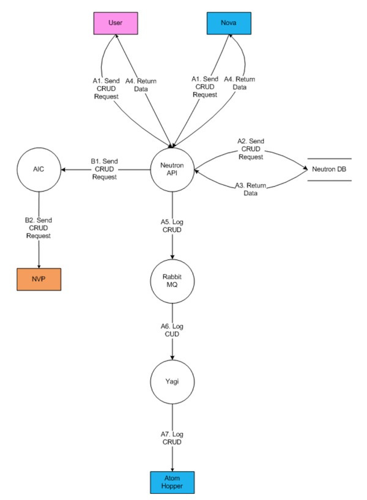

Our customers require us to develop software that is trustworthy and secure.
Privacy also demands attention. To ignore the privacy concerns of users is to
invite blocked deployments, litigation, negative media coverage, and mistrust.
The Quality Engineering (QE) Security team’s goal is to minimize security- and
privacy-related defects in design, code, documentation, and to detect and
eliminate these defects as early as possible in the software development life
cycle (SDLC). Developers who most effectively address security threats and
protect privacy earn users’ loyalties and distinguish themselves from their
competitors.

<!--more-->

### The job of the Quality Engineering Security team

The QE Security team is responsible for the security component of the QE process.
The goal of the team is to ensure that all customer product development tasks,
including code and backend infrastructure, are secured as part of the SDLC. We
are one of the following three pillars of software quality:

* Does it function?
* Does it perform?
* Is it secure?

This process includes conducting threat models, system architecture and
infrastructure reviews, security code testing and reviews, API and web application
security testing, infrastructure security testing, penetration testing, and
adherence to secure development standards.

For every new product, the QE Security team collaborates with all teams to create
a product security test strategy and review the strategy with all the teams
together. The security test strategy covers the following security testing aspects:

* Overview
* Threat model (data flow) diagram
* Contacts
* In scope
* Out of scope
* Security testing process
   * Threat modeling
   * Vulnerability assessment and pen testing
   * Code review and static analysis
   * Web application testing
   * API testing
* Exit criteria
* Risks
* References

During the design stage, we conduct threat modeling for the application. The
threat modeling session focuses on sensitive data and data flows across various
components. The session helps us identify potential security defects in the
design stage so that we can address them early. Once the Development team starts
coding, the QE Security team conducts a security code review of the source code
using both automatic tools and a manual reviewing approach. After we deploy the
application into the staging environment, the QE Security team conducts web
application and API security testing. We prioritize identified defects based on
their severity and impact. The QE Security team works with the Development team
and QE team to make sure that any critical or high security defects are addressed
before the application is released into the production environment.

### Agile security

The trend in the security field is to integrate with the development process as
early as possible with minimum interruption of their operations. The QE Security
team should be able to speak the same language as the Development team to get
their buy-in about security. Since every Development team is using Agile development
process at Rackspace, the QE Security team also adapted the Agile process for
our operations. We use the same Jira system as all other teams to track all our
tasks and stories so that they are aware of our progress. For any incoming
security request, we create a Jira ticket and add the requester as the observer.
For identified defects, we create Jira defects in the Development team’s Jira
project directly so that they can pick up the story and fix them quickly. The
QE Security team also has daily standup to check the progress of the team members'
Jira stories. We run retrospective meetings every two weeks to identify room for
improvement in our process.

### Threat modeling

Threat Modeling is a core element of the overall Security Life-cycle (SDL). As
part of the design phase of the SDL, threat modeling allows software architects
to identify and mitigate potential security issues early, when they are
relatively easy and cost-effective to resolve. Therefore, it helps reduce the
total cost of development.

The threat modeling session is a technical discussion of the design and deployment
strategy used by the product. The QE Security team creates a data flow diagram
as the discussion continues.  Depending on the complexity and type of product,
the session might cover the following topics:

* How do various parts of the product communicate with each other?
* Is that communication encrypted?
* What protocol is used for the communication?
* How does the product authenticate requests it makes or receives?
* What software stack is used by this product? OS?
* Where will this product be deployed?  Iron, private cloud, public cloud...
* How is access granted and maintained for administration work?
* How are the servers and applications patched?
* How do you share passwords within your team?
* How do you prevent one user from accessing another user's data?
* If a customer cancels or stops using the product, how is their data securely erased?

Threat modeling is an interactive, iterative process that covers the general use
cases for the product, starting from when a customer first uses it. The model
follows the flow of data through the product's system and the product's
interactions with external systems.

 The following example shows a data flow diagram for one of our products:

 If, at a future date, the product is changed, a short threat model update
 session is scheduled to review the existing threat model and update it as needed.

### Security code review

The security code review is the process of auditing an application's source code
to verify that the proper security controls are in place to eliminate possible
application security defects, and it ensures that developers are following
secure development guidelines.

We use a commercial solution with an automatic security code-scanning tool that
can scan thousands of lines of code in a short time. However, the findings
generated by the tool might contain false positives. The QE Security team works
with the Development team to verify each finding to filter out false positives.
In addition, the QE Security team also conducts a manual security code review of
key components of the source code. During the security code review, we focus on
identifying the following common security defects as defined in the
[OWASP Top 10 Website](https://www.owasp.org/index.php/Category:OWASP_Top_Ten_2017_Project):

* A1:2017-Injection
* A2:2017-Broken Authentication
* A3:2017-Sensitive Data Exposure
* A4:2017-XML External Entities (XXE)
* A5:2017-Broken Access Control
* A6:2017-Security Misconfiguration
* A7:2017-Cross-Site Scripting (XSS)
* A8:2017-Insecure Deserialization
* A9:2017-Using Components with Known Vulnerabilities
* A10:2017-Insufficient Logging&Monitoring

 We have code review checklists for different types of applications. The QE
 Security team leverages these checklists to make sure that the review is
 compreshensive. For example, the following list shows the authentication
 section of a security source code review checklist for a web application:

* 2.1 Authentication  Are application trust boundaries identified on the data flow diagrams in the design document?
* 2.2 Authentication  Does the design identify the identities that are used to access resources across all trust boundaries?
* 2.3 Authentication  Does the application require authentication for all resource access attempts except for publicly accessible resources?
* 2.4 Authentication  Does the design identify the mechanisms used to protect user credentials whilst in transit?
* 2.5 Authentication  Does the application ensure that minimal error information is returned in the event of authentication failure?
* 2.6 Authentication  Does the application use authentication controls that fail in a secure manner?
* 2.7 Authentication  Is the identity used to authenticate with the database (including level of access required) detailed in the design document?
* 2.8 Authentication  Have the identities being used by this application been configured for least-privileged access?
* 2.9 Authentication  Are authentication-related tokens such as cookies transmitted over secured connections?
* 2.10 Authentication  Does the application restrict the number of failed logon attempts ?
* 2.11 Authentication  Does the application enforce the use of complex passwords (meet Rackspace password complexity rules)?

### API security testing

API security testing is a process of comparing the state of an API against a
set of security requirements. Unlike a security code review, API security
testing needs a fully functional application to run various security tests.
Before they actively test the product's systems, the QE Security team works with
the teams to determine the appropriate scope for the API test. After the scope
is determined, the QE Security team works with the Product team to determine a
workable testing window for the testing to take place. At the scheduled time,
the QE Security team begins the test with activities such as reading the API
documentation (to understand how to use the API), creating test API calls,
running security checks, and so on.

API security testing can be done using automatic tools or manually. Normally,
it is a mix of manual verification and use of automatic tools. For example, we
use Burp, an intercepting proxy, to view and modify the HTTP communication
between the tester and the API.  You might include certain test strings in the
payload to verify whether the request body is subject to SQL injection by
checking the response from the server. At the same time, you can also use
intruder module from Burp to automatically send thousands of different test
payloads to the server. We use the following checklist with different categories
of tests that we should perform to provide comprehensive coverage:

* Info gathering
* Configuration management testing
* Authentication testing
* Session management
* Authorization testing
* Business logic testing
* Data validation testing
* Denial of service testing
* Web services testing

Each category of security tests has a separate list of security tests. For
example, the following security tests belong to the data validation testing
phase:

* Testing for stored cross site scripting
* Testing for SQL injection
* Testing for Lightweight Directory Access Protocol (LDAP) injection
* Testing for Object-relational mapping (ORM) injection
* Testing for eXtensible Markup Language (XML) injection
* Testing for XML Path Language (XPath) injection
* Testing for Internet Message Access Protocol (IMAP) and Simple Mail Transfer Protocol (SMTP) injection
* Testing for code injection
* Testing for OS commanding injection
* Testing for buffer overflow
* Testing for incubated vulnerability

### Infrastructure security testing

Infrastructure security testing is the process of identifying, classifying, and
prioritizing vulnerabilities in computer systems and network infrastructures.
The process identifies threats and the risks they pose. We normally use automated
testing tools, such as Nessus or Nexpose scanner, whose results are listed in the
test report. For each vulnerability reported by the commercial scanner, the
quality engineering security team manually verifies the reported vulnerability
to remove any false positives from the final report of test findings.

Infrastructure security testing can identify the following security defects for
computer systems and networks:

* Vulnerabilities that allow a remote hacker to control or access sensitive data on a system.
* Misconfiguration (e.g. open mail relay, missing patches, etc.).
* Default passwords, a few common passwords, and blank or absent passwords on some system accounts.
* Denials of service against the TCP/IP stack by using malformed packets.
* Preparation for Payment Card Industry Data Security Standard (PCI DSS) audits.

### Security and automation

The average ratio between the number of Development team members and the number
of QE Security team members is close to 50:1 in the industry. If the QE Security
team is using any manual testing processes, they struggle to meet the security
requests from the Development team, even if they also use automated tools. At
the same time, the Development team releases their products faster and faster by
leveraging technologies such as Continuous Integration and Continuous Delivery
(CI/CD). Traditional security teams cannot handle CI/CD responsibilities because
their testing last days or weeks.

To meet these new challenges, our QE Security team focuses on automation for both
tooling and processes. Every member of this team is a software developer who can
write code and work on automation. The QE Security team provides security tools,
with a run time of minutes or seconds, that can be integrated into the development
process. Without the tools, the Development team would move forward without security.
At the same time, the QE Security team separately runs the same tools for better
coverage with a longer run time. For example, both the Development team and the
QE Security team use an automatic static code scanning tool. The Development team
configures the tool to scan changed files for each pull request with a quick
turnaround time. The QE Security team configures the tool to scan the whole
source code repository every night by pulling the latest code for better coverage
with longer scanning time. Together, we increase the tool coverage making both
teams happy.

The QE Security team has been worked on various automation tools and has
released the following open source tools. We are look forward to releasing more
in the future.

* [Syntribos]( https://github.com/openstack/syntribos) is an open source
automated API security testing tool that is maintained by members of the
OpenStack Security Project. Given a simple configuration file and an example
HTTP request, syntribos replaces any API URL, URL parameter, HTTP header, and
request body field with a given set of strings. Syntribos iterates through each
position in the request automatically and automatically detect common security
defects such as SQL injection, LDAP injection, buffer overflow, etc. In addition,
syntribos can help identify new security defects by using automated fuzzing.
* [DefectDojo]( https://www.defectdojo.org/) is a security program and
vulnerability management tool. DefectDojo allows you to manage your application
security program, maintain product and application information, schedule scans,
triage vulnerabilities, and push findings into defect trackers. Consolidate your
findings within one source of truth with DefectDojo.
* Security Pipeline is an integration framework that integrates various security
tools such as blackbox testing and security code scanning tools. It can be used
by the QE Security team to automate the security testing process for our products.

### Fanatical security

Security is very important for the success of Rackspace. The QE organization
includes security (and therefore the QE Security team) as one component of its
overall responsibility. Other QE components are functional and performance
testing. The focus of the QE Security team is similar to that of the Development
team - build a product that is functional, secured, and performs as expected.
The QE Security team works with other teams to identify and address security
defects before the product is released to customers. Security testing is
conducted throughout the entire SDLC so that security defects may be addressed
in a timely manner. Together, we offer a fanatical security experience to our
customers.

Use the Feedback tab to make any comments or ask questions.

