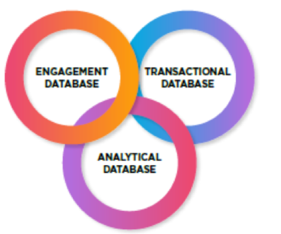
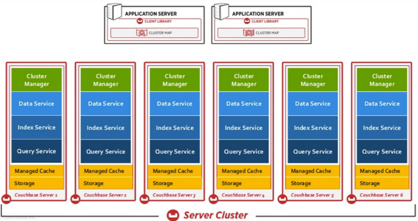

This blog explores Couchbase&reg;, which is an open-source distributed NoSQL
document and key-value database, released under the Apache&reg; 2.0 license.

<!--more-->

### Introduction

Couchbase provides low-latency data management for large scale interactive online
applications, which handle user requests like adding, removing, retrieving,
presenting, and manipulating data. To support these applications, data should
reside in a format that is easy to scale and access. This requirement led to the
emergence of Couchbase Server&reg;, which was created after the merger of
two popular NOSQL technologies, Membase&reg; and CouchDB&reg;.

Membase was developed by NorthScale, under the memcached project, and was designed
as a key-value store with the simplicity, speed, and scalability of memcached,
along with storage, persistence, and querying capabilities of a database.

CouchDB uses JSON for data representation and built-in replication and is written
in Erlang&trade;. CouchDB was developed by Damien Katz in 2005 and became an
Apache project in 2008.

In 2011, Membase, Inc. and Couchone, the company behind the CouchDB project,
announced a merger and called the merged company Couchbase, Inc.

### Different type of databases

This section describes the differences between three types of databases,
transactional, analytic, and engagement databases, shown in the following image:

Image source: [https://resources.couchbase.com/c/engagement-database-whitepaper?x=49kQ7H](https://resources.couchbase.com/c/engagement-database-whitepaper?x=49kQ7H)

#### Transactional databases

Transactional databases store highly structured data in tables and have unique
rows and columns. These databases are used mainly by the accounting, human
resources, sales, and purchasing departments of an organization. In transactional
databases, user interactions, support, and engagement are generally out of scope,
so millions of users can’t upload, view, or share billions of pictures, videos,
or words at the same time.

Because of high costs and the inability to handle huge amounts of unstructured
and semi-structured data, these relational databases can’t provide satisfactory
customer engagement.

The latest growth of mobile technologies, social platforms, and the Internet of
Things (IoT) applications are also creating difficulties for these databases.

Because of their architectural and structural limitations, transactional databases
might not fit in today’s era of digital disruption, and it looks like they are
slowing down digital transformation.

#### Analytical databases

Analytical technologies such as Hadoop&reg; Platform9 or Apache Spark10 are used
to perform backward-looking analytics in an organization’s massive data set of
customer interactions.

Analytical technologies always work with older data and not with real-time data.
Because they were never intended for real-time or predictive operational data,
they failed to build customer engagement.

For example, suppose you want to personalize suggestions, in real time, for a
customer on an e-commerce site based on the customer's interactions, such as
browsing or social media experiences. An analytical database won’t provide that
kind of facility or performance.

In other words, analytical databases won’t provide the *engagement to a customer*.

#### Engagement databases

Engagement databases provide multiple customer interactions and experiences by
liberating and using the full potential of data at any scale, across any channels
or devices, to build a more meaningful and significant relationship with a customer.
An engagement database has the following major defining characteristics:

- Built for change–at any scale (Scalability)
- Speed
- Secure
- Cloud-native
- Seamlessly mobile
- Built-in smarts

### Couchbase Server

Couchbase, the world’s first engagement database, provides unmatched agility,
scalability, speed, security, availability, and manageability. Today’s businesses
require these qualities to continually reinvent their customer expectations and
experiences and to benefit from an ever-adaptable competitive edge. Couchbase
Server is an open-source, scalable distributed NoSQL document and key-value
database that provides low-latency data management for large-scale, interactive
online applications.

The core architecture of Couchbase is designed to scale easily without performance
degradation and to simplify modern application development with a flexible data
model. Built with a strong emphasis on reliability, the core database platform
abilities include high availability, high scalability, high performance, and
security. The Couchbase database is a multi-model, general-purpose database, which
can be used as a managed-cache tier, a key-value, and a document database.

Couchbase Lite runs natively on mobile devices and IoT environments with managed
synchronization.

The following image shows a Couchbase Server cluster:

Image source: [https://developer.couchbase.com/documentation/server/4.0/architecture/architecture-intro.html](https://developer.couchbase.com/documentation/server/4.0/architecture/architecture-intro.html)

#### Couchbase Server's runtime behavior

Couchbase Server’s runtime behavior depends on the following important components:

- Connectivity architecture
- Replication architecture
- Storage architecture
- Caching layer architecture
- Security architecture

#### Couchbase Server services

Couchbase Server consists of the following core components:

- Cluster Manager
- Data service
- Index service
- Query service

Within a cluster, you can enable the data, index, and query services based on the
workload, as an independent deployment to handle three distinct workloads (core
database operations, indexing, and query processing). These workloads process
independently and simultaneously without any noise on the server side.

Thus, any (or each) node can run one, some,  or all services at any given time.
The database administrator can set up unique topologies by using these independent
services and independently scale the different workloads in the database at once.

#### Couchbase Server editions

There are three editions for Couchbase Server: enterprise, community, and open
source. Each edition offers their respective features and levels of support:

- Enterprise edition (EE): Recommended for production environments, Couchbase
provides the latest production-ready release.

- Community edition (CE): Built for non-commercial developers to help with testing
and identification of issues so that developers can avoid severe problems with
future production releases.

- Open source project: Provided on an open platform for testing, developing,
and future innovation of Couchbase. This is a mandatory foundation for the
development of the Community and Enterprise editions.

### Conclusion

In today’s IT world, customer expectations are driving digital transformation.
Customers seek extraordinary experiences while interacting with the brands they
like. This phenomenon forces organizations to capitalize on the huge opportunities
already available in today’s engagement era, instead of building new internet
applications or mobile apps every day. Organizations must modernize their current
technology and environments with highly responsive, available, scalable,
intelligent, and easy-to-manage databases. Engagement databases such Couchbase
Server suit this need perfectly.

Use the Feedback tab to make any comments or ask questions.

Learn more about our [database services](https://www.rackspace.com/dba-services).

