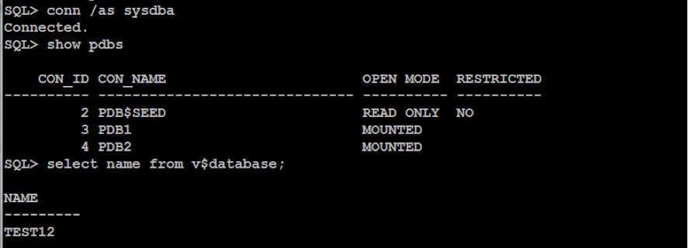
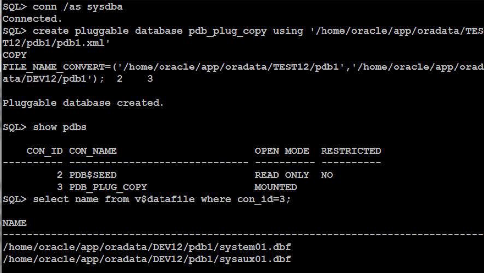
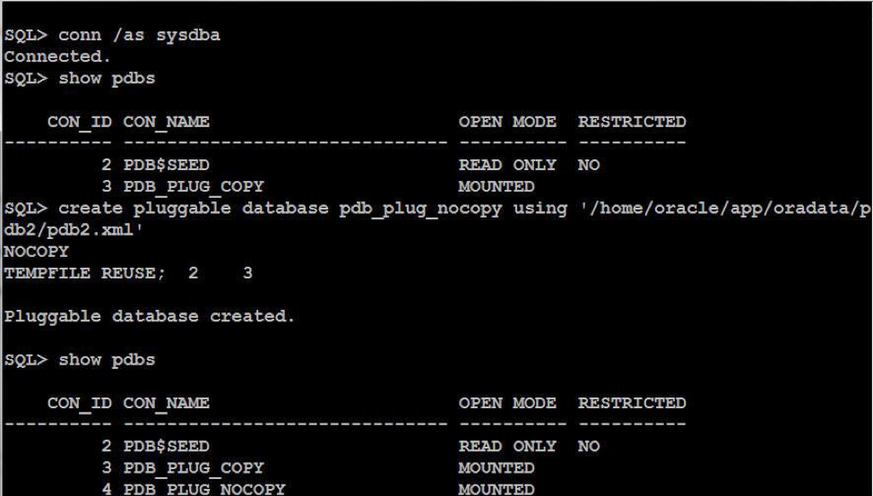
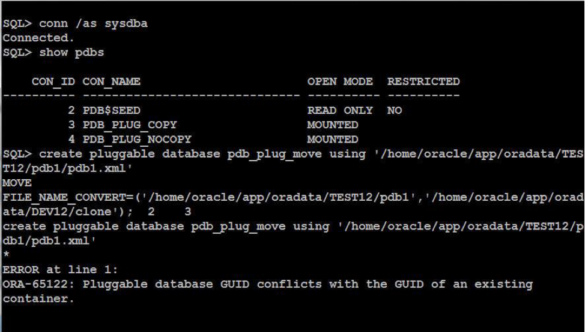
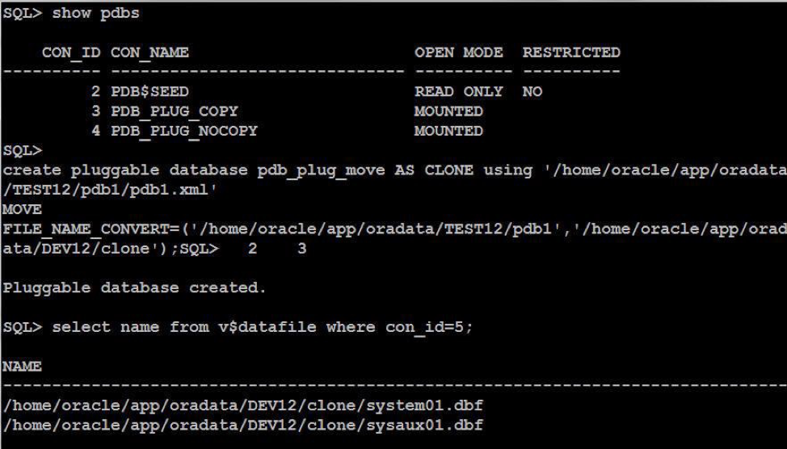

This blog discusses detaching one pluggable database (PDB) from the source
container database (CDB) and attaching it to a target CDB. For the purposes of
this blog, the PDB is the database in which we save all our application-related
databases.

<!--more-->

### Introduction

A CDB contains zero or more PDB databases related to different applications and
contains exactly one root container that stores Oracle&reg;-related metadata
and common users. The name of root container is `CDB$ROOT`. The root container
also contains one seed PDB, `PDB$SEED`. This seed PDB is a system-supplied
template that the CDB can use to create new PDBs. A PDB is the same database
that we use in non-container environments. In version 12c, Oracle introduced
this container and PDB feature, which enables you to add PDBs based on your
business requirements. For instance, you can create a PDB database that contains
sales department data in a sales application and Human Resources (HR) department
data in an HR application.

To unplug a PDB means to detach a PDB database from the source CDB and attach
it to a target CDB.

In this blog, the source CDB, `TEST12`, has two PDBs, `PDB1` and `PDB2`. The
target CDB, `DEV12`, receives the unplugged PDBs.

### Unplug and plug PDB sample

In this section, you learn how to unplug `PDB1` and `PDB2` from the source CDB
`TEST12` and plug them into the target CDB `DEV12`.

Before making changes, the source PDBs are `MOUNTED` as shown in the following
image:

#### Validate PDB compatibility with the target CDB

Before starting the plug operation, ensure that the to-be-plugged-in PDB is
compatible with the new host CDB. If they are not compatible, the execution of
the following PL/SQL block raises an error:

    . oraenv
    [enter dev12 at the prompt]
    sqlplus / as sysdba
    set serveroutput on
    DECLARE
       compatible BOOLEAN := FALSE;
    BEGIN
       compatible := DBMS_PDB.CHECK_PLUG_COMPATIBILITY(
            pdb_descr_file => '/home/oracle/app/oradata/TEST12/pdb1/pdb1.xml ');
       if compatible then
          DBMS_OUTPUT.PUT_LINE('Is pluggable PDB1 compatible? YES');
       else DBMS_OUTPUT.PUT_LINE('Is pluggable PDB1 compatible? NO');
       end if;
    END;
    /

    set serveroutput on
    DECLARE
       compatible BOOLEAN := FALSE;
    BEGIN
       compatible := DBMS_PDB.CHECK_PLUG_COMPATIBILITY(
            pdb_descr_file => '/home/oracle/app/oradata/pdb2/pdb2.xml');
       if compatible then
          DBMS_OUTPUT.PUT_LINE('Is pluggable PDB2 compatible? YES');
       else DBMS_OUTPUT.PUT_LINE('Is pluggable PDB2 compatible? NO');
       end if;
    END;
    /

#### Close the PDBs

Close the PDBs so that they can be unplugged by running the following
SQL*Plus&reg; statements:

    . oraenv
    [enter test12 at the prompt]
    sqlplus / as sysdba
    alter pluggable database pdb1 close immediate;
    alter pluggable database pdb2 close immediate;

The source PDBs should be in the mount state `closed`.

#### Unplug the PDBs

After closing the PDB, generate an XML manifest file. This XML file contains
information about the names and the full paths of the tablespaces, as well as
data files for the unplugged PDB.

Unplug the closed PDB and then specify the path and name of the XML file by
running the following commands:

    alter pluggable database pdb1 unplug into '/home/oracle/app/oradata/TEST12/pdb1/pdb1.xml';
    alter pluggable database pdb2 unplug into '/home/oracle/app/oradata/pdb2/pdb2.xml';

Drop the closed PDB and keep the data files by running the following commands:

    drop pluggable database pdb1 keep datafiles;
    drop pluggable database pdb2 keep datafiles;

Verify the status of the unplugged PDB by running the following commands:

    select pdb_name, status from cdb_pdbs where pdb_name in ('PDB1', 'PDB2');
    [you will see no rows]
    exit

#### Plug the PDBs

You can plug the PDB into the target CDB by using either the COPY method, the
NOCOPY or the CLONE MOVE method.

##### Plug with the COPY method

To use the COPY method to plug the PDB, create and define a destination for
the new data files, plug the unplugged PDB into the target CDB, and then copy
the data files of the unplugged PDB.

Create the destination directory by running the following commands:

    mkdir /home/oracle/app/oradata/DEV12/pdb1
    sqlplus / as sysdba

Use the data files of the unplugged PDB to plug the PDB into the CDB and copy
the data files to a new location by running the following commands:

    create pluggable database pdb_plug_copy using '/home/oracle/app/oradata/TEST12/pdb1/pdb1.xml '
    COPY
    FILE_NAME_CONVERT=('/home/oracle/app/oradata/TEST12/pdb1','/home/oracle/app/oradata/DEV12/pdb1');

Verify the status and open mode of the plugged PDB by running the following
commands:

    select pdb_name, status from cdb_pdbs where pdb_name='PDB_PLUG_COPY';
    select open_mode from v$pdbs where name='PDB_PLUG_COPY';
    List the data files of the plugged PDB.
    select name from v$datafile where con_id=3;
    exit

The result of these operations is shown in the following image:

##### Plug with the NOCOPY method

This method uses the data files of the unplugged PDB to plug the PDB into the
target CDB without making or using any copy.

To use the NOCOPY method to plug the PDB, run the following commands:

    create pluggable database pdb_plug_nocopy using '/home/oracle/app/oradata/pdb2/pdb2.xml'
    NOCOPY
    TEMPFILE REUSE;

This operation takes a few seconds. The original data files of the unplugged PDB
now belong to the new plugged-in PDB in the new host CDB. A file with the same
name as the temp file specified in the XML file is present in the target location.
Therefore, the `TEMPFILE_REUSE` clause is required.

Verify the status and open mode of the plugged PDB by running the following
commands:

    select pdb_name, status from cdb_pdbs where pdb_name='PDB_PLUG_NOCOPY';
    select open_mode from v$pdbs where name='PDB_PLUG_NOCOPY';

The results of these operations are shown in the following image:

List the data files of the plugged PDB by running the following commands:

    select name from v$datafile where con_id=3;
    select name from v$datafile where con_id=4;
    exit

##### Plug with the CLONE MOVE method

To use the CLONE MOVE method to plug the PDB, create and define a destination
for the new data files, use the data files of the unplugged PDB to plug the PDB
into the target CDB, and then move the data files to another location.

Create destination directory by running the following commands:

    mkdir /home/oracle/app/oradata/DEV12/clone
    sqlplus / as sysdba

Plug the PDB into the CDB and move the data files to a new location by running
the following commands:

    create pluggable database pdb_plug_move using '/home/oracle/app/oradata/TEST12/pdb1/pdb1.xml '
    MOVE
    FILE_NAME_CONVERT=('/home/oracle/app/oradata/TEST12/pdb1','/home/oracle/app/oradata/DEV12/clone ');

An error message displays because the global unique identifier (GUID) is not
unique. `PDB1` was already plugged using the COPY method, which caused this
conflict with the GUID as shown in the following image:

To address this, run the following code with the `AS CLONE` clause:

    create pluggable database pdb_plug_move
    AS CLONE using '/home/oracle/app/oradata/TEST12/pdb1/pdb1.xml '
    MOVE
    FILE_NAME_CONVERT=('/home/oracle/app/oradata/TEST12/pdb1','/home/oracle/app/oradata/DEV12/clone');

Verify the status and open mode of the plugged PDB by running the following
commands:

    select pdb_name, status from cdb_pdbs where pdb_name='PDB_PLUG_MOVE';
    select open_mode from v$pdbs where name='PDB_PLUG_MOVE';

List the data files of the plugged PDB by running the following command:

    select name from v$datafile where con_id=5;

The results of these operations are shown in the following image:

#### Open the plugged PDBs

To open the PDB and finalize the plug operation, run the following commands:

    alter pluggable database pdb_plug_nocopy open;
    alter pluggable database pdb_plug_copy open;
    alter pluggable database pdb_plug_move open;

Connect to the plugged-in PDBs and verify the container name that you are
connected to by running the following commands:

    connect sys/*****@localhost:1521/pdb_plug_nocopy AS SYSDBA
    show con_name
    connect sys/******@localhost:1521/pdb_plug_copy AS SYSDBA
    show con_name
    connect sys/******@localhost:1521/pdb_plug_move AS SYSDBA
    show con_name
    exit

#### Move the PDBs back to the source CDB

Close all pluggable databases by running the following commands:

    . oraenv
    [enter dev12 at the prompt]
    sqlplus / as sysdba
    alter pluggable database all close immediate;

Unplug the `pdb_plug_copy` database so that you can use it to re-create the
`pdb1` database by running the following command:

    alter pluggable database pdb_plug_copy unplug into '/home/oracle/app/oradata /pdb_plug_copy.xml';

Drop the `pdb_plug_copy` database by running the following command:

     drop pluggable database pdb_plug_copy;

Unplug and drop the `pdb_plug_nocopy` database so that you can use it to
re-create the `pdb2` database by running the following commands:

    alter pluggable database pdb_plug_nocopy unplug into '/home/oracle/app/oradata /pdb_plug_nocopy.xml';
    drop pluggable database pdb_plug_nocopy keep datafiles;

Drop the `pdb_plug_move` database by running the following command:

    drop pluggable database pdb_plug_move;

Plug the `pdb1` database back into the `TEST12` CDB by running the following
commands:

    connect sys/*****@localhost:1521/test12 as sysdba
    create pluggable database pdb1 AS CLONE using '/u01/app/oracle/oradata/pdb_plug_copy.xml'
    MOVE
    FILE_NAME_CONVERT=(' /home/oracle/app/oradata/DEV12/pdb1',' /home/oracle/app/oradata/TEST12/pdb1');

Plug the `pdb2` database back into the `TEST12` CDB by running the following command:

    create pluggable database pdb2 using '/u01/app/oracle/oradata/pdb_plug_nocopy.xml' nocopy tempfile reuse;

Open `pdb1` and `pdb2` by running the following commands:

    alter pluggable database pdb2 open;
    alter pluggable database pdb1 open;
    exit

### Conclusion

Unplugging and plugging PDBs can simplify the transfer of the files between
servers and reduce the chances of human error. For example, you can apply a patch
in one shot for all PDB databases, whereas in a non-container environment you
need to apply a patch to all databases separately. Backup and other maintenance
tasks are much easier in a container and PDB environment. Having a single file
to transport between servers is simpler because you can't accidentally forget
to transfer one or more files.

Hopefully, this blog gave you a better idea about the version 12c PDB and CDB
benefits over non-container databases.

Use the Feedback tab to make any comments or ask questions.

Learn more about our [database services](https://www.rackspace.com/dba-services).

