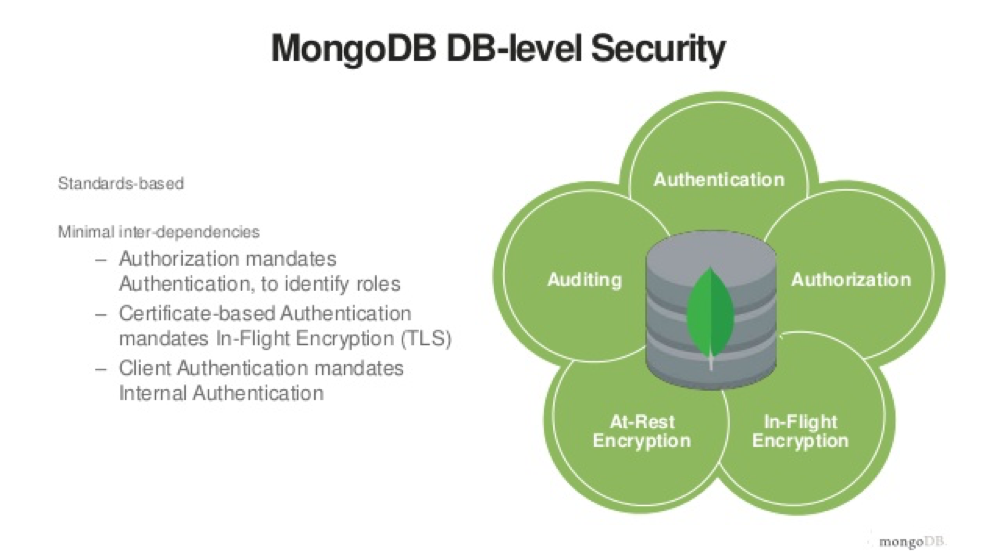
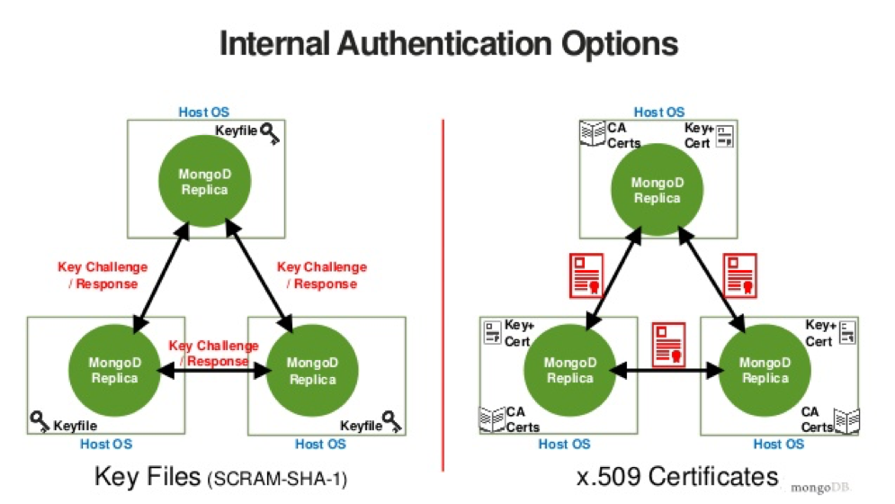

Getting started with MongoDB&reg; is easy. However, you can run into several
hiccups with its new features that emerge on an ongoing basis. One such area of
concern is security, which is the focus of this blog.

<!--more-->

### Introduction

Maintaining security with MongoDB applications is crucial for database
applications. You need to be able to identify the loop holes and know the types
and methods of database or application security to protect the database from
threats. Adhering strictly to the *Security Technical Implementation Guide*
(STIG) helps to secure  MongoDB to a great extent. Auditing from time to time
also helps to identify key flaws in the system or database so that you can
protect the system or database from various threats.

This blog covers ten tips for securing MongoDB to keep it safe and secure.

### Tip 1: Always enable authentication

Enabling authentication is a good practise and the simplest way to secure MongoDB.
Remember, sometimes the simplest security feature that is enabled can safeguard
the system to its maximum extent and thus save the organization from a data
breach that might cost millions of dollars.

Add the following lines to the `mongod.conf` configuration file to enable
authentication in MongoDB:

    Security:
		    Authentication: on

The following image illustrates DB-level security:

Image source: [https://www.slideshare.net](https://www.slideshare.net)

### Tip 2: Use complex passwords

This tip is just common sense.  In most cases, the most basic, simple password
used for any application or database is `12345` or `ABC123`. However, these simple
passwords are the weapon of choice to crack the system and steal the valuable
data.

Because MongoDB doesn’t offer any lockout option for passwords, it is easy for
hackers to try the simplest passwords to crack the database or application in
minutes to get into it.

### Tip 3: Authorize users by roles

MongoDB does not enable access control by default. You can enable authorization
by using the keyword `--auth` when you initialize the MongoDB shell.

Not everyone should administer the database. Even if the database has
authentication enabled, don’t give administrative rights to everyone. Instead,
as a best practice, always create some roles to authorize users.

Setting up certain user roles reduces the complexity for each user and greatly
reduces the risk of an account breach that causes disaster later.

To create a user with a role, run the following command:

    db.createUser({user:"admin", pwd:"X1eL#pM0C12", roles:[{role:"userAdminAnyDatabase", db:"admin"]})

### Tip 4: Add a replication keyfile

Enabling a replication keyfile automatically enables authentication in MongoDB.
With this feature enabled, only hosts with this file installed are able to join
the replica set.

An enabled replication keyfile also ensures data encryption in MongoDB,
which provides an extra layer of protection. You can generate a keyfile by using
any method that you choose, copy the keyfile to the replica set members, and then
start the replica set with the access control enabled.

Add the following lines to `mongod.conf` to enable the replication keyfile:

    Security:
	    KeyFile: <Path to KeyFile>

The following image illustrates keyfile authentication:

Image source: [https://www.slideshare.net](https://www.slideshare.net)

### Tip 5: Don’t use default ports

Never use any default ports to connect to your MongoDB instances. Most of the
time, hackers scan only default or standard port numbers before they attack.
Some of the default ports that MongoDB uses are `27017`, `27018`, `27019`,
`2700X`, and so on.

It is easy to change the default port numbers in `mongod.conf`.

### Tip 6: Have a good backup approach

Always ensure you have the latest copy of data to ensure that your operations
log (oplog) is ready for a point-in-time (PIT) recovery from the moment an attack occurred.

Be ready with a fool-proof disaster recovery set up for any kind of attack.

### Tip 7: Disable public access to your database

Review your application to see if it needs any external account access to the
database. If any such accounts are in place, set them to use authentication and
encryption.

You can even disable the public access by binding the host Internet Protocol
(IP) addresses in `mongod.conf`.

### Tip 8: Enable firewall rules at the operating system level and use VPN

Firewalls provide an extra layer of security to filter and control the access
to a system over the network. On MongoDB servers, enable firewall rules on hosts
or security groups in cloud hosting.

Always ensure that you only give access to mongod instances to trusted sources.
Obstruct IP addresses or port ranges for servers to make
cloud hosting more secure.

Use VPN to provide certified access to your database system for various levels
of encryption, multiple levels of authentication, and authorization for all the
clients.

### Tip 9: Audit the database system regularly for security issues

Audit the database or host system regularly to see if there is any breach or
if any user account has granted elevated privileges, other than the required
ones, based on their roles and privileges.

If elevated privileges were given for testing purposes, make sure to revoke
them to resecure the system.

### Tip 10: Validate and test database access from the outside

You or your team should test the database system for security issues by using
penetration testing or SQL injection to see if they exploit the system. Make
sure that nothing is exposed from the outside world to your database.

You can use many tools for that testing, such as nmap, telnet, and so on.

### Conclusion

This blog helps you to configure some basic security practices for daily
MongoDB administration. Use these tips and the tools described to secure your
MongoDB database applications.

You can also use the MongoDB Monitoring Service (MMS) to monitor and configure
most of the security-related features instead of using the mongo shell.

Use the Feedback tab to make any comments or ask questions.

Learn more about our [certified database administrators and database services](https://www.rackspace.com/dba-services).

