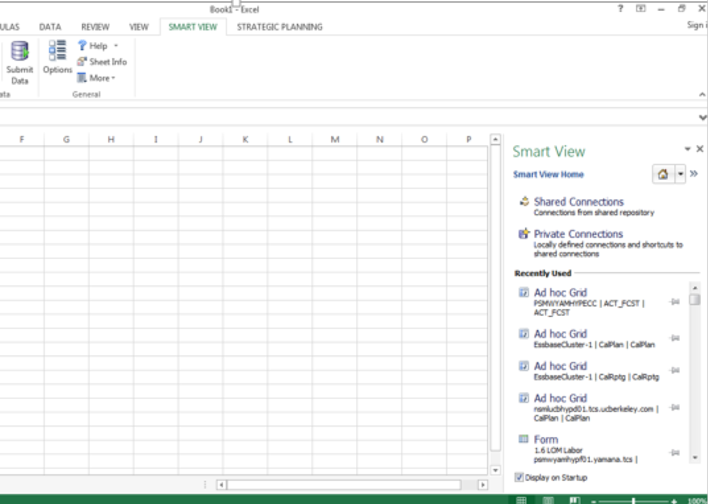
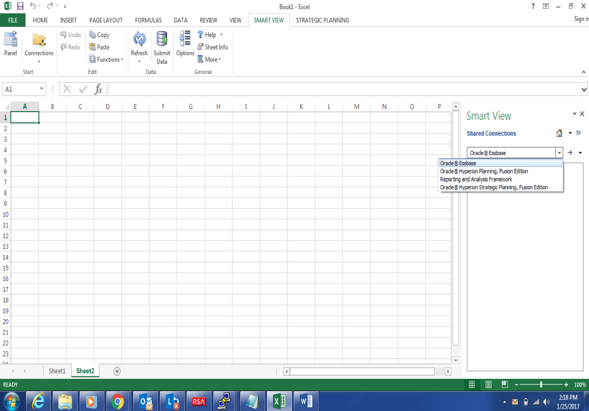
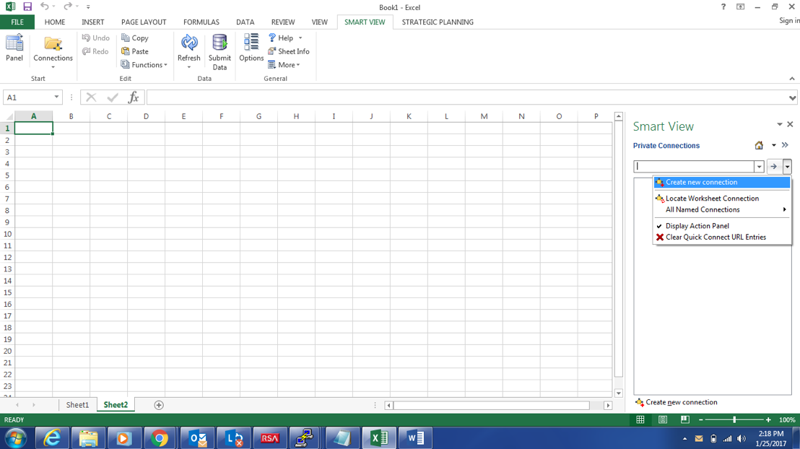
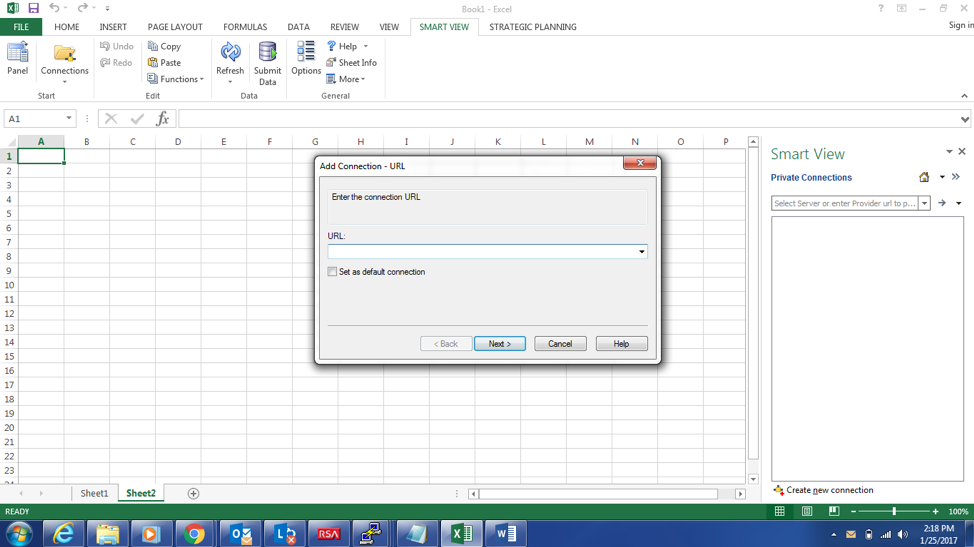

Originally published by TriCore: Sept 12, 2017

Oracle&reg; Smart View provides a common Microsoft&reg; Office interface
designed specifically for Oracle's Enterprise Performance Management (EPM) and
Business Intelligence (BI). By using Smart View, you can view, import, and
create reports.

<!--more-->

### Introduction

The Hyperion Smart View Microsoft Excel add-on tool is a basic and important tool
for all users of Hyperion. This tool is used to load data into Hyperion, to view
data, and to access reports and webforms that have already been loaded into or
created in Hyperion.

One of the most common issues that is faced by end users is that they are not
able to connect to Hyperion Essbase or Hyperion Planning by using Smart View
after they have migrated or upgraded their current servers. This issue is caused
by the change to the server name after migration or an upgrade.

### Use Smart View to connect to data sources

Smart View provides a common Microsoft Office interface for the following
on-premises data sources:

-	Oracle Essbase
-	Oracle Hyperion Financial Management
-	Oracle Hyperion Planning
-	Oracle Hyperion Enterprise Performance Management Workspace
-	Oracle Hyperion Reporting and Analysis
-	Oracle Hyperion Strategic Finance (requires the Strategic Finance extension)
-	Oracle Hyperion Profitability and Cost Management
-	Disclosure Management (requires the Disclosure Management extension)
-	Oracle Hyperion Financial Data Quality Management, Enterprise Edition
-	Oracle BI EE

Smart View provides a common Microsoft Office interface for the following cloud
data sources:

-	Oracle Planning and Budgeting Cloud
-	Oracle Enterprise Planning and Budgeting Cloud
-	Oracle Enterprise Performance Reporting Cloud
-	Oracle Financial Consolidation and Close Cloud
-	Oracle Profitability and Cost Management Cloud
-	Strategic Modeling (requires the Strategic Modeling extension)
-	Oracle Tax Reporting Cloud
-	Oracle Analytics Cloud
-	Oracle Analytics Cloud – Essbase

### Smart View key capabilities

Smart View has the following key capabilities:

-	Integrates EPM and BI data directly from the data source into Microsoft
Word, Microsoft PowerPoint, and Microsoft Outlook.
-	Has full ad hoc and free-form analysis capabilities for Oracle Hyperion
Financial Management, Oracle Essbase, Oracle Hyperion Planning, and Oracle
Business Intelligence Enterprise Edition.
-	Has full ad hoc and free-form analysis capabilities for Oracle EPM Cloud data
sources, including Oracle Planning and Budgeting Cloud, Oracle Financial
Consolidation and Close Cloud, and Oracle Tax Reporting Cloud.
-	Provides data access from relational or multidimensional sources.
-	Supports highly formatted grids in Microsoft Excel.
-	Offers report creation in Excel, Word, and PowerPoint by using EPM and BI data.

### Smart View connections

The Smart View Excel addon offers the following connection types:

- **Shared Connections**: Connections that are defined by an administrator and
that can be viewed by all users.

- **Private Connections**: Locally stored connections or URL-based connections.

The following diagram shows the two connection types:

In most cases, you find all your connections under **Shared Connections**.

If a data source is not listed under **Shared Connections**, you can use the
*quick connect* feature in **Private Connections**. Type a URL in the drop-down
box and click **GO**.

If you have a connection that you use all the time, add it to the list of
private connections and it will always be available in the drop-down list as an
option. Any URLs that you type are stored. When you click on a connection, you
get a context sensitive list of key actions that you can perform on that
connection.

After you use a connection a few times, you can access that connection from the
home panel by finding it in the **Recently Used** list. Most Recently Used (MRU)
items are great for single-click access to your most common tasks, such as
starting an ad-hoc analysis or opening a form. You can pin MRUs so that they
are always where you expect them to be.

### Create shared connections

To create a shared connection, perform the following steps:

1.	From the Smart View ribbon, click **Panel**.
2.	In the Smart View panel, click the arrow next to home as shown in the
following image and select **Shared Connections**.
3.	Log in by using a user ID and a password.

### Create private connections

By using private connections, you can connect to Hyperion Essbase, Planning, HSF,
OBIEE, reporting analysis, and HFM.

If you know the URL, you can create a private connection from a connection that
is not listed in **Shared Connections**. To add a connection by using a URL,
perform the following steps:

1.	From the Smart View ribbon, click **Panel**.
2.	In the Smart View panel, click the arrow next to the home as shown in the
following image and select **Private Connections**.

<ol start=3>
    <li> 	In the text box, shown in the following image, enter the URL, or the local
storage directory, for the data source to which you want to connect and click
<b>Next</b>. If you are unsure which URL to use, contact your system administrator
for the URL. The following list includes many of the most common URLs:

 
<ul>
<li><b>Financial Management</b>: http(s)://servername:port/hfmofficeprovider/hfmofficeprovider.aspx</li>
<li><b>Hyperion Enterprise</b>: https://servername:port/heofficeprovider/heofficeprovider.aspx</li>
<li><b>Planning</b>: http(s)://servername:port/HyperionPlanning/SmartView</li>
<li><b>Essbase</b>: http(s)://servername:port/aps/SmartView</li>
<li><b>Reporting and Analysis</b>: http(s)://servername:port/raframework/browse/listxml</li>
<li><b>Financial Close Management</b>: https://servername:port/fcc/servlets/smartview/fcmsvservlet</li>
<li><b>Oracle Hyperion StrategicFinance</b>: https://servername:port/StrategicPlanning/SmartView</li>
</ul>

    </li>
</ol>

### Conclusion

Many customers use Smart View to load data and view data as part of their daily
activities. This blog shows you how to make the required connections to
Hyperion. You can also easily make changes to connections when there are any
upgrades to Smart View or Hyperion. You can use the preceding information to
create connections to all of the Hyperion components.

Use the Feedback tab to make any comments or ask questions.
