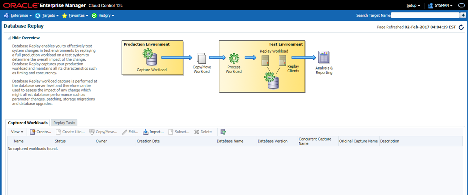

Originally published by TriCore: Sept 7, 2017

Oracle&reg; Smart View provides a common Microsoft&reg; Office interface
designed specifically for Oracle's Enterprise Performance Management (EPM) and
Business Intelligence (BI). By using Smart View, you can view, import, and
create reports.

This blog discusses Oracle&reg; load testing, also known as performance
testing, which is used to test a database under various representative load
conditions.

<!--more-->

### Introduction

Sometimes functional and regression testing is not sufficient for validating
new code changes, especially when you are trying to make bulk code changes,
doing a database or application upgrade, or changing any hardware. It makes
sense to simulate the production load on the test environment to see how it
behaves under various load conditions.

You might also perform a load test when a particular product is going live, or
a new country localization is being implemented, in the case of an e-business
suite.

There are four main phases in a load testing exercise:

1) Preparation  
2) Simulation  
3) Capture metrics  
4) Analysis  

The following sections explore each phase in detail.

### Preparation phase

First identify the tool or procedure for conducting the test. Available tools,
both open source and licensed, include the following software:

-	Mercury LoadRunner - requires license
-	Borland SilkPerformer - requires license
-	HammerDB - open source
-	Swingbench - open source
-	Oracle Application Testing Suite (OATS) - requires license

You can also simulate load with custom-developed scripts.

#### Collect information

Collect information about the production system and the load test system. You
need to know the operating system (OS) version, patch level, and hardware
resources, such as central processing units (CPUs), random access memory (RAM),
data storage device details, and so on.

#### Determine the metrics to be measured

List the metrics to be measured during the load testing exercise. Optional
metrics include the following:

-	CPU usage
-	Load average
-	Memory usage
-	SQL response time
-	Throughput
-	Hits per second

You can configure OS watchers on the load testing system to get granular details
of the OS and the hardware metrics.

The Oracle Automatic Workload Repository (AWR) needs to be configured, if it is
not in place already.

#### Determine the core test areas

The core test areas for load testing depend on the type of application being
hosted by the database:

-	For an E-Business Suite (EBS) database, the month-end period is a major event
that you can include during simulation load.
-	For an EBS environment with manufacturing, the Advanced Supply Chain Planning
(ASCP) plan run is a major event, which you need to test.
-	You can simulate the payroll run of an application if it is being used in an
Human Resources (HR) module.
-	In the case of a core banking database, you can simulate the End of Day (EOD)
processing to account for most of the load.

All of the preceding cases are more like batch processing scenarios. Along with
these cases, you should also include transaction processing windows when more
concurrent users are on the system.

#### Create a test plan:

Use the following stitems to create a test plan:

-	Include at least two different phases for the test, a baseline and a
post-upgrade phase.
-	The baseline test is used to measure the current environment and validate it
against the actual production environment. The post-upgrade test evaluates the
environment after the upgrade is made.
-	By using the baseline and the post-upgrade tests, you can analyze the
impact of the upgrade.
-	Identify load test procedures, including how to start the load test and how
to evaluate test progress for each test.
-	List the tests to be conducted.
-	Plan the number of test run iterations for each test. For example, run the
same test three times to get a more accurate average measure of transaction
response time.
-	Identify the reports for each of the load test phases. The reports should
include information on results from each test run, metrics, and other collected
information. Create report templates.
-	Make a checklist of test actions that you need to execute after load testing.
These can include steps to move the database to the pre-load testing state.

#### Some considerations

You need to consider the following issues if the load test system is not a 1:1
scale of the production system:

-	Behavior in load testing is different than in production.
-	Errors shown in production don't reproduce in load testing.
-	Transaction performance is different between load testing and production.
-	Other factors, not listed above, can also influence the load testing, and
therefore, the results and analysis.

### Simulation phase

After you finalize the test plan and choose the tools, you need to install and
set up the necessary tools for simulation.

You can simulate load in different ways based on the tools being used. It is as
simple as running a few select data definition language/data manipulation
language (DDL/DML) queries on a set of tables or as complex as replicating a
series of batch processing programs like ASCP run, Payroll run, or EOD processing.

First, capture and replay the baseline load from the source system in a load
test. Then, move on to replaying the representative load.

####  HammerDB and OATS/Oracle Database Replay

HammerDB and OATS/Oracle Database Replay have the following characteristics:

-	HammerDB enables you to capture the load on the source system by using Oracle
trace files. Then, they can be moved to the load test system and replayed on it.
-	Learn more about the [detailed process](https://www.hammerdb.com/hammerdb\_oracle\_trace\_replay.pdf).
-	OATS is a comprehensive, integrated testing solution that ensures the
quality, scalability, and availability of your web applications, web services,
packaged Oracle applications, and Oracle databases.
-	Oracle Database Reply is another option for performing load testing. You can
use it from DBMS\_WORKLOAD\_CAPTURE APIs or Enterprise Manager. However, there
are some licensing implications to use these tools. Using API’s, the
DBMS\_WORKLOAD\_CAPTURE package is part of the Oracle Real Application Testing
option. DBMS\_WORKLOAD\_REPLAY package is part of the Oracle Real Application
Testing option. Use of the function DBMS\_WORKLOAD\_REPLAY.COMPARE\_PERIOD\_REPORT()
also requires a license of Oracle Diagnostics Pack.
-	You can also access the SQL Performance Analyzer feature from the SQLPLUS
interface.

The DBMS_SQLPA package is a part of Oracle Real Application Testing option. The
Oracle Real Application Testing license is required for both capture and replay,
and systems for database replay is charged by the total number of CPUs on those
systems. Refer the following My Oracle Support (MOS) note for detailed steps for
capture and replay using API’s:

- [Capture using APIs](https://docs.oracle.com/database/121/RATUG/GUID-7AB9889A-6F05-41D3-8EA1-F4BEEC507BDE.htm#RATUG122)
- [Replay using APIs](https://docs.oracle.com/database/121/RATUG/GUID-0F8D20F3-A4A1-4A89-852A-449C2E7C9602.htm#RATUG151)

#### Using Enterprise Manager

You can perform capture and replay from Oracle Enterprise Manager (OEM) interface.
From the **Enterprise** menu of the Enterprise Manager Cloud Control console,
select **Quality Management->Database Replay**.

A **Database Replay** page appears, similar to the following image:

Learn about the detailed procedures for [Capture from OEM](https://docs.oracle.com/database/121/RATUG/GUID-1679DB12-B633-4021-A3B9-9CC6216D6681.htm#RATUG117)
and for [Replay from OEM](https://docs.oracle.com/database/121/RATUG/GUID-B97B7550-A947-45D0-A31B-636A6427DD86.htm#RATUG147).

### Capture metrics phase

While the simulation phase is running, make sure that the OS watcher is running
and gathering statistics on the load testing environment.

Ensure that AWR snapshots are running at 30-minute intervals.

If an OEM infrastructure is available, ensure the OEM agent is active on the
load testing server and that data is being captured.

### Analysis phase:

To analyze the load test results, consider the following items:

- Compare the baseline load and the representative load. Depending on the
options available, you can analyze AWR reports and compare OEM data for
various load situations.

- Look for the peaks in CPU and memory usage, SQL response time, and throughput.
Confirm that the peaks are within the permissible limits.

- If you used Oracle Database Replay for simulating load, use this
[document](https://docs.oracle.com/database/121/RATUG/GUID-3E9AA9F2-B37B-4E03-9E00-FEB0A141631E.htm#RATUG159)
to analyze the workloads.

- If you used OATS for capture and reply, use this
[document](https://docs.oracle.com/cd/E25294_01/doc.920/e15484/oltchap6.htm#CEGEIEDF)
to analyze the test results.

- If you used the HammerDB tool, use this [document](https://www.hammerdb.com/document.html).

- Based on your analysis of the metrics, you can decide whether to go live with
your planned changes or to adjust your plan.

### Conclusion

The preparation phase is pivotal to the whole load testing exercise. Exercise
more caution in the analysis and conclusion, especially when the load testing
system is not a 1:1 replica of production.

You need to conduct each of the steps and processes carefully because any
missed step or issue can invalidate the test results. This can result in a
decision made under false or misleading information.

A successful and well-conducted load test exercise increases confidence and
reduces the risk of a system upgrade.

Use the Feedback tab to make any comments or ask questions.
