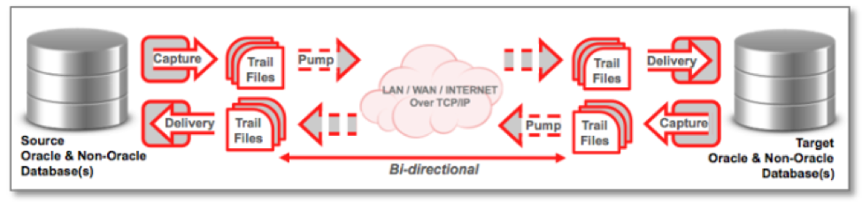

This blog offers suggestions for troubleshooting issues with Oracle&reg;
GoldenGate lag.

<!--more-->

### What is lag?

Lag is the time difference between when changes are made within the source
database and when those changes are applied to the target database. This article
discusses the following types of lag:

**Extract lag**: The difference, in seconds, between the system clock time that
a record was processed by the **Extract** GoldenGate component and the timestamp
of that record in the data source.

**Replicat lag**: The difference, in seconds, between the system clock time that
the last record was processed by the **Replicat** GoldenGate component and the
timestamp of the record in the trail files, which are a record of the transactions.

### Monitor lag

You can monitor lag with the following GoldenGate **Manager** parameters (found in
**mgr.prm**):

–  LAGINFO {seconds | minutes | hours}: the basic informational warning lag threshold
–  LAGREPORT {minutes | hoursS}: the interval at which **Manager** checks for lag
–  LAGCRITICAL {seconds | minutes | hours}: the critical warning lag threshold

You can also monitor **ggserr.log** for latency information and review database
query statistics in the GoldenGate dynamic performance views.

### Obtain lag information

Use the following GoldenGate Software Command Interface (GGSCI) lag commands to
obtain lag statistics for running Oracle GoldenGate Groups:

#### LAG EXTRACT

Use `LAG EXTRACT` to determine the true lag time between **Extract** and the data
source, as shown the following example:

    LAG EXTRACT group_name

The output should be similar to the following example:

    2018-08-17 23:09:31  INFO    OGG-14054  Lag from heartbeat table requires DBLOGIN.

    Sending GETLAG request to EXTRACT EXT1 ...
    Last record lag 4 seconds.
    At EOF, no more records to process

#### LAG REPLICAT

Use `LAG REPLICAT` to determine the true lag time between **Replicat** and the
trail, as shown in the following example:

    LAG REPLICAT group_name

The output should be similar to the following example:

    2018-08-17 23:02:49  INFO    OGG-14054  Lag from heartbeat table requires DBLOGIN.
    Sending GETLAG request to REPLICAT REP1 ...
    Last record lag 6 seconds.
    Low watermark lag: 67.
    High watermark lag: 8.
    Low watermark position: 68765101167.
    High watermark position: 68765101638.
    At EOF, no more records to process

### Control how lag is reported

Use the `LAGREPORTMINUTES` or `LAGREPORTHOURS` parameter to specify the interval
at which **Manager** checks for **Extract** and **Replicat** lag.

Use the `LAGCRITICALSECONDS`, `LAGCRITICALMINUTES`, or `LAGCRITICALHOURS`
parameter to specify a lag threshold that is considered critical and to force a
warning message to the error log when the threshold is reached. This parameter
affects **Extract** and **Replicat** processes on the local system.

Use the `LAGINFOSECONDS`, `LAGINFOMINUTES`, or `LAGINFOHOURS` parameter to
specify a lag threshold. If the lag exceeds the specified value, GoldenGate
reports lag information in the error log. If the lag exceeds the value specified
with the `LAGCRITICAL` parameter, **Manager** reports the lag with a critical
warning. Otherwise, it reports the lag with an informational message.

### Analyze lag

Before trying to diagnose lag and potential bottlenecks in a GoldenGate
environment, you should first understand the flow of data between the source and
target databases, as shown in the following figure:

Image source: [https://bit.ly/2OGREey](https://bit.ly/2OGREey)

The following components can contribute to performance bottlenecks:

- **Extract** reads the Oracle log files and captures any required data for
  replication.
- **Extract** carries out any mapping and conversion of the data and writes
  to the trail files.
- **Data Pump** reads the trail files and carries out any required mapping and
  conversion of the data.
- **Data Pump** transfers the trail files from the source system to the target
  system, where **Collector** writes to the remote trail files.
- **Replicat** reads the trail file, applies any mapping and conversions, and
  applies the data to the target database by using SQL statements.

### Gather diagnostic lag information

To monitor GoldenGate performance, several key pieces of information must be
gathered and analyzed. You should gather performance data on both the source
and target environments for the same period to get a clear picture of lag.

Diagnostic information can be gathered from the following sources:

-  **Extract** and **Replicat** report files and error logs
-  **Extract** and **Replicat** statistics
-  Database views
-  Automatic Workload Repository (AWR) and Active Session History (ASH) reports
-  Oracle Streams Performance Advisor
-  Integrated **Extract** and **Replicat** Health Check report

### Reduce lag

The following sections offer suggestions to troubleshoot and reduce lag within
various GoldenGate components.

#### Tune Extract

Tune **Extract** by using the following techniques:

–  Use the `LOGALLSUPCOLS` parameter to instruct **Extract** to write
   supplemental logged columns to the trail file.
–  Use the `PARALLELISM` parameter to control the number of preparers for
   processing logs. The Enterprise Edition allows for parallelism of preparers.
-  Avoid having long transactions.
-  Increase the input and output (I/O) throughput of the machine running
   **Extract**, especially write throughput.
-  Split large tables into row ranges across process groups.

#### Tune Pump

Tune **Pump** by using the following techniques:

-  Remove unnecessary processing in **Pump**.
-  Try to use the `COMPRESSION` feature.
-  Optimize network delivery by increasing the `TCPBUFSIZE` and `TCPFLUSHBYTES`
   parameter sizes.

#### Tune Replicat

Tune **Replicat** by using the following techniques:

-  Use the `BATCHSQL` parameter, which improves the apply performance in the
   majority of workloads
-  Parallelize the **Replicat** apply by using integrated (IR) or coordinate
   replicat (CR) features.
-  Optimize target database SQL execution.
-  Use the `EAGER_SIZE` threshold to begin to apply transactions before a
   commit is received. The default is 9500.

#### Tune GoldenGate in general

Use the following techniques to tune GoldenGate in general:

-	Use multiple process groups.
-  Split large tables into row ranges across process groups.
-	Configure GoldenGate to use the network efficiently.
-	Eliminate disk I/O bottlenecks.
-	Manage virtual memory and paging.
-	Optimize data filtering and conversion.

### Conclusion

Lag time is a critical measure in a GoldenGate replication environment. This
post reviewed the tools and utilities used to gather diagnostic information
and offered recommendations to improve the performance.

Use the Feedback tab to make any comments or ask questions.

Learn more about our [database services](https://www.rackspace.com/dba-services).

Learn more about [Rackspace Application Services](https://www.rackspace.com/application-management).
