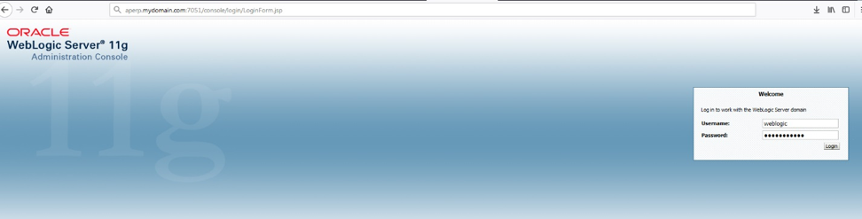
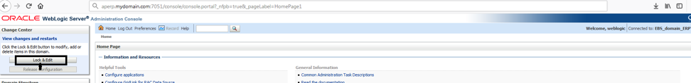
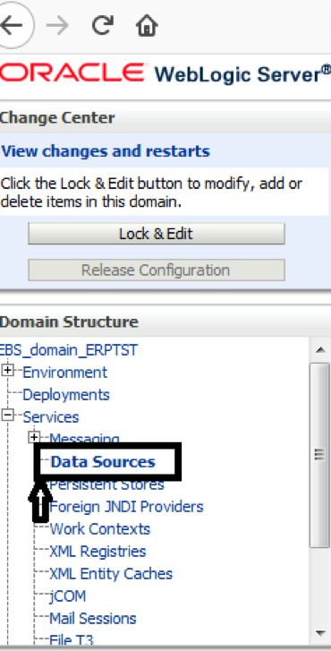
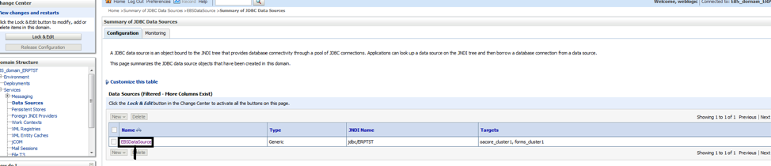
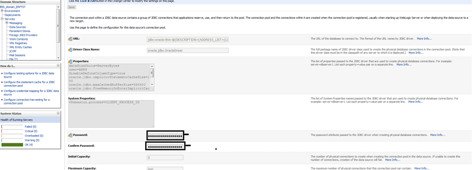

This blog outlines the steps to change the password for Oracle&reg;'s E-Business
Suite (EBS) APPS schemas and WebLogic&reg;, which is a routine activity for an
Oracle Applications database administrator (DBA). In EBS version R12.2, you can
change passwords by using the `AFPASSWD` option, or by using `FNDCPAS` followed
by some manual steps.

<!--more-->

### Change the schema passwords

The following table shows the schemas for EBS v. R12.2:

<table>
  <tr>
    <th>Schema &nbsp; &nbsp; &nbsp; &nbsp; &nbsp; &nbsp; &nbsp;</th>
    <th>Description</th>
  </tr>
  <tr>
    <td>APPS</td>
    <td>Owns all of the applications code in the database and has access to all
    data in the E-Business Suite.  
    All end-user connections connect as APPS after being authenticated
    by using the APPLSYSPUB schema.  
    The APPS schema must have the same password as the APPLSYS and APPS_NE schemas. </td>
  </tr>
  <tr>
    <td>APPSLSYS</td>
    <td>Owns the foundation objects (AD_* and FND_* tables) of the E-Business
    Suite that are used to define users, menus and so on.  
    The APPLSYS schema must have the same password as the APPS and APPS_NE schemas. </td>
  </tr>
  <tr>
    <td>APPS_NE</td>
    <td>Is the new non-edition runtime ‘APPS’ user for the E-Business Suite.  
    The APPS_NE schema must have the same password as the APPLSYS and APPS schemas. </td>
  </tr>
</table>

 

**Table Source**: [https://www.integrigy.com/security-resources/oracle-e-business-suite-applsys-apps-and-appsne](https://www.integrigy.com/security-resources/oracle-e-business-suite-applsys-apps-and-appsne)

**Note:** The steps to change a password must be carried out on the run file
system, and the `FND_USER` and `FND_ORACLE_USERID` tables should be backed up
before you change any passwords. Remove the backups after you have confirmed
that the changes are successfully completed. Passwords for all the three schemas,
APPS, APPLSYS and APPS_NE, are changed together when you change the APPLSYS
password.

Use the following steps to change the schema passwords:

#### 1: Stop the application tier services

Stop the application tier services on multiple nodes by running the following
command from the primary application node:

    adstpall.sh apps/apps_password -mode=allnodes

This prompts for the WebLogic password. Internally, it connects to all the
nodes by using Secure Shell (SSH), which was enabled as part of the R12.2.x
prerequisites setup.

#### 2. Change the passwords

Use one of the following command line utilities for changing the passwords
for the schemas, APPS, APPLSYS, and APPS_NE.

##### FNDCPASS

Use the following command to change passwords after exporting the environment
file to the run file system on the primary application server:

    FNDCPASS apps/apps_password 0 Y <SYSTEM username>/<SYSTEM password> SYSTEM APPLSYS <new_password>

**Note:** You might need to apply the
[patch 19127427](https://support.oracle.com/knowledge/Oracle%20E-Business%20Suite/2433710_1.html),
otherwise `FNDCPASS` might fail to change the password with the error:
*ERROR IN PASSWORD VERIFICATION FOR APPS*.

##### AFPASSWD

`AFPASSWD` is an enhanced version of `FNDCPASS` and has the following features:

- `AFPASSWD` only prompts for passwords required for the current operation,
  which provides a separation of duties between applications administrators and
  database administrators. This also improves interoperability with Oracle
  Database Vault. In contrast, the `FNDCPASS` utility currently requires the
  specification of the APPS and the SYSTEM usernames and corresponding passwords,
  which prevents the separation of duties between applications and database
  administrators.

- When you change a password with `AFPASSWD`, you are prompted to enter the new
  password twice to confirm.

- In EBS Release 12.2.3 and later, you can also use the `AFPASSWD` utility to
  migrate EBS user passwords to a password-hashing scheme.

Use the following syntax for the `AFPASSWD` command:

    AFPASSWD [-c <APPSUSER>[@<TWO_TASK>]] -s <APPLSYS>

The following example changes the password and exports the environment file of
the run file system on the primary application server with database as the user
**ERPUAT**:

- Run the command: `AFPASSWD -c apps@ERPUAT -s APPLSYS`
- Enter the Oracle password for the Application Object Library *APPSUSER* and
  connect successfully to **APPS**.
- Enter the password for the **SYSTEM** Oracle schema and connect successfully
  to **SYSTEM** (Log file: **AFPWD\_ERPUAT\_11.log**).
- Enter the new password for the user and verify the new password for user.
- The operation completes successfully.

#### 3. Run autoconfig

Run autoconfig with the newly changed password on all nodes.

#### 4. Start AdminServer

Start AdminServer by using the **$INST_TOP/admin/scripts/adadminsrvctl.sh**
script. Do not start any other application tier services. Use the following
command:

    adadminsrvctl.sh start

#### 5. Change the APPS password in WebLogic

Change the APPS password in the WebLogic Suite (WLS) datasource by using one of
the options described in the following sections.

##### Change password in the console

To change the APPS pasword by using the WLS console, perform the following steps:

1. Log in to the WLS Administration Console.
   
2. Click **Lock & Edit** in the Change Center.
   
3. In the Domain Structure tree, expand **Services**, and select **Data Sources**.
   
4. On the **Summary of JDBC Data Sources** page, select **EBSDataSource**.
   
5. On the **Settings for EBSDataSource** page, select the **Connection Pool** tab.
6. Enter the new password in **Password**.
   
7. Enter the new password in **Confirm Password**.
8. Click **Save**.
9. Click **Activate Changes** in the Change Center.

##### Change the password on the command line

To change the APPS password in the WLS adadmin console from the unix prompt,
perform the following steps:

1. Identify the following information, which will be used in the next step:

   - weblogic\_password: weblogic password
   - server\_name: Server name where weblogic admin is running
   - port: weblogic admin port of run file system
   - apps\_password: New apps password which you changed previously
   - actual path of data source: $FMW\_HOME/user\_projects/domains/EBS\_domain\_${ORACLE_SID}

<ol start=2>
    <li> Edit <b>updateDSpwd.py</b> and update the parameters with your details:</li>
</ol>

        username = 'weblogic'
        password = 'weblogic_password'
        URL= 't3://server_name:port'
        connect(username,password,URL)
        edit()
        startEdit()
        en = encrypt('apps_password','actual path of data source')
        dsName = 'EBSDataSource'
        cd('/JDBCSystemResources/'+dsName+'/JDBCResource/'+dsName+'/JDBCDriverParams/'+dsName)
        set('PasswordEncrypted',en)
        print ('')
        print ('')
        save()
        activate()

<ol start=3>
    <li> Execute <b>updateDSpwd.py</b>.</li>
</ol>

#### 6. Start all services

Start all services by running the following command from primary application node:

    adstrtal.sh apps/apps_password -mode=allnodes

#### 7. Verify the Weblog datastore

Use the following steps to verify the WLS datastore:

1. Log in to the WLS Administration console.
2. In the Domain Structure tree, expand **Services** and select **Data Sources**.
3. On the **Summary of JDBC Data Sources** page, select **EBSDataSource**.
4. On the **Settings for EBSDataSource** page, select **Monitoring > Testing**.
5. Select **oacore\_server1**.
6. Click **Test DataSource**.
7. Look for the message *Test of EBSDataSource on server oacore_server1 was successful*.

### Change the WebLogic password

The following sections show the steps for updating the WebLogic password for
Txk Delta 7 and later and for versions earlier than Txk Delta 7.

#### Tkx Delta 7 and later

The following steps apply to WebLogic Txk Delta 7 and later:

1. Run the following command to source the run filesystem, shut down all
   application tier services except the Admin Server, and ensure that no
   application services (except admin server and node manager) are running on
   the primary application server:

        adstpall.sh apps/apps_password -mode=allnodes -skipNM -skipAdmin

2. Run the following command to change the Weblogic administration password and
   start the services:

        perl $FND_TOP/patch/115/bin/txkUpdateEBSDomain.pl -action=updateAdminPassword

   The system prompts you for the Apps password, the old WebLogic password and the
   new WebLogic password.

   Following is some sample output from this process:

    $ perl $FND_TOP/patch/115/bin/txkUpdateEBSDomain.pl -action=updateAdminPassword

    Program: txkUpdateEBSDomain.pl started at Tue Aug 21 04:30:52 2018

    AdminServer is restarted after changing WebLogic Admin Password
    All MidTier services should be SHUTDOWN before changing WebLogic Admin Password
    Confirm if all Mid-Tier services are in SHUTDOWN state. Enter "Yes" to proceed or anything else to exit:
    Enter the full path of Applications Context File [DEFAULT - /apps1/OSID/fs1/inst/apps/OSID_pserver/appl/admin/OSID_pserver.xml]:
    Enter the WLS Admin Password:
    Enter the new WLS Admin Password:
    Enter the APPS user password:

    Executing: /apps1/OSID/fs1/FMW_Home/webtier/perl/bin/perl /apps1/OSID/fs1/EBSapps/appl/ad/12.0.0/patch/115/bin/adProvisionEBS.pl  ebs-get-serverstatus -contextfile=/apps1/OSID/fs1/inst/apps/OSID_pserver/appl/admin/OSID_pserver.xml -servername=AdminServer -promptmsg=hide -logfile=/apps1/OSID/fs1/inst/apps/OSID_pserver/logs/appl/rgf/TXK/txkUpdateEBSDomain_Tue_Aug_21_04_30_52_2018/EBSProvisioner.log

    Online mode:

    Backup Location: /apps1/OSID/fs1/inst/apps/OSID_pserver/logs/appl/rgf/TXK/txkUpdateEBSDomain_Tue_Aug_21_04_30_52_2018
    Logfile Location: /apps1/OSID/fs1/inst/apps/OSID_pserver/logs/appl/rgf/TXK/txkUpdateEBSDomain_Tue_Aug_21_04_30_52_2018/updateAdminPassword.log

    Executing: /apps1/OSID/fs1/EBSapps/comn/util/jdk32/jre/bin/java -classpath :/apps1/OSID/fs1/FMW_Home/wlserver_10.3/server/lib/weblogic.jar:/apps1/OSID/fs1/FMW_Home/Oracle_EBS-app1/oui/jlib/srvm.jar:/apps1/OSID/fs1/EBSapps/comn/java/classes:/apps1/OSID/fs1/EBSapps/comn/shared-libs/ebs-3rdparty/WEB-INF/lib/ebs3rdpartyManifest.jar:/apps1/OSID/fs1/FMW_Home/Oracle_EBS-app1/shared-libs/ebs-appsborg/WEB-INF/lib/ebsAppsborgManifest.jar oracle.apps.ad.util.UpdateEBSDomain updateAdminPassword  -contextfile /apps1/OSID/fs1/inst/apps/OSID_pserver/appl/admin/OSID_pserver.xml -promptmsg hide -logdir /apps1/OSID/fs1/inst/apps/OSID_pserver/logs/appl/rgf/TXK/txkUpdateEBSDomain_Tue_Aug_21_04_30_52_2018 -logfile /apps1/OSID/fs1/inst/apps/OSID_pserver/logs/appl/rgf/TXK/txkUpdateEBSDomain_Tue_Aug_21_04_30_52_2018/updateAdminPassword.log

    Domain updated successfully
    Restarting AdminServer with new Admin Password.

    You are running adadminsrvctl.sh version 120.10.12020000.10

    Stopping WLS Admin Server...
    Refer /apps1/OSID/fs1/inst/apps/OSID_pserver/logs/appl/admin/log/adadminsrvctl.txt for details

    AdminServer logs are located at /apps1/OSID/fs1/FMW_Home/user_projects/domains/EBS_domain_OSID/servers/AdminServer/logs

    adadminsrvctl.sh: exiting with status 0

    adadminsrvctl.sh: check the logfile /apps1/OSID/fs1/inst/apps/OSID_pserver/logs/appl/admin/log/adadminsrvctl.txt for more information ...

    You are running adnodemgrctl.sh version 120.11.12020000.12

    NodeManager log is located at /apps1/OSID/fs1/FMW_Home/wlserver_10.3/common/nodemanager/nmHome1

    adnodemgrctl.sh: exiting with status 0

    adnodemgrctl.sh: check the logfile /apps1/OSID/fs1/inst/apps/OSID_pserver/logs/appl/admin/log/adnodemgrctl.txt for more information ...

    You are running adadminsrvctl.sh version 120.10.12020000.10

    Starting WLS Admin Server...
    Refer /apps1/OSID/fs1/inst/apps/OSID_pserver/logs/appl/admin/log/adadminsrvctl.txt for details

    AdminServer logs are located at /apps1/OSID/fs1/FMW_Home/user_projects/domains/EBS_domain_OSID/servers/AdminServer/logs

    adadminsrvctl.sh: exiting with status 0

    adadminsrvctl.sh: check the logfile /apps1/OSID/fs1/inst/apps/OSID_pserver/logs/appl/admin/log/adadminsrvctl.txt for more information ...

    *************** IMPORTANT ****************
    WebLogic Admin Password is changed.
    Restart all application tier services using control scripts.
    ********************************************

    Program: txkUpdateEBSDomain.pl completed at Tue Aug 21 04:34:33 2018

<ol start=3>
    <li> Start all services on all nodes, using the following command.</li>
</ol>
        adstrtal.sh apps/apps_password -mode=allnodes

<ol start=4>
    <li>  Login to the admin console to verify that the new WebLogic user password works.</li>
</ol>

#### Versions earlier than Tkx Delta 7

The following steps apply to WebLogic versions earlier than Txk Delta 7:

1. Log in to the WebLogic Administrative console.
2. Use the existing WebLogic admin username and password.
3. Click **Lock & Edit** and click **Domain**.
4. Click on the **Security** tab and click on the **Advanced** tab.
5. Enter the new password that you want for the WebLogic admin user in the
   **Node Manager Password**.
6. Click **Save** and verify that the settings were updated successfully. Then
   click on **Activate Changes**.
7. Click **Security Realms** and Click **Myrealm**.
8. Select **Users and Groups**, select **Weblogic User**, and enter the new
   password for the WebLogic user.
9. Make sure that the settings have  been updated successfully.

**Note**: In the next prepare phase to run after the password change, Oracle Ad
Online Patching (adop) invokes EBS Domain Configuration to ensure that the WLS
data source on the patch file system is synchronized with the new Apps password.

### Conclusion

Use the process outlined in this blog to change the APPS, APPLSYS, APPS_NE and
WebLogic password. Note that passwords with special characters or multibyte
characters are not currently supported with EBS.

`FNDCPASS` is a legacy tool that is still supported for backwards compatibility,
but entering passwords on the command line might be a security risk. Oracle
recommends that all customers make the transition as soon as possible to the
successor tool, `AFPASSWD`, for which no passwords are entered on the command
line.

Use the Feedback tab to make any comments or ask questions.

Learn more about our [database services](https://www.rackspace.com/dba-services).
