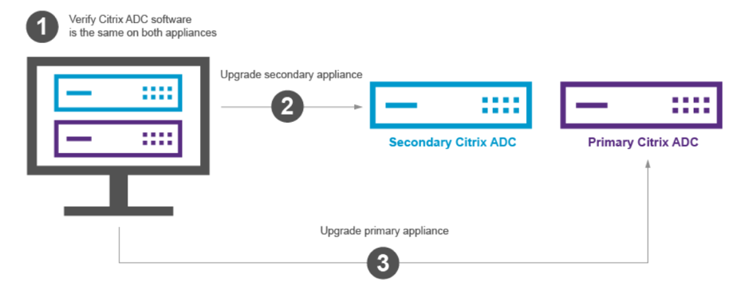
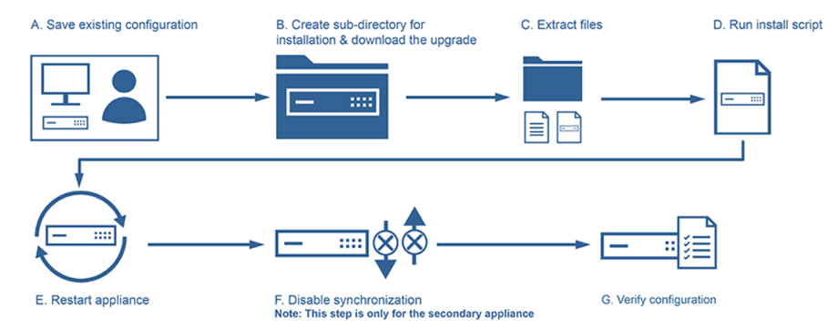
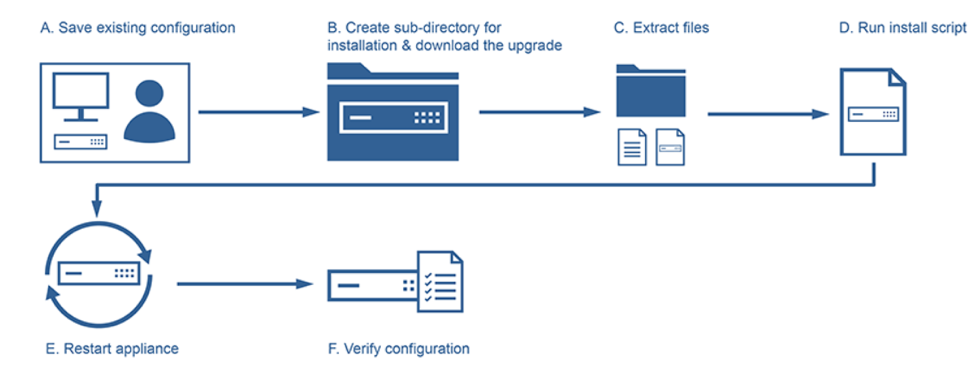

NetScaler&reg; Application Delivery Controller (ADC), Citrix&reg; Systems' core
networking product, is a tool that improves the delivery speed and quality of
applications to an end user. This blog describes how to upgrade, by using the
command line interface (cli), the software on NetScaler appliances that are
configured in a high-availability setup.

<!--more-->

### Introduction

The ADC product was developed for business customers and performs tasks such as
traffic optimization, Layer 4 to Layer 7 load balancing, and web application
acceleration while maintaining data security.

You should upgrade the firmware to overcome known issues and bugs with the current
version and to have a smooth business transition.

### Upgrade prerequisites

Review the following prerequisites before beginning the upgrade:

-	Make sure which stable version needs to be upgraded based on the model
   (software and hardware compatibility).

-	Verify whether the appliance has enough space  in `/var` for the upgrade. If
   necessary, free up more space.

-	Go through the release notes and look for any modified or depreciated commands.

-	Follow your organization’s change control procedures.

-	Allocate twice as much time to perform the upgrades.

-	Download the approved image from the Citrix download center (note the integrity
   value of the image).

-	Log in to NetScaler and save the configuration before taking any backups.

-	Take a full backup of NetScaler (Secure Sockets Layer (SSL), license,
   configuration, and so on) and store it in a share folder.

### Upgrade procedure

The following image shows a high-level overview of the ADC upgrade steps:

**Note:** Always upgrade the secondary appliance first and then upgrade the
primary appliance.

#### Upgrade the secondary appliance

The following image shows the steps to upgrade the software on the secondary
appliance.

Image source: [https://docs.citrix.com/en-us/netscaler/12-1/upgrade-downgrade-netscaler-appliance/upgrade-downgrade-HA-pair.html](https://docs.citrix.com/en-us/netscaler/12-1/upgrade-downgrade-netscaler-appliance/upgrade-downgrade-HA-pair.html)

1.	Log in to the secondary NetScaler appliance by using a Secure Shell (SSH) utility,
   such as PuTTY, and specifying the NetScaler IP (NSIP). Use the *nsroot/admin*
   credentials to log in to the appliance.

2.	Save the existing configuration by using the following command:

        save ns config

3.	Review the load balancer virtual server IP (LBVip) and the service group (SG)
   statuses to gauge how many are up prior to the upgrade. Record the results.
   After the secondary appliance becomes primary, you need to verify that the
   same number of SGs and virtual server IPs (VIP) are up. Perform the
   verification by using the following commands:

        sh lb vserver | grep -c "State: UP"    -- Shows number of UP LB VIP’s
        sh servicegroup | grep -c "Effective State: UP" – Shows number of UP SG’s

4.	Open a shell prompt and run the following commands to create new directory
   under `/var/nsintall` to upload the upgrade file:

        cd /var/nsinstall
        mkdir x_xnsinstall

5.	Upload the `.tgz` file from the local system or file transfer protocal (ftp)
   server to  `/var/nsinstall/x_xnsinstall` (example file name: **ns-x.0-xx.x.tgz**).

6.	Before you run the install script, extract the files and place them on the
   appliance. Use the following command to uncompress the bundle:

        tar -zxvf ns-x.0-xx.x.tgz

7.	Run the following command to install the downloaded software. If the
   appliance does not have sufficient disk space to install the new kernel
   files, the installation process performs an automatic cleanup of the flash
   drive.

        ./installns

8.	After the installation process is complete, the process prompts you to restart
   the appliance. Press **y** to restart the appliance.

9.	Log in to the appliance CLI by using the *nsroot/admin* credentials and
   execute the following command.  The output of the preceding command should
   indicate that the appliance is the secondary node and that synchronization
   is disabled.

 	      show ha node

10. If synchronization is not disabled, run the following command to disable
    synchronization on the appliance:

        set ha node -hasync disabled

11. Ensure that the configuration is complete and as expected.

12. Run the following commands to perform a force failover and takeover as the
    primary appliance and to verify the failover:

        force failover
        show ha node

13. Review the LBVip and SG statuses by using the commands from step 3.

#### Upgrade the primary appliance

The following image shows the steps to upgrade the software on the primary
appliance:

Image source: [https://docs.citrix.com/en-us/netscaler/12-1/upgrade-downgrade-netscaler-appliance/upgrade-downgrade-HA-pair.html](https://docs.citrix.com/en-us/netscaler/12-1/upgrade-downgrade-netscaler-appliance/upgrade-downgrade-HA-pair.html)

1.	Log in to primary appliance, which is currently secondary, and follow
   steps 4 to 9 from the "Upgrade the secondary appliance" section.

2.	Run the following command to display the state of the appliance. The output
   should indicate that the appliance is the primary node and that the status
   of the node state is **UP**.

        show ha node

3.	If the appliance is not a primary appliance, run the following command to
   perform a force failover to ensure that the appliance is a primary appliance:

        force failover

4.	Verify that the appliance is a primary appliance.

5.	Review LBVip and SG statuses. Perform the verification by using
   the following commands:

        sh lb vserver | grep -c "State: UP"    -- Shows number of UP LB VIP’s
        sh servicegroup | grep -c "Effective State: UP" – Shows number of UP SG’s

#### Enable synchronization on the secondary appliance

To enable synchronization on the secondary appliance, complete the following
steps:

1.	Run the following command to verify that the appliance is a secondary
   appliance:

        show node

2.	Run the following command to enable synchronization on the appliance:

        set ha node -hasync enabled

3.	Run the following command to verify that the configuration of the secondary
   appliance is synchronized with that of the primary appliance:

        show ns runningconfig

### Conclusion

You have successfully upgraded and verified whether the SGs and VIPs are same
as they were before the upgrade.  Log in to the load balancer from the graphical
user interface (GUI) to check out the new look. If you encounter any GUI bugs
after the upgrade, contact Citrix support to get any needed hotfixes.  You can
check with the support team before upgrading the firmware to get details about
the stability of your version of ADC to avoid unnecessary issues.

Use the Feedback tab to make any comments or ask questions.

Learn more about [Rackspace application services](https://www.rackspace.com/application-management).

Reference: [https://docs.citrix.com/en-us/netscaler/12-1/upgrade-downgrade-netscaler-appliance/upgrade-downgrade-HA-pair.html](https://docs.citrix.com/en-us/netscaler/12-1/upgrade-downgrade-netscaler-appliance/upgrade-downgrade-HA-pair.html)
