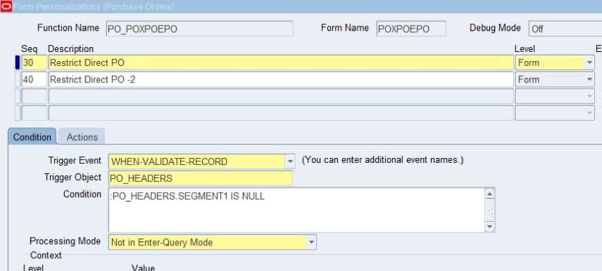
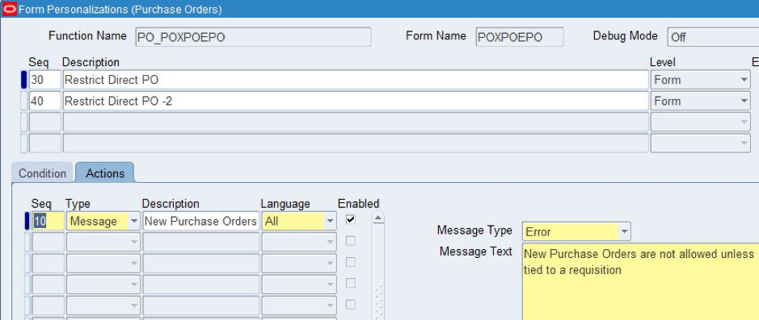
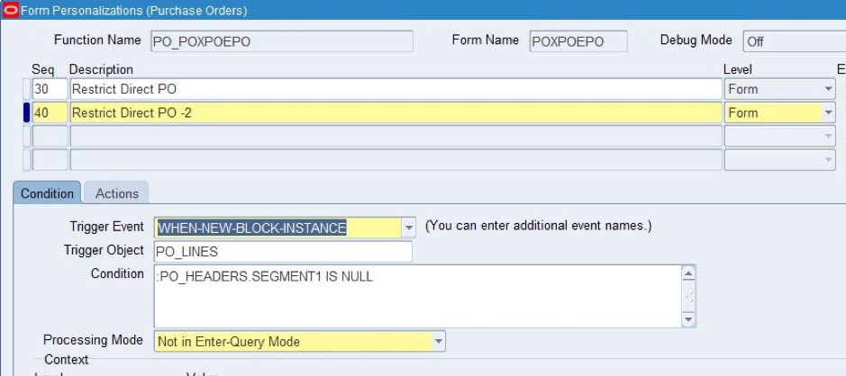
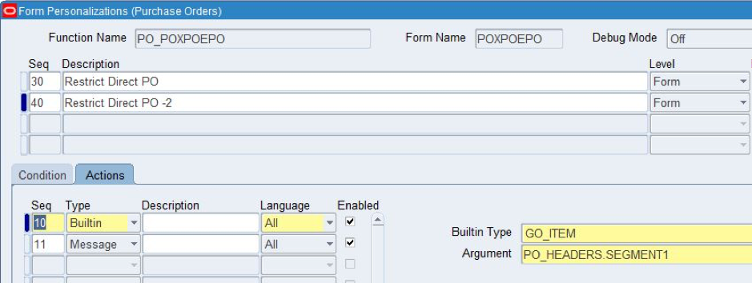
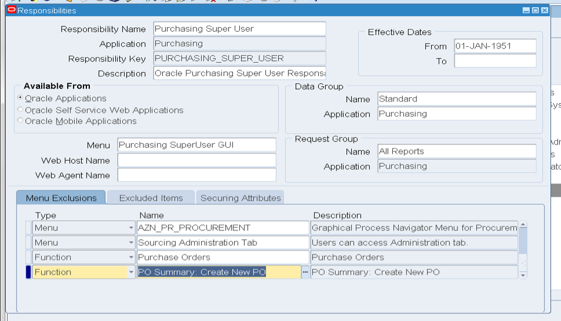

Sometimes businesses require a requisition in order to raise a purchase order
(PO) and restrict manual PO creation. This blog shows you how to restrict a
user from manually creating a PO.

<!--more-->

### Introduction

In Oracle&reg; purchasing, you create a PO by using either of the following
methods:

- Manually by using the PO form.
- Automatically from a requisition by using the AutoCreate form.

Some businesses require a requisition to create a PO and restrict manual PO
creation. The following sections show options to restrict the manual creation
of POs in Oracle E-Business Suite (EBS) applications.

#### Option 1: Personalize the POXPOEPO form

This method requires two personalizations, one on the PO Header Block and
another on the PO Line Block.

To personalize at the PO Header Block, use the `WHEN VALIDATE RECORD` event, as
shown in the following image.

You need to add a condition to check whether the PO number (**SEGMENT1**) is
null. If it is null, you can raise an error message. A null **SEGMENT1** means
that you are trying to create a new PO on a purchase order form, so we need to
restrict that here, as shown in the following image:

To personalize at the PO line level, trap the PO creation in the
`WHEN NEW BLOCK INSTANCE` event.

If the **SEGMENT1** at the PO header level is null, take the following actions:

1.	Pass the control to PO Header Block.
2.	Raise an error message.

The following images demonstrate these actions:

#### Option 2: Use menu exclusions

To use menu exclusions, you need to exclude several functions at the
responsibility level to ensure that a user is not able to create the PO manually.
Make sure that you modify all responsibilities where you want to restrict PO
creation.

You should exclude the following functions:

-	`Purchase Orders`
-	`PO Summary: Create New PO`

The following image shows this process:

The limitation with menu exclusions is that a user is not able to edit the POs
(which were created through the auto-create functionality) from responsibilities
on which functions `Purchase Orders` and `PO Summary: Create New PO` are excluded.

### Conclusion

You can use either of the methods described in this blog to restrict the creation of
PO creation. If you want to permit a user to edit the PO after creating it from
a requisition, you should use the form personalization method. If the user
will create the PO from AutoCreate without needing to edit it, then use the menu
exclusion method. I hope you find these hints valuable and are able to put them
to good use.

Use the Feedback tab to make any comments or ask questions.

Learn more about our [database services](https://www.rackspace.com/dba-services).

