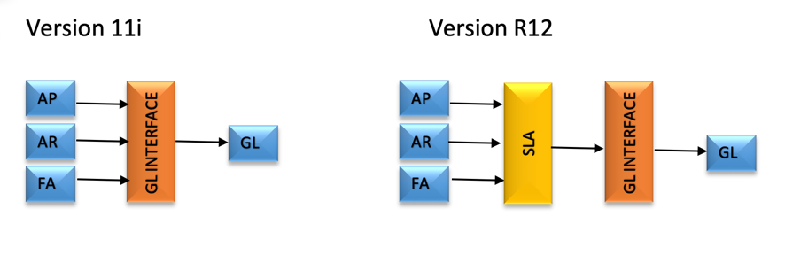

Originally published by TriCore: February 12, 2017

This blog takes you through Subledger Accounting (SLA), which is one of the most
important features of Oracle&reg; version R12. SLA is the most robust feature in
R12, providing the power to modify accounting according to business needs. This
blog outlines the difference between R12 and earlier versions of the Subledger,
along with some of its key features and components of SLA.

<!--more-->

### Introduction

Prior to R12, data was transferred from SLA to the General Ledger (GL) interface
table and then imported into the GL base tables. There was no scope of
modification of accounting data at the Subledger level. SLA, introduced
in R12, sits between the Subledger and GL interface table, and enables you to
tweak the standard accounting rules to produce the desired accounting data
depending on business requirements.

Because SLA provides the power to modify accounting as needed, after the seeded
rules are modified and validated, you won't need to repeatedly revise data in
the tables. When `Create Accounting` runs from the Subledger, it produces the
desired accounting results. In addition, you can define different rules for all
the Subledgers.

### Differences between Subledger versions

The following image highlights the differences between the Subledger
architecture in versions 11i and R12:

Key features include the following items:

-	SLA forms and programs are embedded within the standard Oracle application
   responsibility. Separate responsibilities are no longer required.
-	Standard rules can be copied and modified.
-	Generation and storage of detailed accounting entries.
-	SLA maintains a complete link between transactions and accounting entries,
   which makes auditing very easy.
-	SLA enables you to drilldown from GL journal lines to the Subledger
   transactions and vice versa.

### Components of SLA

SLA has the following components:

**Event Class (EC)**: Classifies transaction types. *Invoice* and *Payment* are
examples of event classes in the **Payables** Subledger.

**Event Types (ET)**: Define possible actions on each EC with potential
accounting significance. *Validation* and *cancellation* are examples of an ET.

**Journal Line Type (JLT)**: Defined for a particular EC and must be assigned
to a Journal Line definition. A JLT carries the debit and credit aspect of
accounting.

**Account Derivation Rules (ADR)**: Contain the rules to derive the GL code
combination for a particular JLT. You can assign seeded sources, custom sources,
or constant values.

**Journal Line Definitions (JLD)**: Group the EC, ET, JLTs, and ADRs for the
Journal.

**Application Accounting Definitions (AAD)**: Group the EC, ET, JLTs and ADRs
for a Ledger. This is a repetitive step in R12 and is removed in the Oracle
Fusion&reg;.

**Subledger Accounting Method (SLAM)**: Contains a previously created AAD to
form a method that is assigned to a Ledger.

### Conclusion

SLA eliminates the burden of repetitive manual accounting intervention. SLA
provides a mechanism to produce the desired accounting results with minimal
setup.

Use the Feedback tab to make any comments or ask questions.

Learn more about our [database services](https://www.rackspace.com/dba-services).

