There are many approaches to upgrading a multi-node Couchbase&reg; Server cluster.
This post describes detailed steps for the rolling online upgrade by using the
graceful failover and delta recovery method.

<!--more-->

### Introduction

The method described in this post is one of the most preferred methods for online
upgrades because it does not require adding any additional nodes to the cluster
for the upgrade. The method is fast and less resource intensive because the node
is recovered by using only delta changes instead of a full rebalance. Also, the
global secondary indexes are preserved in this process, which does not require
a rebuild. The primary disadvantage of this approach is decreased high
availability for the duration of upgrade.

### Prerequisites

You should perform this upgrade during off-peak business hours.  There are
also certain requirements and considerations for using the graceful failover.
Review this [setup document](https://docs.couchbase.com/server/5.5/clustersetup/setup-failover-graceful.html)
before proceeding with the steps outlined in this post.

### Environment details

The example in this post has the following characteristics:

- It has a two-node cluster `Prashant 2-Node London Cluster`.
- It upgrades Couchbase Enterprise Edition version 5.1.0 build 5552 to Couchbase
Enterprise Edition version 5.5.0 build 2473 - IPv4.
- It uses the Couchbase Administration Web Console for most of the steps.

### Upgrade steps

Use the steps in this section to perform the upgrade.

#### Step 1: Download Couchbase version 5.5 on both nodes of the cluster

Download the Couchbase version 5.5 binary executable on the first of the cluster
nodes.

The following image uses the `WGET` utility to download the required RPM Package
Manager (RPM) file from the server.

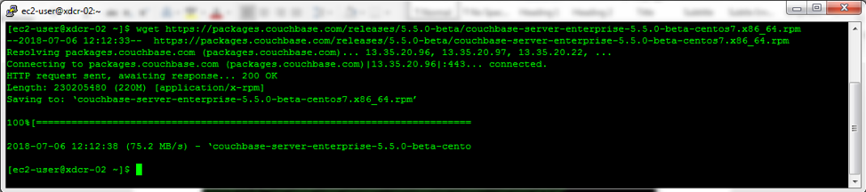

After the download, the current location contains the version 5.5 binary as shown
in the following image:

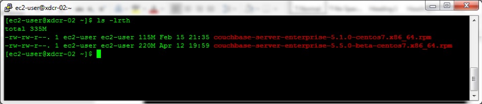

Repeat the download process for the other node of the cluster.

#### Step 2: Login to cluster node-1

Use the Couchbase Web Console to log in to cluster `node-1` by using the
`Adminstrator` account, as shown in the following image:

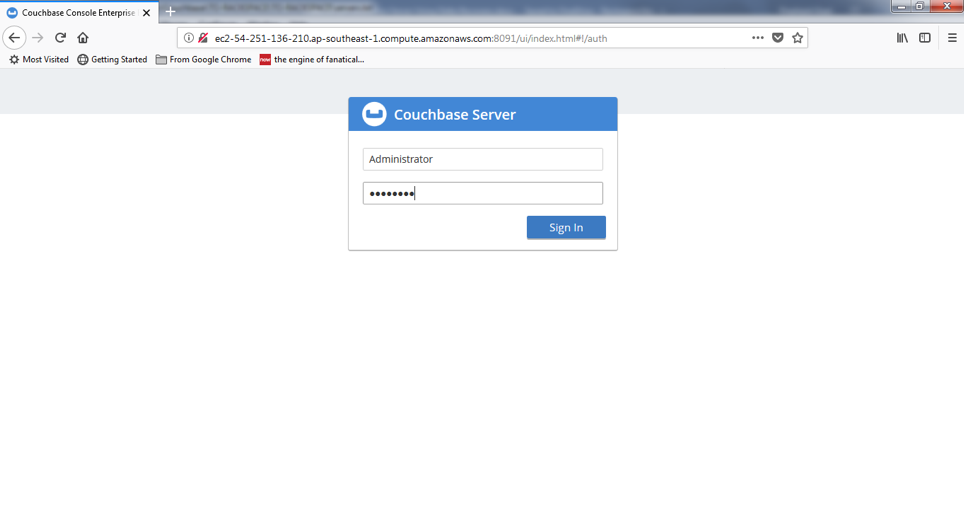

#### Step 3: List the servers

Click on the **Servers** tab to see the list of servers that are a part of the
cluster. The following image shows that we have two server nodes that are part
of this cluster:

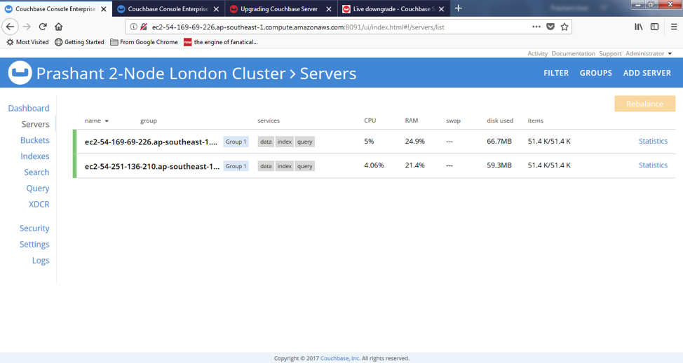

#### Step 4: Review the server details

Click on each server to see its detailed information including the current
version, as shown in the following image:

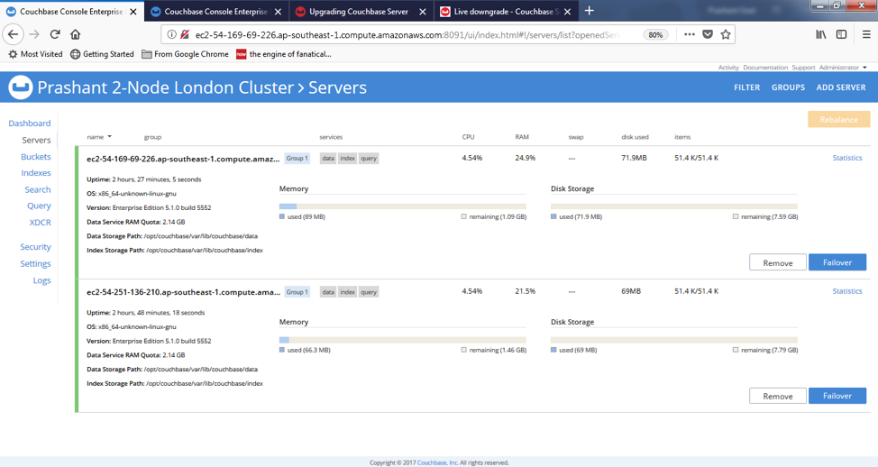

Because you logged in from `node-1`, you need to upgrade the other node, `node-2`,
first so that the Couchbase Web Console session remains intact even after the
Couchbase shutdown during the upgrade.

#### Step 5: Perform a graceful failover of node-2

Expand the `node-2` section and click **Failover**, as shown in the following
image:

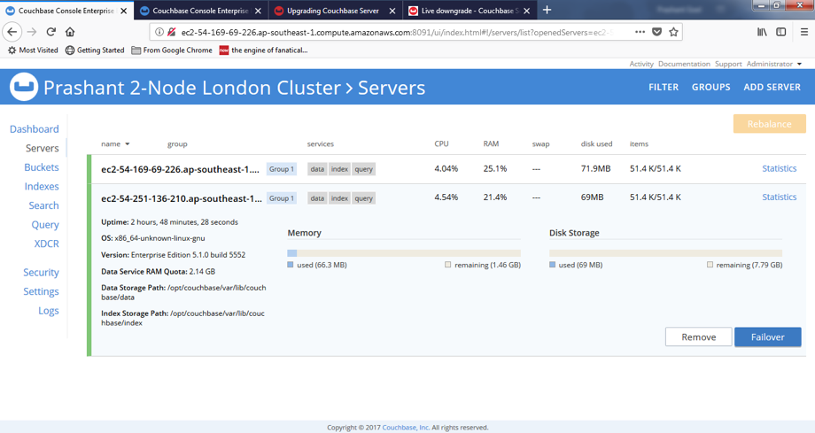

Select **Graceful Failover** and click **Failover Server** as shown in the
following image:

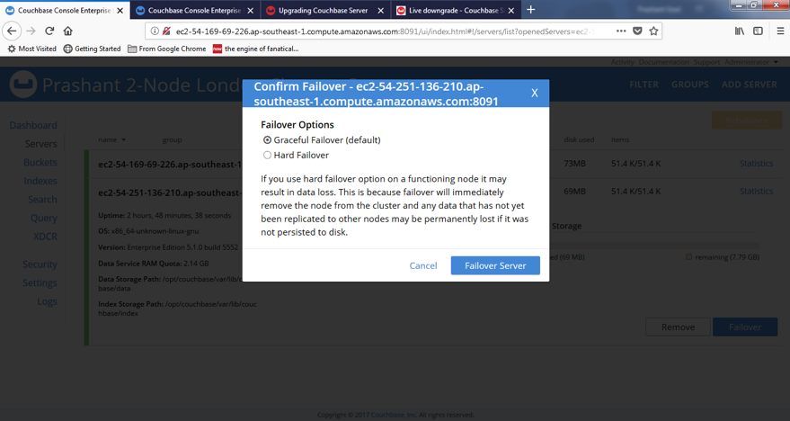

The time it takes for the graceful failover is directly proportional to the
number of *vBuckets* that are required to be activated or synced to the surviving
node. If you select **Hard Failover** instead, the vBuckets are not synced and
eventually you would need to use **Full Recovery** instead of **Delta Recovery**
after the software upgrade.

The following image shows the progress of the upgrade:

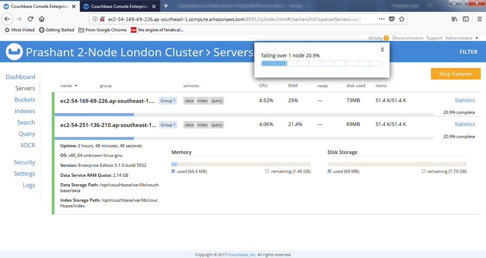

The following image shows the Couchbase Web Console after the upgrade completes:

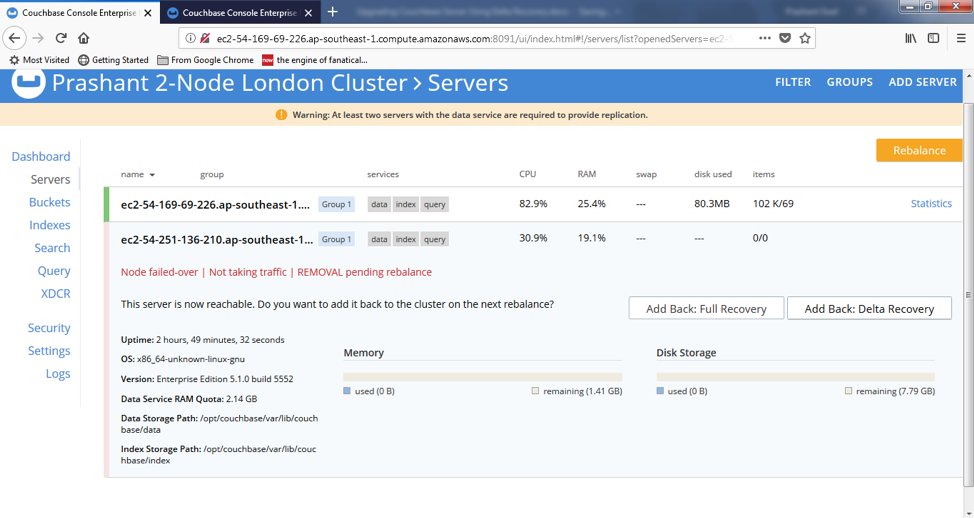

#### Step 6: Shut down Couchbase on node-2

Shut down Couchbase on `node-2` as shown in the following image:

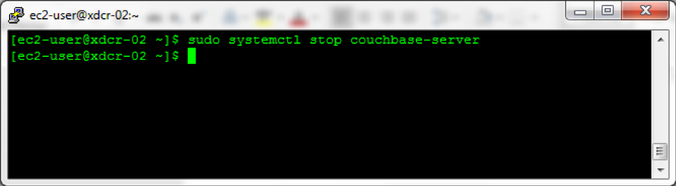

After the shutdown, the status of the node in the Couchbase Web Console changes
to **Node unresponsive** as shown in the following image:

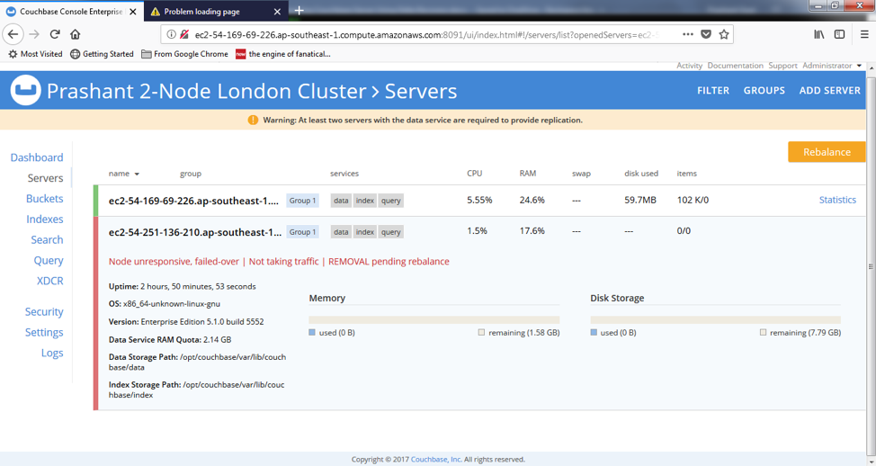

#### Step 7: Perform the upgrade

Upgrade the existing version 5.1.0 installation to 5.5.0 by applying the binary
that you downloaded in Step 1 as shown in the following image. Because this is
not a fresh installation, use the `--upgrade` option of the RPM command. If you
wanted to uninstall version 5.1.0 and then install 5.5.0 (instead of using the
`--upgrade` option), you would need to do to use **Full Recovery** instead of
**Delta Recovery** after the software upgrade.

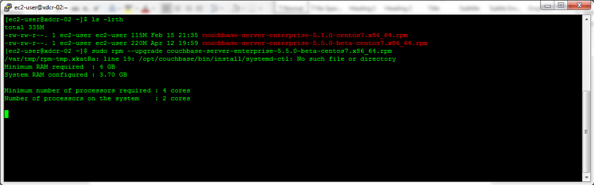

The upgrade should take only a few minutes and, after the upgrade completes, the
Couchbase Server process starts automatically as shown in the following image:

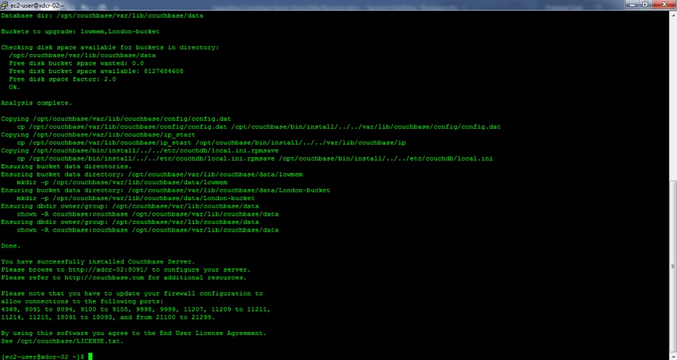

The Couchbase Web Console output now shows the upgraded version as well as the
option to add back using either **Full Recovery** or **Delta Recovery**, as
shown in the following image:

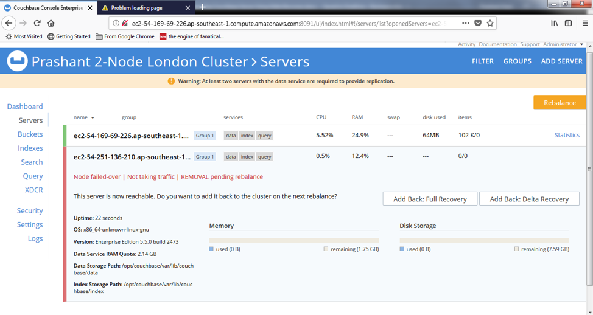

#### Step 8: Perform a Delta recovery

Click on **Add Back: Delta Recovery**.

The status changes to **DELTA RECOVERY pending rebalance** as shown in the
following image. In this step, you are just telling Couchbase which recovery
mode to use, not actually kicking off the recovery.

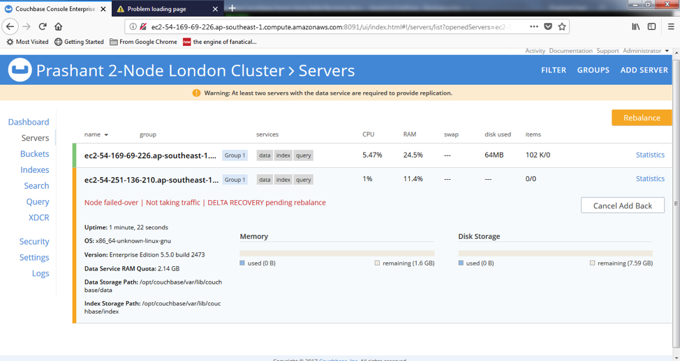

#### Step 9: Start the recovery

Click **Rebalance** to sync the upgraded node to the cluster. This should go
quickly because it's a delta recovery instead of a full recovery.

The following image shows the progress of the recovery:

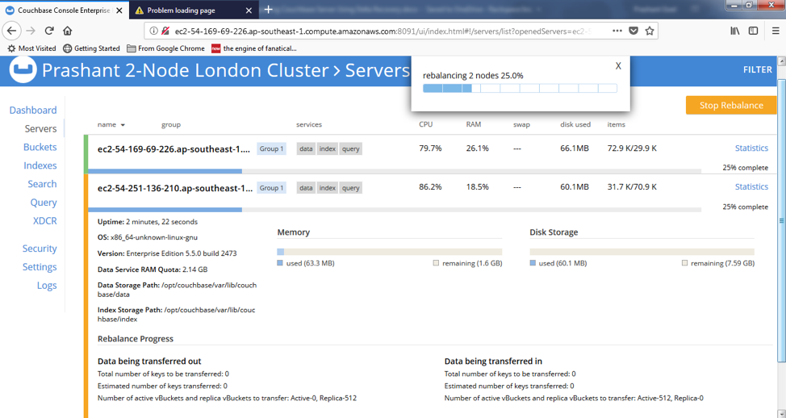

After the rebalance completes, the node turns green in the Couchbase Web Console
and is back in sync on the cluster. You can also see the version is upgraded to
5.5 as shown in the following image:

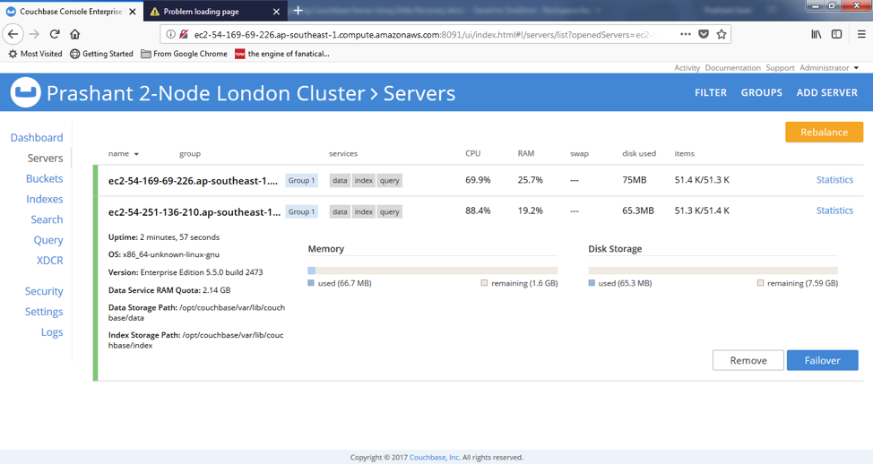

Notice in the following image that one node in the cluster is on version 5.1.0
and the other is on version 5.5.0:

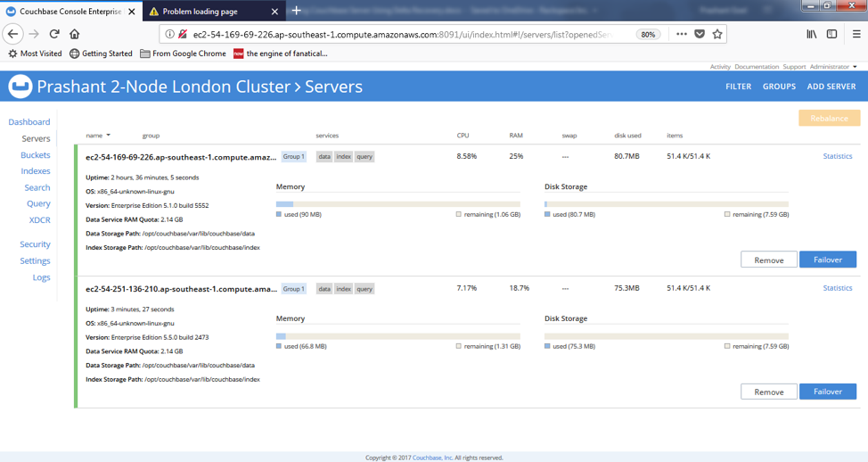

#### Step 10: Upgrade node-1

Now that you successfully upgraded `node-2`, you need to upgrade `node-1`. First,
log in to the `node-2` Couchbase Web Console as `Administrator` and repeat Steps
5 to 9 for server `node-1`.

The following image shows the Couchbase Web Console after the upgrade and
recovery of `node-1` is complete:

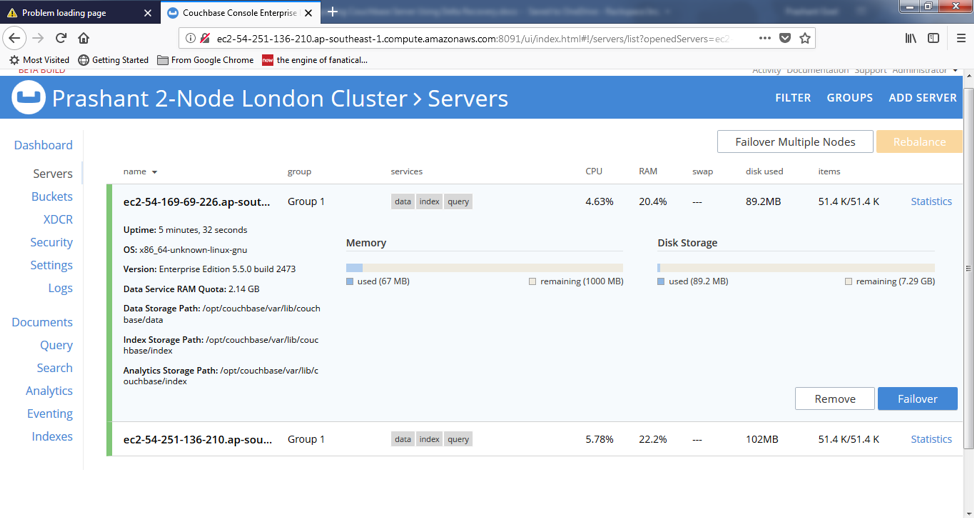

Note the following two new options on the left side menu, which are new in
Version 5.5.0.

- Analytics: Enables execution of familiar SQL queries by using N1QL for analytics.

- Eventing: Enables creation of server-side functions, which are triggered
  by using the `Event-Condition-Action` model.

### Conclusion

The graceful failover and delta recovery method is an excellent option in
Couchbase rolling upgrades. For a very large database cluster spanning across
many nodes, full recovery of each upgraded node can be a nightmare. By failing
over gracefully, Couchbase gives us the option to add back the upgraded node by
syncing only the changes that took place during the upgrade. This is
significantly less time consuming.

Also, for interactive database applications that have many Global Secondary
Indexes (GSIs), this is a favorable approach because the GSIs are preserved and
do not need to be rebuilt, which saves resources and reduces upgrade time.

To take maximum advantage of this approach, the upgrade should take place in
off-peak hours. This addresses the only shortcoming of this approach (decreased
high availability) and speeds up the upgrade because the delta changes will be
much fewer during off-peak hours.

Use the Feedback tab to make any comments or ask questions.

Learn more about our [database services](https://www.rackspace.com/dba-services).

