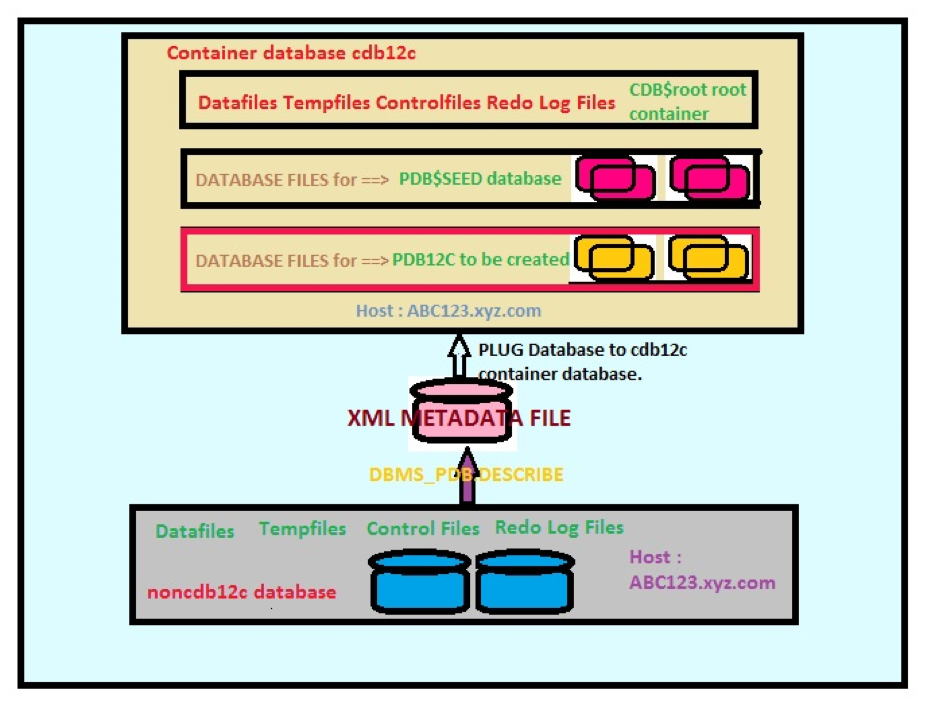

Originally published by TriCore: August 29, 2017

Oracle&reg; version 12c offers multitenant database options for host multiple
pluggable databases (PDB) with a single container database (CDB). Sometimes,
you need to convert a non-CDB database into a CDB pluggable database. This blog
describes methods that you can use to convert a non-CDB database into a CDB
database.

<!--more-->

### Test case setup

This test scenario starts with a non-CDB database instance, `noncdb12c`,
that is running on the machine `ABC123.xyz.com`. The task is to create a CDB
database, `cdb12c`, on the same machine. You need to make sure you
have enough disk space to hold the converted CDB database.

**Host server**: ABC123.xyz.com

**Non-CDB database**: noncdb12c

**Oracle version**: 12.1.0.2

The following image shows the test scenario:

### Conversion tests

Use the steps in this section to convert the non-CDB database to a CDB database.

#### Step 1: Perform a clean shutdown

Perform the following steps to cleanly shut down the non-CDB database:

- Set the environment to `noncdb12c`.
- Execute the following command:

        sqlplus / as sysdba

- Run the following code at the SQL prompt:

        shutdown immediate

#### Step 2: Open the database as read-only

After you have cleanly shutdown the database, perform the following steps to
start the database in mount exclusive mode and open the database in read-only
mode:

- Set the environment to `noncdb12c`.
- Execute the following command:

        sqlplus / as sysdba

- Run the following code at the SQL prompt:

        startup mount exclusive

        alter database open read only;

#### Step 3: Generate a PDB manifest file

Perform the following steps to generate a PDB manifest file from the non-CDB:

- Set the environment to `noncdb12c`.
- Execute the following command:

        sqlplus / as sysdba

- Run the following code at the SQL prompt:

        exec dbms_pdb.describe (pdb_descr_file=>'/tmp/noncdb12c_manifest_file.xml');

#### Step 4: Shutdown the non-CDB

Perform the following steps after Step 3 completes to shut down the non-CDB file.

- Set the environment to `noncdb12c`.
- Execute the following command:

        sqlplus / as sysdba

- Run the following code at the SQL prompt:

        shutdown immediate

#### Step 5: Start the CDB

If the CDB is not already running, perform the following steps to start it and
to check compatibility:

- Set the environment to `cdb12c`.
- Execute the following command:

        sqlplus / as sysdba

- Run the following code at the SQL prompt:

        startup
        SET SERVEROUTPUT ON;
	     DECLARE
	     Compatible CONSTANT VARCHAR2(3) :=CASE  DBMS_PDB.CHECK_PLUG_COMPATIBILITY
	     (pdb_descr_file => '/tmp/noncdb12c_manifest_file.xml')
	     WHEN TRUE THEN 'YES'
	     ELSE 'NO'
	     END;
	     BEGIN
	        DBMS_OUTPUT.PUT_LINE(compatible);
	     END;
	     /

#### Step 6: Check for errors

After the CDB database startup completes, perform the following steps to check
for errors in the `PDB_PLUG_IN_VIOLATIONS` view:

- Set the environment to `cdb12c`.
- Execute the following command:

        sqlplus / as sysdba

- Run the following code at the SQL prompt:

        startup
        SELECT name, cause, type, message, status FROM PDB_PLUG_IN_VIOLATIONS
        WHERE name='NONCDB12C';

**Note**: If there are any errors, fix them before proceeding.

#### Step 7: Connect to the CDB and plug into the PDB

Perform the following steps to connect to the CDB and plug into the PDDB12C
database by using the non-CDB manifest file:

- Set the environment to `cdb12c`.
- Execute the following command:

        sqlplus / as sysdba

- Run the following code at the SQL prompt:

        CREATE PLUGGABLE DATABASE pdb12c USING '/tmp/noncdb12c_manifest_file.xml'
 	     COPY
 	     FILE_NAME_CONVERT = ('<Datafile_Location_for_noncdb>', 'Datafile_Location_for_pdb');

**Note**: The following options are supported, and you can choose one based on
your environment:

- **COPY**: The datafiles of the `noncdb` remain intact, and the `noncdb` is copied
to create a PDB at the new location and keep the original datafiles intact at
the original location. This means that a noncdb database is still operational
after the creation of the PDB.
- **MOVE**: The datafiles of the `noncdb` are moved to a new location to create
a PDB. In this case, the `noncdb` database is not available after the PDB is created.
- **NOCOPY**: The datafiles of the `noncdb` are used to create a PDB2, and it uses
the same location as the `noncdb`. In this case, the `noncdb` database is not
available after the PDB is created.

You can use the `FILE_NAME_CONVERT` parameter to specify the new location of the
datafiles while using either the **COPY** or **MOVE** option.

#### Step 8: Run the conversion script

After step 7 completes successfully, perform the following steps to switch to
the PDB container and run the conversion script,
`$ORACLE_HOME/rdbms/admin/noncdb_to_pdb.sql`:

- Set the environment to `cdb12c`.
- Execute the following command:

        sqlplus / as sysdba

- Run the following code at the SQL prompt:

        alter session set container=pdb12c
        @$ORACLE_HOME/rdbms/admin/noncdb_to_pdb.sql

#### Step 9: Start the PDB and verify the mode

Perform the following steps to start the PDB and verify that the mode is **open**:

- Set the environment to `cdb12c`.
- Execute the following command:

        sqlplus / as sysdba

- Run the following code at the SQL prompt:

        alter pluggable database open;
        SELECT name, open_mode FROM v$pdbs;

### Conclusion

When you convert a non-CDB database to a CDB pluggable database, you can choose
from several options depending upon the size of the database.

If the database is very large, you might use the **NOCOPY** option. This
minimizes the amount of extra space needed and reduces the time it takes to
perform the conversion operation. The **NOCOPY** option is risky, however, because
you don't keep the original database files intact. Thus, if you need to restore
the database to the previous state, you must restore the database using the
backups taken before the conversion activity.

If database size is smaller, you should use the **COPY** option so that, if
there are any issues, the fallback to the old non-CDB is straightforward
because the original files are always intact.

Use the Feedback tab to make any comments or ask questions.

Learn more about [Rackspace application services](https://www.rackspace.com/application-management).

