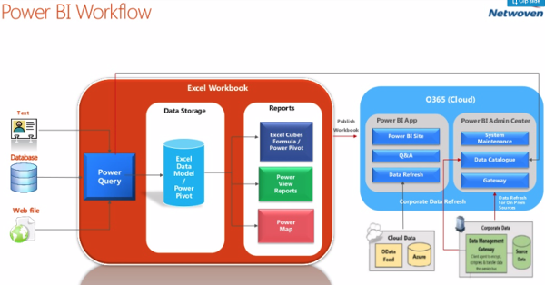

Originally published by TriCore: November 7, 2017

Microsoft&reg; introduced the idea of self-service business intelligence (BI)
back in 2009, announcing Power Pivot for Microsoft Excel&reg; 2010.
After several years, Microsoft released version 1 of [Power
BI&reg;](https://powerbi.microsoft.com/en-us/), but the user experience wasn't
great. Microsoft collected feedback from end users and crafted a
newer version of Power BI that became popular. This blog provides an
introduction to this tool.

<!--more-->

Microsoft Power BI is more than a business analytics tool. It's an ecosystem
that can integrate existing corporate BI with self-service and analyze data
by using key components like Power Excel, Power Query, Power View, and other
tools.

The following image shows the Power BI workflow:

Source: [Microsoft Power BI
Overview](https://www.slideshare.net/Netwoven/power-bi-overview-41399411).

### Differences between Power BI and SQL Server Reporting Services

The following table describes the differences between Power BI and Microsoft
SQL Server&reg; Reporting Services (SSRS):

| **Power BI** | &nbsp; | **SSRS** |
|---|---|--- |
| A cloud-based business analytics tool that performs data acquisition and transformation, data modeling, and visualization with greater speed, efficiency, and understanding. | &nbsp; &nbsp; &nbsp; &nbsp; | An enterprise visualization tool built on old technology that requires another system to deliver data. 	|
| &nbsp;|  &nbsp;| &nbsp; |
| Most enterprise clients are adopting visualization tools that are more adaptive and responsive. Users want advanced tools that look modern and can cross-filter when they click on charts. | &nbsp; &nbsp; &nbsp; &nbsp; | SSRS has a static design. There's also a learning curve for developing reports. 	|
| &nbsp;|  &nbsp;| &nbsp; |
| Power BI is available for free and requires minimal training. Users create their own reports by dragging and dropping fields. Power BI also offers modern rendering. | &nbsp; &nbsp; &nbsp; &nbsp; 	| A SQL server license is required. You must also define the scope for your requirements, have a developer work on those requirements, consider how to deploy the software, and schedule data refreshes. Reports are static. In addition, you're dependent on a BI developer to make changes. 	|

 

### Power BI features

Power BI has the following features:

- **Search with natural language queries or the Q&A question box**: Users can
  easily query data by entering natural language terms. There's no special
  code or syntax.

- **Quick Insights**: This feature enables Power BI to search data sets by
  using sophisticated algorithms. It outputs a list of charts that help
  users better understand the data.

- **APIs**: By using the Microsoft Power BI REST API, you can programmatically
  access Power BI resources such as data sets, tables, and rows.

- **Power BI Embedded**: This Microsoft Azure&reg; service enables you to add
  interactive Power BI reports to your own web and mobile applications.

- **Visual Interactions**: You can precisely configure the following types of
  visual interactions:

  - **Filtering interaction**: When you use filtering interaction, the chart
    that you select applies the same filter to the destination chart.

  - **Pie chart**: This is the default filtering behavior.

  - **No filtering interaction**: No filters are applied.

- **Query Editor**: The Query Editor uses Power BI Desktop's query language.

### Content packs

Content packs provide access to the data that your web services generate.
They're designed to enable you to deploy and share predefined models and
reports within your company. While any user may share a dashboard, the power
and flexibility of content packs are only available to pro-level users.

There are two types of content packs: organizational content packs and
service content packs.

#### Organizational content packs

Organizational content packs make it easy to distribute reports to your team
by enabling you to package your dashboards, reports, Excel workbooks, and
data sets and publish them together. Power BI stores the content packs that you
create in the _pack library_, where they're easily accessible to your teams.
Content pack visibility is restricted to users within your organization.
The user who created the content pack has administrative rights to modify,
refresh, and delete the workbook and data set.

#### Service content packs

Service content packs can connect to a number of external services such as
Google&reg; Analytics&trade;, Salesforce&reg;, and Microsoft Dynamics&reg;.
Power BI creates a dashboard and a set of reports that automatically display
your data from these services and provide visual insights into your business.

### Dashboard sharing and groups

The dashboard is a container for visualizations that Power BI generates from
your data sets. You can share your dashboards with the following users:

- Other users in your organization (either by email or by sharing a link to
  the dashboard).
- Users who are associated with a domain other than that of your organization
  (by email only).

### Create an app workspace in Power BI

Alternatively, you can create an app that enables you to automatically share
all of your dashboards with your users, as well as assign editing rights to
certain users within that group.

### App workspaces compared with organization content packs

In the group or app workspace, a single copy of a report and dashboard is
shared. This copy is not visible to external users.

You can think of an app workspace as a simplified evolution of the content
pack. App workspaces are easier to understand and maintain in the long run
because an app that you create has a one-to-one relationship with its
workspace.

#### Share results with users outside of the group

If you want to share results with users outside of the group, using the
content pack for an organization is a good solution. Users receive copies of
these objects, and the copies are automatically synchronized if a new version
of the same content pack is published. If a user customizes a copy of an
object, it only works on their own copy of the reports. The copy is no longer
synchronized with the original one.

### Security and roles

In Power BI, you can use row-level security (RLS) and filters to restrict data
access for specific users. You can define these filters within roles.
You can configure RLS for data models on data sets that use DirectQuery,
such as SQL Server.

Only the owners of the data set see the security option. If the data set is in
a group, only administrators of the group see the security option.

### Connect to a database

You can load data into Power BI from a variety of sources, including the
tools described in this section.

#### Import

Import is useful when you don't need to continually refresh your data. When
you choose Import, Power BI Desktop connects to the database, loads the
information, and stores it within its internal data model. You can then work
on your data in Power BI Desktop without a connection to the database. A
connection is only required when you want to refresh the data.

#### DirectQuery

Using DirectQuery is the most convenient way to load or update data
frequently. With DirectQuery, Power BI Desktop doesn't load the data into its
internal database. Instead, it queries the original database each time it
needs to draw a chart. Therefore, the connection between Power BI Desktop and
the database is permanent. However, using DirectQuery has the following
limitations:

- All tables must come from a single database.
- There is a limit of one million rows for returning data.

### One gateway for all of your cloud services

After you publish the Power BI Desktop file to the Power BI service, the
refresh operation requires either a Personal Gateway or an Enterprise Gateway.

The gateway acts as a bridge between the cloud server and the on-premises
server. Data transfer between the cloud and the gateway is secured
through Azure Service Bus. The Service Bus creates a secure channel between
the cloud server and the on-premises server through an outbound connection on
the gateway. There are no inbound connections that you need to open on an
on-premises firewall. The closer the gateway is to the server, the faster the
connection. If possible, it's best to put the gateway on the same server as
the data source. This setup helps avoid network latency between the gateway
and the server.

### Conclusion

In summary, Power BI is a suite of business analytics tools for analyzing data
and revealing useful insights. Power BI dashboards give you a 360-degree view
of your most important metrics in a central place. These metrics are available
on all of your devices and updated in real time. With a single click, you can
explore your dashboard data to make timely and important business decisions.

<a class="cta purple" id="cta" href="https://www.rackspace.com/application-management/professional-services">Learn more about Rackspace Application Services</a>

Visit [www.rackspace.com](https://www.rackspace.com) and click **Sales Chat**
to get started.

Use the Feedback tab to make any comments or ask questions.
