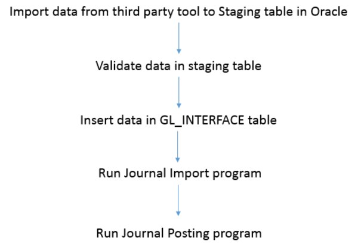

Originally published by TriCore: October 6, 2017

This blog covers the basic requirements to import journal entries from any
third-party tool into Oracle&reg;
E-Business Suite (EBS) General Ledger (GL).
After you import journals into the system, you need to post them.

<!--more-->

This example uses the table `GL_INTERFACE` as the open interface. You use
standard programs to import and post the journals corresponding to entries
made in the `GL_INTERFACE` table.

In this example, you'll complete the steps that appear in the following image:

**Image source**: Author.

### 1. Import data from the third-party tool to the staging table in Oracle.

You can insert data from the third-party tool into a staging table in several
ways, such as by using direct table entries or SQL*Loader. Use the method that
works best for your situation.

### 2. Validate the data in the staging table.

In addition to validating your custom data, you should ensure
that the following conditions are met:

- The accounting period is valid and open.
- The accounting date or GL date falls within an open or future period.
- A set of books and a chart of accounts are configured.
- A valid code combination is available to use.

### 3. Insert data in the GL_INTERFACE table.

The base table that's available for entries is `GL_INTERFACE`. The data in
this table must have the format that this section describes. The import
program uses this format to make records in the GL system.

The following columns are required:

- `STATUS`
- `LEDGER_ID`
- `USER_JE_SOURCE_NAME`
- `USER_JE_CATEGORY_NAME`
- `ACCOUNTING_DATE`
- `CURRENCY_CODE`
- `DATE_CREATED`
- `CREATED_BY`
- `ACTUAL_FLAG`
- `ENCUMBRANCE_TYPE_ID`: Only when `ACTUAL_FLAG=’E`
- `BUDGET_VERSION_ID`: Only when `ACTUAL_FLAG=’B’`
- `PERIOD_NAME`: Only when `ACTUAL_FLAG=’B’`
- `ENTERED_DR`
- `ENTERED_CR`

Don't populate the following columns. The system uses these columns while it's
processing the import:

- `REFERENCE3`
- `REFERENCE11-REFERENCE20`
- `TRANSACTION_DATE`
- `JE_BATCH_ID`
- `JE_HEADER_ID`
- `JE_LINE_NUM`
- `CHART_OF_ACCOUNTS_ID`
- `FUNCTIONAL_CURRENCY_CODE`
- `DATE_CREATED_IN_GL`
- `WARNING_CODE`
- `STATUS_DESCRIPTION`
- `DESC_FLEX_ERROR_MESSAGE`
- `REQUEST_ID`
- `SUBLEDGER_DOC_SEQUENCE_ID`
- `SUBLEDGER_DOC_SEQUENCE_VALUE`
- `GL_SL_LINK_ID`
- `GL_SL_LINK_TABLE`
- `BALANCING_SEGMENT_VALUE`
- `MANAGEMENT_SEGMENT_VALUE`
- `FUNDS_RESERVED_FLAG`

`GROUP_ID` is the key column. When you move records from staging to journals,
`GROUP_ID` establishes the link between them. You use this column to identify
your journal entries in GL after the import and post processes are complete.

The following code sample shows a generic approach to implementing the
solution:

    FUNCTION INSERT_INTERFACE_DATA RETURN CHAR
    IS

    CURSOR CUR_DATA
    IS
       Write cursor on staging table

    BEGIN

       FOR REC_DATA IN CUR_DATA
       LOOP
             IF NVL(REC_DATA.amount, NULL) IS NOT NULL
          THEN
             lv_segment1 := NULL;
             lv_segment2 := NULL;
             lv_segment3 := NULL;
             lv_segment4 := NULL;
             lv_segment6 := NULL;
             lv_segment7 := NULL;

             SELECT gcc.segment1 seg1, gcc.segment2 seg2,
                    gcc.segment3 seg3,
                    gcc.segment4 seg4,
                    gcc.segment6 seg6,
                    gcc.segment7 seg7
               INTO lv_segment1,
                    lv_segment2,
                    lv_segment3,
                    lv_segment4,
                    lv_segment6,
                    lv_segment7
               FROM apps.mtl_parameters mp,
                    apps.gl_code_combinations gcc
              WHERE mp.organization_code = REC_DATA.ship_FROM
                AND mp.material_account = gcc.code_combination_id;

          END IF;

          IF (    (lv_segment1 IS NOT NULL)
              AND (lv_segment2 IS NOT NULL)
              AND (lv_segment3 IS NOT NULL)
              AND (lv_segment4 IS NOT NULL)
              AND (lv_segment5 IS NOT NULL)
              AND (lv_segment7 IS NOT NULL)
             )
          THEN
                  lv_vendor := REC_DATA.VENDOR_CODE;
                  ln_amount := REC_DATA.amount;
                  ld_ship_date := REC_DATA.ship_date;
                  BEGIN

                          INSERT INTO gl.gl_interface
                          (
                          status,
                          ledger_id,
                          set_of_books_id,
                          accounting_date,
                          currency_code,
                          date_created,
                          created_by,
                          actual_flag,
                          user_je_category_name,
                          user_je_source_name,
                          segment1,
                          segment2,
                          segment3,
                          segment4,
                          segment5,
                          segment6,
                          segment7,
                          entered_dr,
                          entered_cr,
                          date_created_In_gl,
                          Reference10,
                          group_id
                          )
                          VALUES
                          (
                          'NEW',
                          2021,
                          -1,
                          REC_DATA.ship_date,
                          'USD',
                          REC_DATA.ship_date,
                          fnd_global.user_id,
                          'A',
                          'AutoFreight',
                          'Freight',
                          lv_segment1,
                          '0000',                       --l_segment2,
                          lv_segment3,
                          lv_segment4,
                          lv_frt_accrual,                --l_segment5,
                          '0',         --l_segment6,
                          lv_segment7,
                          NULL,
                          REC_DATA.amount,
                          TRUNC(SYSDATE),
                          lv_reference10,
                          ln_group_id
                          );

                          INSERT INTO gl.gl_interface
                          (
                          status,
                          ledger_id,
                          set_of_books_id,
                          accounting_date,
                          currency_code,
                          date_created,
                          created_by,
                          actual_flag,
                          user_je_category_name,
                          user_je_source_name,
                          segment1,
                          segment2,
                          segment3,
                          segment4,
                          segment5,
                          segment6,
                          segment7,
                          entered_dr,
                          entered_cr,
                          date_created_In_gl,
                          Reference10,
                          group_id
                          )
                          VALUES
                          (
                          'NEW',
                          2021,
                          -1,
                          REC_DATA.ship_date,
                          'USD',
                          REC_DATA.ship_date,
                          fnd_global.user_id,
                          'A',
                          'AutoFreight',
                          'Freight',
                          lv_segment1,
                          lv_segment2,
                          lv_segment3,
                          lv_segment4,
                          lv_segment5,
                          '0',
                          lv_segment7,
                          REC_DATA.amount,
                          NULL,
                          TRUNC(SYSDATE),
                          lv_reference10,
                          ln_group_id
                          );

                  EXCEPTION
                  WHEN OTHERS THEN
                       PRINT('Line could not insert in GL Interface: BOL-CARRIER-EQUIPMENT-ORDER TYPE:'||lv_Reference10,'logerrr');
                  END;

             END IF;

       ELSE
             PRINT('Amount 0 so line did not insert in GL Interface: BOL-CARRIER-EQUIPMENT-ORDER TYPE:'||REC_DATA.bol_no
                                                                                                       || ' - '
                                                                                                       || REC_DATA.CARRIER_CODE
                                                                                                       || ' - '
                                                                                                       || REC_DATA.equipment_no
                                                                                                       || ' - '
                                                                                                       || REC_DATA.ORDER_TYPE,'logerrr');

       END IF;

       END LOOP;

       COMMIT;

       SELECT SUM(entered_dr), SUM(entered_cr)
         INTO ln_entered_dr, ln_entered_cr
         FROM gl.gl_interface
        WHERE GROUP_ID = ln_group_id;

       if ln_entered_dr != ln_entered_cr
       then
            PRINT('Debit and Credit amount do not match in GL Interface for Group ID:'||ln_group_id,'logerr');
            PRINT('Debit amount:'||nvl(ln_entered_dr,0),'logout');
            PRINT('Credit amount:'||nvl(ln_entered_cr,0),'logout');

            DELETE FROM gl.gl_interface
             WHERE GROUP_ID = ln_group_id;

            COMMIT;

                               UPDATE_RECORDS('PROCESS_FLAG',
                      'Error',
                                              'ALL',
                                              'Debit and Credit amount do not match in GL Interface for Group ID:'||ln_group_id);

            fnd_file.put_line (fnd_file.OUTPUT,'All lines removed FROM GL Interface for Group ID:'||ln_group_id);

            RETURN 'N';
       else
            fnd_file.put_line (fnd_file.OUTPUT,'Debit amount:'||nvl(ln_entered_dr,0));
            fnd_file.put_line (fnd_file.OUTPUT,'Credit amount:'||nvl(ln_entered_cr,0));

            RETURN 'Y';
       end if;

       RETURN 'Y';

    EXCEPTION
    WHEN OTHERS
    THEN
         PRINT('ERROR: in function INSERT_INTERFACE_DATA:'||sqlerrm,'logerrr');
    END INSERT_INTERFACE_DATA;

### 4. Run the Journal Import program.

The Journal Import program receives data from `GL_INTERFACE`, validates it,
and then converts it to journal entries that are compatible with the GL system.

This program uses the following base tables:

- `GL_JE_HEADERS`
- `GL_JE_LINES`
- `GL_JE_BATCHES`

After the Journal Import program finishes importing and converting the data,
it can create one or more GL batches for the same `GROUP_ID`. This
functionality is the main reason why you use `GROUP_ID` to identify the
records and batches for your data.

This process requires you to configure an `ACCESS SET` in the system for each
ledger in operation, as well as a source for each custom source.

The following code shows how to perform this task:

    --Access Set
    BEGIN
             SELECT access_set_id
               INTO ln_access_set_id
               FROM (SELECT gas.access_set_id
                       FROM gl_access_sets gas, gl_ledgers gl
                      WHERE gas.default_ledger_id = gl.ledger_id
                        AND gl.ledger_id = 2021
                   ORDER BY gas.access_set_id)
              WHERE ROWNUM = 1;
    EXCEPTION
    WHEN OTHERS
    THEN
         ln_access_set_id := fnd_profile.VALUE ('GL_ACCESS_SET_ID');
    END;

    --Source
    SELECT JE_SOURCE_NAME
            INTO lv_source
            FROM gl_je_sources
           WHERE USER_JE_SOURCE_NAME = ‘XXX Source’

Use the following code to submit your program:

    fnd_request.submit_request ('SQLGL',
                                'GLLEZLSRS', -- Short Name of program
                                NULL,
                                NULL,
                                FALSE,
                                ln_access_set_id, --Data Access Set ID
                                lv_source,      --Source 'Freight'
                                2021,           --Ledger
                                g_group_id,     --Group ID
                                 'N',         --Post Errors to Suspense
                                 'N',         --Create Summary Journals
                                 'O'          --Import DFF
                                 );

You can check for batches that the Import Program created for your data set by
running the following query:

    SELECT DISTINCT JE_BATCH_ID , NAME
      FROM GL_JE_BATCHES
     WHERE GROUP_ID = g_group_id

After you've verified all of the entries, you can post the journals. Use the
**Journal Import Execution Report** to check for any errors corresponding to
the Request ID of the program and the Group ID.

### 5. Run the Journal Post program.

Posting the journal updates the balance in the corresponding details and summary accounts.

To complete this process you must configure an Auto Posting Set for each source in the system. An Auto Posting Set contains a set of criteria for automatically posting journal batches.

The following code shows an example Auto Posting Set:

    SELECT AUTOPOST_SET_ID
       INTO ln_autopost_set_id
       FROM GL_AUTOMATIC_POSTING_SETS_V
      WHERE AUTOPOST_SET_NAME = 'XXX_SET'
        AND ENABLED_FLAG = 'Y';

Use the following code to submit your automatic posting program:

    fnd_request.submit_request('SQLGL',
                               'GLPAUTOP', '', '',
                               FALSE,
                               ln_access_set_id,
                               ln_autopost_set_id,
                               '',
                               chr(0),
                                        '','','','','','','','','','','','','','','','','','','','',
                                        '','','','','','','','','','','','','','','','','','','','',
                                        '','','','','','','','','','','','','','','','','','','','',
                                        '','','','','','','','','','','','','','','','','','','','',
                                        '','','','','','','','','','','','','','','');

This program submits another program that only handles posting the batches.

You can track errors and unprocessed batches by checking the details of the
Posting Execution Report or running the following query:

    SELECT count(*)
     FROM GL_JE_BATCHES
             WHERE GROUP_ID = g_group_id
      AND STATUS != 'P';

### Conclusion

Companies use a wide range of legacy systems to manage different business
functions. EBS GL is one of the crucial modules. Companies often have a
requirement to import data from legacy systems into GL. This blog helps
you get started with an automated, flexible, and easy-to-manage solution.

Use the Feedback tab to make any comments or ask questions.

Learn more about [Rackspace application services](https://www.rackspace.com/application-management).
