This post discusses the Oracle&reg; Real Application Clusters (RAC) One Node
feature in the Database Enterprise Edition, which was introduced with the 11g
Release 2, provides enhanced high availability for single instance Oracle
Databases, protecting them from both planned and unplanned downtime. The post
also provides instructions for installing the Oracle Grid infrastructure, which
is required to use One Node.

<!--more-->

### Introduction

The One Node feature is a single instance of Oracle RAC running on one node of
the cluster while the second node is in a cold standby mode. One Node allows
customers to standardize their database deployment and management, consolidate
database storage, and upgrade to a full multi-node Oracle RAC database without
downtime or disruption.

With RAC, you can achieve continuous availability. There is little or no
latency because transparent application failover (TAF), which is a failover
routing mechanism, redirects transactions to a surviving server when a server
crashes or a node becomes unavailable.

This is special because TAF performs quick clone of the instance to a new node.

    "If the node fails, Oracle Clusterware will automatically restart the Oracle
    RAC One Node instance on another server in the cluster."

TAF automates the instance relocation without any downtime and does not require
manual intervention, which is a significant benefit. It uses *Omotion*, which
facilitates instance migration or relocation.

### RAC One Node versus RAC

Traditionally, RAC is used in a multi-node architecture, with many separate
instances residing on separate servers. RAC One Node is a multiple-instance of
RAC running on a single node in a cluster and has a fast *instance relocation*
feature in the event of a catastrophic or instant server failure.

RAC works as a live-live solution. The nodes in the cluster are all active and
can accept connections and workloads and can work together as a single unit.

RAC One Node, as the name suggests as well, works as a live-standby solution,
where only one node is active and the other nodes are available to accept the
workload in case the active node goes down (planned or unplanned).

### Benefits of RAC One Node

The following list shows some benefits of the RAC One Node architecture:

- Sessions can be migrated from the active node while staying online.
- The online upgrade to RAC from RAC One Node (and vice-versa) is easy.
- Exadata is supported.
- Supported by using Oracle Virtualization Manager (OVM).
- Rolling Patches to RAC provide the same interface as RAC One Node.
- A One Node database using DBCA (from 11.2.0.2) can be created easily.
- One Node is supported on the same platforms as RAC.
- The cluster failover mechanism ensures high availability.

### Prerequisites for Installation (on Red Hat Enterprise Linux Server 6)

Before you install One Node, ensure that you perform the following tasks:

- As the `root` user, create the users and operating system (OS) groups that
  will own the Oracle software.

- Ensure that the date and time settings on all the nodes are set as closely as
  possible to the same date and time. You can use `ntpd` with the -x option or
  the Oracle Cluster Time Synchronization Service (CTSSD) to synchronize the
  time. Instructions on configuring `ntpd` with the -x option can be found in
  [My Oracle Support ExtNote:551704.1](https://support.oracle.com/knowledge/Oracle%20Cloud/551704_1.html).

- Configure Secure Shell (SSH) on each node in the cluster and ensure that you
  have the following rpms installed:

        binutils-2.20.51.0.2-5.11.el6.i686
        compat-libcap1-1.10-1.i686
        compat-libstdc++-33-3.2.3-69.el6.i686
        gcc-4.4.4-13.el6.i686
        gcc-c++-4.4.4-13.el6.i686
        glibc-2.12-1.7.el6.i686
        glibc-devel-2.12-1.7.el6.i686
        Ksh
        libgcc-4.4.4-13.el6.i686
        libstdc++-4.4.4-13.el6.i686
        libstdc++-devel-4.4.4-13.el6.i686
        libaio-0.3.107-10.el6.i686
        libaio-devel-0.3.107-10.el6.i686
        make-3.81-19.el6.i686
        sysstat-9.0.4-11.el6.i686

- Check the ASM libraries. Ensure that you have the following Oracle ASMLib
  downloads for Red Hat Enterprise Linux Server 6:

        oracleasm-support-2.1.8-1.el6.x86_64.rpm
        oracleasmlib-2.0.4-1.el6.x86_64.rpm

- Download the Grid and RDBMS installation software from the
  [Oracle Downloads website](https://www.oracle.com/technetwork/database/enterprise-edition/downloads/index.html).
  Choose the download binary depending on the platform on which you plan to install the software.

- Create a directory for the Oracle Grid CRS Home on both nodes.  By default, Grid is installed in `/u02/app`.

         [grid@BOSODBD01 grid]$ cd /u02/app
         [grid@BOSODBD01 app]$ ls -lrt

         total 12
         drwxr-xr-x. 3 root oinstall 4096 Sep 28 00:31 grid
         drwxrwxr-x. 9 grid oinstall 4096 Sep 30 22:48 oracle
         drwxrwx---. 6 grid oinstall 4096 Oct  7 21:11 oraInventory

         [grid@BOSODBD01 grid]$ ls -lrt

         total 4
         drwxr-xr-x. 68 root oinstall 4096 Sep 28 00:36 11.2.0.4

### Install Grid

Perform the following steps to install Grid:

#### Step 1: Initiate installation

Open a Virtual Network computing (VNC) connection and, as a Grid user, change
directories (`cd`) into the folder where you staged the Grid infrastructure
installation zip file, unzip the file, and run `./runInstaller`.

Click **Skip software updates** on the first installation window, then click
**Next**.  Select options as shown in the following image:

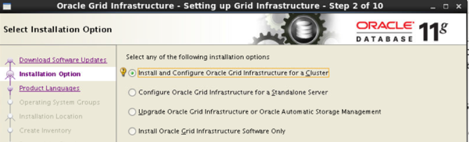

Then, click **Advanced Installation** in the next window.

#### Step 2: Enter node information

Enter the cluster and SCAN name and ensure that they show the correct default
nodes on the cluster node information screens as shown in the following images:

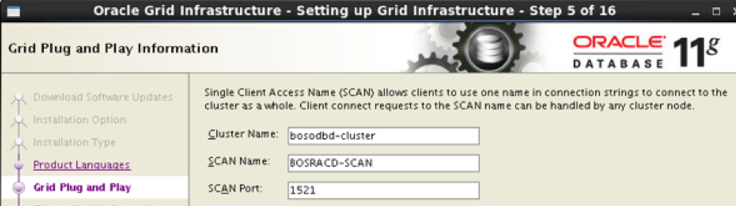

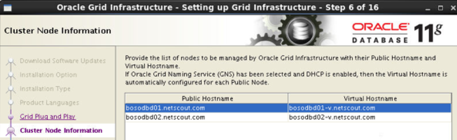

#### Step 3: Configure and test SSH connectivity

Click **SSH Connectivity** to configure and test the password-less SSH
connectivity by typing in the OS password for the user `grid` and select **Setup**
as shown in the following images:

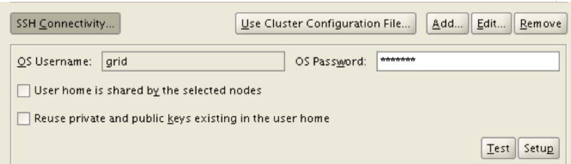

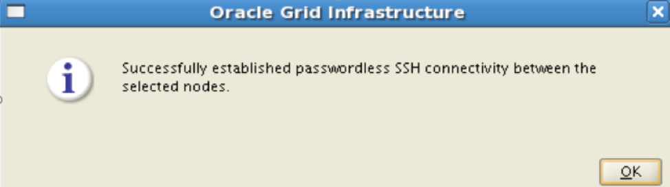

#### Step 4: Select the network

Choose the **Network Interface Name** and **Type** according to the subnet as
shown in the following image. Associate one subnet with one interface only.

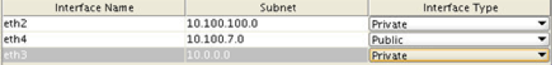

Select **Oracle ASM** as the storage option and specify directories for the data
storage as shown in the following image:

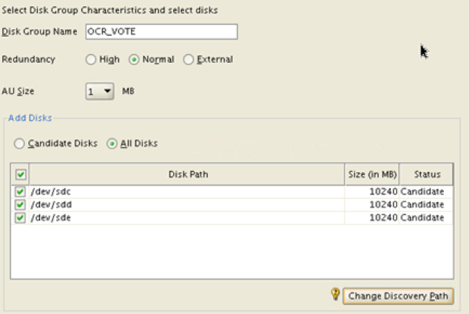

#### Step 5: Select the group

Be very careful while selecting the group, as shown in the following image:

#### Step 6: Specify Grid directories

Specify the Oracle Grid infrastructure for cluster home base,the software
directory for its HOME directory, and an inventory directory as shown in the
following images:

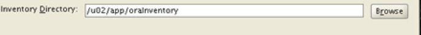

#### Step 7: Complete installation

After the setup checks are finished, check **Ignore All** and click **Next** to
run the installation as shown in the following image:

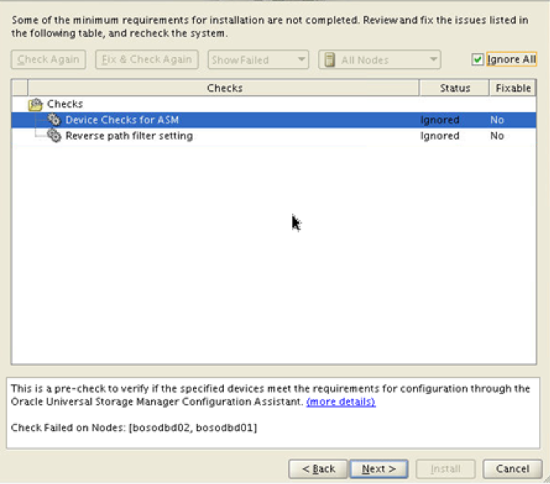

After the installation completes, do not forget to run the `root.sh` file as
shown in the following image:

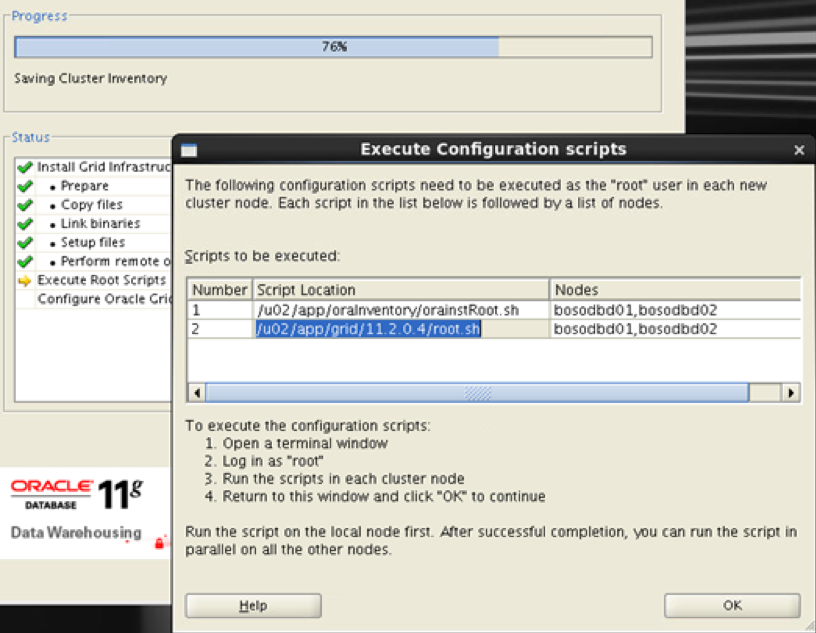

#### Step 8: Post-installation checks

Perform the following tasks to verify the installation:

-	Run the following commands to check the Grid installation as the `root` user:

        ./crs_stat –t
        ./crsctl check cluster –all

- Run the following command to check the Grid installation as the `grid` user:

        crsctl query css votedisk

-	Run the following command to create a diskgroup in $GRID_HOME/bin:

        asmca

### Install the database

Perform the following steps to install the database:

#### Step 1: Install RDBMS

As the Oracle user (RDBMS software owner), start the installer by running
the following commands:

    # su – oracle
    # cd directory-where-you-staged-the-RDBMS-installation-software
    # ./runInstaller

**NOTE:** Ensure that the installer is run as the intended software owner user
because the only supported method to change the software owner is to reinstall
the database.

#### Step 2: Choose Grid options

After following the  database installation steps, when prompted for Grid
Installation Options, select them as shown in the following image:

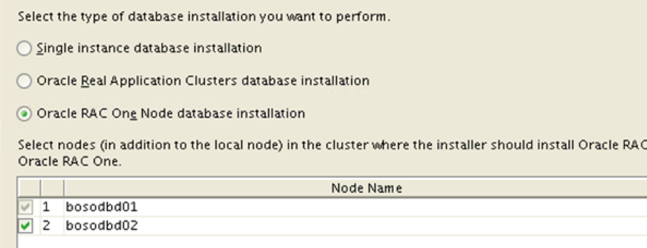

#### Step 3: Choose database configuration options

When prompted for the type of database configuration options and details, select
them as shown in the following images and ensure that you select **Oracle
Automatic Storage Method**, when asked for database storage:

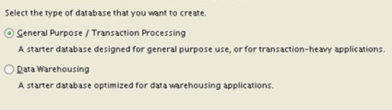

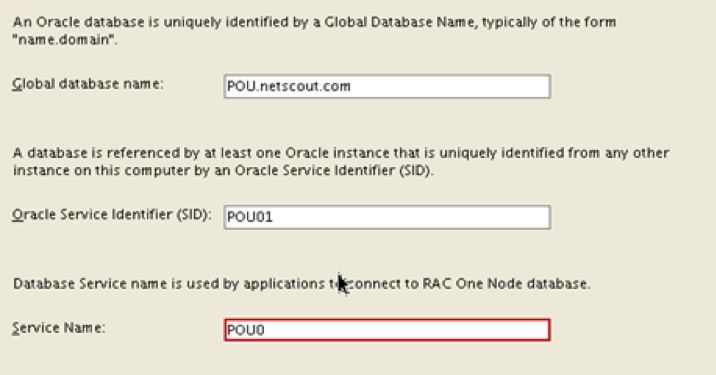

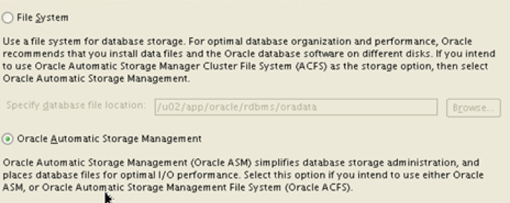

#### Step 4: Select Disk Group

The Disk Group is created after the Grid installation. Select it as shown in the
following image:

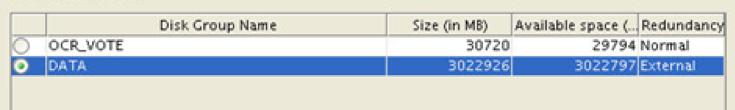

Ignore any errors by checking **Ignore All** as shown in the following image:

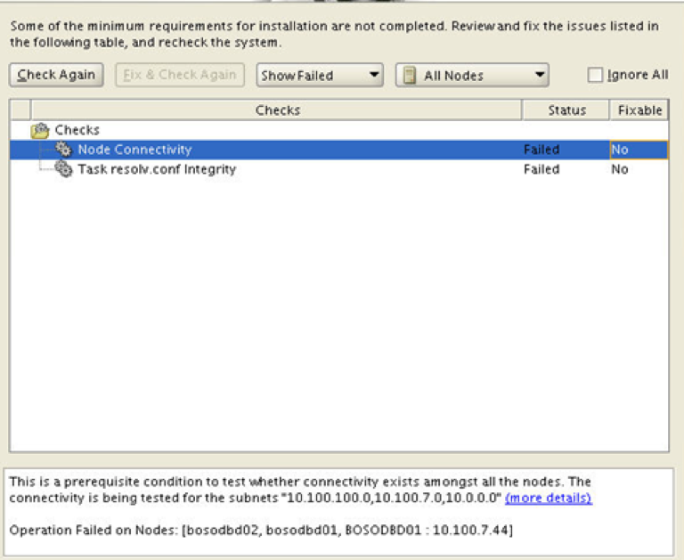

### RAC One Node commands

The following list shows some of the available One Node commmands:

- `srvctl config database -d <database_name>`
(This command shows output entry as **Type: RACOneNode**, which signifies this
is a One Node RAC)

- `srvctl status database -d <database_name>`

- `srvctl relocate database -d <database_name> -n <hostname> -w 10 -v`
(This command changes the RAC One Node to the other node in the cluster. It
starts the other instance of the database by shutting down the one that is
currently running).

### Conclusion

Oracle RAC One Node provides a significant enhancement in Oracle Database
availability.

People now-a-days are looking to reduce server loads, improve instance
availability, deduct workloads, decrease maintenance outages (which obstruct
normal day-to-day operations), and ease database management. Oracle RAC One Node
is a best-in-class solution for the databases and deployments, including those
in the cloud.

Use the Feedback tab to make any comments or ask questions.

Learn more about our [database services](https://www.rackspace.com/dba-services).
