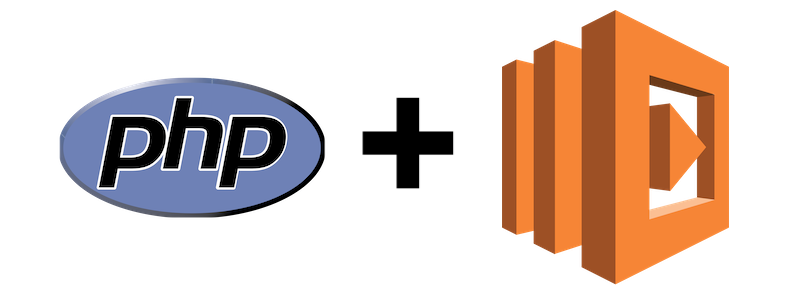

This year's AWS re:Invent was a nonstop, high-powered firehose of exciting new
features and products. Native PHP support on Lambda wasn't one of those features,
but the new [AWS Lambda runtime API](https://docs.aws.amazon.com/lambda/latest/dg/runtimes-api.html)
and [layers](https://docs.aws.amazon.com/lambda/latest/dg/configuration-layers.html)
capabilities gives us the ability to build a clean, supportable implementation
of PHP on Lambda of our own. In this post, we'll take a brief look at the overall
workflow and runtime lifecycle, and then I will show you one way to build a PHP
runtime to start powering your PHP applications on AWS Lambda.

<!--more-->

Not a PHP developer? No problem! You can adapt the examples in this guide to
build a custom runtime in your language of choice.

### Overview of Lambda custom runtimes and layers

Before we get started, we should take a moment to consider how native language
support on Lambda behaves and how the custom runtime API differs. At a high level,
selecting a natively-supported language when creating your Lambda function
defines the environment that AWS will use to execute your function code. The
environment has the language runtime (Python, Node, etc.) built in, as well as
an implementation of the Lambda Runtime API that manages the execution lifecycle
of the environment and invocations of the function itself. The design of the
custom runtime API separates these responsibilities and puts control of the
runtime completely in our hands. The environment's only responsibilities now
are starting and shutting down our custom runtime.

The lifecycle of the runtime itself is composed of an Init phase, and any number
of Invoke phases. The Init phase spans the period of time between when the
environment starts our custom runtime, and the time when our actual Lambda
function code is executed. The Init phase code will execute only once during
the environment lifecycle, during which we can prepare our custom runtime to
handle all future Lambda function invocations. At the conclusion of the Init
phase, our runtime sits in the Invoke phase, and will continuously ask for and
execute additional work until the environment shuts it down entirely.

In addition to being able to define custom runtimes for our Lambda functions,
we now have the ability to incorporate reusable components into our Lambda
functions in the form of layers. If you've written Lambda functions in the past
using Node.js, you should be familiar with the practice of packaging the
entirety of a `node_modules` directory with every individual function you create,
even if there are no differences between the contents of those `node_modules`
across your overall application. This tends to be a slow process, which can
result in very long build times for large applications consisting of many Lambda
functions, especially if some of those Lambda functions didn't depend on *all*
of the `node_modules` in the first place. With the new layering capability, we
can publish reusable layers to share among different Lambda functions. For example,
we can publish one layer consisting solely of our custom runtime code ,and
another layer consisting of library code or other dependencies, and then
configure our Lambda functions to make the contents of those two previously
published layers available to our function code as needed.

### Getting started

We'll get to the actual code for the custom runtime later, but first, we need
to make sure that the underlying Lambda Execution Environment is able to execute
the PHP code we'll be writing. Since there's no native support for PHP in Lambda,
we'll need to provide the PHP binary for Lambda to use to execute our custom
runtime code. The best way to go about this is to compile the desired version of
PHP in an Amazon Linux environment compatible with the same
[environment in which the Lambda will be executing](https://docs.aws.amazon.com/lambda/latest/dg/current-supported-versions.html).

If you're already familiar with the process of launching an EC2 instance, launch
one now using the same AMI from the underlying
[Lambda Execution Environment](https://docs.aws.amazon.com/lambda/latest/dg/current-supported-versions.html)
(`amzn-ami-hvm-2017.03.1.20170812-x86_64-gp2` at the time of this writing), and
ensure that it has an IAM Instance Profile that will allow it to create IAM
Roles and manage Lambda functions. Once it is ready, log into it using SSH.

If you haven't done that sort of thing before, there is a fantastic
[step-by-step guide](https://aws.amazon.com/blogs/compute/scripting-languages-for-aws-lambda-running-php-ruby-and-go/)
to doing this for PHP 7.0.7 (however, because support for PHP 7.0.x has ended at
the time of this writing, we use PHP 7.3.0 for this example). Follow the
instructions in the guide linked above up up to the **Setting up PHP on the instance**
step, and then... read on!



### Compiling PHP

Now, let's compile PHP by running the following commands:

```bash
# Update packages and install needed compilation dependencies
sudo yum update -y
sudo yum install autoconf bison gcc gcc-c++ libcurl-devel libxml2-devel -y

# Compile OpenSSL v1.0.1 from source, as Amazon Linux uses a newer version than the Lambda Execution Environment, which
# would otherwise produce an incompatible binary.
curl -sL https://www.openssl.org/source/openssl-1.0.1k.tar.gz | tar -xvz
cd openssl-1.0.1k
./config && make && sudo make install
cd ~

# Download the PHP 7.3.0 source
mkdir ~/php-7-bin
curl -sL https://github.com/php/php-src/archive/php-7.3.0.tar.gz | tar -xvz
cd php-src-php-7.3.0

# Compile PHP 7.3.0 with OpenSSL 1.0.1 support, and install to /home/ec2-user/php-7-bin
./buildconf --force
./configure --prefix=/home/ec2-user/php-7-bin/ --with-openssl=/usr/local/ssl --with-curl --with-zlib
make install
```

Once that's all completed, run `/home/ec2-user/php-7-bin/bin/php -v` to verify
all went well. You should see some variation of the following, depending on the
version you installed:

```bash
PHP 7.3.0 (cli) (built: Dec 11 2018 17:45:29) ( NTS )
Copyright (c) 1997-2018 The PHP Group
Zend Engine v3.3.0-dev, Copyright (c) 1998-2018 Zend Technologies
```

### Preparing to write some code

Now let's set up a working directory to package up and deploy our example:

```bash
mkdir -p ~/php-example/{bin,src}/
cd ~/php-example
touch ./src/{hello,goodbye}.php
touch ./bootstrap && chmod +x ./bootstrap
cp ~/php-7-bin/bin/php ./bin
```

Which will give us this initial directory structure:

```
/home/ec2-user/php-example/
├── bin/
│   └── php*
├── bootstrap*
└── src/
    ├── goodbye.php
    └── hello.php

2 directories, 4 files
```

We now have some empty PHP script files where our function code will live, as
well as an empty, executable `bootstrap` file. Let's talk about `bootstrap` first.
Since the Lambda environment's responsibility will be limited to simply starting
and shutting down our custom runtime API, it's up to us to define what is *actually*
going to happen in the Lambda environment once that runtime API starts up. The
`bootstrap` script will be what handles these Init and Invoke phases.

We’ll work on the `bootstrap` script first, but before we can do that we have
one more setup task to complete. Implementing the custom runtime API will involve
making a number of HTTP requests and parsing response headers, which can be
very cumbersome to do in PHP using natively-available utilities like the various
`curl_*` functions. Rather than go that route, we'll use the
[Composer](https://getcomposer.org) package manager to install the popular
[Guzzle](https://github.com/guzzle/guzzle) PHP HTTP client and simplify our
custom runtime API implementation. Since any non-trivial PHP application is
almost certainly going to be making use of other open source libraries or
frameworks, completing this step will give us the added bonus of having a
mechanism available for incorporating additional dependencies as our application
evolves.

First, install Composer:

```bash
curl -sS https://getcomposer.org/installer | ./bin/php
```

Which should output something like this:

```bash
All settings correct for using Composer
Downloading...

Composer (version 1.8.0) successfully installed to: /home/ec2-user/php-example/composer.phar
Use it: php composer.phar
```

Next, install Guzzle:

```bash
./bin/php composer.phar require guzzlehttp/guzzle
```

Which will give us this:

```bash
Using version ^6.3 for guzzlehttp/guzzle
./composer.json has been updated
Loading composer repositories with package information
Updating dependencies (including require-dev)
Package operations: 5 installs, 0 updates, 0 removals
  - Installing guzzlehttp/promises (v1.3.1): Loading from cache
  - Installing ralouphie/getallheaders (2.0.5): Loading from cache
  - Installing psr/http-message (1.0.1): Loading from cache
  - Installing guzzlehttp/psr7 (1.5.2): Loading from cache
  - Installing guzzlehttp/guzzle (6.3.3): Loading from cache
guzzlehttp/guzzle suggests installing psr/log (Required for using the Log middleware)
Writing lock file
Generating autoload files
```

### Building the custom runtime

We're now ready to implement the custom runtime API and build a couple of example
Lambda functions!

Let's start with the `bootstrap`. The `bootstrap` is the main engine that drives
our example; it can be written in any language that Lambda's underlying Amazon
Linux environment is able to run. Because this is a PHP example, both the custom
runtime and the `bootstrap` script itself are written in PHP, and they are
executed using the PHP binary we compiled earlier for Amazon Linux. Lambda
places the files from our various layers under `/opt`, so our `/home/ec2-user/php-example/bin/php`
file ultimately ends up being `/opt/bin/php`. The `#!/opt/bin/php` shebang
declaration at the top of our `bootstrap` will instruct the program loader to
use our PHP binary to execute the remainder of the code.

Here's what our initial `bootstrap` script looks like:

```php
#!/opt/bin/php
<?php

// This invokes Composer's autoloader so that we'll be able to use Guzzle and any other 3rd party libraries we need.
require __DIR__ . '/vendor/autoload.php';

// This is the request processing loop. Barring unrecoverable failure, this loop runs until the container shuts down.
do {
    // Ask the runtime API for a request to handle.
    $request = getNextRequest();

    // Obtain the function name from the _HANDLER environment variable and ensure the function's code is available.
    $handlerFunction = array_slice(explode('.', $_ENV['_HANDLER']), -1)[0];
    require_once $_ENV['LAMBDA_TASK_ROOT'] . '/src/' . $handlerFunction . '.php';

    // Execute the desired function and obtain the response.
    $response = $handlerFunction($request['payload']);

    // Submit the response back to the runtime API.
    sendResponse($request['invocationId'], $response);
} while (true);
```

The overall flow of things is fairly straightforward. We obtain the next request
that needs to be handled, execute the code to handle it, submit a response, then
repeat the process.

You may have noticed that there is no error handling or abstractions of any kind
in place. For this example, this is done purposely in the interest of brevity.
In a real, object-oriented application, we'd have graceful error handling in place
and be delegating things like input parsing, sanitization, request routing, and
so on to an application framework. Please consult the
[Runtime API documentation](https://docs.aws.amazon.com/lambda/latest/dg/runtimes-api.html)
as you build your production custom runtimes in order to ensure that you're
handling all eventualities as gracefully as possible! Otherwise, an unhandled
error causes the custom runtime to be terminated prematurely.

Now that we've got the overall structure of the request processing loop in place,
let's add the `getNextRequest()` and `sendResponse()` implementations to our
`bootstrap`.

```php
function getNextRequest()
{
    $client = new \GuzzleHttp\Client();
    $response = $client->get('https://' . $_ENV['AWS_LAMBDA_RUNTIME_API'] . '/2018-06-01/runtime/invocation/next');

    return [
        'invocationId' => $response->getHeader('Lambda-Runtime-Aws-Request-Id')[0],
        'payload' => json_decode((string) $response->getBody(), true)
    ];
}
```

Here, we're making a `GET` request to the runtime API to obtain the next Lambda
invocation that needs to be serviced. Each response will provide some information
about the invocation [in the response headers](https://docs.aws.amazon.com/lambda/latest/dg/runtimes-api.html#runtimes-api-next),
but for now, we're just interested in the Invocation ID (`Lambda-Runtime-Aws-Request-Id`).
We'll also grab the request payload to supply request parameters to our functions.
We'll retrieve those and return a simple associative array to make these values
available to the caller.

```php
function sendResponse($invocationId, $response)
{
    $client = new \GuzzleHttp\Client();
    $client->post(
        'https://' . $_ENV['AWS_LAMBDA_RUNTIME_API'] . '/2018-06-01/runtime/invocation/' . $invocationId . '/response',
        ['body' => $response]
    );
}
```

To send the response, we `POST` back to the runtime API with whatever output
text our functions return.

### Coding our example functions

Now let's fill in the Lambda functions. We'll just have two simple functions -
`hello()` and `goodbye()`, which each expect an array of `$data` having a `name`
key with a value that they will say "Hello" or "Goodbye" to.

Save the following to `src/hello.php`:

```php
<?php

function hello($data)
{
    return "Hello, {$data['name']}!";
}
```

and save this to `src/goodbye.php`:

```php
<?php

function goodbye($data)
{
    return "Goodbye, {$data['name']}!";
}
```

Before we create and test our custom runtime API and PHP functions, let's take
a quick inventory. By now we should have the following items:

* PHP binary compiled on Amazon Linux
* `bootstrap` file coded in PHP to handle the Init and ongoing Invoke phases
* `vendor` directory with Guzzle's source code
* Two simple PHP functions - `hello()` and `goodbye()`

## Deployment

Let's prepare our layers and function code for publication!

```bash
zip -r runtime.zip bin bootstrap
zip -r vendor.zip vendor/
zip hello.zip src/hello.php
zip goodbye.zip src/goodbye.php
```

Before publishing everything, we'll need to make sure we're on a recent enough
version of the AWS CLI that has the new Lambda capabilities available. The
easiest way to do this is to just update to the latest version:

```bash
sudo pip install --upgrade awscli
```

Now, we can publish our two layers.

**NOTE:** In my case, I've assigned an IAM instance profile to my EC2 instance
that gives me access to the necessary AWS APIs to handle all publication from
the instance. You can opt to do the same, or just download the four `zip` files
and run them locally using your own IAM user credentials. Naturally, you can
also use the Amazon Web Console.

To do this using the CLI, we'll first need to create an execution role for our
Lambda:

Save the following to `/tmp/trust-policy.json`:

```json
{
  "Version": "2012-10-17",
  "Statement": [
    {
      "Effect": "Allow",
      "Principal": {
        "Service": "lambda.amazonaws.com"
      },
      "Action": "sts:AssumeRole"
    }
  ]
}
```

and then run:

```bash
aws iam create-role \
    --role-name LambdaPhpExample \
    --path "/service-role/" \
    --assume-role-policy-document file:///tmp/trust-policy.json
```

Make note of the `Role.Arn` output value (e.g. `arn:aws:iam::XXXXXXXXXXXX:role/service-role/LambdaPhpExample`),
which you'll need for the next steps.

Now, let's create our `runtime` and `vendor` layers.

```bash
aws lambda publish-layer-version \
    --layer-name php-example-runtime \
    --content fileb://runtime.zip \
    --region us-east-1

aws lambda publish-layer-version \
    --layer-name php-example-vendor \
    --zip-file fileb://vendor.zip \
    --region us-east-1
```

Make note of each command's `LayerVersionArn` output value (e.g. `arn:aws:lambda:us-east-1:XXXXXXXXXXXX:layer:php-example-runtime:1`),
which you'll need for the next steps.

Now, let's create our two functions (be sure to replace the XXXXXXXXXXXX with
your account number):

```bash
aws lambda create-function \
     --function-name php-example-hello \
     --handler hello \
     --zip-file fileb://./hello.zip \
     --runtime provided \
     --role "arn:aws:iam::XXXXXXXXXXXX:role/service-role/LambdaPhpExample" \
     --region us-east-1 \
     --layers "arn:aws:lambda:us-east-1:XXXXXXXXXXXX:layer:php-example-runtime:1" \
              "arn:aws:lambda:us-east-1:XXXXXXXXXXXX:layer:php-example-vendor:1"

aws lambda create-function \
     --function-name php-example-goodbye \
     --handler goodbye \
     --zip-file fileb://./goodbye.zip \
     --runtime provided \
     --role "arn:aws:iam::XXXXXXXXXXXX:role/service-role/LambdaPhpExample" \
     --region us-east-1 \
     --layers "arn:aws:lambda:us-east-1:XXXXXXXXXXXX:layer:php-example-runtime:1" \
              "arn:aws:lambda:us-east-1:XXXXXXXXXXXX:layer:php-example-vendor:1"
```

### Testing

And finally, let's invoke them!

```bash
aws lambda invoke \
    --function-name php-example-hello \
    --region us-east-1 \
    --log-type Tail \
    --query 'LogResult' \
    --output text \
    --payload '{"name": "World"}' hello-output.txt | base64 --decode

aws lambda invoke \
    --function-name php-example-goodbye \
    --region us-east-1 \
    --log-type Tail \
    --query 'LogResult' \
    --output text \
    --payload '{"name": "World"}' goodbye-output.txt | base64 --decode
```

The `--query 'LogResult' --output text` parameters and `| base64 --decode`
display the logging output you'd normally see in CloudWatch logs to the CLI. If
all goes well, the output should look something like this:

```bash
START RequestId: bf3a91af-f380-11e8-8a98-99a71fd9601e Version: $LATEST
END RequestId: bf3a91af-f380-11e8-8a98-99a71fd9601e
REPORT RequestId: bf3a91af-f380-11e8-8a98-99a71fd9601e	Init Duration: 141.20 ms	Duration: 74.11 ms	Billed Duration: 300 ms 	Memory Size: 128 MB	Max Memory Used: 38 MB

START RequestId: d14d2f9b-f380-11e8-8a98-99a71fd9601e Version: $LATEST
END RequestId: d14d2f9b-f380-11e8-8a98-99a71fd9601e
REPORT RequestId: d14d2f9b-f380-11e8-8a98-99a71fd9601e	Init Duration: 101.65 ms	Duration: 77.20 ms	Billed Duration: 200 ms 	Memory Size: 128 MB	Max Memory Used: 27 MB
```

Subsequent invocations of the same functions will not have Init phases (so long
as there's an active runtime waiting to process new work), and the duration of
the Invoke phase is generally lower. For example:

```bash
REPORT RequestId: 4bbf021d-fd75-11e8-9129-574c933ae3eb	Duration: 4.41 ms	Billed Duration: 100 ms 	Memory Size: 128 MB	Max Memory Used: 38 MB
REPORT RequestId: 4c97876f-fd75-11e8-becf-a9bea4741119	Duration: 9.59 ms	Billed Duration: 100 ms 	Memory Size: 128 MB	Max Memory Used: 38 MB
REPORT RequestId: 4d298e9b-fd75-11e8-ac02-d96b0f356492	Duration: 2.68 ms	Billed Duration: 100 ms 	Memory Size: 128 MB	Max Memory Used: 38 MB
REPORT RequestId: 4d971d18-fd75-11e8-a534-73dd2a333b34	Duration: 1.94 ms	Billed Duration: 100 ms 	Memory Size: 128 MB	Max Memory Used: 38 MB
```

A quick `cat` of the `hello-output.txt` and `goodbye-output.txt` files also
reveals the `Hello, World!` and `Goodbye, World!` output, respectively.

### Conclusion

In this post, you got a glimpse into what's possible with the new Lambda custom
runtime API and layering capabilities. From here, you can choose to incorporate
[API Gateway with Lambda Integration](https://docs.aws.amazon.com/apigateway/latest/developerguide/getting-started-with-lambda-integration.html),
use your [Lambda Functions as Application Load Balancer Targets](https://docs.aws.amazon.com/elasticloadbalancing/latest/application/lambda-functions.html),
or even use these functions as behind-the-scenes PHP workers to perform tasks
asynchronously.

The new runtime APIs for Lambda make it possible to create runtimes for any
programming language. You can see other examples for
[Rust](https://aws.amazon.com/blogs/opensource/rust-runtime-for-aws-lambda/)
and [C++](https://aws.amazon.com/blogs/compute/introducing-the-c-lambda-runtime/)
that AWS has already open sourced. I am excited about what these new capabilities
could mean for PHP applications in 2019, and I look forward to seeing what you
build with them. If you build something you'd like to share, use the Feedback tab,
or reach out to me on [Twitter](https://twitter.com/michaelmoussa).

---

Are you excited about this and other recent AWS launch announcements? We'd love
to help. Schedule [a free strategy session](https://go.rackspace.com/Ask-An-AWS-Expert.html)
to discuss how Rackspace can assist you in taking advantage of new AWS products
and services!

