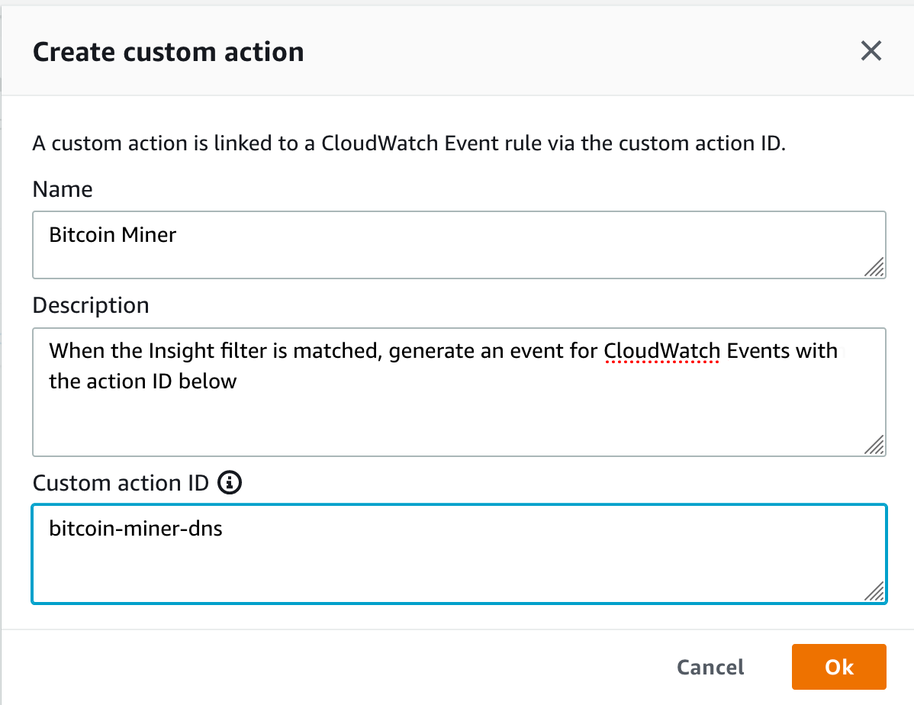
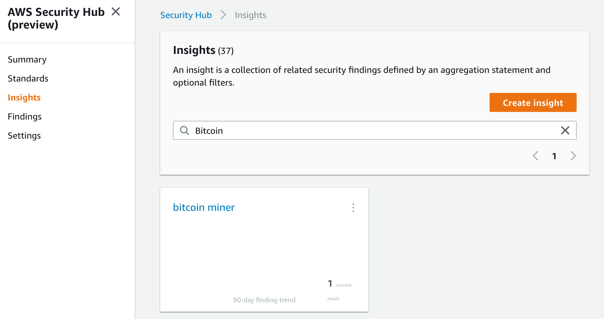
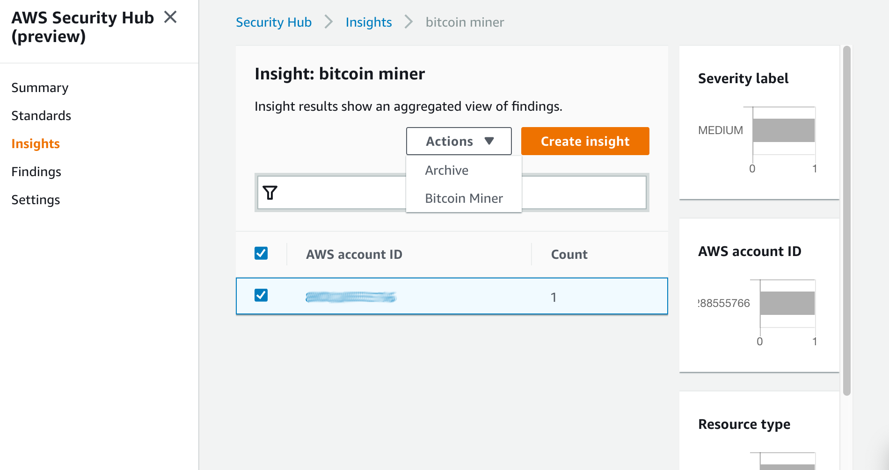

AWS Security Hub was announced in Andy Jassy's re:Invent 2018
[Keynote(46:23)](https://youtu.be/ZOIkOnW640A?t=2783) and pitched as "a place to
centrally manage security and compliance across your whole AWS environment
(applause)" and then went on to announce an array of partners who were part of
the initial integration effort (muted applause). While this announcement enjoyed
just 3 minutes on centre stage, this is a significant development.

<!--more-->

### Security hub - why is this significant?

One of the notable developments included in this announcement is the creation
by AWS and adoption by AWS and select AWS partners of a **standard format** for
security events called the ['AWS Security Finding' format](https://docs.aws.amazon.com/securityhub/latest/userguide/securityhub-findings-format.html).
This common format is a key enabler of the aggregation of 'Findings' into
Security Hub as it pushes the responsibility for conformance onto the findings
emitter rather than requiring the aggregator to build and maintain multiple
parsers for all findings sources. The AWS services GuardDuty, Macie, and
Inspector, if configured, will automatically have their findings aggregated in
SecurityHub once it is enabled.

Given that many of the security partners involved compete with one another to
some extent or offer Security Operations Centre (SOC) services providing the
black box magic of event ingestion and correlation into incidents, one can
imagine that the incentive to standardise on a format which could level the
playing field just a little bit must not have been great. The inexorable change
of the market and the dominant agent of that change together clearly made a
compelling case!

### Coming together

The standard findings format ensures that the attributes required for the
*correlation* of findings are present. ['Insights'](https://docs.aws.amazon.com/securityhub/latest/userguide/securityhub-insights.html)
are light-weight correlation rules, essentially filter and grouping operations
to linked to an 'action'. This 'action' as set up in Security Hub is simply an
identifier for an event which will be sent to CloudWatch Events if triggered.
In CloudWatch Events, notifications, automations, or integrations are configured.
As it stands today, `actions` must be manually triggered from the 'insight' and
*cannot be associated and triggered automatically*. One assumes that this will
be addressed in future releases.

Usefully, some standard findings are made available by AWS for such conditions
as 'S3 buckets with sensitive data and public read permissions' which on their
own should spare a great deal of pain to AWS customers!

On the theme of aggregation, Security Hub supports a master/member model where
the designate master account can invite member accounts to pool findings. Once
accepted, the findings from the member account are aggregated in Security Hub
in the master. The member has access to view their own findings, while the
master has a view of findings from itself and all members. It should be notes
that at this time, Security Hub is a *regional* service.

Under the 'Standards' menu, AWS provides the first of its automated compliance
checks – 'CIS AWS Foundations' -  with 43 automated rules as of 11th December
2018.

### A brisk walk-through

Let's take a brief look in practice at how these various concepts and components
work together. We'll be working with a single test account rather than trying
to demonstrate master/member.

* We've enabled GuardDuty for our test account to provide us with some findings
to work with.
* In the ** AWS Console -> GuardDuty -> Settings ** we've clicked 'Generate
Sample Findings' which has generated a spread of 45 findings.
* Since GuardDuty findings are automatically aggregated in SecurityHub, after a
short delay, these same 45 findings are available for us to manipulate in
SecurityHub.
* Today, we are concerned about resource theft for BitCoin mining, so let's see
what GuardDuty has identified for us in this regard:


``` bash
aws securityhub get-findings --filter '{"ResourceType": [ { "Comparison": "CONTAINS", "Value": "AwsEc2Instance" } ], "Type": [{"Comparison": "CONTAINS", "Value": "TTPs/Command and Control/CryptoCurrency:EC2-BitcoinTool.B!DNS"}] }'
```

And, indeed, we do have a match output in the **AWS Security Finding format**:

```JSON
{
    "Findings": [
        {
            "LastObservedAt": "2018-12-12T12:59:54.166Z",
            "FirstObservedAt": "2018-12-12T12:59:54.166Z",
            "GeneratorId": "arn:aws:guardduty:eu-west-1:9876123456789:detector/00b3cc1abf112994d0a265ad873033bc",
            "Severity": {
                "Product": 5,
                "Normalized": 50
            },
            "Title": "Bitcoin-related domain name queried by EC2 instance i-99999999.",
            "Resources": [
                {
                    "Tags": {
                        "GeneratedFindingInstaceTag4": "GeneratedFindingInstaceTagValue4",
                        "GeneratedFindingInstaceTag5": "GeneratedFindingInstaceTagValue5",
                        "GeneratedFindingInstaceTag6": "GeneratedFindingInstaceTagValue6",
                        "GeneratedFindingInstaceTag7": "GeneratedFindingInstaceTagValue7",
                        "GeneratedFindingInstaceTag1": "GeneratedFindingInstaceValue1",
                        "GeneratedFindingInstaceTag2": "GeneratedFindingInstaceTagValue2",
                        "GeneratedFindingInstaceTag3": "GeneratedFindingInstaceTagValue3",
                        "GeneratedFindingInstaceTag8": "GeneratedFindingInstaceTagValue8",
                        "GeneratedFindingInstaceTag9": "GeneratedFindingInstaceTagValue9"
                    },
                    "Region": "eu-west-1",
                    "Partition": "aws",
                    "Details": {
                        "AwsEc2Instance": {
                            "VpcId": "GeneratedFindingVPCId",
                            "ImageId": "ami-99999999",
                            "IpV4Addresses": [
                                "198.51.100.0",
                                "10.0.0.1"
                            ],
                            "LaunchedAt": "2017-12-20T23:46:44.000Z",
                            "SubnetId": "GeneratedFindingSubnetId",
                            "Type": "p2.xlarge"
                        }
                    },
                    "Type": "AwsEc2Instance",
                    "Id": "arn:aws:ec2:eu-west-1:9876123456789:instance/i-99999999"
                }
            ],
            "WorkflowState": "NEW",
            "ProductArn": "arn:aws:securityhub:eu-west-1::product/aws/guardduty",
            "ProductFields": {
                "action/dnsRequestAction/domain": "GeneratedFindingDomainName",
                "additionalInfo": "{\"threatListName\":\"GeneratedFindingThreatListName\",\"sample\":true}",
                "archived": "false",
                "resourceRole": "TARGET",
                "action/dnsRequestAction/protocol": "UDP",
                "aws/securityhub/SeverityLabel": "MEDIUM",
                "count": "1",
                "detectorId": "00b3cc1abf112994d0a265ad873033bc",
                "action/dnsRequestAction/blocked": "true",
                "aws/securityhub/ProductName": "GuardDuty",
                "aws/securityhub/FindingId": "arn:aws:securityhub:eu-west-1::product/aws/guardduty/arn:aws:guardduty:eu-west-1:9876123456789:detector/00b3cc1abf112994d0a265ad873033bc/finding/92b3d14048db77e93aae9a8693e937b8",
                "action/actionType": "DNS_REQUEST",
                "aws/securityhub/CompanyName": "AWS"
            },
            "RecordState": "ACTIVE",
            "CreatedAt": "2018-12-12T12:59:54.166Z",
            "UpdatedAt": "2018-12-12T12:59:54.166Z",
            "Description": "EC2 instance i-99999999 is querying a domain name that is associated with Bitcoin-related activity.",
            "SchemaVersion": "2018-10-08",
            "Id": "arn:aws:guardduty:eu-west-1:9876123456789:detector/00b3cc1abf112994d0a265ad873033bc/finding/92b3d14048db77e93aae9a8693e937b8",
            "Types": [
                "TTPs/Command and Control/CryptoCurrency:EC2-BitcoinTool.B!DNS",
                "Effects/Resource Consumption/CryptoCurrency:EC2-BitcoinTool.B!DNS"
            ],
            "AwsAccountId": "9876123456789"
        }
    ]
}
```

* Let's create an `insight` with these filter criteria so that we can quickly
isolate further findings of this type:


```bash
aws securityhub create-insight --name "bitcoin miner"  --filter '{"ResourceType": [ { "Comparison": "CONTAINS", "Value": "AwsEc2Instance" } ], "Type": [{"Comparison": "CONTAINS", "Value": "TTPs/Command and Control/CryptoCurrency:EC2-BitcoinTool.B!DNS"}] }' --group-by AwsAccountId
{
    "InsightArn": "arn:aws:securityhub:eu-west-1:9876123456789:insight/9876123456789/custom/45be0f15-d947-4bf7-8c27-83eef7487141"
}

```

* There is no AWS CLI option to create an `action` just now, so we need to
go to the **AWS Console -> SecurityHub -> Settings -> Custom actions**. Click
on **Create custom action**.



* It's now time to create our **CloudWatch Events** rule:

```bash
aws events put-rule --cli-input-json '{"Name": "SecHub", "EventPattern": "{\"source\":[\"aws.securityhub\"],\"resources\":[\"arn:aws:securityhub:eu-west-1:9876123456789:action/custom/bitcoin-miner-dns\"]}","State": "ENABLED"}'
{
    "RuleArn": "arn:aws:events:eu-west-1:9876123456789:rule/SecHub"
}
```

* For our `rule` `target`, we'll make use of an SNS topic which is already in
use for other security notifications:

```bash
aws events put-targets --rule SecHub --targets "Id"="1","Arn"="arn:aws:sns:eu-west-1:9876123456789:security_events"
```

our subscription to this topic looks like this:

```
aws sns get-subscription-attributes --subscription-arn "arn:aws:sns:eu-west-1:9876123456789:security_events:14bc3d5c-0bc8-463d-a920-c52c87ba8730"
{
    "Attributes": {
        "PendingConfirmation": "false",
        "Endpoint": "secevents@example.com",
        "Protocol": "email",
        "RawMessageDelivery": "false",
        "ConfirmationWasAuthenticated": "false",
        "Owner": "9876123456789",
        "SubscriptionArn": "arn:aws:sns:eu-west-1:9876123456789:security_events:14bc3d5c-0bc8-463d-a920-c52c87ba8730",
        "TopicArn": "arn:aws:sns:eu-west-1:9876123456789:security_events"
    }
}
```

* So far, so good! Time for action...In the **AWS Console -> Security Hub -> Insights**
panel, we find the `insight` which we created earlier:



* Clicking through on that `insight`, we see the `finding` we previously turned
up in our seach. We highlight this and select the `action` we created earlier
from the dropdown. We are notified in a green across the top of the panel that
this operation has been successful.



* While we wait for the email notification to arrive, we can validate that
CloudWatch Events has seen and processed the event triggered by our `action`
by visiting **AWS Console -> CloudWatch -> Events -> Rules** and click on our
**SecHub** rule:


If we view the metrics for this rule, we should should see `TriggeredRules`
reporting a value of `1`. Before long, however, an email will appear in our
Inbox with the full raw contents of the `finding`.

### Where to from here?

As a PoC, this is interesting, but this is merely a start. CloudWatch Events
provides a broad selection of targets, which enable a high degree of versatility,
whether you want to push events to another system, generate a ticket in order
to engage human specialists, or automate remediation. What can you accomplish?
Sign up for the Security Hub preview and share your thoughts and experiences below.

Something to watch is the extent to which the **AWS Security Finding format**
takes on a life of its own outside of AWS. Having been compelled to conform to a
standard, does this development serve as a catalyst for further cooperation
between vendors or the inspiration behind yet to be conceived OSS projects? There
does not appear to have been much movement on Security Device Event Exchange
and the Cisco extension [CICEE](https://www.cisco.com/c/en/us/td/docs/security/ips/specs/CIDEE_Specification.html?dtid=osscdc000283)
in recent years, just perhaps this is the impetus which has been lacking.

Use the Feedback tab to make any comments or ask questions.

### Resources

* Security Hub in Andy Jassy's re:Invent 2018 [keynote(46:23)](https://youtu.be/ZOIkOnW640A?t=2783)
* re:Invent 2018 [SEC397 breakout session](https://youtu.be/TdT8ds_C8Gs) on Security Hub
