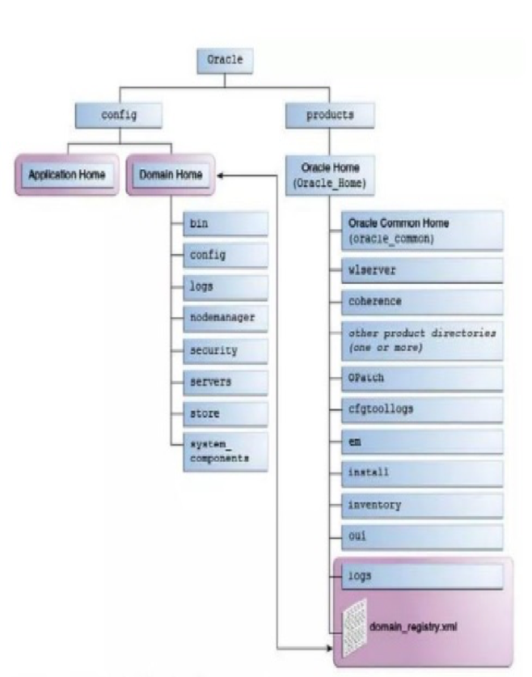
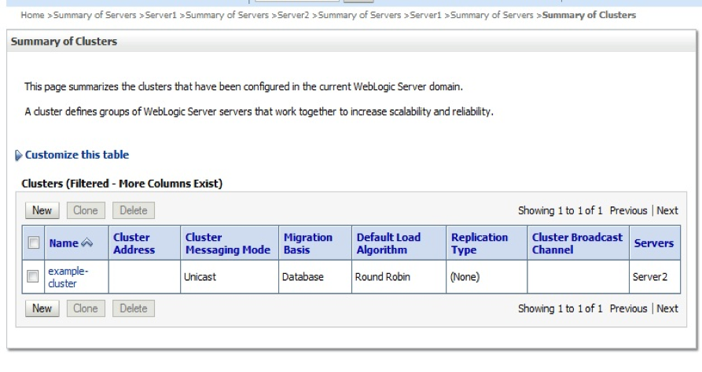
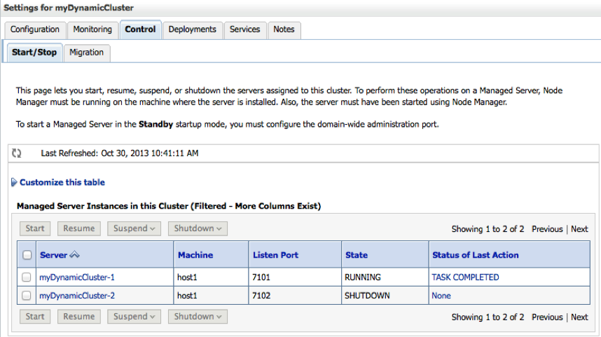
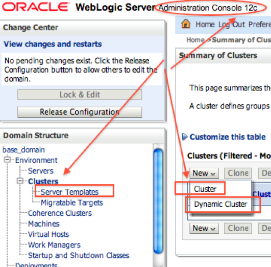

This blog covers some of the changes and new features of Oracle&reg; WebLogic
Server&reg; version 12c.

<!--more-->

### Introduction

WebLogic Server is an application server that is Java&reg; EE 7 compliant and is used
to deploy and run distributed Java applications. This popular Oracle product is
used in all the latest Oracle fusion products like service-oriented architecture
(SOA), Oracle Business Intelligence Enterprise Edition (OBIEE), Oracle Access
Management and Oracle Identity Mangement (OAM/OIM), Oracle E-Business Suite (EBS)
12.2, Oracle Enterprise Manager (OEM) 13c, and so on.

The latest version of WebLogic Server is 12.2.1.3. You can download it from the
[Weblogic download link](https://www.oracle.com/technetwork/middleware/weblogic/downloads/wls-main-097127.html)

### Changes in WebLogic Server v12c

The following sections cover some of the new features and changes introduced in
version of 12c WebLogic, including changes in installation modes, directory
structure, dynamic clusters, the OPatch utility, multitenancy, and others.

#### Install media type

In 12c, the installation type has been changed. Following are three different
ways that you can install WebLogic Server:

-	Quick Installer
-	Generic Package Installer (Jar)
-	Fusion Middleware Infrastructure Installer (for multitenancy)

#### Directory structure and file system

In 12c, the  directory structure of a WebLogic server has changed to

**Home -> Oracle -> Product -> Oracle Home -> config -> Config -> Domain Home -> Application Home**.

The main installation directory, Oracle_Home, is **/Oracle/Middleware/Oracle\_Home**.

The Repository Creation Utility (RCU) script directory is **/Oracle/Middleware/Oracle\_Home/oracle\_common/bin**.

The WebLogic home directory, WLS_HOME, is **/Oracle/Middleware/Oracle\_Home/wlserver**.

The patching directory is **/Oracle/Middleware/Oracle\_Home/OPatch**.

The following image shows the WebLogic file structure:

#### Dynamic cluster

Changes to dynamic clusters include the following items:

-	Clusters can contain one or more dynamic servers.
-	Servers can be dynamically scaled based on an application's need.
-	You can use a user server template to define the configuration of servers or
   parts of dynamic cluster.

The following image shows a cluster created with the **Round Robin** type in the
WebLogic Console:

The following image shows the dynamic cluster running status in the WebLogic Console:

#### Dynamic server

Changes to dynamic server include the following items:

-	You can create a WebLogic Server from a server template.
-	A dynamic cluster creates these dynamic servers.

The following image shows where to create a dynamic server in the WebLogic Console:

#### Multitenancy

Changes to multitenancy include the following items:

-	Multiple parties can share the multitenant sharable infrastructure.
-	Enhancements improved the density and resource efficiency.
-	Resource isolation is available within a domain.

#### JDK 8 certified

WebLogic Server 12c R2 is certified for use with JDK 8 Update 40 and later
versions.

#### JDBC data source types

The following Java Database Connectivity (JDBC) data sources were introduced in
version 12c:

-	Universal connection pool data sources
-	Proxy data sources

#### Patches

Starting with version 12.1.2, you need to apply WebLogic patches by using the
Opatch utility instead of by using BEA Smart Update (`bsu.sh`).

With WebLogic Server 12.2.1.3.0, you can obtain the list of patches that have
been applied to a WebLogic Server instance. Access this applied patch list by
reviewing either the `weblogic.log.DisplayPatchInfo` system property or the
`ServerRuntimeMBean.PatchList` attribute.

#### D-PCT

WebLogic Server 12.2.1.1.0 introduces Domain to Partition Conversion Tool (D-PCT),
which provides the ability to migrate existing applications and resources from
a non-multitenant domain to a multitenant domain partition.

#### Docker certification

WebLogic Server 12.2.1 is certified to run inside a Docker&reg; container. Docker
is a Linux&reg;-based container technology that enables you to quickly create
lightweight clustered and non-clustered WebLogic Server domain configurations
on a single host OS or virtual machines, for either development or production
environments.

### Conclusion

The WebLogic Server 12c Release 2 brings enhancements that focus on availability,
manageability, support for modern standards and technologies, cloud enablement,
and portability.

The enhancements and new features leverage a best-in-class Java EE (Enterprise
Edition) application server, taking it to the next level, including additional
support for new and emerging specifications, standards, and technologies. They
also offer the ability to more efficiently isolate and manage applications and
resources and provide maximum availability of applications and data. The good
news is that not only can your custom Java applications take advantage of these
new capabilities, but many of the Oracle Fusion Middlewear (FMW) components,
such as the Oracle SOA Suite, Oracle Service Bus, Oracle BPM Suite, WebCenter
Content and Portal, Forms & Reports, and OBIEE can also reap the benefits
available in this latest release of WebLogic Server. Version 12.2.1 of WebLogic
Server and FMW are available for download now. Take them for a test drive so
that you can experience these benefits for yourself.

Use the Feedback tab to make any comments or ask questions.

Learn more about our [database services](https://www.rackspace.com/dba-services).

