User authentication is a common application requirement that has been solved
numerous times in the past - why trouble yourself with implementing and managing
it yet again, when you could be working on exciting new features in your
application instead? The AWS Application Load Balancer (ALB) can greatly simplify
user authentication with several different social media, SAML 2.0, and OpenID
Connect identity providers (IdP).

In this post, we'll walk through the entire process of setting up ALB authentication
using Amazon Cognito against a Microsoft Active Directory Federation Services
SAML IdP.

<!--more-->

### Getting started

Let's first take a high-level look at what we're trying to achieve. We have an
application with functionality that requires a user to be authenticated. When
our application is accessed, we'd like to redirect users who haven't already
authenticated over to our SAML IdP. There, they can log in against an existing
database of users, and the IdP will post a response to a callback URL that we
provide to let us know that the user authenticated successfully. If so, they can
proceed to the application; otherwise, they will continue to be denied access.

This walkthrough assumes we'll be authenticating against our company's Microsoft
Active Directory Federation Services (ADFS), but the same overall procedure
should be adaptable to any compatible SAML IdP. Before we proceed, we'll assume
we already have the following:

  * An application hosted at `https://app.example.com/` and sitting behind an
  existing Application Load Balancer (ALB).
  * A subdomain we can use for authentication, e.g. `auth.app.example.com`.
  * An [AWS Certificate Manager](https://aws.amazon.com/certificate-manager/)
  issued certificate for `app.example.com` and `auth.app.example.com`.
  * The metadata document endpoint URL for our SAML IdP, e.g. `https://example.com/FederationMetadata/2007-06/FederationMetadata.xml`.

Of course, throughout this walkthrough, you should replace instances of `app.example.com`
with your application's _actual_ domain name.

**NOTE:** While this post makes a few assumptions about your current environment,
a precise match is not absolutely necessary. For instance, if you don't have the
ability to create a subdomain for authentication (`auth.app.example.com`), you
can adapt the instructions below to work with the Amazon Cognito domain URL that
is available when creating the user pool. Or, perhaps you have an application,
but don't have an existing ALB. If so, rather than modifying an existing ALB,
just create a new one taking the information in this post into consideration.

### Creating the Cognito user pool

[Amazon Cognito](https://aws.amazon.com/cognito/) lets us avoid having to
implement the necessary logic to negotiate the user authentication flow, manage
state, and capture available user information. Let's begin by
[creating a new user pool](https://console.aws.amazon.com/cognito/users/?region=us-east-1#/pool/new/create):

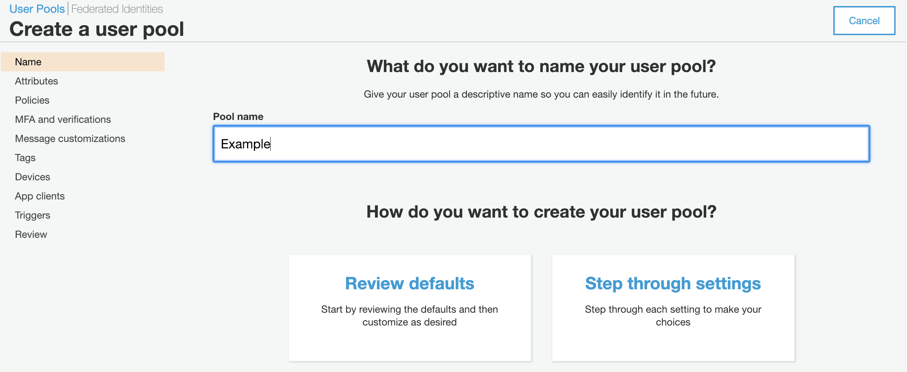

For the **Pool name**, choose something descriptive. Because this user pool is
for https://app.example.com/, we'll name it "Example".

Next, click **Step through settings**. We will be leaving most of the settings
at their default values. However, it's good to look them over if you're not
already familiar with Cognito in order to get a sense of what is possible.

The first section, **How do you want your end users to sign in?**, can be left
alone because users will be signing in via ADFS. The next section, **Which
standard attributes do you want to require?**, needs careful consideration. Pay
close attention to the highlighted text in the screenshot below:

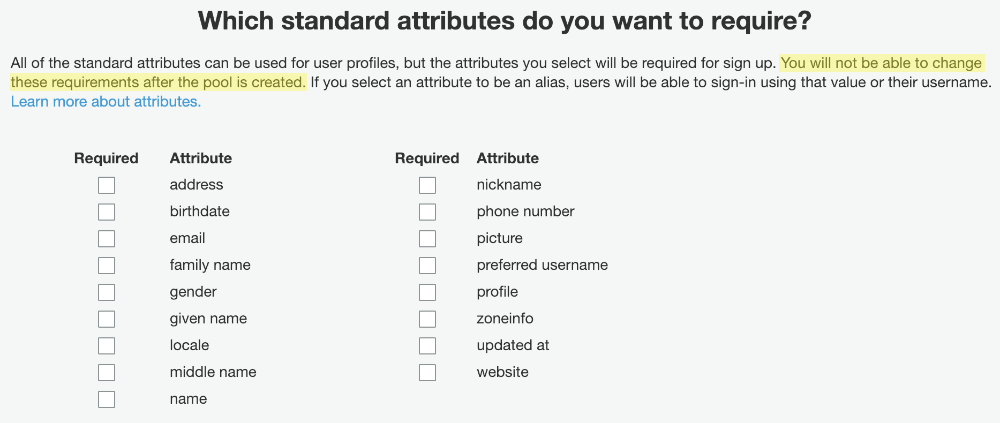

There are a number of standard attributes like `email` and `name` that ADFS can
expose in the authentication response in the form of **claims**. These checkboxes
do not specify which claims will or will not be exposed, nor do they control
how those claims map to these standard attributes; the checkboxes simply indicate
whether or not any of these standard attributes are required in order for a user
to sign up. Unfortunately, we must make these decisions at the time the user pool
is created! We cannot make additional attributes required, nor can we change our
minds about a required attribute suddenly becoming optional. Doing so requires
the user pool to be recreated, which will also require configuration changes in
ADFS for the new user pool identifier.

Until such time that Cognito allows these settings to be modified after the user
pool is created, I recommend not setting any attributes to be required at this
point. If we _do_ end up needing certain attributes to be required, we can
enforce this either within the application or within Cognito using
[Lambda triggers](https://docs.aws.amazon.com/cognito/latest/developerguide/cognito-user-identity-pools-working-with-aws-lambda-triggers.html).
For this post's example, we'll leave all fields unchecked.

We can also choose to create optional, custom attributes under **Do you want to
add custom attributes?** Custom attributes, while optional, cannot be removed
from the user pool after creation. For this example, we won't create any.

Because we'll be using ADFS exclusively for authentication and implicit sign-up,
we can leave the default options on the next several screens by clicking
**Next step**. We _will_ be creating an app client as part of this process, but
there are several configuration values that need to be set that the AWS console
does not let us fill in until the user pool is actually created. So, when we
reach **Which app clients will have access to this user pool?**, we'll click
**Next step** again to get past that as well. Other than setting any standard
attributes as _required_, we can make any changes we need after the user pool
is created.

Finally, we **Create pool**, and make note of the **Pool Id**, which we'll need
later.

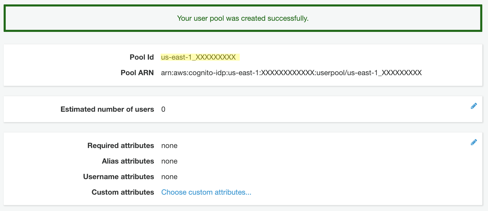

Before we move on to creating the app client, we'll need to create an
**Identity provider** to associate to it when configuring the app client.

### Setting up the SAML identity provider

Start by clicking **Identity providers** on the left menu under the **Federation**
and selecting **SAML**. Then, supply either the metadata document URL
(e.g. `https://example.com/FederationMetadata/2007-06/FederationMetadata.xml`)
or upload the metadata document if your SAML IdP does not publish it anywhere
publicly accessible. Consult your IdP's documentation, or if you're using your
own company's ADFS like I did for this example, check with one of your system
administrators.

After inputting the metadata document, enter a name for the provider. If your
IdP supports sign out flow and you wish to enable it, you can do here. You can
also add any [IdP identifiers](https://docs.aws.amazon.com/cognito/latest/developerguide/cognito-user-pools-managing-saml-idp-naming.html),
if needed. When finished, click **Create provider**.

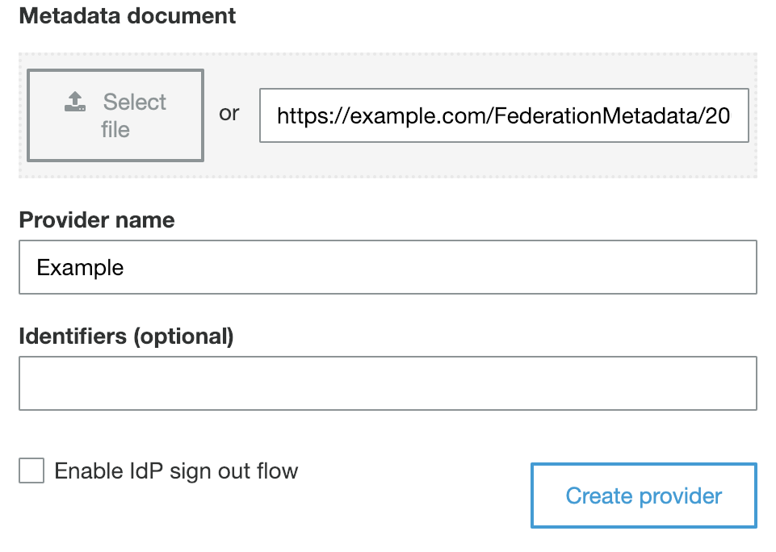

You should now see the provider listed under **Active SAML Providers**.

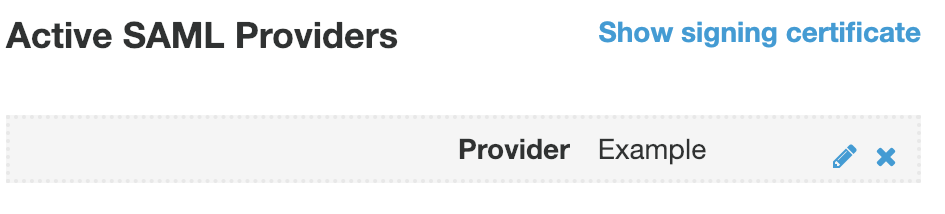

Next, we can set up **Attribute mapping** between the claims exposed via ADFS
responses I mentioned earlier and attributes within the user pool. To do so,
click **Attribute mapping** under **Federation** in the left menu.

Here, we can add several SAML attributes that we want Cognito to capture from
the ADFS claims and store permanently. In the screenshot below, I'm capturing
the **name** and **emailaddress** claims and mapping them to the standard **Name**
and **Email** attributes. If you created any custom attributes earlier, they
would appear in the **User pool attribute** dropdown with the `custom:` prefix.

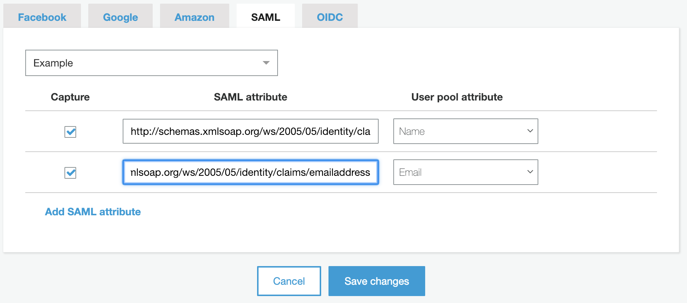

To see which claims are available to you, have a look at your IdP's
`FederationMetadata.xml` file and look for tags in this format:

```xml
<auth:ClaimType
  xmlns:auth="https://docs.oasis-open.org/wsfed/authorization/200706"
  uri="https://schemas.xmlsoap.org/ws/2005/05/identity/claims/emailaddress"
>
  <auth:DisplayName>Email</auth:DisplayName>
  <auth:Description>Email address of the user.</auth:Description>
</auth:ClaimType>
```

**NOTE:** You must specify the full `uri` in the **SAML attribute** input - the
simple `name` or `emailaddress` identifiers will not suffice.

Let's move on to creating our app client!

### Configuring the app client

We'll need an app client to represent our application within. Click **App clients**
on the left menu under **General settings**, then click **Add an app client**
to begin creating one. For this example, we just need to enter a name. The rest
of the settings can be left at their defaults.

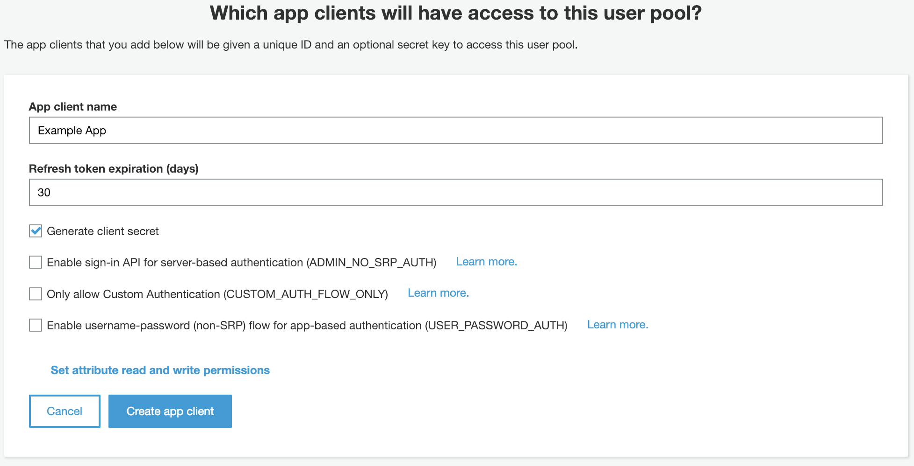

After the app client has been created, click **App client settings** under **App
integration** in the left menu to configure it. We'll need to make sure that our
**Example** identity provider is enabled, the **Callback URL** is entered correctly,
and that **Authorization code grant** and **openid** are checked under the
**OAuth 2.0** settings. For ALB authentication against an ADFS SAML IdP, the
**Callback URL** must be in the form `https://<application domain>/oauth2/idpresponse`.
The `<application domain>` corresponds to the domain where your application is
accessed. In this case, we're using `app.example.com`.

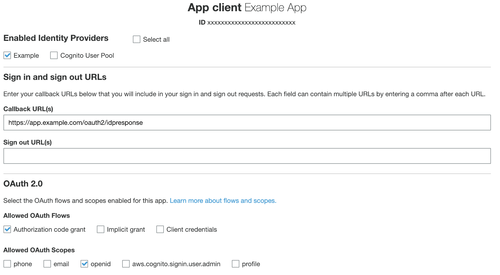

Pay special attention to the **Callback URL**. A small typo, or omission of the
`/oauth2/idpresponse` path portion, easily result in a great deal of lost time
to troubleshooting. If at any point throughout or after this tutorial you
encounter the cryptic error message shown below, there's a good chance an
incorrect **Callback URL** is the cause!

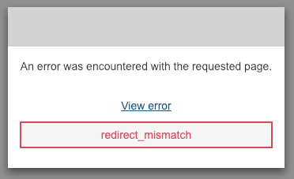

We're almost done with Cognito. The last item on our agenda is choosing a domain.

### Choosing the Cognito domain name

The domain in this case isn't the domain of the application - it's the domain
for the sign-up and sign-in pages used by Cognito itself. In this tutorial,
we're going to use the custom subdomain (`auth.app.example.com`) mentioned at
the start. If you don't have the ability to go that route, enter a **Domain prefix**
in the **Amazon Cognito domain** section. If it's available, you can use it to
create an `https://<your domain prefix>.auth.us-east-1.amazoncognito.com` domain
instead.

To use a custom domain, we'll skip past the **Amazon Cognito domain** section,
and enter our custom authentication subdomain and select our previously created
ACM certificate:

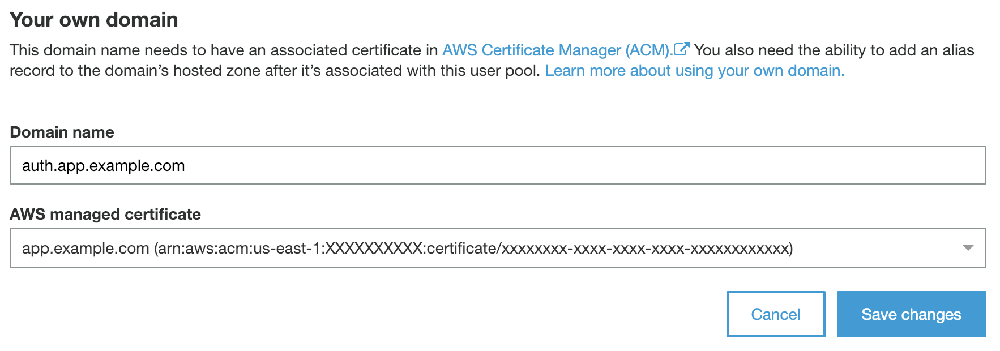

**NOTE:** We _technically_ don't need to have a _real_ application yet in order
to set up ALB authentication, but the custom domain step above will fail if the
parent domain does not have an **A** record associated with it:

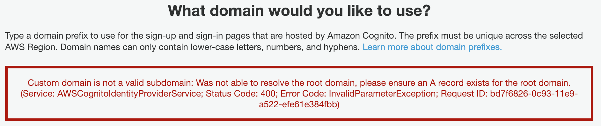

 If you're working on setting up authentication prior to beginning work on the
 application itself, you can work around this limitation by creating an **A**
 record in your DNS configuration for the parent domain name that points to a
 valid IP address that won't actually lead anywhere (such as `0.0.0.0`).

 Otherwise, you can expect to see the following when you click **Save changes**:

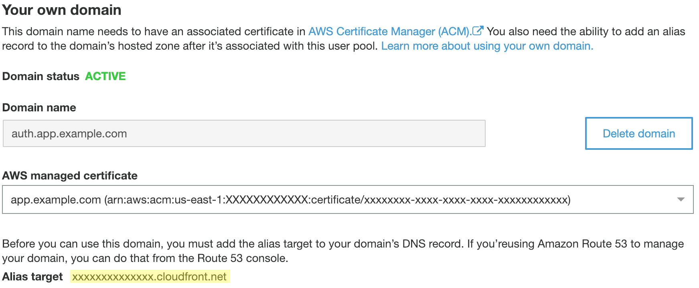

Make note of the **Alias target** and add an **A** record for `auth.app.example.com`
with that as its target. Here's what the record set would look like if you're
using Route 53 for DNS:


### Configuring ADFS

This post assumes you're merely a consumer of the SAML IdP and not the administrator.
Before proceeding, you should contact your ADFS administrator and ask them to
add the new ADFS configuration for your application. They will need the following
information to do so:

  * **Audience URN:** `urn:amazon:cognito:sp:us-east-1_XXXXXXXXX`
  * **Post binding:** `https://auth.app.example.com/saml2/idpresponse`
  * **Claims to provide:**
    * `https://schemas.xmlsoap.org/ws/2005/05/identity/claims/name`
    * `https://schemas.xmlsoap.org/ws/2005/05/identity/claims/emailaddress`

Substitute the example values provided above with the actual values from your
Cognito user pool, custom domain, and `FederationMetadata.xml`.

We're now ready to configure the Application Load Balancer.

### ALB authentication

This tutorial assumes you already have an ALB pointing to your existing application,
so I won't cover how to create one - only how to add authentication. ALB
authentication is only available for HTTPS listeners, so if your application
isn't already sitting behind an ALB listening for HTTPS requests, you will need
to rectify that before proceeding.

Adding authentication to the ALB is fairly straightforward and requires just one
default rule with two actions: "_If the request hasn't already been routed elsewhere,
then (1) authenticate the user and (2) forward the request on to the application
target group._" If all of the earlier steps were completed successfully up until
now, insert a new default action in the first slot as shown below:

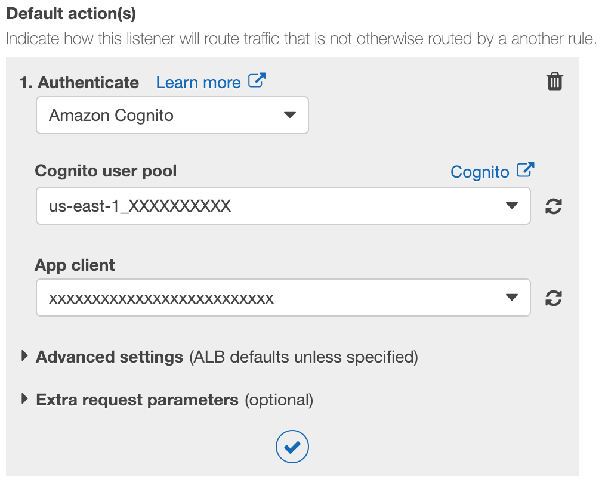

Then, make sure you're still forwarding the request to the application target
group afterwards:

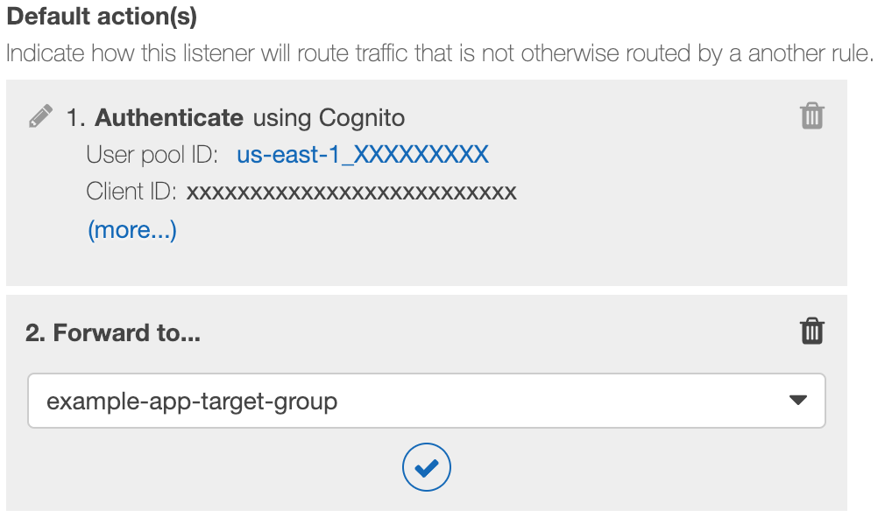

The end result will be something like this:

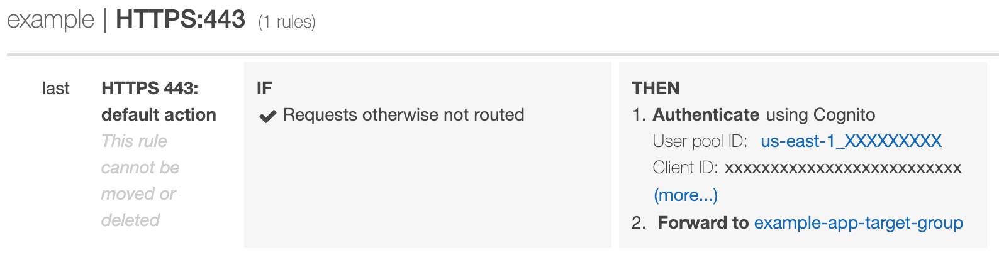

This setup assumes that _all_ endpoints under your application require
authentication. If that isn't the case, you can opt to either (a) add additional
path-based routing rules to bypass authentication for certain pages (such as
landing pages, documentation, and so on), or (b) move all secure endpoints under
a specific path (`/authenticated` or `/secure`, for example) and make all other
destinations not require authentication. I strongly recommend option (a), as
doing so ensures that you'd need to _explicitly_ configure a page to not require
authentication.

**NOTE:** Since ALB authentication only works on secure listeners, you should
also consider adding a listener on port 80 that will all HTTP requests to HTTPS.
This isn't _strictly_ necessary, but doing so ensures that your users always get
to your application even if they accidentally try to access it insecurely. The
`port 80` listener requires just one rule:


### Testing it out

After the Cognito user pool is created, the ALB listeners are configured, and
the ADFS administrator confirms that the configuration for the application has
been added, it's time for a test drive. Head over to any `https://app.example.com/`
page that requires authentication, and you will be redirected to the SAML IdP's
login screen. For example:

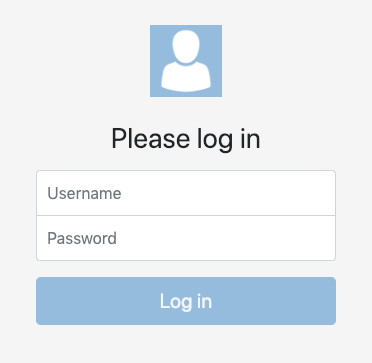

After logging in successfully, you'll be redirected back to your application and
able to access all of the secure pages!

Finally, if we return to our Cognito user pool and select **Users and groups**
under **General settings**, we'll find that Cognito has created a group for our
users...


... and that it automatically adds users who successfully authenticate to the
group:

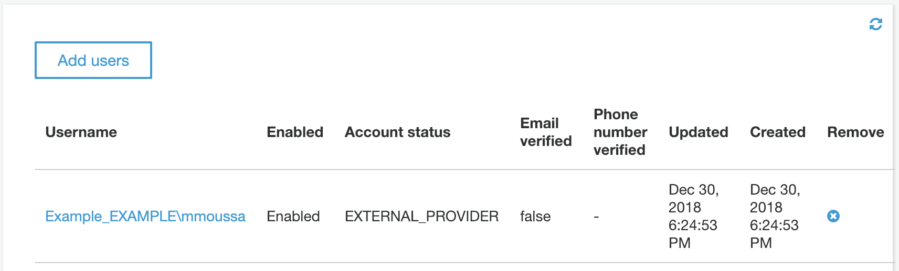

### Conclusion

In this post, we covered the basics of creating a Cognito user pool to support
 ALB authentication with an ADFS SAML IdP. This merely scratches the surface of
 what's possible in terms of application user authentication and identity
 management with Cognito, and I encourage you to dig into the
 [Cognito Developer Resources](https://aws.amazon.com/cognito/dev-resources/)
 that are available in order to explore further. To learn more about ALB
 authentication itself beyond just ADFS SAML IdPs, you can start with
 [https://docs.aws.amazon.com/elasticloadbalancing/latest/application/listener-authenticate-users.html](https://docs.aws.amazon.com/elasticloadbalancing/latest/application/listener-authenticate-users.html).
 You can also check out the [Authentication on Application Load Balancer](https://www.exampleloadbalancer.com/auth_demo.html)
 demo, which features links to various other resources that may be helpful.

 Use the Feedback tab to make any comments or ask questions.
