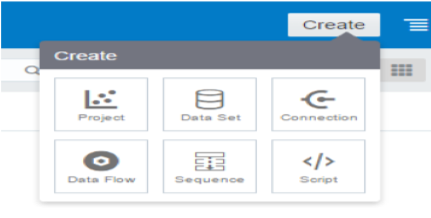
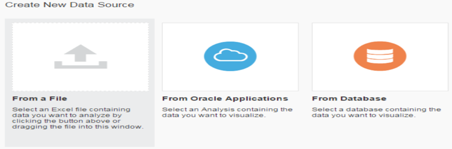
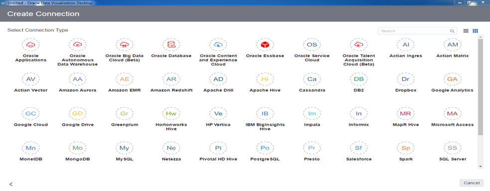
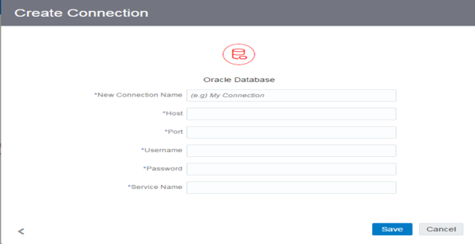
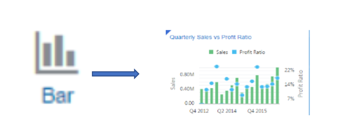
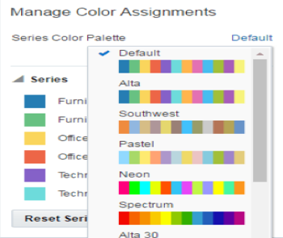
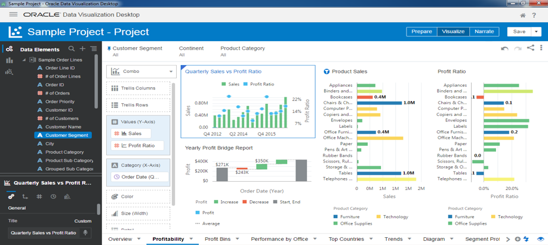
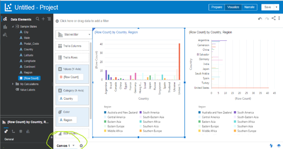
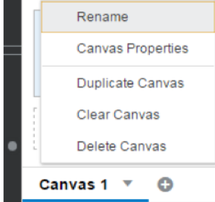

This blog covers how to use the Oracle&reg; Data Visualization Desktop (DVD) to
analyze data.

<!--more-->

### Introduction

Oracle's DVD version 12.2.4.3, released in May 2018, makes it easy to visualize
data. You can upload datafiles or connect to database by using available data
sources.

DVD is a single-user desktop application that provides visualization functionality
to business users. DVD is better than the Oracle Business Intelligence Enterprise
Edition (OBIEE) 12C analyzer and is a user-friendly tool.

### Benefits

DVD offers the following benefits:

-	A personal, single-user desktop application: Install on personal systems and
   analyze the data there.

-	Offline availability: Shared and imported projects are always available.

-	Completely private analysis: Analyze data without depending on others.

-	Full control of data source connections: Choose from many connection types
   that provide secure connections.

-	Direct access to on-premises data sources: Connect to the database by using VPN.

-	Lightweight single-file download: Directly download and install the `.exe` file.

-	No remote server infrastructure: Easily manage the standalone application
   on your personal system.

-	No administration tasks: Administrative tasks like start, stop, and upgrade
   are not required.

### Installation

DVD installation has the following minimum system requirements:

- Operating system: Microsoft&reg; Windows&reg; x64 (64-bit) 7 SP1+, 8.1, or 10;
  Windows Server&reg; 2012 R2; MacOS&reg; Sierra (10.12) or High Sierra (10.13)

- CPU: Intel&reg; Core&trade;2 Duo CPU E8400 @ 3.00 GHz, 2992 Mhz 2 Cores, 2
  logical processors or faster

- Memory: 4.00 GB memory or more

- Minimum free disk space: 2 GB plus space for any uploaded data files

- User privileges: Administrative privileges to install

To install DVD, download and run the installation file from
[Oracle](https://www.oracle.com/technetwork/middleware/oracle-data-visualization/downloads/oracle-data-visualization-desktop-2938957.html).

The following image shows the DVD home page after installation.

### Features of DVD version 12.2.4

DVD features include the following items:

-	New data connector types
-	Duplicating data sets
-	Machine learning (ML) capabilities to make predictions and intelligent suggestions
-	Data flow enhancements
-	Data source editor changes
-	Updates to projects and visualizations including map backgrounds

### Create a project and choose a data set

By using DVD, you can analyze data from various data sources such as Microsoft
Excel&reg;, database, and Oracle applications, by creating a project and data
sets to fetch data.

To create a project, use the following steps, as shown in the following image:

1. Go to the Main Menu.

2. Select **Project**.

3. Click **Create**.

4. Click **Data Set**.

After you click **Data Set**, you must select from the data sources as shown in
the following image:

**From a File**: You can upload an Excel file (assuming the first row of the
spreadsheet is column headings).

**From Oracle Applications**: You can connect to live OBIEE instances, where
OBIEE reports as direct sources.

**From Database**: You can connect to various databases such as Oracle, DB2&reg;,
MySQL&reg;, MongoDB&reg;, and so on.

### Connect to a database

When you select **From Database**, you see the available database connection
types as shown in the following image:

When you select **Oracle database**, you are prompted for connection details as
shown in the following image:

After the data source is connected, click on **Create Data Set** on the home page
and select the tables to use by clicking on the available schemas in the database.
After the Data Set is created, you can modify the columns or add new columns in
the Data Set.

You can use *Shift+click* or *Ctrl+click* to select multiple columns. Click
**Add Selected** to add the columns you selected, or click **Add All** to include
all the table columns in the data source. Drag identical columns to the dashboard
data element, and click **Change Visualization Type** in the canvas as shown
in the following image:

The visualize canvas has a color section, which allows you to make the
visualization more attractive by adding colors to measure values, as shown in
the following image:

The following image shows the project view after you add data elements to the
dashboard:

Each canvas at the bottom of the dashboard can have multiple visuals of data.

You can duplicate the canvas and visuals, and you can change the visualization
depending on your needs. You can also add an image to canvas such as adding
client logs to dashboard.

The following images show the canvas view:

### Importing and sharing

DVD has options to share the project files with other users and to import
project files shared by external users. When you share the project, you need to
give the password for protecting the file.

#### Importing

Follow these instructions to import a project or application:

1.	Go to Home page.
2. Click **Projects**.
3. Click **Page Menu**.
4. Select **Import**.
5.	In the **Import** dialog, click **Select File** or drag a project or application
   file onto the dialog.
6. Click **Import**.

#### Sharing a project
Follow these instructions to share a project:

1.	Go to Home page.
2. Click **Projects**.
3. Select the project or folder that you want to share.
4.	Click **Actions**.
5. Select **Share**.
6. Click **File**.
7.	In the **File** dialog, click **Include Data** to include the data with the
   project or folder.
8.	If you want to include the data source connection’s user name and password
   with the exported project, click **Connection Credentials**.

### Differences between Oracle DVD and 12C OBIEE VA

Following are the major differences between Oracle DVD and 12C OBIEE VA:

| **Oracle DVD** | &nbsp; &nbsp; &nbsp; &nbsp; | **12C OBIEE VA** |
|---|---|---|
| DVD runs on 64-bit system only | &nbsp; &nbsp; &nbsp; &nbsp; | Runs on 32- or 64-bit systems and browser compatibility is required |
| Easy installation as it’s standalone | &nbsp; &nbsp; &nbsp; &nbsp; | Installation & configuration required at server level           |
| More than 30 visual elements are available | &nbsp; &nbsp; &nbsp; &nbsp; | Seventeen visual elements are available                         |
| Desktop application - no login is needed | &nbsp; &nbsp; &nbsp; &nbsp; | It’s accessible by using browser and a login is required        |

 

### Conclusion

Oracle DVD is a simple business intelligence (BI) tool that is used to analyze
data, and it doesn’t need to connect data warehouse instances. Easy to install
on a desktop, DVD enables you to analyze data by connecting with various data
sources. It’s a user-friendly tool and can be used by anyone with minimal
knowledge of analysis.

Use the Feedback tab to make any comments or ask questions.

Learn more about Rackspace's [Business Intelligence solutions](https://www.rackspace.com/business-intelligence)
and our [database services](https://www.rackspace.com/dba-services).
