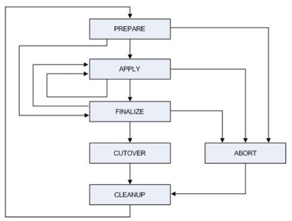

This blog reviews the importance of running an ADOP (Application DBA Online
Patching Utility) cycle with `fs_clone` after any changes or technology patches
are made to the Weblogic Server (WLS) or Oracle&reg; Fusion Middleware (FMW)
home directories on your patch file system. The blog explores a problem scenario
and explains how to handle related issues easily.

<!--more-->

### The ADOP cycle phases

The following image shows the phases of the ADOP cycle:

Image Source: [https://docs.oracle.com/cd/E26401_01/doc.122/e22954/T202991T531065.htm](https://docs.oracle.com/cd/E26401_01/doc.122/e22954/T202991T531065.htm)

### Problem history

After applying Critical Path Update (CPU) patches to an Oracle version R12.2
instance on a patch file system, ADOP completed a full cycle run (prepare, apply,
finalize, cutover, and cleanup). After running another ADOP cycle for a different
activity, the instance was cloned to another server.

However, when applying WLS patches on the new cloned environment, the system
encountered a conflict. The patch was pointing to a version mismatch of the WLS.

### Analysis

Research showed that the CPU patches previously applied to WLS and FMW Web Tier
and Oracle common home directories were not included in run and patch file system.
On further investigation into the ADOP logfiles, we noticed the prepare file
synchronized the file system, however we couldn't see the changes made to the
**Oracle\_home** and **FMW\_home** directories during the patching cycle.

### Deduction:

From our analysis, we draw the following conclusions:

1. The file synchronization in the prepare phase is only for the **APPL\_TOP**.

   The log files we reviewed showed propagating file system changes from run
   **APPL\_TOP** to patch **APPL\_TOP**.

2. After Weblogic patches were applied, `fs_clone` was not run before initiating
   the next ADOP cycle.  Thus, the new patches don't show up in the successive
   run even after the second ADOP cycle completes, and it was not available in
   the cloned instance.

### Recommendation

In the prepare phase, the patch file system is usually synchronized with the run
file system by creating a new database edition. This is a default incremental
synchronization of files that are changed on the application top.

To synchronize the applied patches, invoke `txkADOPPreparePhaseSynchronize.pl`
to the **$APPL\_TOP** of run file system from the last patching cycle or invoke
`fs_clone`. In this case, we don't call the actual `fs_clone`. Instead, we call
`FsCloneStage` and `FsCloneApply` for the $APPL_TOP, which is very unsynchronized.

The file system synchronization method is selected automatically based on the
Configuration Change Detector (`adConfigChangeDetector.pl -detectConfigChanges`).

Different file synchronization methods include the following options:

**Option 1** – identify patches from the database that were applied in the last
ADOP. Merge and apply these silently. This process takes less time because
the system applies only the unapplied patches.

**Option 2** – Recreate or reclone the run file system **$APPL\_TOP** to
the patch file system **$APPL\_TOP**. This is extremely unsynchronized and
consumes more resources.

**Option 3** – Use the third-party software of your choice (such as `rsync`) to
synchronize the file system.

### Parameters passed with prepare

`Prepare` uses the following parameters:

a) Use the `Skipsyncerror` option in the ADOP prepare phase to ignore errors and
   warnings as a workaround for synchronization errors and failures, which might
   happen if the patch application failed in a previous patching cycle. The
   default value is **NO**.

   **syntax:** `adop phase=prepare skipsyncerror=yes`

b) Use the `sync_mode` option to specify the method to use to sync the patch file
   system with a run file system.

   **syntax:** `adop phase=prepare sync_mode=(delta|patch)`

   `sync_mode patch` – Reapplies patches which were already applied to run
   file system (default mode).
   `sync_mode delta` – Copies all customizations and file changes. This mode
   uses the synchronization command from the file **delta\_sync\_drv.txt** and
   is a new feature from `AD-TXK delta 8`.

### ADOP fs_clone command

 The `fs_clone` command recreates or reclones the entire patch file system
 including setting all configurations and customizations on the patch file
 system in the same manner as the run file system. Doing this is as resource
 intensive as taking a full backup of the run file system and then creating a
 patch file system.

`fs_clone` has the following useful commands:

- `adop phase=fs_clone force=yes ` - Restarts a failed clone from beginning
   (default=NO).

- `adop phase=fs_clone s_fs_backup_count=1` - Sets the number of backups of the
   patch file system to be preserved before it can be recreated from the run
   file system (default=0 no backups are taken).

### Key takeaways

Even though the prepare phase runs at the start of every patching cycle, the
technology stack patches (applied by the `opatch/Smart update` utility) are not
synced in the prepare stage.

Prepare does not synchronize any changes done manually like:
-	Compiling user-defined JSPs.
-	Copying third party libraries.
-	Copying and compiling user-defined concurrent programs.
-	Copying and generating user-defined forms.

You must add the custom patching actions (like those described previously) in the
custom synchronization driver, `adop_sync.drv`, in the prepare phase.

In the file, `adop_sync.drv`, the following categories of commands exist:

-	Run one time only
-	Run at each file system synchronization

To copy customizations and file changes in prepare phase, use the following
command:

`ADOP phase=prepare sync_mode=(delta|patch)`

If any patches aborted or any maintenance or Release Update Pack (RUP)
patches are applied, `fs_clone` must be run at the end to recreate the patch
file system as an exact copy of the run file system.

### Conclusion

Whenever any changes are done to Weblogic Server or Fusion Middleware components
of E-Business Suite Release 12.2, it is imperative that database administrators
run `fs_clone` to ensure that the patch file system is updated with all the
latest changes that were performed to WLS or FMW of the run file system.

Use the Feedback tab to make any comments or ask questions.

Learn more about our [database services](https://www.rackspace.com/dba-services).
