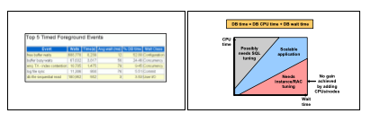
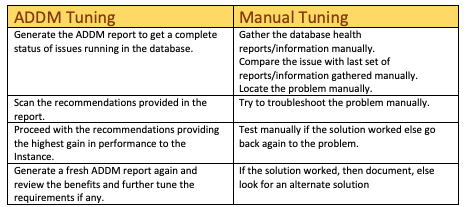
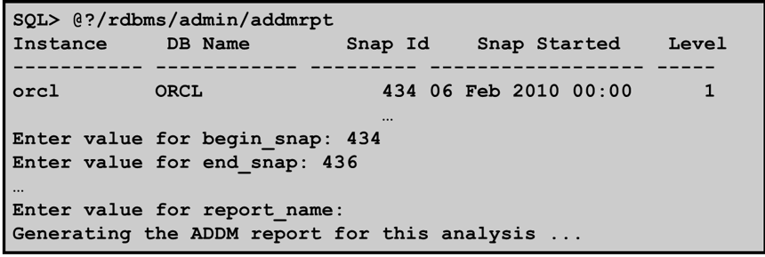
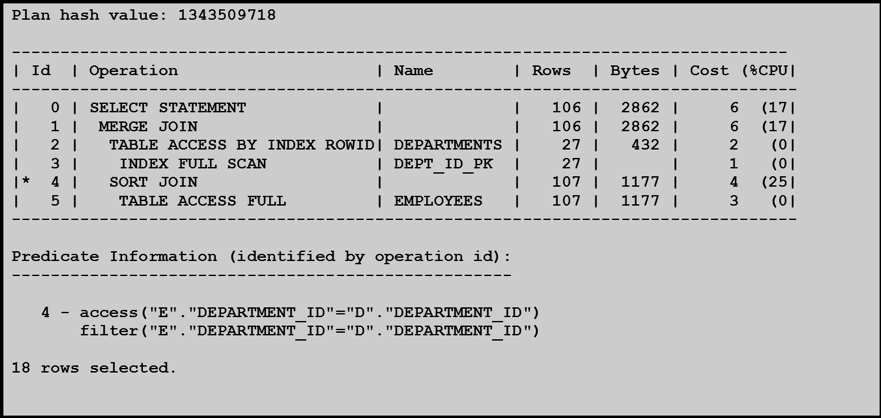
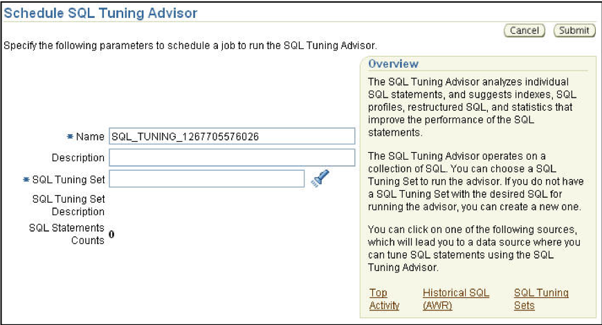
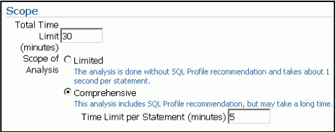
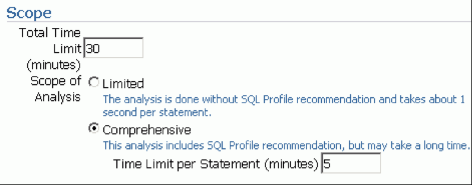
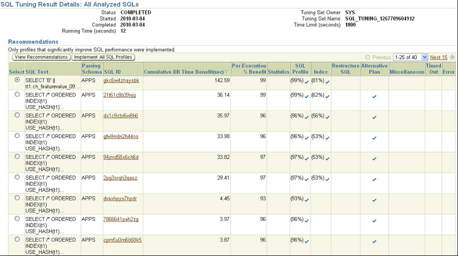
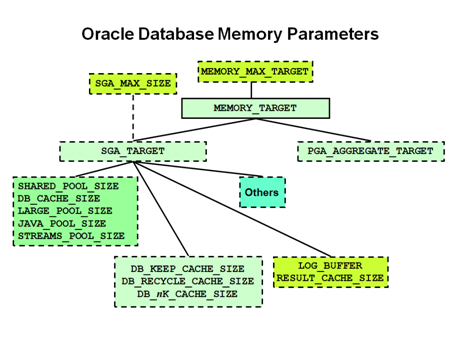
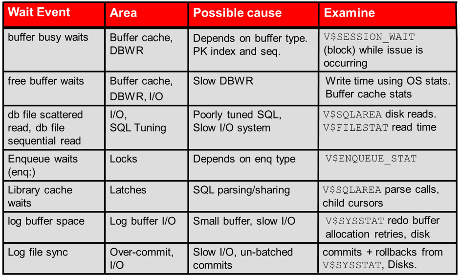

Doing performance tuning on your database is one of the most common and yet the
most important activity that every database administrator (DBA) must perform on
an ongoing and regular basis. Experts recommend that you regularly fine-tune
databases to optimized performance. Fine-tuning helps users to run their reports
and queries faster and get results quicker. This post shares some techniques for
troubleshooting and tuning Oracle&reg; databases.

<!--more-->

### Tuning steps

To start with, you need to identify the area where the problem is occurring.
Possible areas that can trigger the problem include the operating system,
database, memory shortages, and so on. After you have identified a problem area,
you can proceed with tuning the area for maximum benefits. This blog focusses
on only performance tuning.

Oracle has given DBAs a few tools to help with diagnosing problems and
troubleshooting performance issues. These tools include the Automatic Database
Diagnostic Monitor (ADDM) and Automatic Workload Repository (AWR) reports, which
you can generate for the problematic time-period and use in your analysis. You
should use the tools to look for skewed or tunable components.

### Top Timed Events in AWR reports

AWR is a tool with which you can generate a report that summarizes memory usage
in a statistics form by a particular instance. To generate an AWR report,
run the following file in a sqlplus prompt:

    @$ORACLE_HOME/rdbms/admin/awrrpt.sql

This generates an AWR report in HTML format by  using a pre-stored template.
After you have generated the AWR report, you can quickly see the **Top Timed
Events** section in the AWR report, which identifies the problematic area, as
shown in the following image:

### ADDM tuning Session

Normally, when an issue is reported, the DBA might troubleshoot only that area
or resolve that specific problem. However, if the issue is not correctly
identified and addressed, it might lead to bigger problems in future. The DBA
can miss the bigger picture here. To help DBAs get a bigger and a complete
picture about database issues, Oracle has provided another tool for DBAs, ADDM.
An ADDM tuning session follows a procedure similar to the manual tuning session.
The following image shows a comparison:

*Image source:  Oracle 11G Performance Tuning training manual*

Retrieve ADDM reports by using SQL or through Oracle Enterprise Manager (OEM).
The following image shows sample SQL:

### Bad SQL and execution plans

After the AWR or ADDM report identifies sections of bad SQL/SQLID, you can use
DBMS\_XPLAN to gather more information about them. The DBMS_XPLAN package
supplies the following table functions that you can use to retrieve and display
the execution (exec) plan:

    DISPLAY
    DISPLAY_AWR
     select plan_table_output from table (DBMS_XPLAN.DISPLAY_AWR('fs22b3fgfh8xc'));
    DISPLAY_CURSOR

The following image shows sample output from the `EXPLAIN PLAN` command and
identifies whether the query is using a full table scan or narrowing down the
data by using some indexes:

ADDM reports reflect whether you can achieve any performance benefit by creating
some new indexes. You can also run the SQL Tuning Advisor from OEM to fine tune
the queries and possibly use a better execution plan. Most of the time, using
a better plan for problematic SQL resolves the major performance issue.

### SQL Tuning Advisor

SQL Tuning Advisor helps analyze SQL statements and obtain performance
recommendations by using SQL authorization ID (SQLID) to analyze and suggest
solutions. SQL Tuning Advisor analyzes the following sources:

- Top activity: Analyzes the top SQL statements currently active.
- SQL tuning sets: Analyzes a set of SQL statements that you provide.
- Historical SQL (AWR): Analyzes SQL statements from statements collected by
  AWR snapshots.

The following screenshots show some examples:

### Long running requests

In Oracle eBusiness Suite databases, the issue of long running requests mostly
crops up where a few concurrent requests keep on running. To resolve this, you
need to gather more information about the database session associated with the
concurrent requests. The following image shows steps to collect this

information:

### Oracle Database memory parameters

After reviewing the AWR reports, a DBA can easily identify the cache that
requires fine tuning because the cache hit ratio is lower for that cache than
it is for other caches.  The following image shows a few of the top database
parameters that you must consider for instance-wide memory tuning.

*Image source:* [https://ora-performance-tuning.blogspot.com/2014/02/automatic-shared-memory-management.html](https://ora-performance-tuning.blogspot.com/2014/02/automatic-shared-memory-management.html)

### Commonly observed wait events

The following table shows some common wait events and their possible causes:

*Table source: Oracle Performance Tuning 11G OCP training manual,  chapter 20, page 24*

### Top 10 tuning issues

Customers commonly face the following top 10 tuning issues:

-	**Bad connection management:** Developers write the code to connect to the
database in the application or run queries to fetch the data from the database.
After the data has been fetched and nothing more is required, the code should
close the connection to the database. However, this often doesn't happen, which
leads to an increased number of inactive sessions in the database. These sessions
use precious resources that could have been used for other active connections.

-	**Bad use of cursors and shared pool:** A cursor is a tool in the arsenal of
a Developer that mostly stay unutilized. Without cursors, Oracle has to hard
parse the code every time it's run. This hugely impacts the performance of SQL
queries that are run repeatedly. A DBA can identify this problem by looking into
the **Instance Efficiency Percentages - Execute to Parse %.** AWR report section.

-	**Bad SQL:** The way that an SQL query is written (with join conditions to
fetch the data) significantly affects the performance of that SQL, after it's
executed. You should avoid full table scans for large tables. After SQL has
been prepared, developers and DBAs should run an explain plan on that SQL to
understand the cost of running it in the database. By using cursors, bind
variables, and indexes, you can increase the efficiency.

- **Use of nonstandard initialization parameters:** DBAs should always use only
standard or recommended initialization parameters. Use non-standard initialization
parameters only when they are suggested by an Oracle Service Request (SR).

-	**Getting database I/O wrong:** When a DBA choosing database hardware should
try to distribute the database over multiple disks and involve the network team
in a discussion about the speed with which data will be traveling to end users
from the database server and back. A DBA should take into consideration the
speed of the network switches and routers to avoid any bottleneck or performance
issues.

-	**Redo log setup problems:** Redo logs are required to store the data from
redo buffer so that Oracle can redo the transactions in case of any crash. If
the redo log size is inadequate, then multiple switches might happen in the
database that cause performance issues. This also increases the load on the
archive generation.

-	**Serialization of data blocks in the buffer cache:** This happens due to
a shortage of free list groups or undo segments. This situation arises for
insert-heavy databases with a large base of active users but fewer undo segments,
which ultimately leads to performance issues.

-	**Full table scans:** Check for full table scans in queries by running an
explain plan. Normally, a query that does full table scans reflects bad SQL
design, which can be corrected by using indexes and by narrowing the data
required. In few cases, full table scans can be beneficial, especially in the
case of small tables.

-	**Recursive SQL:** Recursive SQL can be a boon to developers if used correctly,
but it can be a double-edged sword. Done right, it provides the output
efficiently. Otherwise, it hugely impacts the performance of the database.

-	**In-disk sorting:** In-disk sorting is a very expensive task for database.
It indicates poor SQL design and bad optimization. You can identify the issue
in the **Instance Activity Stats – Sorts (disk)** AWR report section.

### Conclusion

While DBAs must consider different areas for performance tuning, in the database
world, performance tuning starts from the database and application design stage.
Databases and applications that are designed with performance tuning perspective
in mind are much more scalable than applications designed without performance
tuning consideration.

The performance tuning points covered in this blog are just a tip of the iceberg.
I recommend that fellow DBAs keep reading more on the topic to take care of the
database performance overall.

Use the Feedback tab to make any comments or ask questions.

Learn more about our [database services](https://www.rackspace.com/dba-services).

Rackspace has extensive knowledge of Oracle products. Learn more about how we
can maximize your [Oracle investment](https://www.rackspace.com/oracle).

