The NetScaler Application Delivery Controller (ADC) is a Citrix&reg; Systems
core networking product. ADC improves the delivery speed and quality of
applications for an end user. The product helps business customers perform
tasks such as traffic optimization, L4-L7 load balancing, and web app
acceleration while maintaining data security.

<!--more-->

### Introduction

NetScaler ADC monitors server health and allocates network and application
traffic to additional servers for efficient use of resources. It also performs
several kinds of caching and compression. It can be used as a proxy server to
process Secure Socket Layer (SSL) requests instead of servers (SSL offloading).

This blog covers the basic Hyper Text Transfer Protocol (HTTP) site load
balancing configuration.

### Typical load balancing traffic flow

The following steps comprise the typical load balancing traffic flow for NetScaler:

1.	A user enters a URL into their browser.
2.	The URL's Domain Name Server (DNS) record points to one of the public Virtual
   Internet Protocols (VIP) on NetScaler and identifies the traffic's
   protocol (such as HTTP port 80 traffic).
3.	NetScaler then passes that traffic to one of the servers in the server pool,
   based on the balancing method defined (such as round robin, persistence, and
   so on).
4.	The servers send back the page or application that the user requested by
   using a Load Balancing Virtual IP (LBVIP).
5.	The LBVIP routes the traffic to the Internet by setting the source to `LBVIP`.
6.	The web page or application displays on the user computer.

The following image shows this traffic flow:

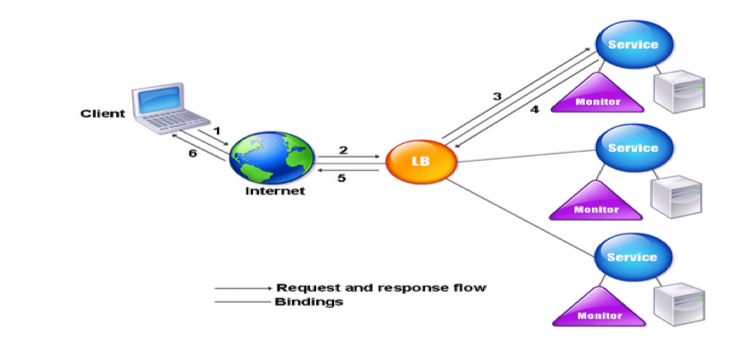

*Image Source:* [https://docs.citrix.com/en-us/netscaler/12/load-balancing/load-balancing-configure-monitors.html](https://docs.citrix.com/en-us/netscaler/12/load-balancing/load-balancing-configure-monitors.html)

### Prerequisites

Before configuring NetScaler load balancing, perform the following steps:

1. Load the necessary license to NetScaler.
2. Configure the `MGMT` port for management access.
3. Configure DNS servers and the Subnet IP Address (SNIP) in the same server subnet
   and allow the Virtual Local Area Network (LAN) in the switch trunk port that
   is connected to NetScaler.

### Configuration

To configure NetScaler load balancing, perform the following steps:

#### Add backend servers

To add the backend servers, perform the following steps:

1. Connect to the management IP of your NetScaler.
2. Select **Login > Configuration > Traffic Management > Load Balancing > Servers**.
3. Click **Add**.

   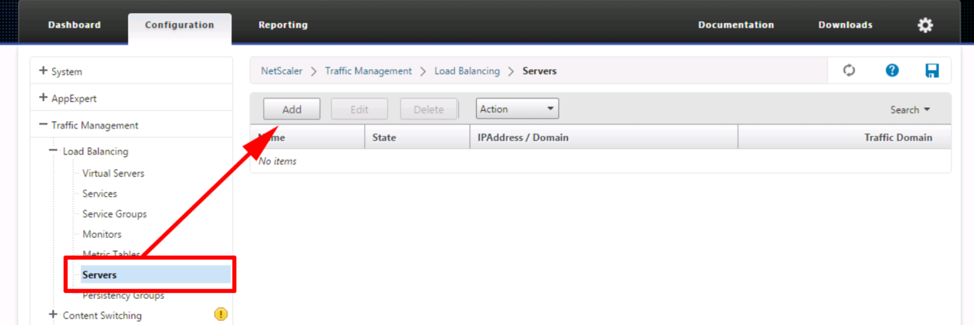

<ol start=4>
    <li>Choose a naming convention for the first server and enter its IP address.
   This example uses `Web-01`.</li>
    <li>Click <b>Create</b>.</li>
</ol>

   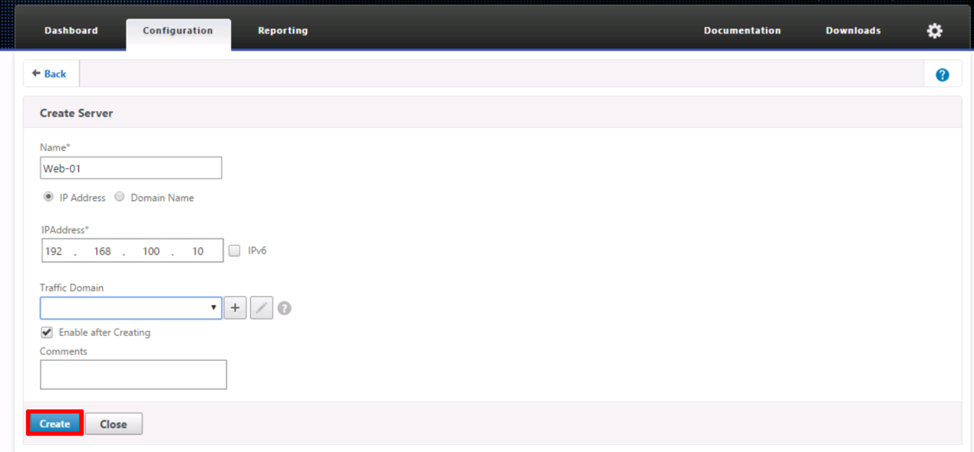

<ol start=6>
    <li>Repeat steps 3 and 4 for the other backend web servers.</li>
</ol>

   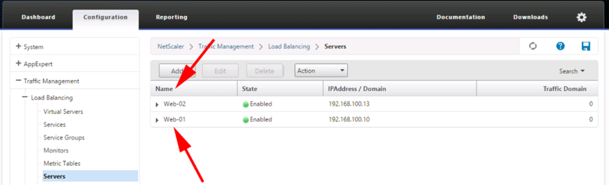

#### Create a service group

To create a service group, perform the following steps:

1. Group these servers together in a service group configuration by choosing
   **Traffic Management > Load Balancing > Service Groups**.
2. Click **Add**.

   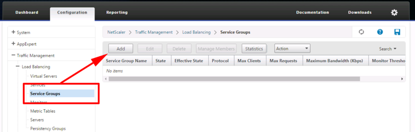

<ol start=3>
    <li>Name the service group and set the protocol to <b>HTTP</b>.</li>
    <li>Click <b>OK</b>.</li>
</ol>

   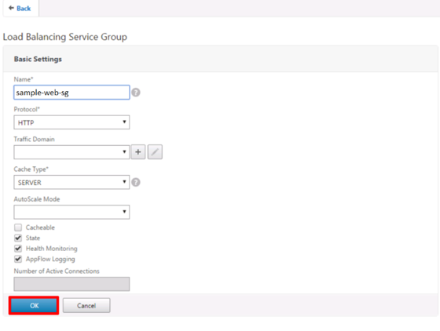

<ol start=5>
    <li>Click <b>No Service Group Member</b>.</li>
</ol>

   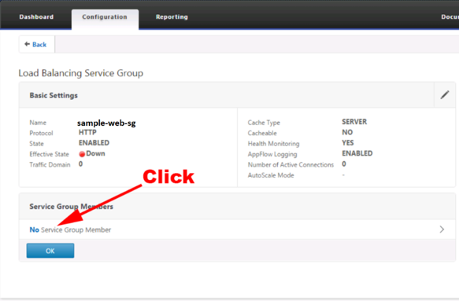

<ol start=6>
    <li>Click <b>Server Based</b>.</li>
    <li>Select all the servers with the search arrow or add servers directly by
    IP base instead of creating them individually.</li>
    <li>Set the server listening port (For example, the HTTP protocol is TCP port 80).</li>
    <li>Click <b>Create</b>.</li>
</ol>

   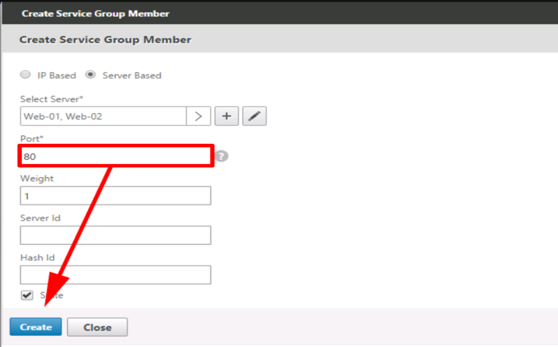

<ol start=10>
    <li>Click <b>OK</b>.</li>
</ol>

   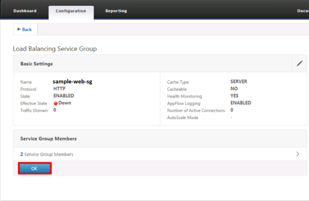

#### Change the monitoring

To change the monitoring, perform the following steps:

1. Change the monitoring from `SNIP` to `Backend servers`.

   

<ol start=2>
    <li>Click <b>No service Group Monitor Binding</b> and select the required
    monitoring binding. In this case, choose the HTTP NetScaler that has a
    monitor for HTTP preconfigured.</li>
    <li>Click the search arrow, select <b>http-ecv > Bind</b>.</li>
    <li>Click <b>Done</b>.</li>
</ol>

   

#### Create a virtual server

To create a virtual server, perform the following steps:

1. Create a virtual server by choosing **Configuration > Traffic Management >
   Load Balancing > Virtual Servers**.
2. Click **Add**.
3. Give the virtual server a name.
4. Set the protocol to `HTTP`.
5. Specify the IP address, which should be the VIP that NetScaler presents to
   the outside world.
6. Set the port to `80`.
7. Click **OK**.

   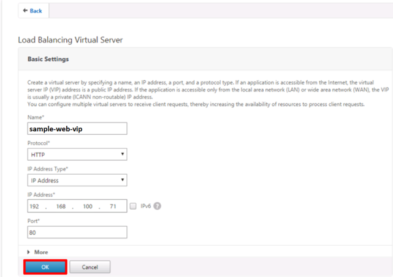

<ol start=8>
    <li>Add the previously created group by clicking <b>No load balancing Virtual
   Servers Service Group Binding</b> and click <b>Select</b>.</li>
</ol>

   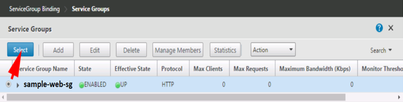

<ol start=9>
    <li>Click <b>Bind</b> and click <b>Done</b>.</li>
</ol>

   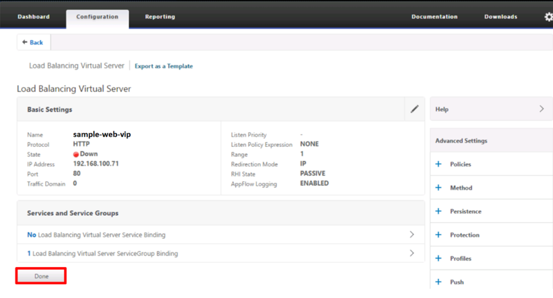

<ol start=10>
    <li>Save your work and wait for the VIP to come up.</li>
</ol>

   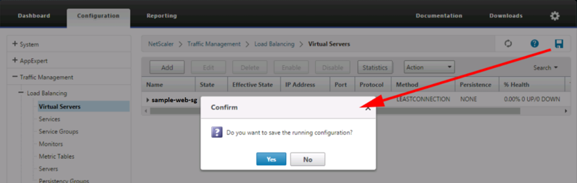

### Test the configuration

To test the configuration, use different web **Welcome** pages on each of the
servers. When you refresh the page, you can see that the NetScaler is doing its
job and balancing the requests across both back-end web servers as shown in the
following image:

   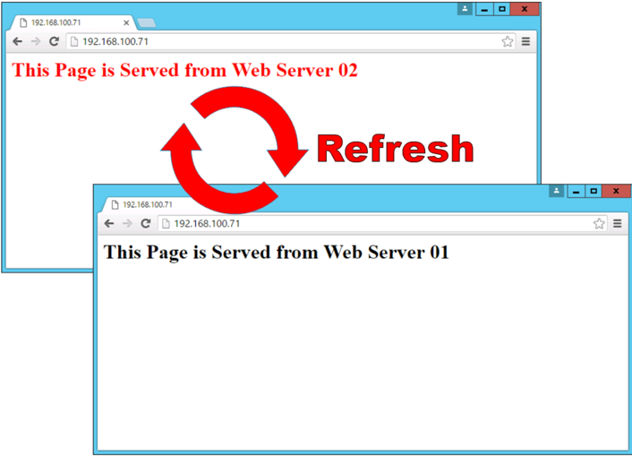

### Conclusion

Use a load balancer to distribute the load across multiple web and application
servers. Load balancers can also do SSL offloading to expose the application or
URL to the Internet in a secure way by installing an SSL certificate. If you
have only one back-end server with SSL offloading, you should install the SSL
certificate on the server and expose the server to the Internet with all the
appropriate security measures and patches. You should open only the required
ports on the firewall for the LBVIPs or the back-end server with SSL offloading
when you expose it to the Internet.

Use the Feedback tab to make any comments or ask questions.

Learn more about [Rackspace application services](https://www.rackspace.com/application-management).
