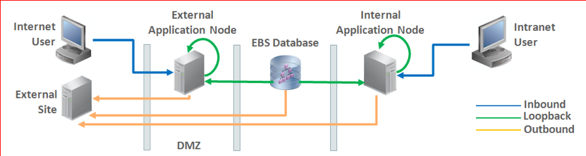
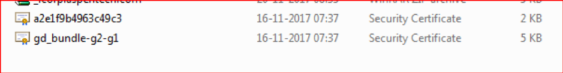
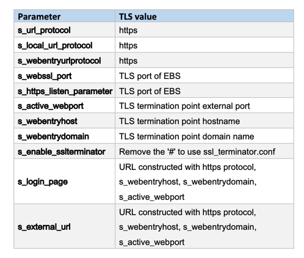

This blog introduces transport layer security (TLS) and explains how it differs
from secure socket layer (SSL). It also includes essential step-by-step instructions
to enable TLS in Oracle&reg; E-Business Suite&reg; (EBS) R12.

<!--more-->

### What is TLS?

TLS is an upgraded version of SSL and provides secure communications between the
client and server. Because TLS uses a symmetric cryptography algorithm to encrypt
the data, the data transfer is more secure and stable than the transfer is by
using SSL.

### Why to use TLS with EBS?

As you likely know, EBS uses inbound, outbound, and loopback connections and
shares business critical information with EBS users. Thus, more chances
of  data theft, data tampering, and message forgery are possible. However, by
enabling TLS with EBS, you can avoid all of these problems.

The following image illustrates the connection flow in EBS:

Image source: Enabling TLS in Oracle E-Business Suite Release 12.1 (Doc ID 376700.1)

### Implement TLS with EBS

Perform the following tasks to enable TLS with EBS:

- Upgrade the Java Development Kit (JDK&reg;) and Web Home.
- Apply mandatory patches.
- Configure OpenSSL&reg;.
- Generate a **.csr** file.
- Get the certified .csr file from a certificate authority (CA).
- Download and import the certificates into EBS.
- Make configuration changes.
- Run AutoConfig.
- Verify the URL.

#### 1. Upgrade JDK and Web Home

Upgrade to JDK 7 or above, and upgrade Web Home to version 10.1.3.5.

#### 2. Apply mandatory patches

Install the following patches (or the most recently released patch):

- Oracle Opatch (6880880)
- Oracle Critical Patch Updates (CPU)
- Oracle HTTP Server (OHS) (27078378)
- Oracle Process Manager and Notification Server (OPMN) (27208670)
- EBS (22724663, 22922530, and 22974534)

#### 3. Configure OpenSSL

Create an OpenSSL configuration file by executing the following commands:

    cd $INST_TOP/certs/Apache
    mkdir WildcardCert
    cd $INST_TOP/certs/Apache/WildcardCert

Create the following **new.cnf** file to use as a response file for OpenSSL:

    cat new.cnf
    [req]
    prompt = no
    default_md = sha256
    distinguished_name = dn
    req_extensions = ext
    [dn]
    CN = *. corp.aspentech.com
    O = Aspen Technology Inc
    OU = IT
    L = Bedford
    ST = Masachett
    C = US
    [ext]
    subjectAltName = DNS:*. corp.aspentech.com

#### 4. Generate a .csr file

Use the following steps to generate a **.csr** file:

1. Run the following command to generate .csr file:

        $ openssl req -newkey rsa:2048 -nodes -keyout server.key -sha256 -out new.csr -config new.cnf
         Generating a 2048 bit RSA private key
         ......................................+++
         ........................................................................................+++
         writing new private key to 'server.key'

2. Verify the **.csr** on **https://www.sslshopper.com/csr-decoder.html**

3. If the information is correct, send the **.csr** to a CA.

#### 5. Get the certificate from the CA

The CA should send you a server certificate and certificate chain files.

#### 6. Download and import the certificate files

After receiving the server certificate and certificate chain files from the CA,
perform the following steps:

##### Download files

Download the archive file onto your desktop, unzip the archive into new folder, and
create a wallet. You should see two files, as shown in the following image:

The file that starts with `a2e` is the main file, and the one that starts with
`gd` is the intermediate file.

Open the main file and save the **root** (or main) certificate as a **.crt**
file. Similarly, open the intermediate file and save it also as a **.crt**
file. Upload all files to the server.

##### Create an Apache directory

Execute the following commands to create an Apache&reg; directory. If an Apache
directory already exists, backup the old Apache directory first.

    cd $INST_TOP/certs/
    mkdir Apache

##### Create a wallet directory

Execute the following command to create an empty wallet directory on the application
node:

    orapki wallet create -wallet /u01/app/TATII1/inst/apps/TATII1_nchlatiebsa01/certs/Apache -pwd WalletPasswd123 -auto_login

The preceding command creates the **ewallet.p12** and **cwallet.sso** files inside the
wallet folder (**/u01/app/TATII1/inst/apps/TATII1\_nchlatiebsa01/certs/Apache**).

##### Copy certificates

Run the following commands to import the certificates, in the sequence: root,
server, intermediate:

    orapki wallet add -wallet /u01/app/TATII1/inst/apps/TATII1_nchlatiebsa01/certs/Apache -trusted_cert -cert  "/home/appti1/ITK1054693/root.crt" -pwd WalletPasswd123

    orapki wallet add -wallet /u01/app/TATII1/inst/apps/TATII1_nchlatiebsa01/certs/Apache -trusted_cert -cert  "/home/appti1/ITK1054693/server.crt" -pwd WalletPasswd123

    orapki wallet add -wallet /u01/app/TATII1/inst/apps/TATII1_nchlatiebsa01/certs/Apache -trusted_cert -cert  "/home/appti1/ITK1054693/intermediate.crt " -pwd WalletPasswd123

##### Create b64InternetCertificate.txt

Perform the following steps to add the contents of **ca.crt** to
**b64InternetCertificate.txt**:

1. Go to version 10.1.2 **ORACLE\_HOME/sysman/config/**.
2. Execute the following command:

        Cat root.crt >> b64InternetCertificate.txt

##### Copy the wallet to OPMN

Perform the following steps to copy the wallet to OPMN:

1. Navigate to the **$INST\_TOP/certs/opmn** directory.
2.	Create a new directory named **BAK**.
3.	Move **ewallet.p12** and **cwallet.sso** from **$INST\_TOP/certs/Apache** to **BAK**.
4.	Copy **ewallet.p12** and **cwallet.sso** from **BAK** to **$INST\_TOP/certs/opmn**.

The results should be similar to the following example:

    [appti1@nchlatiebsa01 opmn]$ pwd
    /u01/app/TATII1/inst/apps/TATII1_nchlatiebsa01/certs/opmn
    [appti1@nchlatiebsa01 opmn]$ ls -ltr
    drwxrwxr-x 2 appti1 appti1 4096 Nov 17 05:34 BAK
    -rw------- 1 appti1 appti1 3993 Nov 20 00:05 cwallet.sso
    -rw------- 1 appti1 appti1 3965 Nov 20 00:05 ewallet.p12
    [appti1@nchlatiebsa01 opmn]$

##### Update the cacerts file

Perform the following steps to update the JDK **cacerts** file:

1.	Navigate to **$OA\_JRE\_TOP/lib/security**.
2.	Back up the existing **cacerts** file.
3.	Copy **root.crt** and **server.crt** to this directory and issue the following
   command to ensure that **cacerts** has write permissions:

        $ chmod u+w cacerts

4.	Execute the following commands to add your Apache **ca.crt** and **server.crt** to **cacerts**:

        $ keytool -import -alias ApacheRootCA -file root.crt -trustcacerts -v -keystore cacerts
        $ keytool -import -alias ApacheServer -file server.crt -trustcacerts -v -keystore cacerts

5. When prompted, enter the keystore password. The default password is `changeit`.

##### Update parameters

Make the following TLS-related parameter changes in the XML file:

 

If you are using end-to-end TLS, make the following changes:

 

#### 7. Make configuration changes

Make the following changes to files:

(If the file is not present in the custom folder, then create a custom folder
and copy the file.)

##### For FND\_TOP>/admin/template/custom/opmn\_xml\_1013.tmp:

Replace this line in the template:

      <ssl enabled="true" wallet-file="%s_web_ssl_directory%/opmn"/>

With the following replacement line:

     <ssl enabled="true" openssl-certfile="%s_web_ssl_directory%/Apache/opmn.crt" openssl-keyfile="%s_web_ssl_directory%/Apache/server.key" openssl-password="dummy" openssl-lib="%s_weboh_oh%/lib" ssl-versions="TLSv1.0,TLSv1.1,TLSv1.2" ssl-ciphers="AES128-SHA,AES256-SHA"/>

###### For FND\_TOP>/admin/template/custom/httpd\_conf\_1013.tmp:

Modify the following section:

    <IfDefine SSL>
       LoadModule ossl_module libexec/mod_ossl.so
    </IfDefine>

To the following:

     <IfDefine SSL>
        #LoadModule ossl_module libexec/mod_ossl.so
        LoadModule ssl_module libexec/mod_ssl.so
     </IfDefine>

###### For FND\_TOP>/admin/template/custom/ssl\_conf\_1013.tmp:

Comment out the following line in the template:

    #SSLWallet file:%s_web_ssl_directory%/Apache

Add the following lines to the template:

    SSLCertificateFile %s_web_ssl_directory%/Apache/server.crt
    SSLCertificateKeyFile %s_web_ssl_directory%/Apache/server.key
    SSLCertificateChainFile %s_web_ssl_directory%/Apache/intermediate.crt

Replace the following line:

    SSLCipherSuite HIGH:MEDIUM:!aNULL:+SHA1:+MD5:+HIGH:+MEDIUM

With the following replacement line:

    SSLCipherSuite HIGH:MEDIUM:!aNULL:!RC4:!3DES:!SEED:!IDEA:!CAMELLIA:+HIGH:+MEDIUM

Replace the following line:

    SSLProtocol    -all +TLSv1 +SSLv3

With the following replacement line:

    SSLProtocol all -SSLv2 -SSLv3

###### For the following files:

- **<FND\_TOP>/admin/template/custom/oc4j\_properties\_1013.tmp**
- **<FND\_TOP>/admin/template/custom/oafm\_oc4j\_properties\_1013.tmp**
- **<FND\_TOP>/admin/template/custom/forms\_oc4j\_properties\_1013.tmp**

Copy the original files from **<FND\_TOP>/admin/template** to
**<FND\_TOP>/admin/template/custom**, if the custom directory or any of the
customized template files do not already exist.

Update these custom files by adding the following line:

     https.protocols=TLSv1,TLSv1.1,TLSv1.2

#### 8. Run AutoConfig

Run `adautocfg.sh` in the application tier **$ADMIN\_SCRIPTS\_HOME** directory.

#### 9. Perform the final verification

Verify the URL, which should look like the following example:

    SQL> select home_url from icx_parameters;
    HOME_URL
    --------------------------------------------------------------------------------
    https://ebstest1.corp.aspentech.com:4443/OA_HTML/AppsLogin

### Conclusion

If you plan to use EBS and transmit important data, you must enable TLS with EBS
to provide a secure way for the internet-based communication to happen between
the server and client. This ensures that no one tampers with or hacks the data
during communications.

Use the Feedback tab to make any comments or ask questions.

Learn more about our [database services](https://www.rackspace.com/dba-services).

We are the experts on Oracle products, so let Rackspace help you maximize your [Oracle investment](https://www.rackspace.com/oracle).
