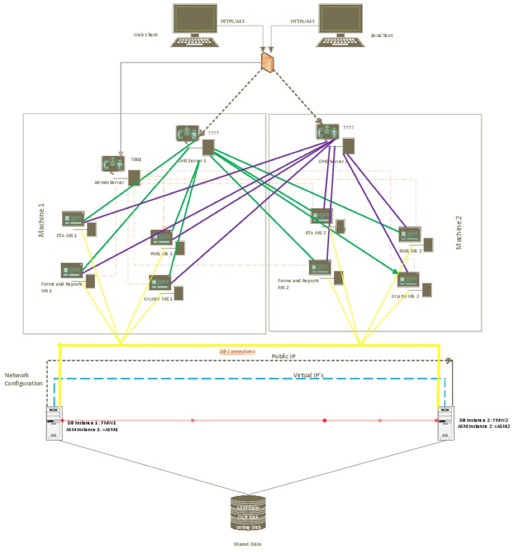
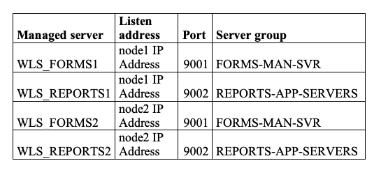
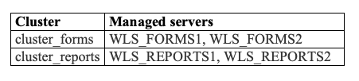
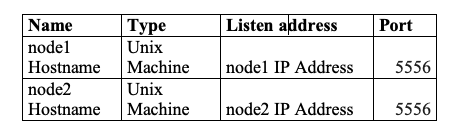
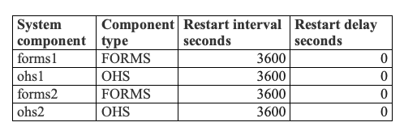

This blog shows you how to install and configure Oracle&reg; Forms and
Reports version 12.2.1.3.0 on Oracle Enterprise Linux (OEL) version 7.2
server to ensure high availability.

<!--more-->

The following diagram illustrates a high-availability model:

To use this high-availability model, you need to perform the following tasks,
which this blog covers in detail:

-	Prepare to install WebLogic&reg; Server version 12.2.1.3 on the application nodes (node1 and node2).
-	Install JDK&reg; 1.8.
-	Install WebLogic Server 12.2.1.3.
-	Create database schemas by using the Repository Creation Utility (RCU).
-	Install Oracle Forms and Reports on node1 and node2.
-	Create and configure the Forms and Reports domain on node1.
-	Conduct post-installation tasks on node1.
-	Use WebLogic `pack` and `unpack` commands to join node2 to the clustered domain on node1.
-	Conduct post-installation tasks on node2.
-	Configure Forms and Reports to use the HTTP server.

### Prepare to install WebLogic Server

To prepare the operating system (OS) for the Weblogic Server installation, refer
to the following documents. Ensure that the OS versions and required settings
are complete on both the application nodes (node1 and node2).

For the certification matrix, see this [Oracle reference document](https://www.oracle.com/technetwork/middleware/fusion-middleware/documentation/fmw-122110certmatrix-3050412.xlsx).

For Linux&reg; requirements like OS packages, kernal settings, and memory settings,
see [these reference documents](https://docs.oracle.com/html/E73100_01/toc.htm#GUID-37C51062-3732-4A4B-8E0E-003D9DFC8C26)
and ensure that you apply the patches to both nodes.

### Install JDK 1.8

Use these steps to install JDK 1.8:

1. Download the Java Development Kit (JDK) from the [Oracle Technology Network Portal](https://www.oracle.com/technetwork/java/javase/downloads/jdk8-downloads-2133151.html).
2. Execute the following commands to unzip **jdk-8u181-linux-x64.tar.gz**, which
   you downloaded:

        [appfmw@fmwNode1 ~]$ cd /u01/app/JAVA/
        [appfmw@fmwNode1 JAVA]$ gunzip jdk-8u181-linux-x64.tar.gz
        [appfmw@fmwNode1 JAVA]$ tar -xvf jdk-8u181-linux-x64.tar

3. Set JAVA_HOME to point to JAVA directory by using the following commands:

        [appfmw@fmwNode1 ~]$ export JAVA_HOME=/u01/app/JAVA/jdk1.8.0_181
        [appfmw@fmwNode1 ~]$ export PATH=$JAVA_HOME/bin:$PATH
        [appfmw@fmwNode1 ~]$ which java
        /u01/app/appdw/jdk1.8.0_111/bin/java

### Install WebLogic Server

To install WebLogic Server version 12.2.1.3 on both nodes, execute the following
commands to navigate to software directory, extract the WebLogic software, set
an environment, and start the installation:

    [appfmw@fmwNode1 ~]$ cd /stage/oracle/FMW
    [appfmw@fmwNode1 FMW]$ $JAVA_HOME/bin/java -jar fmw_12.2.1.3.0_infrastructure.jar

To continue the installation on node 1, perform the following steps as prompted:

1. In **Set Installation Inventory setup**, set the **Directory** to **/u01/app/oraInventory**,
   the **OS Group** to **dba**, and click **OK**.
2. On the **Welcome** page, click **Next**.
3. Enable **Skip Auto Updates** and click **Next**.
4. Set **Oracle Home** to **/u01/app/middleware** and click **Next**.
5. Select **Fusion Middleware Infrastructure** and click **Next**.
6. If the prerequisite checks complete without any errors and warnings, click **Next**.
7. Verify the **Installation Summary** and click **Install**.
8. The **Installation Summary** should be 100% completed. After it finishes, click **Next**.
9. Select **Installation complete** and click **Finish**.

**Note:** In the cluster setup, repeat the WebLogic Server installation by using
the preceding steps on node2, with the same directory structure.

This completes the installation of the Oracle Fusion Middleware Infrastructure
12.2.1.3.0.

### Create database schemas by using RCU

You should have already created a database and prepared it for the WebLogic Server
domain. The database must be running.

Login to the server as user `Oracle` and run the following commands to start
the RCU:

    [appfmw@fmwNode1 FMW]$ cd /u01/app/middleware/oracle_common/bin
    [appfmw@fmwNode1 bin]$ ./rcu

To continue the installation, perform the following steps as prompted:

1. On the **Welcome** page, click **Next**.
2. On **Create Repository** page for the new Oracle Forms and Reports installation,
   select **Create Repository -> System Load and Production Load**.
3. In **Database Connection Details**, provide the database connection information.
   Set **Database Type** to **Oracle Database** and enter the database server details.
   After the installer checks the database connectivity and opens a window,
   click **OK**.
4. On the **Select components** page, set **Prefix** as **PROD** for the
   database schemas and select the following components:
   - Oracle Platform Security Services
   - Audit Services
   - Audit Services Append
5. Click **Next**, and after the installer checks the database prerequisites,
   click **OK**.
6. On the **Schema Passwords** page, set the password for all the database schemas.
7. On the **Map Tablespace** page, click **Next** and click **OK** when the following
   message appears: **Validating and creating tablespaces**.
8. Verify the installation summary and click **Create**.
9. Check the summary and click **Close**.

### Install Oracle Forms and Reports

Perform the following commands on both node1 and node 2 to install Forms and
Reports:

    [appfmw@fmwNode1 ~]$ export JAVA_HOME=/u01/app/JAVA/jdk1.8.0_151
    [appfmw@fmwNode1 ~]$ export PATH=$JAVA_HOME/bin:$PATH
    [appfmw@fmwNode1 ~]$ which java
    /u01/app/appdw/jdk1.8.0_111/bin/java
    [appfmw@fmwNode1 ~]$ cd /stage/oracle/FMW
    [appfmw@fmwNode1 FMW]$ ./fmw_12.2.1.3.0_fr_linux64.bin

To continue the installation on node1, perform the following steps as prompted:

1. In **Set Installation Inventory setup**, set **Directory** to
   **/u01/app/oraInventory**, the **OS Group** to **dba**, and click **OK**.
2. On the **Welcome** page, click **Next**.
3. Enable **Skip Auto Updates** and click **Next**.
4. Set **Oracle Home** to **/u01/app/middleware**.
5. For **Installation type**, choose **Forms and Reports Deployment**.
6. On the **Prerequisite Checks** page, ensure that all checks are complete and
   click **Next**.
7. On the **Installation Summary** page, verify that installation messages and
   click **Install**.
8. On the **Installation Progress** page, ensure that all steps are complete and
   click **Next**.
9. After the installation completes, check the installed components and click
   **Finish**.

**Note:** In the cluster setup, repeat the Forms and Reports software installation
on node2 by using the preceding steps, with the same directory structure.

### Create and configure the Forms and Reports domain on node1

Run the following commands to navigate to **$ORACLE\_HOME/oracle\_common** and
start the configuration wizard to create and configure a Forms and Reports
domain on node1:

    [appfmw@fmwNode1 ~]$ cd /u01/app/middleware/oracle_common/common/bin
    [appfmw@fmwNode1 bin]$./config.sh

To continue the installation on node1, perform the following steps as prompted:

1. On the **Templates** page, select **Create a new Domain** and set the
   **Domain Location** to **/u02/app/middleware/user\_projects/domains/DEV\_domain**.
2. On the next page, select **Create Domain using Product Templates** and select
   the following templates:
   - Oracle Forms - 12.2.1.3.0 [forms]
   - Oracle Reports Application - 12.2.1 [reports]
   - Oracle Enterprise manager - 12.2.1.3.0 [em]
   - Oracle HTTP ServerCollocated) - 12.2.1.3.0 [ohs]
   - Oracle Reports Tools - 12.2.1 [ReportsToolsComponent]
   - Oracle Reports Server - 12.2.1 [ReportsServerComponent]
   - Oracle Reports Bridge - 12.2.1 [ReportsBridgeComponent]
   - Oracle JRF - 12.2.1.3.0 [oracle\_common]
   - WebLogic Coherence Cluster Extension - 12.2.1.3.0 [wlserver]
3. On the **Application Location** page, set **Application Location** to
   **/u02/app/middleware/user\_projects/applications/DEV\_domain**.
4. On the **Administrator Account** page, set the **Name** and **Password** for
   the WebLogic administrator.
5. On the **Domain Mode and JDK** page, set **Domain Mode** to **Production**
   and check the **JDK location** of **/u01/app/JAVA/jdk1.8.0\_181**.
6. On the **Database Configuration Type** page, select **RCU Data** and set
   **Vendor** to **Oracle**. For **Connection Parameters**, specify
   the correct schema prefix: **PROD_STB** and use the credentials from the
   previously executed "Create database schemas by using RCU" section.
   Click on **Get RCU Configuration**. After you verify everything, click **Next**.
7. In the **Database Components** section, select everything from the database
   details from step 6. Click **Next**.
8. On the **JDBC Test** page, ensure that all tests complete successfully. If
   anything is wrong, go back to step 6 and provide the correct details for the
   database. When everything is correct, click **Next**.
9. On the **Advanced Configuration** page, select **Administration Server**,
   **Node Manager**, **Topology**, and **System Components**.
10. On the **Administration Server** page, configure the AdminServer on node1.
    Set **Server Name** to **AdminServer**, set **Listen Address** to **\<Node1 Hostname\>**,
    and **Port** to **7001**.
11. On the **Node Manager** page, configure the node manager for
    node1. **Set Node Manager Type** to **Per Domain Default Location**. Enter
    Node Manager credentials. Set **Username** to **nodemgr** and **Password**
    to **welcome1**. Click **Next**.
12. On the **Managed Servers** page, add the Forms and Report servers and the
    managed servers on both node1 and node2 as shown in the following table:

    

<ol start=13>
    <li>On <b>Clusters</b> page, keep the default values and click <b>Next</b>.</li>
    <li>On the <b>Server Templates</b> page, keep the default values and click <b>Next</b>.</li>
    <li>On the <b>Dynamic Templates</b> page, keep the default values and click <b>Next</b>.</li>
    <li>On the <b>Assign Servers to Clusters</b> page, assign the servers as shown
    in the following table:</li>
</ol>

   

<ol start=17>
    <li>In <b>Coherence clusters</b>, keep the defaults and click <b>Next</b>.</li>
    <li>On the <b>Machine</b> Page, change the settings as shown in the following table:</li>
</ol>

   

<ol start=19>
    <li> On the <b>Assign Servers to Machine</b> page, add the <b>AdminServer</b>,
    <b>WLS_FORMS1</b>, and <b>WLS_REPORTS1</b> to the Machine node1 and add
    <b>WLS_FORMS1</b> and <b>WLS_REPORTS1</b> to the Machine node2.</li>
    <li>On the <b>Virtual Target</b> page, select <b>Don’t configure</b>, and click <b>Next</b>.</li>
    <li>On the <b>Partitions</b> page, select <b>Don’t configure</b>, and click <b>Next</b>.</li>
    <li>On the <b>System Components</b> page, keep <b>forms1</b> and <b>ohs1</b>. Add two more
    entries, <b>forms2</b> and <b>ohs2</b>, as shown in the following table:</li>
</ol>

   

<ol start=23>
    <li>On the <b>OHS Server</b> page, select <b>System Component</b> <b>ohs1</b> and provide
    the following details:</li>
    <ul>
    <li>Admin Host: Node1 IP Address</li>
    <li>Admin Port: 7779</li>
    <li>Listen Address: Node1 IP Address</li>
    <li>Listen Port: 7777</li>
    <li>SSL Listen Port: 4443</li>
    <li>Servername: https://<Node1 IP Address>:7777</li>
    </ul>
    <li>On the <b>OHS Server</b> page, select <b>System Component</b> <b>ohs2</b> and provide the following details:</li>
    <ul>
    <li>Admin Host: Node2 IP Address</li>
    <li>Admin Port: 7779</li>
    <li>Listen Address: Node2 IP Address</li>
    <li>Listen Port: 7777</li>
    <li>SSL Listen Port: 4443</li>
    <li>Servername: https://<Node2 IP Address>:7777</li>
    </ul>
    <li>On the <b>Assign System Components to machines</b> page, assign <b>forms1</b> and
    <b>ohs1</b> to <b>Machine Node1</b> and assign <b>forms2</b> and <b>ohs2</b>
    to <b>Machine Node2</b>.</li>
    <li>On the <b>Configuration Summary</b> page, verify the summary and click <b>Create</b>.</li>
    <li>After the domain creation completes, click <b>Next</b>.</li>
    <li>At the end of the <b>Configuration</b> page, click <b>Finish</b>.</li>
</ol>

### Conduct post-installation tasks on node1

Perform the following steps on node1:

1. Run the following commands to disable the **Derby** database:

        [appfmw@fmwNode1 ~]$ cd /u01/app/middleware/wlserver/common/derby/lib/
        [appfmw@fmwNode1 lib]$ mv derby.jar disable_derby.jar

2. Run the following commands to start the AdminServer by using a script:

        [appfmw@fmwNode1 ~]$ cd /u02/app/middleware/user_projects/domains/PRD_ETA/bin/
        [appfmw@fmwNode1 bin]$ ./startWebLogic.sh
        :

3. When prompted, enter username (**weblogic**) and the password to boot the WebLogic
   server.
4. To verify the AdminServer, browse to **https://<Node1 Host Name>:7001/console**
   and log in with the credentials (**weblogic** and <weblogic password>) from the
   domain creation step. Check the server status and then shut down the AdminServer
   from the console.
5. Run the following commands to create **boot.properties**:

        [appfmw@fmwNode1 AdminServer]$ cd /u02/app/middleware/user_projects/domains/DEV_domain/servers/AdminServer
        [appfmw@fmwNode1 AdminServer]$ mkdir security
        [appfmw@fmwNode1 AdminServer]$ cd security/
        [appfmw@fmwNode1 security]$ vi boot.properties
        [appfmw@fmwNode1 security]$ cat boot.properties
        username=weblogic
        password=<weblogic password>

6. Run the following commands to edit **nodemanager.properties**, and change
   parameter **CrashRecoveryEnabled=false** to **CrashRecoveryEnabled=true**.:

        [appfmw@fmwNode1 nodemanager]$ cd /u02/app/middleware/user_projects/domains/DEV_domain/nodemanager
        [appfmw@fmwNode1 nodemanager]$ vi nodemanager.properties

7. Run the following commands to start NodeManager:

        [appfmw@fmwNode1 ~]$ cd /u02/app/middleware/user_projects/domains/DEV_domain/bin
        [appfmw@fmwNode1 bin]$ nohup startNodeManager.sh &

8. To start the managed servers on node1, browse to **https://<Node1 Host Name>:7001/console**
   and enter the credentials (**weblogic**/<weblogic password from Domain creation>).
   Start all the managed servers on node1 from the console.

9. Configure the Reports server on Node1 as shown in the following section.

#### Reports Server Configuration on Node1

Perform the following configuration steps to configure reports on node1:

1. Create ReportsToolsInstance (by using `wlst`).  Run the following commands
   to start `wlst`:

        [appfmw@fmwNode1 configuration]$ cd /u01/app/middleware/oracle_common/common/bin
        [appfmw@fmwNode1 bin]$ ./wlst.sh

2. Run the following commands to connect to the AdminServer (**Note:** the
   AdminServer and WLS_REPORTS must be running):

        wlst> connect('weblogic','welcome1', 't3://<Node1 HostName>:7001')

3. Run the following command to create the reports server instance:

        wls:/forms_domain/serverConfig/> createReportsToolsInstance(instanceName='reptools1',machine='<NODE1 Hostname>')

4. Run the following command to edit **rwservlet.prpoerties**  to enable Reports
   Webaccess:

        vi /u02/app/middleware/user_projects/domains/DEV_domain/config/fmwconfig/servers/WLS_REPORTS1/applications/reports_12.2.1/configuration/rwservlet.properties

   Add the following <webcommandaccess> line (shown in place):

      <?xml version="1.0" encoding="UTF-8"?>
      <rwservlet xmlns="https://xmlns.oracle.com/reports/rwservlet" xmlns:xsd="https://www.w3.org/2001/XMLSchema">
          <server>rep_wls_reports_host03</server>
          <singlesignon>no</singlesignon>
          <inprocess>yes</inprocess>
          <webcommandaccess>L2</webcommandaccess>
      </rwservlet>

<ol start=5>
    <li>Restart the managed server <b>WLS_REPORTS1</b> from the console.</li>
    <li>Run the following command to create the stand alone reports server, <b>my_rersrv</b>:</li>
</ol>
        [oracle@host03]$ /u01/app/middleware/oracle_common/common/bin/wlst.sh

<ol start=7>
    <li>Run the following command to connect to the AdminServer(the AdminServer and
     <b>WLS_REPORTS</b> must be running):</li>
</ol>
        wlst> connect('weblogic','<weblogic password', 't3://<Node1 Hostname>:7001')

<ol start=8>
    <li>Run the following command to create the <b>ReportsServerInstance</b>:</li>
</ol>

        wls:/forms_domain/serverConfig/> createReportsServerInstance(instanceName='my_repsrv',machine='UnixMachine_1')

<ol start=9>
    <li>Run the following command to disable the single sign on for the Reports Server:</li>
</ol>

        vi /u02/app/middleware/user_projects/domains/DEV_domain/config/fmwconfig/components/ReportsServerComponent/my_repsrv/rwserver.conf

        Change:  <!--job jobType="report" engineId="rwEng" securityId="rwJaznSec"/-->
        To:      <job jobType="report" engineId="rwEng"/>

<ol start=10>
    <li>Run the following commands to start the standalone reports server and save
    the NodeManager password:</li>
</ol>

        cd /u02/app/middleware/user_projects/domains/DEV_domain/bin
        ./startComponent.sh my_repsrv storeUserConfig

<ol start=11>
    <li>When prompted to try the nodemanager user password, enter Node Manager
    password:<b>xxx</b>.</li>
</ol>

### Join node2 to the clustered domain on node1

Perform the following steps to join node2 to the clustered domain on node1:

1.	Stop all the managed servers that are running from the console.
2.	Stop the AdminServer from running in its terminal or console window.
3.	Go to the **/u01/cluster** on node1.
4.	Execute the following commands:

        [appts@fmwNode2 bin]$ cd /u02/app/cluster
        [appts@fmwNode2 cluster]$ /u01/app/middleware/oracle_common/common/bin/pack.sh -managed=true -domain=/u02/app/middleware/user_projects/domains/DEV_domain -template=cluster.jar -template_name="DEV_DOMAIN"

        << read domain from "/u02/app/middleware/user_projects/domains/DEV_DOMAIN"
        >>  succeed: read domain from "/u02/app/middleware/user_projects/domains/DEV_DOMAIN"
        << set config option Managed to "true"
        >>  succeed: set config option Managed to "true"
        << write template to "/u02/app/cluster/cluster.jar"
        ..............................
        >>  succeed: write template to "/u02/app/cluster/cluster.jar"
        << close template
        >>  succeed: close template
        [appts@fmwNode2 cluster]$

5.	Go to node2 and open a terminal window.
6.	Go to **/u01/app/middleware/oracle\_common/common/bin**.
7.	Execute the following `unpack` command:

        [appts@fmwNode2 bin]$ ./unpack.sh -domain=/u02/app/middleware/user_projects/domains/DEV_DOMAIN -template=/u02/app/cluster/cluster.jar
        << read template from "/u02/app/cluster/cluster.jar"
        >>  succeed: read template from "/u02/app/cluster/cluster.jar"
        << set config option DomainName to "DEV_DOMAIN"
        >>  succeed: set config option DomainName to "DEV_DOMAIN"
        >>  validateConfig "KeyStorePasswords"
        >>  succeed: validateConfig "KeyStorePasswords"
        << write Domain to "/u02/app/middleware/user_projects/domains/DEV_DOMAIN"
        ...........................................................................
        >>  succeed: write Domain to "/u02/app/middleware/user_projects/domains/DEV_DOMAIN"
        << close template
        >>  succeed: close template
        [appts@fmwNode2 bin]$

8. Run the following commands to start NodeManager on node2:

        cd /u02/app/middleware/user_projects/domains/DEV_DOMAIN/bin
        ./startNodeManager.sh

9. Perform the following steps on node1 to start the AdminServer on node1:

   - Open a terminal or console session.
   - Go to **/u02/app/middleware/user\_projects/domains/DEV\_DOMAIN/bin**.
   - Run the following command:

        ./startWebLogic.sh

### Conduct post-installation tasks on node2

Perform the following configuration steps to configure reports on node2:

1. Create **ReportsToolsInstance** by using `wlst`.  Run the following commands
   to start `wlst`:

        [appfmw@fmwNode2 configuration]$ cd /u01/app/middleware/oracle_common/common/bin
        [appfmw@fmwNode2 bin]$ ./wlst.sh

2. Run the following commands to connect to the AdminServer (the
   AdminServer and WLS_REPORTS must be running):

        wlst> connect('weblogic','welcome1', 't3://<Node1 HostName>:7001')

3. Run the following command to create the reports server instance:

        wls:/forms_domain/serverConfig/> createReportsToolsInstance(instanceName='reptools2',machine='<NODE2 Hostname>')

4. Run the following command to edit **rwservlet.prpoerties**  to enable Reports
   Webaccess:

        vi /u02/app/middleware/user_projects/domains/DEV_domain/config/fmwconfig/servers/WLS_REPORTS2/applications/reports_12.2.1/configuration/rwservlet.properties

   Add the following <webcommandaccess> line (shown in place):

      <?xml version="1.0" encoding="UTF-8"?>
      <rwservlet xmlns="https://xmlns.oracle.com/reports/rwservlet" xmlns:xsd="https://www.w3.org/2001/XMLSchema">
          <server>rep_wls_reports_host03</server>
          <singlesignon>no</singlesignon>
          <inprocess>yes</inprocess>
          <webcommandaccess>L2</webcommandaccess>
      </rwservlet>

<ol start=5>
    <li>Restart the managed server <b>WLS_REPORTS1</b> from the console.</li>
    <li>Run the following command to create the stand alone reports server, <b>my_rersrv2</b>:</li>
</ol>

        [appfmw@fmwNode2]$ /u01/app/middleware/oracle_common/common/bin/wlst.sh

<ol start=7>
    <li>Run the following command to connect to the AdminServer (the AdminServer and
    <b>WLS_REPORTS</b> must be running):</li>
</ol>

        wlst> connect('weblogic','<weblogic password', 't3://<Node1 Hostname>:7001')

<ol start=8>
    <li>Run the following command to create the <b>ReportsServerInstance</b>:</li>
</ol>

        wls:/forms_domain/serverConfig/> createReportsServerInstance(instanceName='my_repsrv2',machine='UnixMachine_2')

<ol start=9>
    <li>Run the following command to disable the single sign on for the Reports Server:</li>
</ol>

        vi /u02/app/middleware/user_projects/domains/DEV_domain/config/fmwconfig/components/ReportsServerComponent/my_repsrv/rwserver.conf

        Change:  <!--job jobType="report" engineId="rwEng" securityId="rwJaznSec"/-->
        To:      <job jobType="report" engineId="rwEng"/>

<ol start=10>
    <li>Run the following commands to start the standalone reports server and save
    the NodeManager password on node2:</li>
</ol>

        cd /u02/app/middleware/user_projects/domains/DEV_domain/bin
        ./startComponent.sh my_repsrv storeUserConfig

<ol start=11>
    <li>When prompted to try the nodemanager user password, enter Node Manager
    password:<b>xxx</b>.</li>
</ol>

### Configure Forms and Reports to use the HTTP server

Perform the following steps to configure Forms and Reports:

1. Run the following commands on node1 to start the HTTP server:

        [appfmw@fmwNode1 config]$ cd $ORACLE_HOME/oracle_common/common/bin/
        [appfmw@fmwNode1 bin]$ ./wlst.sh

        wls:/offline> nmConnect('nodemgr','welcome1','fmwNode1.test.com','5556','DEV_domain','/u02/app/middleware/user_projects/domains/DEV_domain')

        wls:/nm/PRD_ETA> nmStart(serverName='ohs1', serverType='OHS')
        wls:/nm/PRD_ETA> exit ()

2. Run the following commands on node2 to start the HTTP server:

        [appfmw@fmwNode2 config]$ cd $ORACLE_HOME/oracle_common/common/bin/
        [appfmw@fmwNode2 bin]$ ./wlst.sh

        wls:/offline> nmConnect('nodemgr','welcome1','fmwNode2.test.com','5556','DEV_domain','/u02/app/middleware/user_projects/domains/DEV_domain')

        wls:/nm/PRD_ETA> nmStart(serverName='ohs2', serverType='OHS')
        wls:/nm/PRD_ETA> exit ()

3. Run the following command to edit the Forms configuration  file, **forms.conf**,
   on node1:

        vi /u01/app/middleware/forms/templates/config/forms.conf

        Add following lines:

        <Location /forms>
           SetHandler weblogic-handler
           WebLogicCluster fmwNode1.test.com:9001,fmwNode2.test.com:9001
           DynamicServerList OFF
        </Location>

4. Run the following command to edit the Reports configuration file, **reports\_ohs.conf**
   on node1:

        vi /u01/app/middleware/reports/conf/reports_ohs.conf

       Add following lines:

        <Location /reports>
           SetHandler weblogic-handler
           WebLogicCluster fmwNode1.test.com:9002,fmwNode2.test.com:9002
           DynamicServerList OFF
        </Location>

5. Run the following commands to copy **forms.conf** and **reports\_ohs.conf**
   on node 1:

        cp /u01/app/middleware/forms/templates/config/forms.conf  /u02/app/middleware/user_projects/domains/PRD_ETA/config/fmwconfig/components/OHS/instances/ohs2/moduleconf
        cp /u01/app/middleware/reports/conf/reports_ohs.conf /u02/app/middleware/user_projects/domains/PRD_ETA/config/fmwconfig/components/OHS/instances/ohs2/moduleconf

6. Use `scp` to copy **forms.conf** and **reports\_ohs.conf**
   from **$OHS\_INSTANCE\_HOME/moduleconf** on node1 to
   **$OHS\_INSTANCE\_HOME/moduleconf** node2:

7. Run the following commands to restart the HTTP server on node1:

        [appfmw@fmwNode1 config]$ cd $ORACLE_HOME/oracle_common/common/bin/
        [appfmw@fmwNode1 bin]$ ./wlst.sh

        wls:/offline> nmConnect('nodemgr','welcome1','fmwNode1.test.com','5556','DEV_domain','/u02/app/middleware/user_projects/domains/DEV_domain')

        wls:/nm/PRD_ETA> nmStop(serverName='ohs1', serverType='OHS')
        wls:/nm/PRD_ETA> nmStart(serverName='ohs1', serverType='OHS')
        wls:/nm/PRD_ETA> exit ()

8. Run the following commands to restart the HTTP server on node2:

        [appfmw@fmwNode2 config]$ cd $ORACLE_HOME/oracle_common/common/bin/
        [appfmw@fmwNode2 bin]$ ./wlst.sh

        wls:/offline> nmConnect('nodemgr','welcome1','fmwNode1.test.com','5556','DEV_domain','/u02/app/middleware/user_projects/domains/DEV_domain')

        wls:/nm/PRD_ETA> nmStop(serverName='ohs2', serverType='OHS')
        wls:/nm/PRD_ETA> nmStart(serverName='ohs2', serverType='OHS')
        wls:/nm/PRD_ETA> exit ()

### Conclusion

Installing and configuring a cluster setup is a bit different from setting up a
single server. The latest Fusion Middleware version 12.2.1.3 Forms and Reports
installation and configuration on the cluster environment consists of two Forms and
Reports managed servers running simultaneously to work together for increased
scalability and reliability.

Use the Feedback tab to make any comments or ask questions.

Learn more about our [database services](https://www.rackspace.com/dba-services).

We are the experts on Oracle products, so let Rackspace help you maximize your
[Oracle investment](https://www.rackspace.com/oracle).

