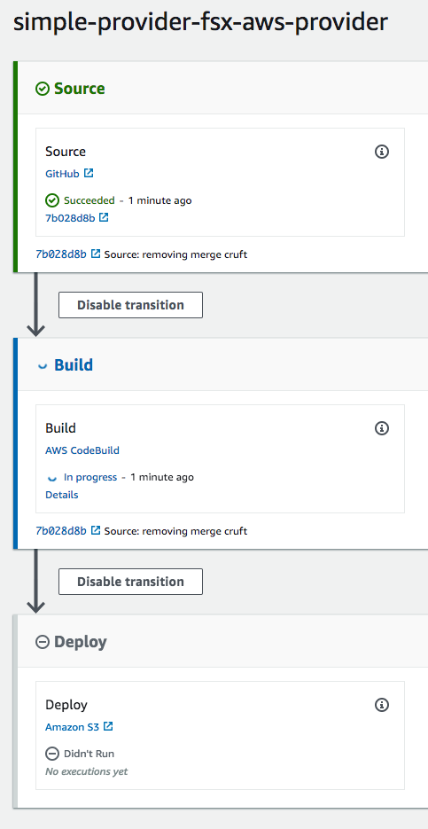
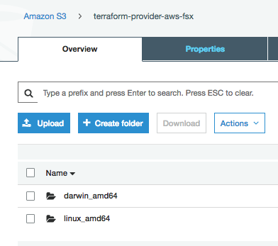

Terraform has gained a lot of popularity in the last couple years. Rackspace
prefers to use Terraform to quickly spin up new architecture in AWS and Azure.
However, with Amazon's lightning-fast deployment of new features, it has become
harder for the Provider maintainers to keep up. Developers are left waiting for
new features to be developed and merged into the `master` branch before becoming
available for general consumption.

<!--more-->

Open Source to the rescue! Since the source for Terraform Providers are available
via Github, any new feature doesn't have to be in the `master` (mainline)
Provider before it can be leveraged by Terraform users.

This post discusses a simple Terraform module that was developed to allow anyone
to easily clone, build, and install a fork or branch of a Terraform Provider
without having to set up a Go build environment directly.

### The Need

Currently (Feb, 2019) there are almost 2000 open issues with the
[Terraform AWS Provider](https://github.com/terraform-providers/terraform-provider-aws/issues).
That's a lot of issues... and while Hashicorp works to make Terraform 0.12 available,
it feels that some of this development work to get new features and bug fixes
merged into `master` has slowed down. Thankfully, the robust community has - in
many cases - developed solutions and submitted PRs. As of February, 2019, there
are 267 outstanding PRs. That's a lot of PRs...

Let's take a look at one specific issue, the [Amazon FSx Feature](https://github.com/terraform-providers/terraform-provider-aws/issues/7035). FSx was recently announced (Dec, 2018) and is a drop-in replacement for Windows File Server as a managed service (see [this blog](https://developer.rackspace.com/blog/amazon-fsx-replaces-file-shares/)). Any team wanting to deploy FSx would need to find some other method than Terraform for deploying it. With this PR unmerged, we'd need to either fallback to CLI commands, or CloudFormation (which at the time of this writing is still not an option as even AWS has not released the CloudFormation changes required to support FSx), or manage this through the Console. None of these options are good for us.

However, since a nice user in the community created a PR, we can review that and
decide if we want to use that code instead.

### The Problem

While this sounds simple, it isn't always easy. All Terraform Providers are
written in Go, so cloning that fork, building, and deploying a fix or enhancement
to our environments to use instead of the mainline `terraform-provider-aws`, is
not trivial.

Let's assume you've done Go development before. In that case, you pull the code,
build it, run tests, then copy the resulting file to your `~/.terraform.d/plugins`
directory, no problem.

But, if you're like me and had never done Go, are you willing to spend the time
to get things set up properly? Here's a tip that took me a couple of hours to
figure out: Go cares about your directory structure!

Either way, at the end, I felt things could be easier.

### The Solution

So, [here](https://github.com/rackerlabs/simple-provider-cicd) is a Terraform
Module, Open Source and available on Github, that you can use to create a CICD
process using CodePipeline and CodeBuild to build and deploy any fork or branch
of a Terraform Provider to an S3 bucket for consumption. Here's how it works:

First, execute the TF Module, providing the Github owner, repository, and branch
to build, along with a couple of additional parameters. This creates all the
necessary setup.

Then, on any push to the repo:

1. CodePipeline pulls source from Github.
2. CodeBuild builds that source into a `darwin_amd64` and `linux_amd64` binaries.
3. CodePipeline copies those two binaries to an S3 bucket for consumption (this is private, btw!).
4. Any user who wants to use this provider just copies the resulting binary to their own machine.

Please review the README and feel free to open any issues or provide feedback.

### An Example

Let's take a look at an example of using this with the FSx PR that I mentioned
earlier. First, I would create a new Terraform module and include a main.tf:

```
module "FSx_pipeline" {
    source = "github.com/rackerlabs/simple-provider-cicd?ref=master"

    github__owner  = "slapula"
    github__repo   = "terraform-provider-aws"
    github__branch = "resource-fsx-file-system"
    project_name   = "fsx-aws-provider"
    s3_bucket      = "terraform-provider-aws-fsx"
    go_package     = "github.com/terraform-providers/terraform-provider-aws"
}
```

Now just run your Terraform init/apply (don't forget to set a GITHUB_TOKEN first!):

```
> tf init && GITHUB_TOKEN=ABCDE12345 tf apply
```

When you're done, you should now have a CodePipeline build going:



And when that's done, you'll have the binaries in S3:



Now just transfer the related binary to whatever environment you need it in!


### Conclusion

Using custom Terraform Providers, built from a forked or branched Github
repository, is now simple and easy with a little AWS and Terraform.

Use the Feedback tab to make any comments or ask questions.

