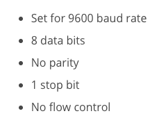
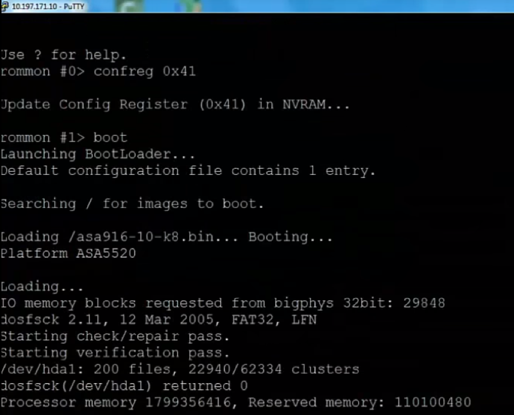

This blog explains how to recover the *enable password* and the *enable secret*
passwords of the Cisco&reg; Adaptive Security Appliance (ASA) and Cisco router.
These passwords protect access to privileged execution and configuration modes.
You can recover the *enable password* password, but the *enable secret* password
is encrypted and must be replaced with a new one. You can also recover the
Fortinet&reg; Fortigate super admin password.

<!--more-->

### Recover the Cisco ASA password

Before you begin the Cisco ASA password recovery, connect the DB9-end of the
serial cable to your PC serial port and plug the other end of the cable into
the console port at the back of the Cisco ASA. If you do not have a serial
port, then you should use a USB-to-serial adapter cable.

Connect to the console by using a terminal emulator with the specifications shown
in the following image:

   

Use the following steps to recover the Cisco ASA password:

<ol start=1>
   <li>Reboot the ASA appliance as shown in the following image. While booting,
   press the <b>Esc</b> key to interrupt the normal boot sequence and select the
   <b>boot-to-ROMMON</b> mode. If you use HyperTerminal&reg;, you should press
   <b>Ctrl+Break</b> because the HyperTerminal emulator does not send the
   <b>Esc</b> keystroke properly.</li>
</ol>

   

<ol start=2>
   <li> Execute the following command to verify the current configuration
   register value, <b>0x00000001</b>:</li>
</ol>

       Rommon #0> confreg

       Current configuration register :0x00000001
       Configuration summary:
       Boot default image from Flash

<ol start=3>
   <li>Answer the following questions and notice that the register value changes:</li>
</ol>

       Do you wish to change this configuration? Y/N: Yes
       Disable system configuration? Y/N: Yes

       Current configuration register:0x00000041
       Configuration summary
       Boot ROMMON
       Ignore system configuration

<ol start=4>
   <li>To reload the appliance, execute the following command, which loads the
   default configuration instead of the startup configuration and has a blank
   enable-mode password as shown in the following image:</li>
</ol>

       Rommon #1> boot

       Ciscoasa> enable
       Password: [Blank]

   

<ol start=5>
   <li>Use the following command to load the <b>startup-config</b> file in to the
   <b>running-config</b> file:</li>
</ol>

       Ciscoasa# copy startup-config running-config

       Destination filename  [running-config] ?   --[Press Enter]
       Ciscoasa# configure terminal

<ol start=6>
   <li>Use the following commands to change the passwords in the default
   configurations:</li>
</ol>

       Ciscoasa(config)# password [password]
       Ciscoasa(config)# enable password [password]
       Ciscoasa(config)# username [name] password [password]

<ol start=7>
   <li>After you set the passwords, run the following command to roll back the
   configuration register value to <b>0x00000001</b>:</li>
</ol>

       Ciscoasa (config)# config-register 0x00000001

<ol start=8>
   <li>Save the new passwords to the <b>startup-config</b> file by entering one the
   following commands:</li>
</ol>

       Ciscoasa# copy running-config startup-config
       [or]
       Ciscoasa# write memory

### Recover the Cisco router password

**Note:** The configuration register value is usually set to **0x2102** when
the value for configuration register is set to the **NVRAM**. When the router
boots, it looks for the **startup-config** file stored in the **NVRAM**. As part of
the password recovery, you need to change the register value to **0x2142**. After
the configuration completes, the router ignores or bypasses the **startup-config**
file in **NVRAM** and enters setup mode.

Before you begin the Cisco ASA password recovery, connect the DB9-end of the
serial cable to your PC serial port and plug the other end of the cable into
the **console** port at the back of the Cisco router. If you do not have a serial
port, then you should use a USB-to-serial adapter cable.

Connect to the console by using a terminal emulator with the specifications shown
in the following image:

   

Use the following steps to recover the Cisco router password:

1. Access the router and record the configuration register value by using the
   following command:

        > Show version

        Configuration register is 0x2102

2. Use the following command to reboot the device. The router reboots and ignores
   the NVRAM configuration. Press the **Ctrl+Break** key to enter the **ROMMON**
   mode:

       rommon 1> confreg 0x2142
       rommon 2> reset

3. In setup mode, type `No` after each setup question to skip the initial setup
   procedure and run the following command:

        Router >enable

4. Run the following commands to load the **startup-config** file into the
   **running-config** file:

        Router# copy startup-config running-config
        Router# configure terminal

5. Change the passwords in the default configuration by entering the following
   commands:

        Router(config)# password [password]
        Router (config)# enable password [password]
        Router (config)# username [name] password [password]

6. After you set the passwords, run the following command to roll back the
   configuration register value to **0x2102**:

        Router(config)#config-register 0x2102

7. Save the new passwords to the startup configuration by running one of the
   following commands:

        Router# copy running-config startup-config
        [or]
        Router# write memory
        Router# reload

Now, you can log in with the new password.

### Recover the Fortigate super admin password

Before you begin the Fortigate super admin password recovery, connect the PC to
the firewall device by using the console port at the back of the unit.

Connect to the console by using a terminal emulator with the specifications shown
in the following image:

   

Use the following steps to recover the Fortigate super admin password:

1. The firewall should respond with its name or hostname. If it doesn’t, try
   pressing **ENTER**.

2. Reboot the appliance.

3. When the firewall name and login prompt appears, enter the username,
   **maintainer** (lowercase format). You might have only 14 seconds to enter
   the username and password, so be prepared to copy and paste the credentials
   to save time.

4. Enter the password, which is **bcpb**, and the serial number of the firewall
   (where the letters of the serial number are in uppercase format). For
   example: **bcpbFGT60C4G18817022**.

5. If Virtual domains (VDOMs) are enabled, skip to step 7.  If VDOMs are not
   enabled, enter the following commands to log in with the **maintainer**
   account:

        config system admin
        edit admin
        set password
        end

6. If Virtual domains (VDOMs) are enabled, enter the following commands to
   login with the **maintainer** account:

        config global
        config system admin
        edit admin
        set password
        end

#### Disable the maintainer account

Using the **maintainer** account to reset a password creates a log. The account
can reset the password for any super-admin user as well as the default admin user.
The maintainer account only has permissions to reset the super-admin profile
password.

You can disable the maintainer account for security reasons by using the
following commands:

    config system global
    set admin-maintainer disable
    end

### Conclusion

If you lose the login details of any network device, password recovery is useful.
You can recover device passwords without disturbing the existing configuration
file as long as the recovery feature is enabled on the appliance.

Use the Feedback tab to make any comments or ask questions.