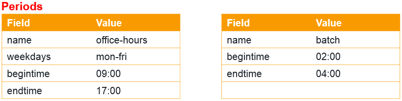

On-demand infrastructure, with its speed, agility, efficient use of resources
and lower costs drives many organizations toward cloud adoption.

When used in conjunction with tools like CloudFormation or Terraform, users are
able to provision and remove cloud infrastructure programmatically. This is
typically referred to as Infrastructure as Code, or IaC, and is great for
stateless resources.

However, what if some servers cannot be regularly re-provisioned from scratch?
Does it mean they need to be up and running 24/7, even if only used during
limited hours?

Fortunately not.

<!--more-->

Cloud providers like AWS offer the ability to stop and start instances as needed
while preserving the data on these instances. A stopped instance doesn’t consume
compute, network or power resources, so monthly costs are slashed drastically as
compute charges cease (of course, storage/disk will still be charged). This is
useful for environments that are only needed for certain portions of the day.

Turning off a non-production environment at the end of the day, for example,
reduces weekly utilization from 168 to 50 hours, yielding a 70 percent reduction
in running costs. Users can apply the same technique to proof-of-concept
environments, typically used for occasional demos, or nightly batch/job processing
environments.

Bottom line: not every resource or environment is needed all the time, so why
pay for them 24/7/365?

### The challenge

There is a catch: automation…or more precisely, the lack thereof.

With the exception of auto-scaling groups, AWS doesn’t have the built-in
functionality to stop and start instances *automatically* based on a defined
schedule. You can stop your instances manually every evening, and start them back
up every morning, but this quickly becomes a pain point.

While some organizations build scheduling automation through services like
Lambda, the maintenance can be problematic. There will be feature requests, bug
reports, training demands and a reliance on a developer’s tacit knowledge.

### The solution

The AWS Instance Scheduler solution packages several AWS services together,
including DynamoDB, Lambda and CloudWatch Events, into a deployable CloudFormation
template, enabling users to automate custom start/stop schedules for their EC2
and RDS instances. Instance Scheduler does not feature a user interface, with
schedule configuration performed by using the DynamoDB interface or the
command-line interface.

Instance Scheduler supports:

* Stopping and starting stand-alone EC2 instances
* Stopping and starting RDS instances
* Stopping and starting instances in multiple regions
* Starting or stopping instances manually outside the defined schedule
* Partial automation (stop-only or start-only schedule)

It does not support:

* Stopping or starting instances that are part of an auto-scaling group (native
ASG scheduled actions can be used in this case)
* Stopping or starting other managed services (e.g. Redshift, Elasticsearch,
ElastiCache, etc.)

### How it works

A DynamoDB table contains definitions of Periods and Schedules, with every
Schedule having a unique name. Resource tags are used to associate EC2 and RDS
instances with a particular Schedule (e.g. Schedule=uk-office-hours, when
“uk-office-hours” is a name of one of the Schedules we defined in DynamoDB).

So what are Periods? Periods contain conditions that define the hours/days/months
an instance will run. Schedules are composed of one or more Periods.

For example:

Assume that instances need to run during office hours (Monday-Friday 9am-5pm ET)
and also perform batch processing every night 2am-4am ET. To achieve this, we
define 2 periods:

The Period “office-hours” covers our office hours requirement and is responsible
for starting the instances at 9am and stopping them at 5pm Monday-Friday. The
Period “batch” starts the instances at 2am and stops them at 4am every day of
the week. Now let’s define our Schedule:

The Schedule “office-and-batch” contains the two running Periods we defined
(“office-hours” and “batch”) and specifies the time zone. With the Schedule
defined, we can associate our EC2 and RDS instances with it by adding a resource
tag with a tag key of “Schedule” and a tag value of “office-and-batch.” Note that
the tag value is identical to the name of the Schedule we defined.

### How much does Instance Scheduler cost?
The solution itself is free, however, because it utilizes a few AWS services
under the hood (DynamoDB, Lambda, CloudWatch), and is deployed in your AWS account,
you will still pay for these services. But, in our experience, unless you have
a significantly large AWS environment, these costs are generally below $10 per
month — and we’ve yet to see a customer that doesn’t save at least $10 in usage
costs with Instance Scheduler. Essentially, it pays for itself.

Instance Scheduler provides a reasonable set of features, at a minimal cost, and
meets most AWS customer use cases. If you need to schedule resources other than
EC2 or RDS, support multiple cloud platforms, or require a UI, however, Instance
Scheduler might not be right for you.

And of course, if you like the solution, but want someone to manage it for you,
Rackspace can help. We provide full management of Instance Scheduler for any AWS
customer with a managed service so you have a Fanatical Experience.

As an added bonus, AWS Instance Scheduler improves security. A system that is
only running for 30% of time has a lower security risk profile. Plus, it’s good
for the environment! You switch off the lights at home when not in use. Shouldn’t
you do the same with your infrastructure?

If you’re a current Rackspace customer and would like to start using Instance
Scheduler, please submit a request via a Support ticket, or reach out to your
account manager.

Learn more about [Rackspace Managed Public Cloud Services](https://www.rackspace.com/cloud/public).

Use the Feedback tab to make any comments or ask questions.
