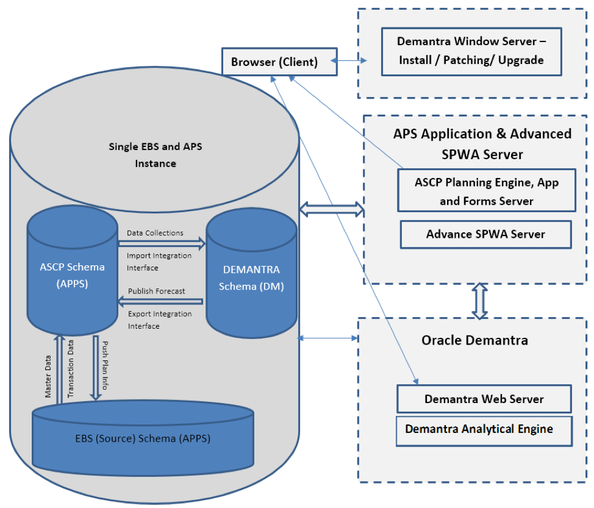
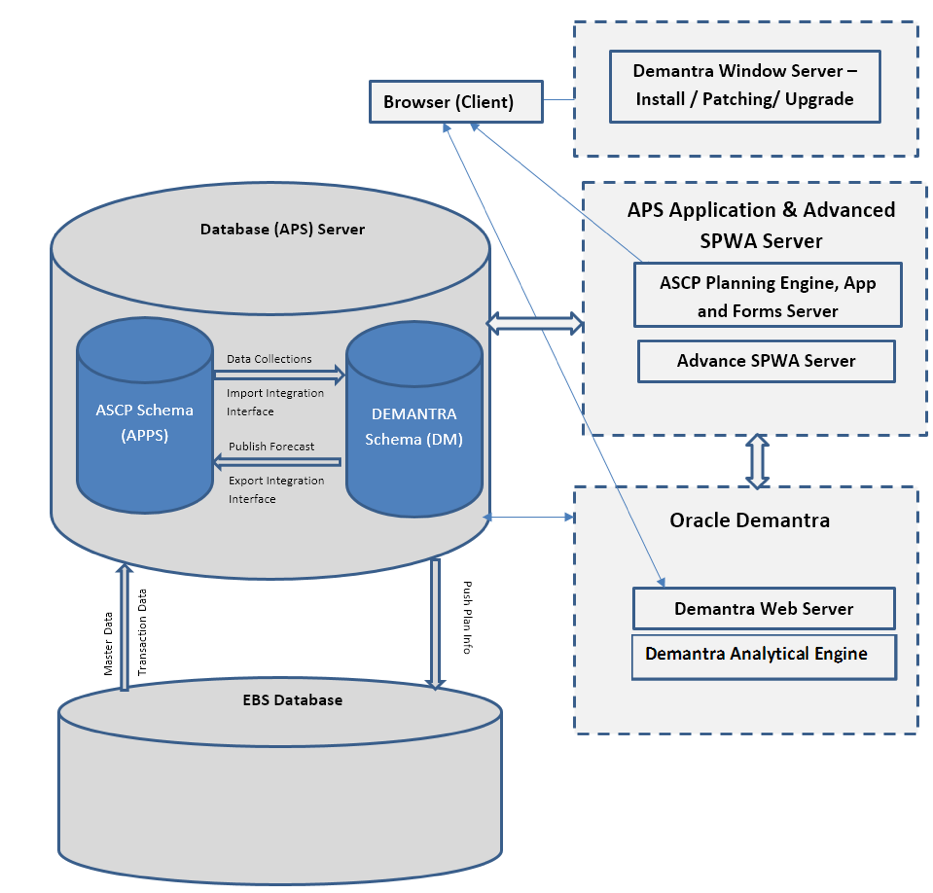

Demantra&reg; and advanced Supply Planning Work Area (SPWA) are demand management
and supply chain management tools provided by Oracle&reg;. These products
integrate with the Oracle E-Business Suite (EBS) and Oracle Advanced Planning
Suite (APS) (which are part of the Oracle Advanced Supply Chain Planning (ASCP))
to best leverage Demantra demand management and supply chain management
functionalities.

This blog covers Demantra and SPWA configuration with
Oracle EBS and APS Value Chain Planning (VCP) from an Oracle database
administrator (DBA) and architecture perspective. It also provides high-level
installation steps for Demantra and advanced SPWA.

<!--more-->

### Introduction

ASCP is a comprehensive, internet-based planning solution that decides when and
where you should deploy supplies (for example, inventory, purchase orders, and
work orders) within an extended supply chain.

Demantra is a best-in-class provider of demand management, sales, and operations
planning, as well as trade promotions management solutions.

Advanced SPWA allows you, as a planner, to view plan data or plan inputs by using
pre-seeded layouts or user-defined page layouts. These layouts enhance your
productivity because they allow you to see an aggregate analytical view with
guided analysis and can also create multiple page layouts with real world
business processes and analysis.

**Note:** The integration of Oracle Demantra and Oracle APS and ASCP is out of
scope of this post. Demantra also supports legacy systems by using flat-file
loads, but this post focuses on using Demantra with Oracle APS and ASCP.

### Demantra, advanced SPWA, EBS, and APS integration architecture

You must install Demantra in the same database as APS and ASCP. The EBS source
instance can be in a separate database, but, for the integration of ASCP and
Demantra to work, ASCP and Demantra must be in the same database. Oracle
supports the following configurations:

- Single instance
- Separate destination and source instances

#### Single instance

The single instance can include Oracle EBS, ASCP and APS, advanced SPWA, and
Demantra. This instance must be a supported combination of EBS and Demantra
releases. Oracle support can provide an up-to-date list of certified versions
for integration.

The following image shows the single instance architecture:

#### Separate destination and source instances

With separate instances, the APS instance includes APS and ASCP, advanced SPWA,
and Demantra. The EBS database is on a separate instance. The destination
instance must be a Demantra-certified version of APS.

The following image shows the separate instances architecture:

### High-level installation steps for Demantra

The installation of the Demantra application is a multistep process.

**Note:** You need to install Demantra on a Microsoft&reg; Windows&reg; server
because only Windows platforms support the Demantra Installer and Demantra
administrative utilities (BusinessModeler, and Demand Management Tools, and so on).

The Demantra Installer on Windows servers creates the database schema (in an APS
database), and you need to use the administrator tools to configure the application.
After you install Demantra on the Windows server, the process transfers the
application to the Unix&reg; servers that host the Demantra Web server and
Analytical Engine server.

Use the following high-level installation steps to install Demantra version 12.2.6.2.

#### Install Demantra on the Windows server

1.	Prepare the database for Demantra by creating a 16 K block size table space
   (tbs) in the APS database (DB).
2.	Install the 64-bit Oracle Database 12c (12.1.0.2) client on the Windows server.
3.	Install Demantra version 12.2.6.2 on the Windows server.

#### Configure the Demantra web server and deploy the Demantra application (demantra.ear) on Linux

4.	Install Java&reg; JDK 8 64-bit on the Linux&reg; server (Demantra web server).
5.	Install Weblogic&reg; 12c (12.1.3.0.0 ) on the Linux server (Demantra web server).
6.	Configure the domain for Demantra deployment.
7.	Configure the JDBC data source.
8.	Enable the archived real path (`archived-real-path-enabled`).
9.	Create the Demantra **WAR** file on the Windows server.
10. Deploy **demantra.ear**.
11. Activate the Demantra application.

#### Configure and deploy the Demantra Analytical Engine on Linux

12. Install Java JDK 8 64-bit and the Oracle client on the Linux server (Demantra Analytical Engine).
13. Copy the engine **tar** file from the Windows server to the Linux server.
14. Create the Engine data source file.
15. Configure the Demantra Analytical Engine on the Analytical Server with a
    new Oracle Wallet Repository.
16. Start the Analytical Engine starter.

### High-level installation steps for advanced SPWA (Advanced Planning UI)

Use the following high-level steps to install the Advanced SPWA (Planning User
Interface (UI)).

#### Installation steps

**Note:** The following WebLogic installation *must be* separate from the
WebLogic installation that comes with EBS applications.

1.	Install J-Rockit or install the required Java Developer Kit: JDK 1.7.0_80+.
2.	Install the WebLogic server 10.3.6 version 11gR1 (10.3.6).
3.	Install ADF 11.1.1.9.0 on top of WLS 10.3.6. For the **Install location**,
   select the WebLogic server home (10.3.6). This is very important. If you
   incorrectly select the WebLogic server home that comes with the version
   12.2.x technical stack, then you will have to redo all the steps from the
   beginning for the VCP Application Development Framework (ADF) UI.
4.	Apply the ADF patches for the planning UI.

#### Configuration and Setup

1.	Create the ASCP domain and admin server.
2.	Create the ASCP managed server.
3.	Apply the JRF - Enterprise Manager.
4.	Create the JDBC data source.
5.	Set up the Metadata Services (MDS) repository.
6.	Start the admin server and the managed server.
7.	Copy **$MSC\_TOP/patch/115/ear/PlanningUI.ear** from APS (VCP).
8.	Deploy **$MSC\_TOP/patch/115/ear/PlanningUI.ear** and start the planning
   application.

#### Set up the VCP side after installation completes

1.	Apply ADF patches for the Fusion middleware.
2.	Edit **$FND\_TOP/secure/allowed\_redirects.conf** by adding the following lines:

        profile MSC_ASCP_WEBLOGIC_URL
        profile FND_OBIEE_URL

3.	Set the profile option **MSC: ASCP Planning URL** at the site level in the
   APS instance with the Advance SPWA URL.

### Conclusion

ASCP provides database-based holistic planning and optimization that rapidly
and significantly improves supply chain performance.

Demantra enables you, as a planner, to sense demand in real time, improve forecast
accuracy, and shape demand for profitability.

The SPWA enables you to view plan data and inputs by using pre-seeded
layouts or custom layouts.

The following benefits result from integrating of these products:

-	Enhance planner productivity because you can see an aggregate analytical
   view with guided analysis.
-	Make informed and faster decisions because you can share unified supply
   chain planning information across the enterprise.
-	Improve supply chain performance by analyzing all aspects of a supply chain
   and develop optimal plans across the virtual supply chain.
-	Take advantage of a demand-driven organization with higher service levels and
   sales, more satisfied customers, and lower inventory and distribution costs.

Use the Feedback tab to make any comments or ask questions.

Learn more about [Rackspace application services](https://www.rackspace.com/application-management).
