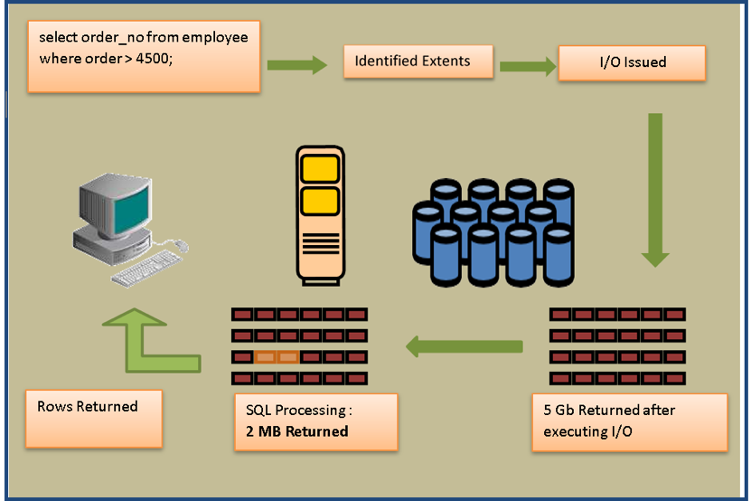
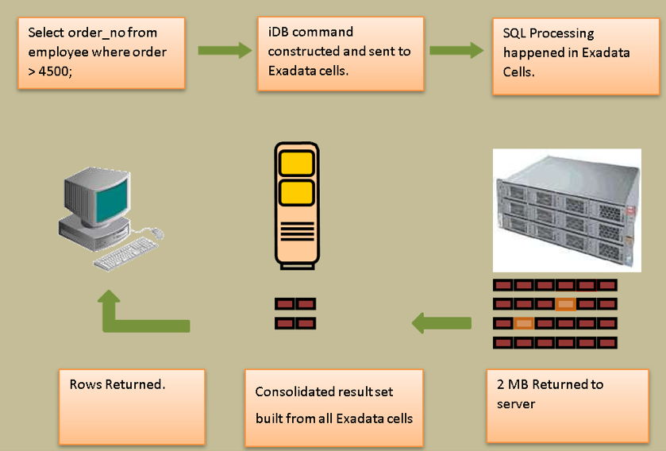

This blog delves into the details of the Oracle&reg; Exadata&reg; Smart Scan
feature, including an explanation of how SQL processing differs with Exadata and
usage examples.

<!--more-->

### Introduction

Oracle designed and introduced Exadata in 2008 as one of the first in the family
of engineered systems. Unlike traditional database systems, which are configured,
installed, tuned, and managed by a user, an engineered system has all the
necessary components like OS, database, memory, and storage preinstalled,
configured, tuned, and optimized by the solution provider, such as Oracle.

There are various components of an Exadata machine.  The following components
are the primary ones:

- **Database servers**: Enterprise-class servers that run database software,
  Automatic Storage Management (ASM), or the Oracle Grid Infrastructure.

- **Storage servers**: Storage servers, or cells, that run Exadata storage server
  software, which manages I/O requests coming from database servers and requests
  for data returned to a user.

- **InfiniBand network**: The internal Exadata network is built on InfiniBand,
  which is primarily designed for high-performance computing environments.

Exadata comes with software known as the Exadata Storage Software (ESS),
which enhances the performance of a database. ESS, the storage management server
installed on each storage cell, manages the storage servers and communicates
with database servers for any storage-related requests.

### Key features of ESS

Following are the key features of ESS:

- **Flash cache**:  The Flash cache is a high-performance cache on cell servers
  that caches recently accessed objects.

- **Flash log**: The Flash log provides a high-performance, low-latency, and
  reliable temporary store for redo-log writes.

- **EHCC**: Exadata Hybrid Columnar Compression (EHCC) enables the highest
  levels of data compression. EHCC organizes data into sets of rows called
  *compression units*. Within a compression unit, EHCC organizes the data by
  column and then compresses the data.

- **Storage indexes**: Storage indexes are in-memory structures on the storage
  servers that are designed to reduce the time spent reading data from a disk
  on the storage servers.

- **Cell offloading**: Unlike traditional storage design, the Exadata storage
  cells are designed to process some workload internally to reduce the overall
  burden on the compute or database nodes. This process is called cell offloading.

- **Smart Scan**: Smart Scan allows most of the SQL processing to happen in
  the storage tier instead of the database tier, which dramatically improves
  query performance. Smart Scan reduces the volume of data sent to the database
  tier thereby reducing CPU usage on database nodes.

### SQL processing

Traditionally, SQL processing happens on database servers only. In Exadata, SQL
processing is divided and also takes place on the storage tier.

#### Tradition SQL processing

The following steps comprise traditional SQL processing, as shown in the
following diagram:

1. A client submits a query.
2. This action triggers a full table scan.
3. The database maps the request to the file and corresponding extents, which
   contain the table being scanned.
4. Similar to a full scan, the database issues the I/O operations to read all
   the blocks.
5. All the queried blocks of the table are read into memory.
6. The process searches the blocks for the rows that satisfy the predicate.
7. Lastly, the requested rows are returned to the client.

If it is a big table, all the blocks from that table are read, transferred
across the storage network, and copied into memory. The process reads many
unwanted rows are read into memory to complete the requested SQL operation. The
large volume of transmitted data consumes bandwidth, impacts response time, and
creates an unnecessary burden on the database tier.

#### Exadata server SQL processing

With Exadata storage, SQL processing is handled much more efficiently because
it uses Exadata storage software, which has database logic built into it. The
following steps comprise Exadata SQL processing, as shown in the following
diagram:

1. A client submits a query.
2. The database server constructs an Intelligent Database (iDB) message, which
   includes the query criteria. This iDB message goes to all storage servers
   in a rack.
3. The **cellsrv** component of the ESS scans the data blocks to identify the
   matching rows and columns that satisfy the request.
4. Every storage server executes the query criteria in parallel and sends only
   the relevant rows, or the net result, to the database server by using
   interconnect.
5. The database consolidates the result and returns the rows to the client.

### Smart Scan requirements

Following are the requirements to use Smart Scan:

- You can use Smart Scan for only full table scans or full index scans.
- Queries must perform direct-path reads.
- You must set the database initialization parameter `CELL_OFFLOAD_PROCESSING`
   to `TRUE`.
- You must save segments in disk groups that are completely stored on Exadata
  cells.
- The ASM disk groups that store the segment data must have the following
  attribute settings:
  –	`compatible.rdbms` = `11.2.0.0.0` (or later)
  –	`compatible.asm` = `11.2.0.0.0` (or later)
  –	`cell.smart_scan_capable` = `TRUE`

### Smart Scan examples

Execute the following steps, first with and then without Smart Scan enabled, to
measure the Smart Scan effect on the statistics.

#### Step 1: Connect to database

Run the following command to connect to your database with SQL*Plus:

    [oracle@nd01db01 ~]$ sqlplus nd/nd
    SQL*Plus: Release 11.2.0.3.0 Production...

#### Step 2: Verify statistics

Run the following query to verify that the statistics are at or near zero:

    SQL> select a.name, b.value/1024/1024 MB from v$sysstat a, v$mystat b
    where a.statistic# = b.statistic# and (a.name in ('physical read total bytes',
    'physical write total bytes', 'cell IO uncompressed bytes')
    or a.name like 'cell phy%');

    NAME	                                                           MB
    --------------------------------------------------------------- ---
    physical read total bytes	                                       0
    physical write total bytes	                                    0
    cell physical IO interconnect bytes	                           0
    cell physical IO bytes saved during optimized file creation	   0
    cell physical IO bytes saved during optimized RMAN file restore	0
    cell physical IO bytes eligible for predicate offload	         0
    cell physical IO bytes saved by storage index	                  0
    cell physical IO bytes sent directly to DB node to balance CPU	0
    cell physical IO interconnect bytes returned by smart scan	      0
    cell IO uncompressed bytes	                                    0

    10 rows selected.

#### Step 3: Execute a select query with Smart Scan disabled

Run the following select query with the optimizer hint that disables Smart Scan:

    SQL> select /*+ OPT_PARAM('cell_offload_processing' 'false') */ count(*)
    from sales where time_id between '01-JUN-2017' and '30-OCT-2017'
    and amount_sold = 1;

    COUNT(*)
    ----------
    134055

#### Step 4: Verify statistics again

Run the following command to verify statistics again. Note that all the data
processed by the query in step 3 (physical read total bytes) is returned to the
database server over the storage network (cell physical IO interconnect bytes).

    SQL> select a.name, b.value/1024/1024 MB from v$sysstat a, v$mystat b
    where a.statistic# = b.statistic# and (a.name in ('physical read total bytes',
    'physical write total bytes', 'cell IO uncompressed bytes')
    or a.name like 'cell phy%');

    NAME	                                                           MB
    --------------------------------------------------------------- -----------
    physical read total bytes	                                       759.429688
    physical write total bytes	                                    0
    cell physical IO interconnect bytes	                           759.429688
    cell physical IO bytes saved during optimized file creation	   0
    cell physical IO bytes saved during optimized RMAN file restore	0
    cell physical IO bytes eligible for predicate offload	         0
    cell physical IO bytes saved by storage index	                  0
    cell physical IO bytes sent directly to DB node to balance CPU	0
    cell physical IO interconnect bytes returned by smart scan	      0
    cell IO uncompressed bytes	                                    0

    10 rows selected.

#### Step 5: Reset the statistics

Run the following command to reconnect the session to the database to reset the
session-level statistics:

    [oracle@nd01db01 ~]$ sqlplus nd/nd
    SQL*Plus: Release 11.2.0.3.0 Production...

#### Step 6: Verify statistics again

Run the following query to verify that the statistics are at or near zero:

    SQL> select a.name, b.value/1024/1024 MB from v$sysstat a, v$mystat b
    where a.statistic# = b.statistic# and (a.name in ('physical read total bytes',
    'physical write total bytes', 'cell IO uncompressed bytes')
    or a.name like 'cell phy%');

    NAME	                                                           MB
    --------------------------------------------------------------- ---
    physical read total bytes	                                       0
    physical write total bytes	                                    0
    cell physical IO interconnect bytes	                           0
    cell physical IO bytes saved during optimized file creation	   0
    cell physical IO bytes saved during optimized RMAN file restore	0
    cell physical IO bytes eligible for predicate offload	         0
    cell physical IO bytes saved by storage index	                  0
    cell physical IO bytes sent directly to DB node to balance CPU	0
    cell physical IO interconnect bytes returned by smart scan	      0
    cell IO uncompressed bytes	                                    0

    10 rows selected.

#### Step 7: Execute a select query without Smart Scan disabled

Run the following select query without the optimizer hint that disables Smart Scan:

    SQL> select count(*) from sales where time_id between '01-JUN-2017'
    and '30-OCT-2017'and amount_sold = 1;

    COUNT(*)
    -------
    134055

#### Step 8: Verify statistics

Run the following query to verify the statistics. Note that the query still
performs approximately 759 MB of I/O (physical read total bytes) as in step 4.
However, this time only 1.7 MB is returned to the DB server (cell physical IO
interconnect bytes). This is the result of a Smart Scan in action. In this case,
Smart Scan is acting on I/O associated with this query because the cell physical
IO bytes that are eligible for predicate offload equals the physical read total
 bytes, and the cell physical IO interconnect bytes returned by smart scan equals
 the cell physical IO interconnect bytes.

    SQL> select a.name, b.value/1024/1024 mb from v$sysstat a, v$mystat b where a.statistic# = b.statistic# and (a.name in ('physical read total bytes', 'physical write total bytes','cell IO uncompressed bytes') or a.name like 'cell phy%');

    NAME                                                             MB
    ----------------------------------------------------------------	----------
    physical read total bytes	                                       759.429688
    physical write total bytes	                                    0
    cell physical IO interconnect bytes	                           1.71562805
    cell physical IO bytes saved during optimized file creation	   0
    cell physical IO bytes saved during optimized RMAN file restore	0
    cell physical IO bytes eligible for predicate offload	         759.429688
    cell physical IO bytes saved by storage index	                  0
    cell physical IO bytes sent directly to DB node to balance CPU	0
    cell physical IO interconnect bytes returned by smart scan	      1.71562805
    cell IO uncompressed bytes	                                    759.429688

    10 rows selected.

### Conclusion

The Smart Scan feature in Exadata enables SQL processing to happen at the
storage tier, instead of the database tier, to improve query performance. Smart
Scan reduces the volume of data sent to the database tier thereby reducing the
CPU usage on database nodes.

Use the Feedback tab to make any comments or ask questions.

Learn more about our [database services](https://www.rackspace.com/dba-services)
and [Rackspace Application services](https://www.rackspace.com/application-management/managed-services).

