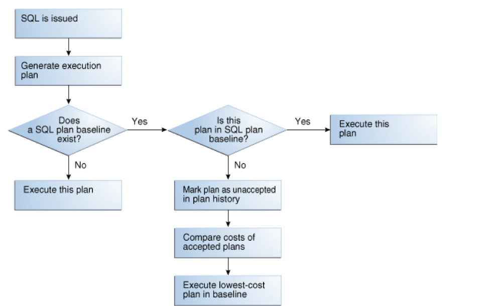

A particular SQL query might perform poorly on one database (such as production)
but work fine on another database (such as development). This situation might
occur if the same query has a different execution plan on each instance. This
blog shows how to transfer the execution plan from an instance, where query
works fine, to another instance, where query behaves poorly, by using the SQL
plan baseline feature that Oracle&reg; Database&reg; first introduced in
version 11g.

<!--more-->

### Introduction to SQL Plan Management

Oracle SQL Plan Management (SPM) is a feature in Oracle Database that
captures all the historical execution plans for a query. With that, you can
create a baseline for the good plan from the execution plans available in SPM
and enable that baseline to ensure that the system picks only the good plan from
the baseline.

To take advantage of this feature, you must identify the `sql_id` of the query
that is performing well on one instance and performing poorly on another
instance. You must also capture the good execution plan ID, the `plan_hash_value`,
of the query on the instance where it works well.

### Copy the SQL base plan from one instance to another

Use the following steps to copy the SQL base plan from the source instance to
the target instance:

1. Run the query on the source instance, where the query works well, so that the
   query exists in the cursor cache.
2. On the source instance, load the SQL execution plan for the query from the
   cursor cache to SPM as a baseline.
3. Create a staging table on the source instance. This table is used to migrate
   the execution plan from the source instance to the target instance.
4. Pack the source execution plan, or baseline, in the staging table on the
   source instance.
5. Transfer the staging table from the source instance to the target instance
   by using the export/import utility.
6. Unpack the SQL plan on the target instance from the staging table to SPM.
7. Verify that baseline created on target instance is fixed and accepted for the
   query to select it on next run.
8. Test the SQL that had a performance issue on the target instance and verify
   that it picks the transferred baseline.

### Example execution

Executing the preceding steps results in output similar to the following
examples.

#### Step 1: Run query on the source instance

Run the SQL on the source instance and identify the `sql_id` and `plan_hash_value`.
Examine the cursor cache to get the values.  In this case, they are the
following values:

- `sql_id`: 9xva48wpnsmp6
- `plan_hash_value`: 1572948408)

Execute the following query on the source instance:

    SQL> select distinct plan_hash_value from v$sql where sql_id='9xva48wpnsmp6';

    PLAN_HASH_VALUE
    ---------------
    1572948408

#### Step 2: Load the plan to SPM

Execute the following query to load this good query execution plan from the
cursor cache to SPM as a baseline:

    SQL> set serveroutput on
    SQL> declare
    2   ret binary_integer;
         l_sql_id varchar2(13);
    3
    4   l_plan_hash_value number;
    5   l_fixed varchar2(3);
    6   l_enabled varchar2(3);
    7   Begin
    8   l_sql_id := '&&sql_id';
    9   l_plan_hash_value := to_number('&&plan_hash_value');
    10   l_fixed := 'Yes';
    11   l_enabled := 'Yes';
    12   ret := dbms_spm.load_plans_from_cursor_cache(
    13       sql_id=>l_sql_id,
    14       plan_hash_value=>l_plan_hash_value,
    15       fixed=>l_fixed,
    16       enabled=>l_enabled);
    17   end;
    18  /

    Enter value for sql_id: 9xva48wpnsmp6
    old   8:  l_sql_id := '&&sql_id';
    new   8:  l_sql_id := '9xva48wpnsmp6';

    Enter value for plan_hash_value: 1572948408
    old   9:  l_plan_hash_value := to_number('&&plan_hash_value');
    new   9:  l_plan_hash_value := to_number('1572948408');

    PL/SQL procedure successfully completed.

Execute the following defined queries to verify that you created the SQL baseline
on the source instance.  Note the following details for later reference.

    SQL> select count(*) from dba_sql_plan_baselines ;

    COUNT(*)
    --------
      1

    SQL> select SQL_HANDLE, PLAN_NAME from dba_sql_plan_baselines;

    SQL_HANDLE                     PLAN_NAME
    ------------------------------ ------------------------------
    SQL_d344aac395f978a4           SQL_PLAN_d6j5asfazky54868c96c3

#### Step 3: Create a staging table on the source instance

Execute the following query to create a staging table on the source instance:

    SQL> sho user
    USER is "SYS"
    SQL> BEGIN
      DBMS_SPM.CREATE_STGTAB_BASELINE(
      table_name      => 'SPM_STAGETAB',
      table_owner     => 'APPS',
      tablespace_name => 'SYSAUX');
    END;

    2    3    4    5    6    7
    8  /

    PL/SQL procedure successfully completed.

#### Step 4: Pack the baseline

Execute the following query to pack the baseline in the staging table on the
source instance:

    SQL> DECLARE
    2      my_plans number;
    3      BEGIN
    4        my_plans := DBMS_SPM.PACK_STGTAB_BASELINE(
             table_name => 'SPM_STAGETAB',
             enabled => 'yes',
    5
    6
    7        table_owner => 'APPS',
    8        plan_name => 'SQL_PLAN_d6j5asfazky54868c96c3',
    9      sql_handle => 'SQL_d344aac395f978a4');
    10   END;
    11  /

    PL/SQL procedure successfully completed.

#### Step 5: Transfer the staging table from the source to the target instance

Execute the following command to take an export backup of the staging table on
the source instance:

    exp file=SPM_STAGETAB.dmp tables=APPS.SPM_STAGETAB log=SPM_STAGETAB.log compress=n
    Export: Release 11.2.0.4.0 - Production on Sun Jun 3 13:14:50 2018
    Copyright (c) 1982, 2011, Oracle and/or its affiliates.  All rights reserved.

    Username: system/*******

    Connected to: Oracle Database 11g Enterprise Edition Release 11.2.0.4.0 - 64bit Production
    With the Partitioning, OLAP, Data Mining and Real Application Testing options
    Export done in US7ASCII character set and AL16UTF16 NCHAR character set

    About to export specified tables via Conventional Path ...
    Current user changed to APPS
    . . exporting table             SPM_STAGETAB	         1 rows exported
    Export terminated successfully without warnings.

Now, execute the following command on the target instance to transfer the export
backup of the staging table to the target instance's host and import the table
in the target instance:

    imp system file=SPM_STAGETAB.dmp log=imp_SPM_STAGETAB.log fromuser=apps touser=apps

    Import: Release 11.2.0.4.0 - Production on Sun Jun 3 14:16:25 2018

    Copyright (c) 1982, 2011, Oracle and/or its affiliates.  All rights reserved.

    Password:

    Connected to: Oracle Database 11g Enterprise Edition Release 11.2.0.4.0 - 64bit Production
    With the Partitioning, OLAP, Data Mining and Real Application Testing options

    Export file created by EXPORT:V11.02.00 via conventional path
    import done in US7ASCII character set and AL16UTF16 NCHAR character set
    . importing APPS's objects into APPS
    . . importing table           "SPM_STAGETAB"   	       1 rows imported
    Import terminated successfully without warnings.

#### Step 6: Unpack the baseline

Execute the following commands to unpack the baseline from staging table to the
target instance's SPM. In the following example, take a count before unpacking
the baseline to verify that the baseline was imported properly on the target.

    SQL> select count(*) from dba_sql_plan_baselines;

    COUNT(*)
    --------
      2

    SQL> SET SERVEROUTPUT ON
    SQL> DECLARE
    2      l_plans_unpacked  PLS_INTEGER;
    3         BEGIN
    4         l_plans_unpacked := DBMS_SPM.unpack_stgtab_baseline(
    5               table_name      => 'SPM_STAGETAB',
    6               table_owner     => 'APPS');
    7
    8            DBMS_OUTPUT.put_line('Plans Unpacked: ' || l_plans_unpacked);
    9      END;
    10  /
    Plans Unpacked: 1

    PL/SQL procedure successfully completed.

    SQL> select count(*) from dba_sql_plan_baselines;

    COUNT(*)
    --------
      3

#### Step 7: Verify the baseline

Run the following commands on the target instance to verify that the baseline
is accepted and fixed.

    SQL> SELECT sql_handle, plan_name, enabled, accepted, fixed, origin FROM dba_sql_plan_baselines;

    SQL_HANDLE            PLAN_NAME                      ENA ACC FIX ORIGIN
    --------------------- ------------------------------ --- --- --- ------------
    SQL_d344aac395f978a4  SQL_PLAN_d6j5asfazky54868c96c3 YES YES NO  MANUAL-LOAD

    SQL>

The preceding output shows that the baseline was imported on target instance
but that it is not fixed. Run the following query to fix the baseline and enable
the optimizer to pick only this plan.

    SQL> DECLARE
    2    l_plans_altered  PLS_INTEGER;
    3  BEGIN
    4    l_plans_altered := DBMS_SPM.alter_sql_plan_baseline(
    5      sql_handle      => 'SQL_d344aac395f978a4',
    6      PLAN_NAME       => 'SQL_PLAN_d6j5asfazky54868c96c3',
    7      ATTRIBUTE_NAME  => 'fixed',
    8      attribute_value => 'YES');
    9
    10    DBMS_OUTPUT.put_line('Plans Altered: ' || l_plans_altered);
    11  END;
    12  /

    PL/SQL procedure successfully completed.

    SQL> SELECT sql_handle, plan_name, enabled, accepted, fixed, origin FROM   dba_sql_plan_baselines;

    SQL_HANDLE            PLAN_NAME                      ENA ACC FIX ORIGIN
    --------------------- ------------------------------ --- --- --- ------------
    SQL_d344aac395f978a4  SQL_PLAN_d6j5asfazky54868c96c3 YES YES YES MANUAL-LOAD

    SQL>

#### Step 8: Test the SQL query on the target instance

Execute the following command on the target instance to verify that it picks up
the new baseline:

    SQL> select SQL_PLAN_BASELINE from v$sql where sql_id='9xva48wpnsmp6';

    SQL_PLAN_BASELINE
    ------------------------------
    SQL_PLAN_d6j5asfazky54868c96c3

### How the SQL plan is selected

The following image shows how a SQL plan is selected when a baseline plan exists:

*Image source*: Metalink Note Automatic SQL Plan Baselines (Doc ID 1930525.1)

### Conclusion

Use the steps in this post if you have to transfer the baseline for a single
query. You can also generate SQL baselines for all the queries for upgrades,
migrations, and so on. Use an SQL plan baseline to have consistent SQL execution
plans and to avoid any performance issues.

Use the Feedback tab to make any comments or ask questions.

Learn more about our [database services](https://www.rackspace.com/dba-services)
and [Rackspace Application services](https://www.rackspace.com/application-management/managed-services).

