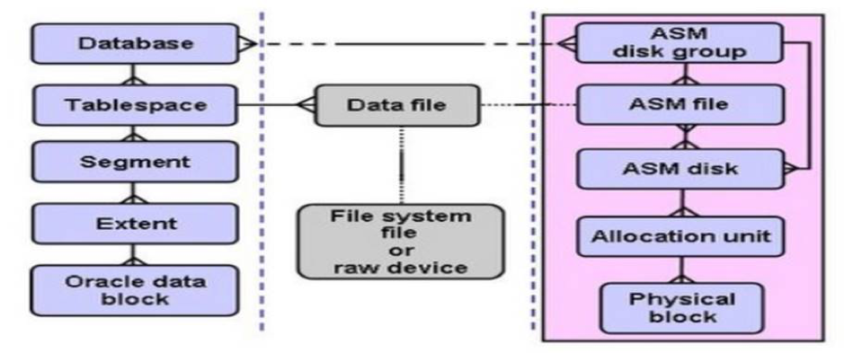

This post discusses how to repair multiple or single block corruption of
data files, including system data files, in an Oracle&reg; database. Block
corruption is a common source of database outages.

<!--more-->

A database block is corrupted when its contents are different than what the
Oracle database expects to find. If block corruption is not prevented or
repaired, the corruption can bring down the database and possibly cause the
loss of key business data.

This is one of the real time issues that you need to face and fix in production
databases.

### Find and fix block corruption

The following image shows a possible block corruption:

*Image source*: [https://blog.toadworld.com/2017/12/01/block-corruption-in-an-oracle-database](https://blog.toadworld.com/2017/12/01/block-corruption-in-an-oracle-database)

#### Find the corruption

To find the corruption, execute the following commands:

    SQL> select * from V$DATABASE_BLOCK_CORRUPTION;

    FILE#    BLOCK#    BLOCKS    CORRUPTION_CHANGE#  CORRUPTION
    ----- ---------- ----------  ------------------  ----------
     352     173191      9               0            ALL ZERO

    SQL> SELECT FILE_ID,RELATIVE_FNO,FILE_NAME,TABLESPACE_NAME FROM DBA_DATA_FILES WHERE FILE_ID=352;

     FILE_ID   RELATIVE_FNO   FILE_NAME                                          TABLESPACE_NAME
    ---------- ------------ -------------------------------------------------- ------------------
        352        352      /u01/apps_st/samusxxxxxxxx_data2/system09.dbf              SYSTEM

    SQL> SELECT owner, segment_name, segment_type FROM dba_extents WHERE RELATIVE_FNO = 352 AND Block_id BETWEEN 173191 AND 173191 + blocks - 1;

    OWNER      SEGMENT_NAME    SEGMENT_TYPE
    -------- ---------------  ------------------
    SYS         I_COL3          INDEX
    SYS         C_OBJ#          CLUSTER

**Note**: In this case, SYS object segment I\_COL3 has a block corruption. The
corrupted block, as reported by the `dbv` command, is shown as free in the
`dba_free_space` view.

#### Free the blocks

To free the blocks for file 352, execute the following commands:

    SQL> select * from V$DATABASE_BLOCK_CORRUPTION;

    FILE#    BLOCK#    BLOCKS    CORRUPTION_CHANGE#  CORRUPTION
    ----- ---------- ----------  ------------------  ----------
     352     173191      9               0            ALL ZERO

    SQL> Select * from dba_free_space where file_id =352 and 173191 between block_id and block_id + blocks -1;

    TABLESPACE_NAME   FILE_ID  BLOCK_ID  BYTES    BLOCKS   RELATIVE_FNO
    ---------------   -------  --------  -----  ---------- ------------
       SYSTEM           352     173191   73728       9        352

#### Force clear blocks

After the blocks are free, you can use the following commands to force clear those
corrupted blocks. This is also known as formatting corrupted blocks that are not
part of any segment.

##### 1. Create a user and grant the user access to the database.

    create user Scott identified by password default tablespace SYSTEM;
    grant resource, connect, create table, create trigger to Scott;

##### 2. Identify the corrupt block against the data file

    [Thu Nov 17 11:59:19 orbdev@samusxxxxxxxx:~ ] $ dbv file='/mnt/apps_st/samusxxxxxxxx_data2/system09.dbf' userid=sys/xxxxx

    DBVERIFY: Release 11.2.0.4.0 - Production on Thu Nov 17 11:59:21 2016

    Copyright (c) 1982, 2011, Oracle and/or its affiliates.  All rights reserved.

    DBVERIFY - Verification starting: FILE = /mnt/apps_st/samusxxxxxxxx_data2/system09.dbf
    Page 173191 is marked corrupt
    Corrupt block relative dba: 0x5802a487 (file 352, block 173191)
    Completely zero block found during dbv:

    Page 173192 is marked corrupt
    Corrupt block relative dba: 0x5802a488 (file 352, block 173192)
    Completely zero block found during dbv:

    Page 173193 is marked corrupt
    Corrupt block relative dba: 0x5802a489 (file 352, block 173193)
    Completely zero block found during dbv:

    Page 173194 is marked corrupt
    Corrupt block relative dba: 0x5802a48a (file 352, block 173194)
    Completely zero block found during dbv:

    Page 173195 is marked corrupt
    Corrupt block relative dba: 0x5802a48b (file 352, block 173195)
    Completely zero block found during dbv:

    Page 173196 is marked corrupt
    Corrupt block relative dba: 0x5802a48c (file 352, block 173196)
    Completely zero block found during dbv:

    Page 173197 is marked corrupt
    Corrupt block relative dba: 0x5802a48d (file 352, block 173197)
    Completely zero block found during dbv:

    Page 173198 is marked corrupt
    Corrupt block relative dba: 0x5802a48e (file 352, block 173198)
    Completely zero block found during dbv:

    Page 173199 is marked corrupt
    Corrupt block relative dba: 0x5802a48f (file 352, block 173199)
    Completely zero block found during dbv:

    DBVERIFY - Verification complete

    Total Pages Examined         : 917504
    Total Pages Processed (Data): 253735
    Total Pages Failing   (Data) : 0
    Total Pages Processed (Index): 335744
    Total Pages Failing   (Index): 0
    Total Pages Processed (Other): 375
    Total Pages Processed (Seg)  : 17
    Total Pages Failing   (Seg)  : 0
    Total Pages Empty            : 327624
    Total Pages Marked Corrupt   : 9
    Total Pages Influx           : 0
    Total Pages Encrypted        : 0
    Highest block SCN            : 3412538527 (1421.3412538527)

    [Thu Nov 17 12:00:13 orbdev@samusxxxxxxxx:~ ] $

##### 3. Find the free space

    Select * from dba_free_space where file_id= <Absolute file number> and <corrupted block number> between block_id and block_id + blocks -1;

    SQL> Select * from dba_free_space where file_id=352 and 173191 between block_id and block_id + blocks -1;

    TABLESPACE_NAME   FILE_ID   BLOCK_ID     BYTES    BLOCKS   RELATIVE_FNO
    --------------- ---------- ---------- ---------- --------- ------------
    SYSTEM              352     173196      73728        9          352

##### 4. Reformat first corrupted block

Repeat step 4 until all corrupted blocks are reformatted.

    create table scott.s (n number,c varchar2(4000)) nologging tablespace SYSTEM;

    select owner,table_name,tablespace_name from dba_tables where table_name='S';

    SQL> CREATE OR REPLACE TRIGGER corrupt_trigger
       AFTER INSERT ON scott.s
       REFERENCING OLD AS p_old NEW AS new_p
       FOR EACH ROW
       DECLARE
       corrupt EXCEPTION;
       BEGIN
       IF (dbms_rowid.rowid_block_number(:new_p.rowid)=&blocknumber)
         and (dbms_rowid.rowid_relative_fno(:new_p.rowid)=&filenumber) THEN
         RAISE corrupt;
       END IF;
       EXCEPTION
       WHEN corrupt THEN
         RAISE_APPLICATION_ERROR(-20000, 'Corrupt block has been formatted');
       END;
     /

    Enter value for blocknumber: 173191
    old   8:   IF (dbms_rowid.rowid_block_number(:new_p.rowid)=&blocknumber)
    new   8:   IF (dbms_rowid.rowid_block_number(:new_p.rowid)=173191)

    Enter value for filenumber: 352
    old   9:  and (dbms_rowid.rowid_relative_fno(:new_p.rowid)=&filenumber) THEN
    new   9:  and (dbms_rowid.rowid_relative_fno(:new_p.rowid)=352) THEN

    Trigger created.

    Select BYTES/1024/1024 from dba_free_space where file_id=352 and 173191 between block_id and block_id + blocks -1;

    72K

    SQL> BEGIN
       FOR i IN 1..100000 LOOP
          EXECUTE IMMEDIATE 'alter table scott.s allocate extent (DATAFILE '||'''/mnt/apps_st/samusxxxxxxxx_data2/system09.dbf''' ||'SIZE 72K)';
       END LOOP;
    END;
    /

    SQL> BEGIN
      FOR i IN 1..1000000 LOOP
         INSERT /*+ APPEND */ INTO scott.s select i, lpad('REFORMAT',3092, 'R') from dual;
      commit ;
      END LOOP;
    END;
    /

    SQL> Select * from v$database_block_corruption;

    no rows selected

    DROP TABLE scott.s;

    Alter system switch logfile;

    Alter system checkpoint;

    DROP trigger corrupt_trigger;

##### 5. Verify that the corrupted blocks are fixed

    SQL> select * from V$DATABASE_BLOCK_CORRUPTION;

    no rows selected

    [Wed Nov 16 08:12:37 orbdev@samusxxxxxx:~ ] $ dbv file='/mnt/apps_st/samusxxxxxx_data2/system09.dbf' userid=sys/****

    DBVERIFY: Release 11.2.0.4.0 - Production on Wed Nov 16 08:12:41 2016

    Copyright (c) 1982, 2011, Oracle and/or its affiliates. All rights reserved.

    DBVERIFY - Verification starting : FILE = /mnt/apps_st/samusxxxxxx_data2/system09.dbf

    DBVERIFY - Verification complete

    Total Pages Examined     : 655359
    Total Pages Processed (Data) : 260868
    Total Pages Failing  (Data) : 0
    Total Pages Processed (Index): 340482
    Total Pages Failing  (Index): 0
    Total Pages Processed (Other): 278
    Total Pages Processed (Seg): 15
    Total Pages Failing (Seg): 0
    Total Pages Empty     : 53716
    Total Pages Marked Corrupt : 0
    Total Pages Influx     : 0
    Total Pages Encrypted   : 0
    Highest block SCN     : 136830000 (1422.136830000)

    [Wed Nov 16 08:14:50 orbldev2@samusxxxxxx:~ ] $

### Conclusion

To detect and prevent data corruption, perform the following Maximum
Availability Architecture (MAA) best practices:

- Use Oracle Data Guard.
- Set the Oracle Database block corruption detection parameters.
- Implement a backup and recovery strategy with Recovery Manager (RMAN).

These high availability solutions are integrated with Oracle Database and
take advantage of the underlying data structures. Thus, the tools offer a new
class of intelligent data protection and disaster recovery.

Use the Feedback tab to make any comments or ask questions.

Learn more about our [database services](https://www.rackspace.com/dba-services)
and [Rackspace Application services](https://www.rackspace.com/application-management/managed-services).
