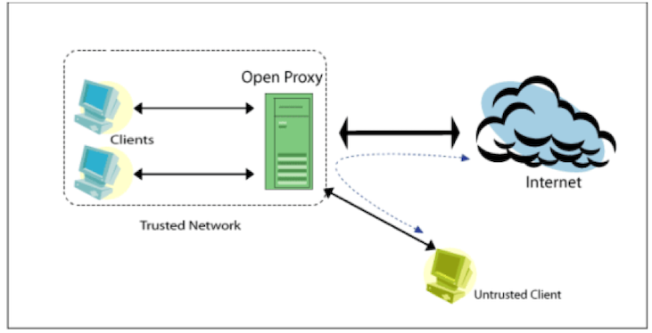
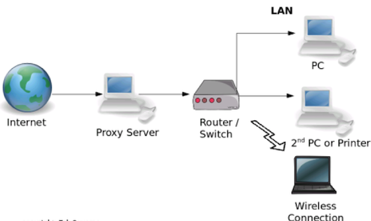
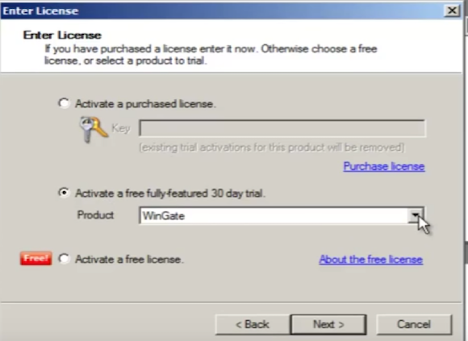
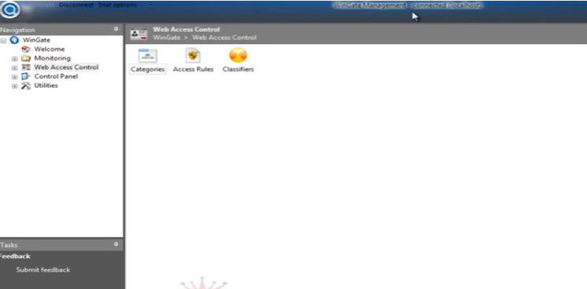
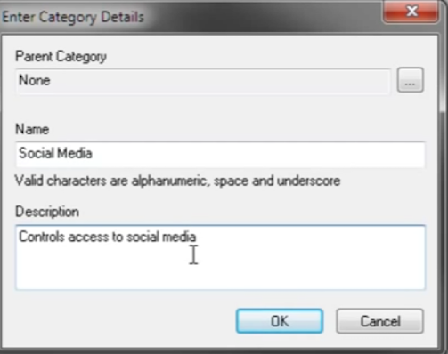
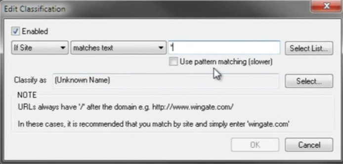
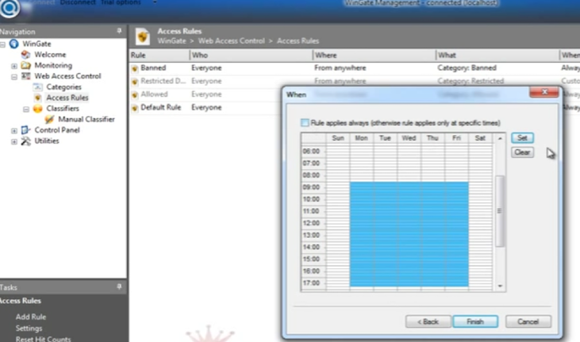

A proxy server is a computer system that sits between the client that requests
a web document and the target server (another computer system) that serves
the document. In its simplest form, a proxy server facilitates communication
between the client and the target server without modifying requests or replies.

<!--more-->

When you initiate a request for a resource from the target server, the proxy
server hijacks the connection, represents itself as a client to the target
server, and requests the resource on your behalf. If a reply is received, the
proxy server returns it, establishing communication with the target server.

*Image source*: Wikipedia [https://mn.wikipedia.org/wiki/%D0%9F%D1%80%D0%BE%D0%BA%D1%81%D0%B8_%D1%81%D0%B5%D1%80%D0%B2%D0%B5%D1%80](https://https://mn.wikipedia.org/wiki/%D0%9F%D1%80%D0%BE%D0%BA%D1%81%D0%B8_%D1%81%D0%B5%D1%80%D0%B2%D0%B5%D1%80)

### What is a proxy?

A proxy represents someone else or has the authority to act on behalf of another.

Proxy servers have the following characteristics:

- Act as an intermediary for requests sent by a client that wants resources
  from other servers in the computer network.
- Can be any computer system or an application.
- Are created when you install and run proxy software on a computer.
- Enable you to cache your web content and return it quickly on subsequent
  requests, which helps system administrators, who often struggle with delays
  and bandwidth usage issues.

Proxy servers have the following advantages:

- Obscure client IP addresses by using network address translation
  (NAT) to remap the private IP address to another IP address, which hides
  the client IP address.
- Block malicious traffic by controlling inbound and outbound traffic.
- Block sites, such as unauthorized sites, adult sites, and so on.
- Log activity by maintaining log records of traffic.
- Improve performance by caching the uniform resource locators (URLs). The
  proxy server reuses the cached URL when a client sends the data to the same
  URL that they used previously.
- Reduce bandwidth usage.

### Proxy server architecture

The following image shows basic web proxy architecture:

As shown in the preceding image, you can install a web proxy server between the
switch and the router. The following web proxy servers are a few of the ones
that are available :

- FreeProxy
- Wingate&reg;
- UltraSurf
- Apache&reg; HttpServer
- Freegaree
- Anonymizer&reg;
- Provoxy
- HAProxy&reg;
- SquidProxy

### Proxy server installation prerequisites

Before you install web proxy server software, ensure that the server has two
network interface cards (NICs). One NIC should connect to an internal switch,
and the other NIC should connect to the router that connects to the Internet.

You should be prepared to configure the server with an IP address, a gateway,
and a Domain Name Server (DNS).

### Download, install, and deploy a Wingate proxy server

Use the following steps to download, install, and deploy a Wingate proxy server:

1. Download the [Wingate software](www.wingate.com) and install it.

2. Enter the 30-day trial license or your purchased license when prompted as
   shown in the following image:

   

*Image source*: [https://www.indiamart.com/proddetail/linux-web-proxy-server-software-6220500388.html](https://www.indiamart.com/proddetail/linux-web-proxy-server-software-6220500388.html)

The following image shows the network after deployment.  The left side shows
the internal architecture, and the right side shows the external architecture.

*Image source*: [https://docs.microsoft.com/en-us/iis/extensions/configuring-application-request-routing-arr/creating-a-forward-proxy-using-application-request-routing](https://docs.microsoft.com/en-us/iis/extensions/configuring-application-request-routing-arr/creating-a-forward-proxy-using-application-request-routing)

### Block a site

The following steps demonstrate how to block a social media site from your
network by using a proxy server:

1. Start Wingate. The following window with a left-side navigation pane displays:

   

<ol start=2>
    <li>Select <b>Wingate>Web Access Control>Access Rule</b> and click <b>Add rule</b>.</li>
    <li>To create an access rule, fill in the rule name and the site to block
    (such as XYZ.com), and click <b>Add</b></li>
    <li>To map to the social media category, navigate to <b>Classifiers</b>,
    enter <b>www.xyz.com</b></li> in the empty dialog box, and click <b>OK</b>
    as shown in the following image:
</ol>

   

<ol start=5>
   <li>Enable the time interval to block a website as shown in the following image:</li>
</ol>

   

<ol start=6>
    <li>Enable the time interval to block a website as shown in the following image:</li>
</ol>

   

<ol start=7>
    <li>Click <b>Finish</b> to block the site URL. When users try to access
    the site, they see a <b>Blocked</b> message.</li>
</ol>

### Conclusion

Proxy servers on large networks help to improve reliability by blocking malicious
data, and they enable you to cache your web content and return it quickly on
subsequent requests.

Use the Feedback tab to make any comments or ask questions.

Learn more about [Rackspace Application services](https://www.rackspace.com/application-management/managed-services).
